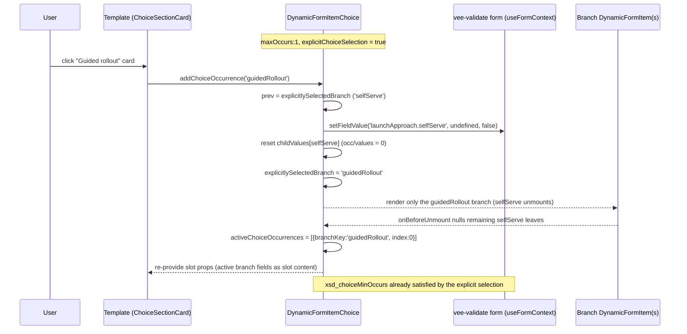
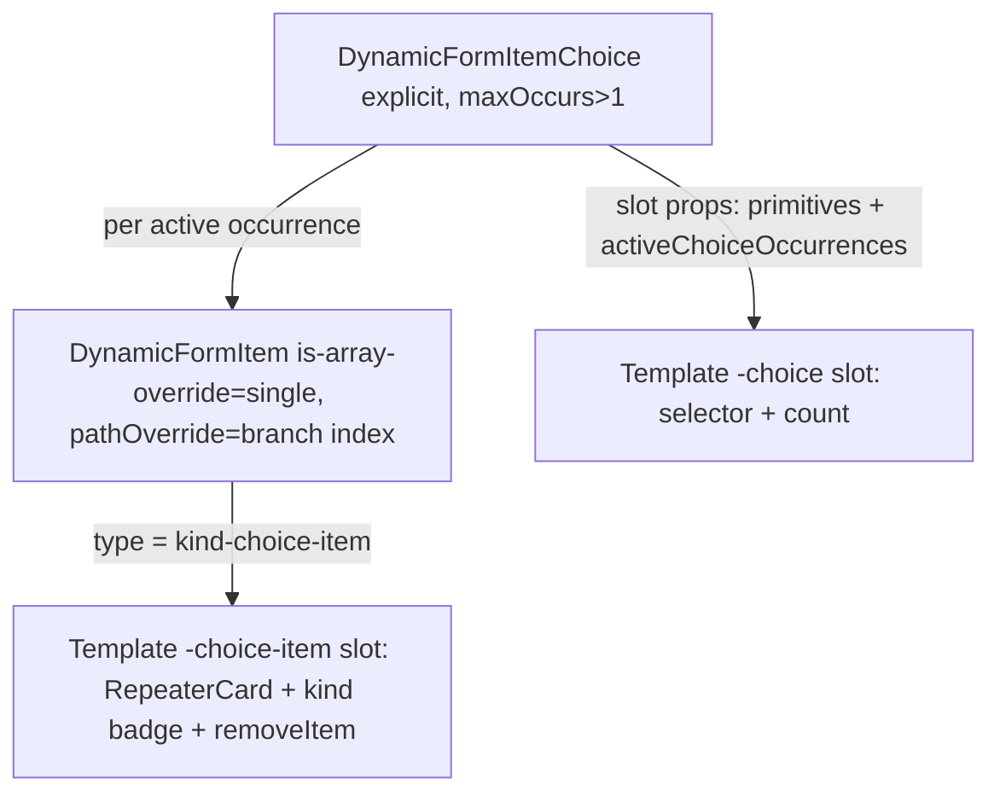

<!-- epic: optional. Set to the parent EPIC-XXX id when this feature belongs to an
     epic; leave "" for a standalone feature. Features are never nested under the
     epic folder, they only reference it here (flat model). -->


# Feature: Explicit choice selection

## Decided without Jeroen (research)

Settled from research during discussion, not reviewed by Jeroen. Override any of these freely.

- Finding 4 → `explicitChoiceSelection` is static metadata, excluded from `ComputedPropsFieldType`
- Finding 6 (nit) → `ChoiceItemAttributes extends ItemAttributes` interface stub added to API item 3
- Finding 7 (nit) → prototype a11y fixes accepted, carried into the docs-migration slice

## Problem & goal

`DynamicFormItemChoice` (see `specs/components.md`, `packages/core/src/components/DynamicFormItemChoice.vue`) counts a `choice` branch as "selected" purely by whether a descendant field has a value (`checkTreeHasValue`, tracked per branch in `childValues`/`occurrences`). This works well for the default UX: the user just starts typing into whichever branch they want, and the others are automatically disabled.

Some forms need a different UX: show a selector first ("what kind of data do you want to enter?"), and only then reveal the fields for the chosen option, before the user has filled in anything. `docs/.vitepress/theme/components/FormExampleClientOnboardingPlanner.vue`'s `launchApproach` step is a concrete example: a `ChoiceSectionCard` (in `AdvancedFormTemplate.vue`'s `#heading-choice` slot) lets the user pick "Self-serve launch" or "Guided rollout" before any field in that branch is shown.

Today that UX is faked entirely in userland, in the example itself:

1. An extended field property `changeChoice` is invented by the example author (`docs/.vitepress/theme/components/AdvancedFormTemplate.vue`'s `Metadata` generic) and is not understood by the engine at all; the template slot just calls it as a plain callback when `ChoiceSectionCard` emits `select`.
2. Selection state lives in a local `ref` (`selectedLaunchApproach`) outside the form's values entirely, not in the metadata/vee-validate value tree.
3. Every branch gets a `computedProps` that hides itself and force-clears its value when it is not the selected one (`thisField.hide = true; thisValue.value = {}`).
4. Every branch gets a **hidden phantom child field** whose only job is to fake a truthy value (`thisValue.value = selectedLaunchApproach.value === 'selfServe' ? true : undefined`) so `checkTreeHasValue()` reports the branch as non-empty and `DynamicFormItemChoice`'s occurrence math counts it as selected, even before the user has filled in a single real field.

This is a workaround that reaches into the engine's internal occurrence-counting mechanism from the outside. It only covers `maxOccurs: 1` (pick exactly one branch); Jeroen notes that a choice can also have `maxOccurs > 1` (e.g. add several typed items, each one of several possible "kinds"), and today there is no equivalent workaround demonstrated for that case, let alone a framework-level one.

**Goal:** give `DynamicFormItemChoice` a first-class, framework-native way to explicitly select (and, for `maxOccurs > 1`, add/remove occurrences of) a branch, exposed to `DynamicFormTemplate`-based templates the same way `addItem` / `removeItem` / `canAddItems` / `canRemoveItems` are already exposed for array fields (`DynamicFormItemArray.vue`, `DynamicFormItemProps`). Template authors (like the docs' `AdvancedFormTemplate.vue`) get a documented, supported mechanism instead of the hidden-field trick, and library consumers building their own templates get the same for free.

**Who this is for:** template authors (anyone building a `DynamicFormTemplate`-based template that needs a "pick first, then fill in" choice UX) and, by extension, docs readers learning the pattern from the published example.

## Scope

### In scope

- A framework-native mechanism in `DynamicFormItemChoice.vue` to explicitly mark a branch as selected/active, without requiring a descendant field to already hold a value.
- Exposing that mechanism as slot props on the `-choice` template slot (see `DynamicFormTemplate.vue`, `DynamicFormItemProps`), mirroring the existing `add-item` / `remove-item` / `can-add-items` / `can-remove-items` pattern used for arrays, so it is discoverable and typed the same way.
- Support for `choice` fields with `maxOccurs: 1` (today's "pick exactly one branch" case, replacing the hidden-field workaround) **and** `maxOccurs > 1` (selecting a branch adds one occurrence of it, respecting each branch's own `maxOccurs` and the shared occurrence-budget math already computed in `DynamicFormItemChoice`'s `occurrences`).
- Support for a `choice` nested inside an array occurrence (e.g. a repeatable group where each item contains a choice); the mechanism must work there, not only for a choice directly under a group/heading.
- Updating `docs/.vitepress/theme/components/FormExampleClientOnboardingPlanner.vue` and `docs/.vitepress/theme/components/AdvancedFormTemplate.vue`'s `#heading-choice` slot to use the new framework mechanism instead of the current hand-rolled `changeChoice` extended property, local ref, and hidden phantom field.
- Documentation: extend `docs/examples/choices.md` and/or `docs/reference/field-metadata.md` with the "select first, then fill in" pattern, written to be as easy to follow as possible, covering both the `maxOccurs: 1` and `maxOccurs > 1` cases.
- Backward compatibility: the existing automatic, value-driven branch counting keeps working unchanged for every existing consumer who does not opt into the new mechanism.

### Out of scope (explicit)

- Any change to how `DynamicFormItemArray`'s own `addItem`/`removeItem` works internally; this feature only mirrors its *pattern* for choices.
- Visual redesign of `ChoiceSectionCard` / `ChoiceCard` beyond what's needed to demonstrate the new mechanism in the updated example; this is not a visual-polish feature.
- Changes to `xsd_choiceMinOccurs` validation semantics; the feature must keep that rule's current meaning.
- New capability for choices nested inside other choices, beyond whatever already works today. Note: choices nested inside array occurrences ARE in scope (see decision 6 below).
- Any change to `Storybook`/`playgrounds/storybook` is not assumed; only in scope if design/architecture concludes it is necessary to demonstrate the mechanism (open question below).

## Functional overview

- **Default behavior is unchanged.** A `choice` field with no explicit selection used keeps working exactly as today: whichever branch the user starts filling in is the one that gets counted, and siblings are disabled once one branch has a value.
- **New: explicit selection.** A template author renders a selector (e.g. `ChoiceSectionCard`, a `<select>`, or per-branch "Add" buttons) inside the `-choice` slot and calls a framework-provided function, received as a slot prop, to mark a branch as selected. The engine then treats that branch as active immediately, without needing any field inside it to hold a value yet.
- **`maxOccurs: 1` (pick one of N):** selecting a branch shows that branch's fields and disables/hides the others, the same outward behavior the current hidden-field workaround produces, but driven by the engine instead of userland state.
- **`maxOccurs > 1` (add several, each one of N kinds):** selecting a branch from the selector adds one occurrence of it. The template gets what it needs to build either an "Add [branch]" button per branch (disabled once that branch's own `maxOccurs`, or the choice's shared budget, is exhausted, consistent with the existing `occurrences` computation in `DynamicFormItemChoice`) or a single dropdown that adds on selection, and to remove a previously-added occurrence again.
- **No more phantom fields.** The engine tracks "has been explicitly selected, whether or not it has real data yet" as first-class state next to the existing `childValues`/`occurrences` tracking, so `checkTreeHasValue()` no longer needs to be tricked with a fake hidden field to represent an empty-but-selected branch.
- **Required-choice validation in explicit mode is symmetric (DECIDED Jeroen 2026-09-10, finding 2).** Selecting a branch (`maxOccurs: 1`) or adding an occurrence (`maxOccurs > 1`) counts toward `xsd_choiceMinOccurs` immediately, even before any field holds a value; the branch or occurrence's own required fields then enforce its contents. Auto mode stays value-driven, unchanged.
- **Preserve-on-switch ships in this feature (DECIDED Jeroen 2026-09-10, Q7).** An opt-in flag, defaulted off: with it on, switching away stashes the branch's data outside the form values and switching back restores it. With it off (the default), switching clears the branch's data to `undefined`; the branch key itself may remain in the raw `values` as accepted residue (finding 1, option (a)), with `removeNullValues` as the documented submit-time cleanup.

## Design (feature level)

Prototype: [`prototype.html`](./prototype.html) (single self-contained file, open in any browser; light/dark toggle top-right drives a `.dark` class on `<html>` exactly like VitePress). Every section has a stable anchor id so stories can deep-link its slice.

The prototype only re-skins the choice selector; it invents no new visual language. It reuses the existing docs demo components (`SectionCard`, `ChoiceSectionCard`, `ChoiceCard`, `RepeaterCard`, `ArraySectionCard`, `AppButton`, `TextInput`, `SelectInput`, `ToggleSwitch`, `ErrorMessage`) and their exact Tailwind slate/indigo/sky/rose palette, expressed as CSS variables that flip in the `.dark` block so both modes come for free. Nothing in this feature needs dark-specific styling beyond that variable flip; the whole prototype was walked in dark and every color-carrying state (selected card gradient + ring, disabled card, add-button disabled, choice error text, field invalid/valid) reads correctly in both modes.

### Provisional slot-prop names

The prototype annotates against provisional names aligned with decision 1 (mirror `addItem`/`removeItem`); the architect sets the final names:

- `addChoiceOccurrence(branchKey)` — mark a branch active (maxOccurs:1) or add one occurrence (maxOccurs > 1).
- `removeChoiceOccurrence(branchKey, index?)` — remove a previously added occurrence.
- `canAddChoiceOccurrence(branchKey)` — per-branch "may add", false when the branch's own `maxOccurs` or the choice's shared budget is exhausted.
- `activeChoiceOccurrences` — the list the template iterates to render occurrence cards; each entry carries its `branchKey` and a stable index.

These are the low-level primitives of decision 2. The engine ships no widget; every widget in the prototype is template-author code built on these four.

### Sections and anchors

| Anchor id | Covers |
| --- | --- |
| `overview` | Feature intro + the provisional slot-prop legend. |
| `single-unselected` | maxOccurs:1, nothing selected. Dashed "Nothing selected yet" prompt, no branch fields. Empty-state baseline. |
| `single-selected` | maxOccurs:1, Self-serve active. Selected card (indigo border + ring + gradient, filled radio), branch fields revealed with data. |
| `single-selected-guided` | maxOccurs:1, Guided active. Shows the inherited field-level validation states (pristine, invalid-with-message, valid) inside a revealed branch. |
| `single-switch` | maxOccurs:1 switching. Before/after with clear-on-switch (decision 3) annotated; preserve-on-switch noted as deferred with no UI. |
| `single-error` | maxOccurs:1 required-but-unselected `xsd_choiceMinOccurs` error on the header, plus a disabled branch card. |
| `multi-empty` | maxOccurs > 1 empty. Dashed prompt + per-branch add buttons + "0 of N" count tag. |
| `multi-add-buttons` | maxOccurs > 1 populated via per-branch add buttons. Occurrence cards = `RepeaterCard` + a new "kind" badge; per-occurrence remove. |
| `multi-limits` | maxOccurs > 1 disabled add: branch's own `maxOccurs` reached (only that button disables) and shared budget exhausted (all disable). |
| `multi-dropdown` | maxOccurs > 1 via the alternative dropdown-adds widget, same primitives (decision 2). |
| `choice-in-array` | Choice inside an array occurrence (decision 6). Two contacts, each with an independent maxOccurs:1 method choice resolved via the item's `pathOverride`. |
| `onboarding-before-after` | The Launch approach step, today's workaround vs the framework-native version, pixel-identical output with the mechanism annotated on each side, plus the docs-impact callout. |

### States policy (applies everywhere in this feature)

- **Empty / unselected:** maxOccurs:1 with nothing active renders the dashed prompt (`ArraySectionCard`'s empty pattern) instead of branch fields; maxOccurs > 1 with no occurrences renders the same dashed "No items added yet" block. Empty is a first-class, always-reachable state (new: the choice may legitimately start with nothing selected).
- **Selected / active:** the branch's fields render immediately, before any field holds a value. Selected choice card = indigo border, 1px indigo ring, subtle top-to-bottom indigo gradient, filled radio dot (unchanged `ChoiceCard`).
- **Disabled:** a branch card at 50% opacity with muted fill and no hover/focus when the template omits it or `canAddChoiceOccurrence` is false; an add button at 40% opacity with not-allowed cursor (existing `AppButton` disabled style) when its branch or the shared budget is exhausted.
- **Loading:** the choice selector has no loading state of its own (selection is synchronous). Async remains a per-field concern inside a branch (e.g. the Training format `select` loading its options), unchanged by this feature. Stated explicitly so silence is not mistaken for an omission.
- **Error:** the `xsd_choiceMinOccurs` message (semantics unchanged, per scope) anchors to the section header, matching today's `ChoiceSectionCard` error slot.
- **Field validation inside a branch:** pristine / invalid-with-message / valid are inherited from the existing per-field templates; the engine decides only whether the branch renders, never how its fields validate.

### Mapping to existing components (`specs/components.md`)

- **Reused unchanged:** `RepeaterCard`, `ArraySectionCard` (empty + count-tag patterns), `AppButton` (default / danger-light / disabled), `TextInput`, `SelectInput`, `ToggleSwitch`, `ErrorMessage`, `SectionCard`. `ChoiceCard`'s radio visual is untouched.
- **Extended:** `ChoiceSectionCard.vue` and `AdvancedFormTemplate.vue`'s `#heading-choice` slot. They stop reading a local `selectedOption` ref and stop emitting a userland `select`, and instead drive selection through the new slot props: cards call `addChoiceOccurrence`, and in repeatable mode the card also renders the add affordance (buttons or dropdown) and the `activeChoiceOccurrences` list with per-occurrence remove.
- **One genuinely new visual element:** the "kind" badge on a repeatable-choice occurrence card (a small pill naming which branch the occurrence belongs to, styled like the existing indigo count tag). Everything else is composition of existing patterns.
- **No new library component.** The choice-inside-array case (`choice-in-array`) is pure composition of `RepeaterCard` wrapping a nested `ChoiceSectionCard` (nested card drops its shadow to read as a sub-region).

### Behavioral note carried into architecture

The updated demo can start with no branch selected (truer "pick first, then fill in"), whereas today it hard-defaults to Self-serve via `selectedLaunchApproach = 'selfServe'`. Starting unselected is the design baseline; pre-selecting a default remains possible with a single `addChoiceOccurrence` call on mount. This is a presentation decision, recorded here so the architect and developer implement the unselected initial state deliberately rather than re-adding a default.

## Architecture (feature level)

Verified against the installed versions on 2026-09-09: vee-validate `4.15.1`, Vue `3.5.35` (`pnpm-lock.yaml`, `packages/core/package.json`). No new dependency is introduced by this feature.

### Summary of the decision

Explicit choice selection is delivered as **four opt-in slot props on the `-choice` slot** plus **one new core `FieldMetadata` flag** that switches a choice from its current value-driven ("auto") rendering to a "selection-first" ("explicit") rendering. Selection lives as ephemeral state inside each `DynamicFormItemChoice` instance and is folded into the existing occurrence math, so `checkTreeHasValue` no longer needs a phantom field. Clearing on switch is performed by the engine through the injected vee-validate form context. No breaking change; the bump is **minor**.

### Component / composable plan (against `specs/components.md`)

- **`DynamicFormItemChoice.vue` — modified (the bulk of the work).** Gains: ephemeral selection state, the four primitives, form-context access for clearing, explicit-mode conditional rendering. All additions are gated behind the new metadata flag, so the auto-mode code path is byte-for-byte the behaviour it has today. This is the only core component that changes materially.
- **`DynamicFormTemplate.vue` — modified (type-only + passthrough).** A new `ChoiceAttributes` interface adds the four choice props; the `-choice` and `default-choice` slot mappings point at it. For the `maxOccurs > 1` slice it also gains `-choice-item` / `default-choice-item` slot entries in `SlotsFromMetadata` and their fallback branch in `typeWithFallback`, mirroring the existing `-array-item` handling. The runtime is unchanged: the props ride through `useAttrs()` + `camelize` exactly like `addItem`/`canAddItems` do today.
- **`FieldMetadata.ts` — modified (additive).** One new optional core property (see Public API impact). Additive, defaulted off.
- **`DynamicFormItem.vue` — unchanged.** It already delegates choices to `DynamicFormItemChoice` via `v-bind="props"` and forwards `pathOverride`; nothing about that contract changes. This matters for decision 6 (see below).

  > **IMPLEMENTATION NOTE (ST-01, flagged amendment, not yet reviewed by Jeroen).** In practice a one-line change to `DynamicFormItem.vue` was required after all: `computedField`'s construction already restores `path` after running `computedProps` (so a `computedProps` mutation of `path` has no effect); ST-01 adds the identical restore for `explicitChoiceSelection` right next to it (`_internalMetadata.explicitChoiceSelection = field.value?.explicitChoiceSelection;`). Reason: `DynamicFormItemChoice` receives `computedField` (not the raw prop) as its `fieldMetadata`, and `computedField` is evaluated once per render *before* `DynamicFormItemChoice` is created, so a component-local "capture once at setup" inside `DynamicFormItemChoice` alone cannot protect against a `computedProps` mutation that is already present on the very first render (only against a mutation appearing later, i.e. genuinely "mid-form"). AC9's runtime test requires the flag to be static from the very first render, not just after mount, so the restore has to happen where `computedField` is built. The delegation contract and `pathOverride` forwarding this bullet talks about (decision 6) are unaffected. No test in the existing `DynamicFormItem.*` suites broke; the change is purely additive to `computedField`'s output shape.

  > **IMPLEMENTATION NOTE (ST-02, flagged amendment, not yet reviewed by Jeroen).** A second, separate change to `DynamicFormItem.vue` was needed: rendering a `maxOccurs > 1` occurrence through the new `*-choice-item` slot requires that occurrence's own leaf/group-render `<component>` to receive the `-choice-item` type suffix (mirroring how the existing `partOfArrayField` prop already drives the `-array-item` suffix) and to forward a `branchKey` slot prop. `DynamicFormItemProps` gained a new optional `branchKey?: string`, and the type computation in `DynamicFormItem.vue`'s leaf-render `<component>` became a three-way check (`branchKey !== undefined` → `-choice-item`; else `partOfArrayField` → `-array-item`; else plain) with a `:branch-key="branchKey"` binding alongside it. Same class of amendment as ST-01's note above (additive, does not touch the delegation/`pathOverride` contract decision 6 describes), just a different one-line-plus-one-prop addition. No existing `DynamicFormItem.*` test broke.
- **`DynamicFormItemArray.vue`, `useFieldArrayExtended.ts`, `checkTreeHasValue.ts`, `overridePath.ts`, `normalizePath.ts` — reused as-is.** The `maxOccurs > 1` slice reuses `useFieldArrayExtended` inside the choice for per-branch push/remove; it does not modify the array component.
- **No genuinely new library component.** Nothing in `specs/components.md` is retired. The one new *visual* element (the "kind" badge) and every widget in the prototype are template-author code in `docs/`, not library surface.
- **Docs — modified, separate slice.** `ChoiceSectionCard.vue` and `AdvancedFormTemplate.vue`'s `#heading-choice` slot consume the new props; `FormExampleClientOnboardingPlanner.vue` drops `changeChoice`, `selectedLaunchApproach`, the per-branch clear `computedProps`, and both phantom hidden children; `AdvancedFormTemplate.vue`'s `Metadata` generic drops the userland `changeChoice` property. `docs/examples/choices.md` gains the "select first, then fill in" section.

### Public API impact (the load-bearing section)

**1. New core `FieldMetadata` property (channel: `FieldMetadata` extension).**

```ts
/**
 * Opt into selection-first rendering for a choice node. When true, no branch is shown
 * until the template calls addChoiceOccurrence(...); the engine clears a deselected branch
 * from form values on switch. When false/omitted, the current value-driven behaviour is
 * unchanged: every branch renders and siblings disable once one holds a value.
 * Has no effect on non-choice nodes.
 */
explicitChoiceSelection?: boolean
```

Optional, defaults to `false`/absent, safe default = today's behaviour. Additive → **minor**.

**Resolved (finding 4).** DECIDED (research, 2026-09-10): `explicitChoiceSelection` is read from static metadata, not the computed field, and is added to the `ComputedPropsFieldType` `Omit` list in `FieldMetadata.ts` (alongside `maxOccurs`, `isComplexType`, `computeOnChildValueChange`). Why: a `computedProps`-mutable flag would let a form flip render mode mid-flight, reintroducing the initial flash and mount/unmount storm ADR-2 exists to prevent; the `Omit` list already excludes structural properties for exactly this class of reason. Stays additive, bump remains **minor**. Sources: `FieldMetadata.ts:214-217`, `DynamicFormItem.vue:465-466`, ADR-2.

**2. New slot props on the `-choice` slot (channel: the slot contract).** Added on a new `ChoiceAttributes<TMetadataConfiguration> extends ArrayChoiceAttributes<TMetadataConfiguration>` used by the `default-choice` and per-type `*-choice` slots:

```ts
interface ChoiceOccurrence {
  branchKey: string; // the choice child's `name` (e.g. 'selfServe', 'apiEndpoint')
  index: number;     // 0 for maxOccurs:1; the occurrence's index within its branch for maxOccurs > 1
}

interface ChoiceAttributes<TMetadataConfiguration> extends ArrayChoiceAttributes<TMetadataConfiguration> {
  /** Mark a branch active (maxOccurs:1) or add one occurrence of it (maxOccurs > 1). No-op when canAddChoiceOccurrence is false. */
  addChoiceOccurrence: (branchKey: string) => void;
  /** Remove a previously added occurrence. index is required in maxOccurs > 1; ignored (optional) in maxOccurs:1 where it deselects the active branch. */
  removeChoiceOccurrence: (branchKey: string, index?: number) => void;
  /** Per-branch guard: false when this branch's own maxOccurs or the choice's shared occurrence budget is exhausted, or when the choice is disabled. */
  canAddChoiceOccurrence: (branchKey: string) => boolean;
  /** The currently active occurrences the template iterates for counts/selector state. */
  activeChoiceOccurrences: ChoiceOccurrence[];
}
```

Naming resolves decision 1: `addChoiceOccurrence` / `removeChoiceOccurrence` mirror `addItem` / `removeItem`; `canAddChoiceOccurrence` mirrors `canAddItems` but is a **per-branch function** rather than a boolean, because a choice has N branches with independent budgets (the one deliberate divergence, justified by the shared-budget math in `occurrences`). `branchKey` is the child `name` (always present after `correctMetadataAndSetDefaults`), not the numeric index, so template code reads against metadata names, not positions. These are decision 2's four low-level primitives; the engine ships no widget.

All existing `-choice` slot members (`fieldMetadata`, `fieldContext`, `required`, `disabled`, `index`, `settings`, `slotProps`, and the array-context `canAddItems`/`addItem`/... used when a choice sits inside an array) are retained unchanged. Adding members to the slot props is additive → **minor**.

**3. New slots `*-choice-item` / `default-choice-item` (channel: the slot contract, `maxOccurs > 1` slice only).** Occurrence wrapper slot, mirroring `*-array-item`: receives `ItemAttributes` plus `removeItem` (wired to `removeChoiceOccurrence(branchKey, index)`) and `branchKey` (for the "kind" badge). Fallback priority `text-choice-item → default-choice-item → default`, added alongside the existing array-item fallback. Additive → **minor**.

DECIDED (research, 2026-09-10, resolves nit 6): the slot's props get a named interface so the developer has a concrete type to implement against:

```ts
interface ChoiceItemAttributes<TMetadataConfiguration> extends ItemAttributes<TMetadataConfiguration> {
  /** The choice branch this occurrence belongs to (the child's `name`). Drives the "kind" badge. */
  branchKey: string;
}
```

Declared in `DynamicFormTemplate.vue` next to `ChoiceAttributes`, same non-export posture as API item 5.

**4. `defineMetadata` generics — unchanged.** The four generics (`FieldValueTypes`, `ExtendedFieldProperties`, `SlotProperties`, `ExtendedSettingsProperties`) keep their signatures. The new slot props hang off the base `ChoiceAttributes`, so every configuration gets them without touching the generic list, and `explicitChoiceSelection` is a core property available regardless of the extended-property generic.

**5. Exports — unchanged.** No new export from `index.ts`. `ChoiceOccurrence` / `ChoiceAttributes` are declared in `DynamicFormTemplate.vue` next to `ArrayChoiceAttributes` and surface through the existing slot typing; export them from `index.ts` only if a consumer needs to annotate a helper (can be added later without a break).

**Changeset bump: minor.** Every change is additive and gated. No export is removed or renamed, no signature changes, and the auto-mode path (the only path existing consumers exercise) is untouched. `specs/components.md` gets the new metadata flag, the four `-choice` slot props, and the `*-choice-item` slots recorded on implementation.

### Where state lives and how it integrates with `childValues` / `occurrences`

Selection is **ephemeral UI state on the `DynamicFormItemChoice` instance** and never written to form `values` (decision 4):

- `maxOccurs: 1` → `explicitlySelectedBranch = ref<string | null>(null)` (holds a `branchKey`). "Selected but empty" cannot be represented by an array placeholder here (there is no array), so it needs this ref. This ref is exactly what replaces the phantom hidden child.
- `maxOccurs > 1` → **no separate ref.** An occurrence *is* a real (possibly empty) item in that branch's field array, which is already how repeatable choice children are stored (`childrenAreArrays === 'array'`). "Selected" therefore means "a placeholder item exists", consistent with how arrays represent not-yet-filled items, and it stays a normal empty item rather than special state.

Integration with the existing counting:

- `activeChoiceOccurrences` is a **computed** that merges the value-driven view (branches whose `childValues` report a value) with the explicit view (`explicitlySelectedBranch`, or the per-branch array items). This is what makes decision 4's "loading saved data still reads as selected" fall out for free: a loaded-but-not-explicitly-selected branch still appears because it has a value.
- The `occurrences` / `valuesCount` math is extended so an **explicitly selected branch counts as one filled choice-occurrence even when empty** (`effectiveValuesCount = max(childValuesDerivedCount, explicitlySelected ? 1 : 0)`). This is the native replacement for the phantom field: `xsd_choiceMinOccurs` clears the moment the user picks a branch (matching the prototype's `single-error` → `single-selected` transition), and the branch's own required fields then enforce its contents. `xsd_choiceMinOccurs` semantics are otherwise unchanged (in scope).
- On a `maxOccurs: 1` switch, `addChoiceOccurrence(newBranch)` also **resets the deselected branch's `childValues` entry** (occurrences/valuesCount → 0) so the count and the choice-level validation reflect reality after the branch unmounts.

> **PROPOSED (adversarial review) — resolve the `xsd_choiceMinOccurs` cardinality asymmetry (finding 2).** The `effectiveValuesCount = max(..., explicitlySelected ? 1 : 0)` fold only exists for `maxOccurs: 1`. For `maxOccurs > 1`, selection is an empty placeholder array item, and `valuesCount` is derived from `checkTreeHasValue` per item (`DynamicFormItemChoice.vue:282`), which is `false` for an empty placeholder, so adding an empty occurrence to a required `maxOccurs > 1` choice does NOT clear `xsd_choiceMinOccurs` the way selecting an empty branch does in the single case. Proposed resolution: adopt the value-driven rule as the intended, documented behaviour for `maxOccurs > 1` (an added-but-empty occurrence does not by itself satisfy the choice minimum; the occurrence's own required fields drive validation), OR, if parity with the single case is wanted, extend `effectiveValuesCount` to also count `activeChoiceOccurrences.length` for the repeatable case. Pick one, state it in the functional overview next to the single-case claim, and add a `*.validation.test.ts` asserting the chosen behaviour for both cardinalities.

DECIDED (Jeroen, 2026-09-10): parity. In explicit mode, an added occurrence counts toward `xsd_choiceMinOccurs` for `maxOccurs > 1` exactly as an explicit selection does for `maxOccurs: 1`: `effectiveValuesCount` also counts `activeChoiceOccurrences.length` in the repeatable case. The add action is the commitment; the occurrence's own required fields enforce its content. Auto mode stays value-driven, unchanged. A `*.validation.test.ts` asserts this for both cardinalities (slice 1 and slice 2).

### Rendering mode (the backward-compatibility hinge)

`explicitChoiceSelection` selects between two render paths inside `DynamicFormItemChoice`:

- **auto (default, flag absent):** render every choice child exactly as today (`v-for child in field.choice`). All branches visible, siblings disable via the existing `overrideChildMaxOccurrences`. Zero behaviour change; this is the compatibility guarantee.
- **explicit (flag true):** render only the **active** branch(es). `maxOccurs: 1` renders the single selected branch's `DynamicFormItem` (or nothing → the template shows its dashed prompt). `maxOccurs > 1` renders one `DynamicFormItem` per occurrence via the `*-choice-item` slot. The selector cards are template-author code built from `fieldMetadata.choice` + `addChoiceOccurrence`; the engine renders only the chosen branch's fields as slot content.

A metadata flag is required rather than inferring the mode from "was `addChoiceOccurrence` ever called", because the *initial* render already differs (auto shows all fields; explicit shows none) and inference would flash all branches before collapsing.

### Clearing on switch, and the preserve-on-switch verdict (decision 3)

The engine clears through the vee-validate form context, obtained with `useFormContext()` (public in 4.15.1, verified at `vee-validate.d.ts:1367`; returns the injected `FormContext`). `DynamicFormItemChoice` is always a descendant of the `useForm()` call in `useDynamicForm`, so a plain inject resolves it (unlike the same-instance quirk `useValidatePartialForm` guards against). Clearing a branch is `setFieldValue(branchPath, undefined, /* shouldValidate */ false)`, where `branchPath = overridePath(branchChild.path, props.pathOverride)` — the same resolution `DynamicFormItem` uses, so it is correct through array indices (decision 6). The public `FormContext` omits `unsetPathValue`, so `setFieldValue(..., undefined)` is the supported clear. This clears the branch's data to `undefined` but does not remove the keys: vee-validate's `setInPath` never prunes, so after a switch the raw `values` object keeps the branch key with an `undefined`/empty shape (e.g. `launchApproach: { selfServe: undefined }`). That residue is the accepted contract (see the decision below): it is behaviourally inert (`checkTreeHasValue` treats `undefined` as no value, so occurrence counting and `xsd_choiceMinOccurs` are unaffected), it serialises away under `JSON.stringify` apart from the empty parent, and it matches what the engine already leaves behind on every non-array field unmount (`DynamicFormItem.vue` `onBeforeUnmount` routes through the same `setInPath`). Consumers who need a byte-clean tree run the exported `removeNullValues(values)` once at submit time, which strips `null`/`undefined` leaves and prunes now-empty containers across the whole tree, not just this path.

> **PROPOSED (adversarial review) — the "clean removal" claim above is inaccurate as written (finding 1).** Verified against the runtime: `setFieldValue` (`vee-validate.mjs:2623`) writes through `setInPath` (`vee-validate.mjs:376`), which sets `undefined` at the leaf and never prunes the key or its now-empty parent container; `unsetPath`/`unsetPathValue` (`vee-validate.mjs:409`) is the only routine that prunes empty containers, and it is not on the public `FormContext`. So after a switch the branch is left as `launchApproach: { selfServe: undefined }`, not absent. The `onBeforeUnmount` null also routes through `setInPath` and does not prune. Proposed resolution (Jeroen to pick):
> (a) **Accept `undefined`-valued residue** as the contract, and rewrite ADR-3 and the functional overview to say "the branch's data is cleared to `undefined`; the parent key remains present with an empty/`undefined` shape, which serialises away under `JSON.stringify`" instead of claiming the subtree leaves `values`. Cheapest, honest, but the raw submitted object is not byte-clean.
> (b) **Prune explicitly** via the runtime-available (but privately-typed) `unsetPathValue`, called as `(useFormContext() as unknown as { unsetPathValue: (p: string) => void }).unsetPathValue(branchPath)`, accepting a documented reliance on a method vee-validate keeps off the public type (revisit on a vee-validate bump). Achieves true removal; costs a typed escape hatch ADR-3 currently forbids.
> (c) **Prune via a tiny engine helper** that reads `useFormContext().values`, deletes the branch key, and empty parents, staying entirely on public surface. More code, no private reliance.
> Either way, add a test asserting the exact post-switch shape of `values` (not just the serialised JSON) so the guarantee is pinned.

DECIDED (Jeroen, 2026-09-10, revised same day from an earlier pick of option (c); reconfirmed by Jeroen on 2026-09-10 when queried during story prep, option (a) is final): option (a), accept the `undefined`-valued residue as the contract. Rationale: the engine already leaves identical residue on every non-array field unmount, so pruning only the choice-switch path would never make the raw `values` object clean anyway; the residue is behaviourally inert for occurrence counting and validation; and a per-switch prune helper would delete keys directly from `useFormContext().values`, bypassing vee-validate's bookkeeping in the same way as the rejected private `unsetPathValue`, with the same re-add risks. The right boundary for cleanup is submit time: the library already exports `removeNullValues` (`packages/core/src/utils/removeNullValues.ts`, exported via `index.ts`), which strips `null`/`undefined` values and prunes empty containers across the whole tree. ADR-3 is amended accordingly. The slice 1 test pins the residue contract instead of key absence: after a switch, the branch is cleared to `undefined`, occurrence counting and `xsd_choiceMinOccurs` are unaffected by the leftover keys, and `removeNullValues(values)` yields the clean shape. The docs migration slice demonstrates `removeNullValues` in the onboarding example's `handleSubmit`.

**Preserve-on-switch verdict: technically feasible and low cost for `maxOccurs: 1`, and it stays inside decision 4.** Before clearing, deep-clone the branch's current value (read via `useFormContext().values` at `branchPath`) into an instance-local `stashedBranchValues = ref<Record<string, unknown>>({})`; on switching back, if a stash exists, restore it with `setFieldValue(branchPath, stashed)`. The stash is ephemeral, never part of `values`, so it is consistent with decision 4 exactly like `explicitlySelectedBranch`. The only caveats are that vee-validate touched/validation state for the branch resets on restore (acceptable, it behaves like freshly re-entered data) and that it would be an opt-in flag (a `DynamicFormSettings` boolean or a `FieldMetadata` boolean, both safe-defaulted off). Because it is feasible and cheap, **whether to ship it in this feature is a scope/product call, not a technical blocker** — recorded as an open question below rather than settled here.

### Choice inside an array occurrence (decision 6)

This works with **no extra mechanism** because the selection ref lives on the `DynamicFormItemChoice` *instance* and there is one instance per array item (the array re-renders the subtree per occurrence). `pathOverride` already threads the item index (`projectContacts[0]`) into the choice, and every path the choice touches (`useField` registration, child `pathOverride`, and the new `setFieldValue(branchPath, ...)` clear) is resolved through `overridePath` with that override. So contact 0's selection and clearing target `projectContacts[0].method.*` while contact 1's target `projectContacts[1].method.*`; neither leaks into the other. The architecture's only obligation is to route the clear through the same `overridePath` resolution the rest of the component uses, which the plan does.

> **PROPOSED (adversarial review) — the `maxOccurs: 1` case is sound, but `maxOccurs > 1` choice-inside-array needs an explicit scope call and a reactivity fix (finding 3).** The reasoning above is correct for a `maxOccurs: 1` choice per array item. It does not cover a `maxOccurs > 1` choice inside an array item, which the prototype never draws (its `choice-in-array` section shows only `maxOccurs: 1` method choices) yet scope does not exclude. In that combination the per-branch `useFieldArrayExtended(branchPath)` helpers (reactivity note line 256, "created once at setup") sit on paths that are NOT static: `branchPath` depends on the reactive `pathOverride` array index, and removing an earlier sibling reindexes it under a surviving instance (`projectContacts[2] → projectContacts[1]`). `DynamicFormItemArray` passes a reactive `computed` path to `useFieldArrayExtended` (`DynamicFormItemArray.vue:63,68`) precisely to survive this; a per-branch helper captured as a plain string at setup would desync and hit the `initFields()` re-add fragility (`DynamicFormItem.vue:407-409`). Proposed resolution: (a) decide whether `maxOccurs > 1` choice-in-array is in scope for this feature; (b) if in scope, require each per-branch `useFieldArrayExtended` to receive a reactive per-branch path (a `computed`, not a setup-time string), and add a test that adds occurrences in a `maxOccurs > 1` choice nested in an array, then removes a sibling array item and asserts the surviving choice's occurrences still map to the right `projectContacts[i]`; add the missing prototype note; (c) if out of scope, exclude it explicitly in the Scope section so the developer does not half-build it.

DECIDED (Jeroen, 2026-09-10): in scope, with the safeguards. `maxOccurs > 1` choice-inside-array is covered per decision 6 with no cardinality carve-out. Binding requirements for slice 2: every per-branch `useFieldArrayExtended` receives a reactive per-branch path (a `computed` over `overridePath(branchChild.path, props.pathOverride)`, never a setup-time string), and the test plan includes the reindex test described above (add occurrences in a nested repeatable choice, remove an earlier sibling array item, assert the surviving choice's occurrences map to the reindexed path). The "created once at setup" wording in the reactivity notes is superseded accordingly: the helpers are created once, but over reactive paths.

### Data flow

Slot props out, events/writes in. Selection never enters `values`; only branch field data does.



Component shape in explicit `maxOccurs > 1` mode:



### Reactivity / render-count notes for the developer

- `explicitlySelectedBranch` and the conditional `v-if`/`v-for` over active branches drive mount/unmount; keep the active-branch computation a single `computed` so a switch is one recompute, not a cascade. Preserve the existing `_analytics_*` counters and add coverage in a `*.analytics.test.ts`.
- `setFieldValue(..., undefined)` triggers the branch's value watchers once; ensure the `childValues` reset and the `setFieldValue` happen in the same handler so `valuesCount`/`combinedValidation` settle in one tick and do not oscillate. There is no new `watchEffect`; the `combinedValidation` on the choice stays a `computed` (it has no self-referential cycle, unlike `DynamicFormItem`).
- For `maxOccurs > 1`, use `useFieldArrayExtended(branchPath)` per branch for push/remove rather than raw `setFieldValue` on the array, to stay on the same array-sync path `DynamicFormItemArray` already relies on and avoid the `initFields()` re-add fragility noted in that file. Branches are static from metadata, so the per-branch array helpers can be created once at setup.

### ADR notes

- **ADR-1: Ephemeral selection ref for maxOccurs:1, array placeholder for maxOccurs > 1.** Context: selection must never reach `values` (decision 4) yet must survive an empty branch. Decision: a `ref<string|null>` for the single case; reuse the existing empty-array-item representation for the repeatable case. Alternative considered: a hidden marker field written into `values` (today's phantom). Rejected: it pollutes submitted data and is the exact workaround this feature removes.
- **ADR-2: Metadata flag `explicitChoiceSelection` to switch render mode.** Context: auto and explicit differ at the *first* render. Decision: an opt-in core `FieldMetadata` boolean, default off. Alternative: infer the mode from primitive usage. Rejected: causes an initial flash of all branches and makes the default ambiguous; a flag keeps auto-mode provably unchanged.
- **ADR-3: Clear via `useFormContext().setFieldValue(path, undefined)`; accept the `undefined` residue, with `removeNullValues` as the submit-time cleanup (amended per finding 1, DECIDED Jeroen 2026-09-10, revised same day from a prune-helper variant).** Context: the engine, not userland, now owns clear-on-switch (decision 3), and `setFieldValue(..., undefined)` leaves `undefined`-valued keys and empty parent containers because vee-validate's `setInPath` never prunes. Decision: clear with the public `setFieldValue(branchPath, undefined, false)` and accept the residue as the contract. It is behaviourally inert (occurrence counting and `xsd_choiceMinOccurs` ignore `undefined` via `checkTreeHasValue`), it is consistent with the residue the engine already leaves on every non-array field unmount, and consumers who need a byte-clean tree call the already-exported `removeNullValues(values)` once at submit. Alternative: reach for the private `unsetPathValue`. Rejected: not on the public type and unsupported. Alternative: an engine helper that deletes the branch key and empty parents from `useFormContext().values`. Rejected: it bypasses vee-validate's bookkeeping just like `unsetPathValue`, carries re-add risks, and cleans only one of the several paths that produce residue, so the raw `values` object still would not be guaranteed clean. Alternative: keep clearing in `computedProps`. Rejected: that is the userland workaround being deleted. A test pins the residue contract: branch cleared to `undefined`, leftover keys do not affect validation or occurrence math, and `removeNullValues(values)` yields the clean shape.
- **ADR-4: `canAddChoiceOccurrence` is a per-branch function.** Context: `canAddItems` is a single boolean but a choice has N independent branch budgets plus a shared budget. Decision: expose a `(branchKey) => boolean` function reading the existing `occurrences` per-branch override. Alternative: a boolean or a precomputed map. Rejected: a boolean cannot express per-branch limits; a function reads cleanly at the call site and matches the prototype's per-button disabling.
- **ADR-5: `branchKey` = child `name`, not index.** Context: `childValues`/`occurrences` are keyed by index internally. Decision: the public API keys by `name` and maps to index inside the component. Alternative: expose indices. Rejected: names are stable, readable, and already how template code refers to branches (`fieldMetadata.choice.map(x => x.name)`).

### Slicing seams (input for the scrum-master)

Independently deliverable, in dependency order:

1. **Engine — maxOccurs:1 explicit selection (foundation).** `explicitChoiceSelection` flag, the four primitives, ephemeral selection ref, folding selection into `occurrences`/`valuesCount`, explicit-mode single-branch rendering, clear-on-switch via form context, and the `ChoiceAttributes` type on the `-choice` slot. Delivers the case that actually replaces the onboarding workaround. Ships alone with unit + validation + analytics tests. No `-choice-item` slot needed here.
2. **Engine — maxOccurs > 1 repeatable selection.** Per-branch `useFieldArrayExtended`, `activeChoiceOccurrences` across branches, `canAddChoiceOccurrence` budget wiring, and the `*-choice-item` / `default-choice-item` slots. Depends on slice 1's types. Blocked on the ordering open question below (grouped vs interleaved) before its `activeChoiceOccurrences` shape is final.
3. **Docs template migration.** Rewrite `ChoiceSectionCard.vue` + `#heading-choice` slot to the primitives; delete `changeChoice`, `selectedLaunchApproach`, the clear `computedProps`, and the phantom children from `FormExampleClientOnboardingPlanner.vue`; start unselected; demonstrate `removeNullValues(values)` in the example's `handleSubmit` as the submit-time cleanup for the accepted `undefined` residue (ADR-3). Depends on slice 1 (and slice 2 for a repeatable demo). Screenshot before/after; pixel-identical to today's Launch approach step.
4. **Docs content.** `docs/examples/choices.md` "select first, then fill in" for both cardinalities. Depends on slices 1 and 2. Slices independently from the engine per the usual docs/engine split.
5. **Preserve-on-switch.** In scope per DECIDED (Jeroen, 2026-09-10) on Q7: an opt-in flag, defaulted off, stash outside `values`, restore on switch-back. Additive flag on top of slice 1; does not block anything else.

## Adversarial review

Ran in FEATURE (full) mode on 2026-09-09 against the installed versions (vee-validate `4.15.1`, Vue `3.5.35`) and the actual code paths (`DynamicFormItemChoice.vue`, `DynamicFormItem.vue`, `DynamicFormItemArray.vue`, `DynamicFormTemplate.vue`, `FieldMetadata.ts`, `DynamicFormItemProps.ts`, the docs workaround). Claims checked against the vee-validate runtime and type declarations, not just reasoned about.

**Verified correct (retracted suspicions, recorded so the discussion does not re-litigate them):**

- `useFormContext()` is public in 4.15.1 (`vee-validate.d.ts:1367`). Confirmed.
- The public `FormContext` omits `unsetPathValue` (`vee-validate.d.ts:461`), so ADR-3's rejection of it as "not on the public type" is accurate.
- The public `FormContext` DOES expose `values: TValues` (re-added at `vee-validate.d.ts:462` after the `Omit`), so the preserve-on-switch plan's read via `useFormContext().values` at `branchPath` is type-valid. My initial suspicion that `values` was stripped was wrong.
- No new dependency and no `peerDependencies` change; bundle impact is additive type surface plus one gated code path. The `minor` classification is defensible on the export/signature axis (nothing removed or renamed, generics unchanged).

**Findings:**

1. **[should-fix] `setFieldValue(branchPath, undefined, false)` does not achieve the "clean removal / no lingering empty objects" the architecture claims.** Verified against the runtime: `setFieldValue` (`vee-validate.mjs:2623`) calls `setInPath(formValues, path, clonedValue)` (`vee-validate.mjs:376`), which writes `acc[lastKey] = undefined` and never prunes the key or its now-empty parent containers. This is exactly the behaviour `unsetPath` (`vee-validate.mjs:409`, used by the private `unsetPathValue`) was written to fix: it walks back up and deletes empty containers via `isEmptyContainer`. So after a switch, `formValues.launchApproach` is left as `{ selfServe: undefined }` (and, once the other branch has ever been touched, `{ selfServe: undefined, guidedRollout: undefined }`), i.e. a lingering object with `undefined`-valued keys rather than an absent branch. The branch's own `DynamicFormItem.onBeforeUnmount` (`DynamicFormItem.vue:403-419`) also only sets the value ref to `undefined`, which routes through the same `setInPath` and likewise does not prune. Under `JSON.stringify` the `undefined` keys disappear (so a serialised payload shows `launchApproach: {}`), but the raw reactive `values` object a consumer receives from `handleSubmit` still carries the `undefined` keys and the empty parent. ADR-3's assertion that "the subtree leaves the submitted `values`" and the functional goal of removing the value-polluting workaround are therefore only partially met. Suggested resolution: state the real post-clear shape honestly, decide whether an empty-but-present parent object is acceptable, and if not, adopt a supported prune. Routed as a PROPOSED edit in ADR-3 / the clearing subsection.

2. **[should-fix] `xsd_choiceMinOccurs` satisfaction is asymmetric between `maxOccurs: 1` and `maxOccurs > 1`, and the spec does not say so.** For `maxOccurs: 1` the architecture folds selection into the count (`effectiveValuesCount = max(childValuesDerivedCount, explicitlySelected ? 1 : 0)`), so picking an empty branch immediately satisfies `xsd_choiceMinOccurs` (matching the prototype's `single-error → single-selected` transition). For `maxOccurs > 1` the design deliberately keeps "no separate ref" and represents a selection as an empty placeholder item in the branch's field array. But `valuesCount` is derived from `checkTreeHasValue` on each item (`DynamicFormItemChoice.vue:282`, `occurrences` at 159-207), and an empty placeholder has no value, so `choiceValuesCount` stays 0. Consequently, on a required `maxOccurs > 1` choice, adding an empty occurrence would NOT clear the choice-level `xsd_choiceMinOccurs`, unlike the single case. The two cardinalities behave differently for the identical user action ("I selected/added a branch but haven't filled it in"). This needs an explicit decision and a validation test, not silence. Routed as a PROPOSED edit in the state-integration subsection.

3. **[should-fix] `maxOccurs > 1` choice inside an array occurrence is in scope but unprototyped, and the per-branch `useFieldArray` plan has a reactive-path hazard the architecture waves off.** Scope requires a choice nested in an array occurrence to work and does not restrict that to `maxOccurs: 1`, yet the prototype's `choice-in-array` section only shows two `maxOccurs: 1` method choices; the `maxOccurs > 1`-choice-inside-array combination is neither drawn nor analysed. The reactivity note (line 256) says the per-branch `useFieldArrayExtended` helpers "can be created once at setup" because "branches are static from metadata". That is only half the story: for a choice inside an array, `branchPath = overridePath(branchChild.path, props.pathOverride)` and `pathOverride` carries the array index, which is reactive: removing an earlier sibling reindexes `projectContacts[2] → projectContacts[1]`, and the surviving `DynamicFormItemChoice` instance (kept alive by its stable `key`) receives a changed `pathOverride` prop. `DynamicFormItemArray` deliberately passes a reactive `computed` path to `useFieldArrayExtended` (`DynamicFormItemArray.vue:63,68`) for exactly this reason. A per-branch helper captured as a plain string at setup would desync from the real array contents and hit the `initFields()` re-add fragility the code already warns about (`DynamicFormItem.vue:407-409`). This is the seam the architect flagged. Suggested resolution: clarify whether `maxOccurs > 1` choice-in-array is in scope; if yes, mandate reactive per-branch paths and a dedicated reindex test, and add a prototype note; if no, exclude it explicitly. Routed as a PROPOSED edit in the decision-6 subsection.

4. **[should-fix] `explicitChoiceSelection` is read from the computed field, so a `computedProps` mutation can flip the render mode mid-form.** `DynamicFormItem` passes `:field-metadata="computedField"` to the choice (`DynamicFormItem.vue:465-466`), and `DynamicFormItemChoice` reads `field.value = props.fieldMetadata` (line 55). The new flag would therefore be reactively mutable through a `computedProps` function, the same channel the workaround abuses. ADR-2 justifies the flag precisely because auto and explicit differ at the first render and inference "would flash all branches before collapsing"; a flag that a `computedProps` can toggle at runtime reintroduces exactly that flash (and a mid-form mount/unmount storm) it set out to avoid. `maxOccurs`, `isComplexType`, and `computeOnChildValueChange` are already excluded from `ComputedPropsFieldType` (`FieldMetadata.ts:214,216-217`) for this class of reason. Suggested resolution: specify that `explicitChoiceSelection` is read from static metadata and add it to the `ComputedPropsFieldType` `Omit` list. Routed as a PROPOSED edit in Public API impact item 1. RESOLVED: DECIDED (research, 2026-09-10), proposal accepted, see Public API impact item 1.

5. **[nit] The `singleChild` shortcut is not reconciled with the flag.** When a choice has exactly one branch, `DynamicFormItemChoice` takes the `singleChild` fast path (line 104-106), renders that child directly, and returns `undefined` from `combinedValidation` (line 214). The spec does not say what `explicitChoiceSelection: true` means for a one-branch choice (selecting "one of one" is degenerate). State that the flag is a no-op on single-branch choices, or that the fast path is bypassed when it is set.

   DECIDED (Jeroen, 2026-09-10): bypass the fast path. When `explicitChoiceSelection: true` is set on a single-branch choice, the `singleChild` shortcut is skipped and the branch behaves as an explicit "add this block / remove it" selection (nothing rendered until `addChoiceOccurrence` is called). With the flag absent, the fast path is unchanged. Slice 1 covers the degenerate single-branch case in its tests.

6. **[nit] `ChoiceItemAttributes` is described but not typed.** Public API impact item 3 says the `*-choice-item` slot "receives `ItemAttributes` plus `removeItem` ... and `branchKey`", but no interface is written the way `ChoiceAttributes` is in item 2. `branchKey` is not on `ItemAttributes`, so the slice-2 slot needs a named `ChoiceItemAttributes extends ItemAttributes` (with `branchKey: string`) for the developer to implement against. Add the interface stub. RESOLVED: DECIDED (research, 2026-09-10), stub added in Public API impact item 3.

7. **[nit] Prototype a11y inconsistency.** The top-level choice grids carry `role="radiogroup"` + `aria-label` (e.g. prototype line 346), but the nested choice grid inside the `choice-in-array` occurrence (line 768) omits both, and the `multi-limits` disabled add-buttons convey their disabled reason only via a `title` tooltip (line 664), which is not reliably announced by screen readers nor reachable by keyboard. These are template-author demo details, not library surface, but the design section asserts a11y "holds up"; tighten the nested-choice `radiogroup` labelling and give the disabled add-button an accessible reason (e.g. `aria-describedby` or visible helper text).

   DECIDED (research, 2026-09-10): accepted as-is. The docs-migration slice (seam 3) implements the nested `radiogroup` labelling and an accessible disabled-reason (visible helper text preferred over `title`); the prototype is reference material and is not reworked for this.

## Constraints & assumptions

- Must stay backward compatible: forms relying purely on the current automatic, value-driven branch counting must behave identically after this feature ships; the new mechanism is additive/opt-in.
- Should follow the existing `addItem` / `removeItem` / `canAddItems` / `canRemoveItems` naming and slot-prop convention (`DynamicFormItemArray.vue`, `DynamicFormItemProps`) for consistency, per `CLAUDE.md`'s Architecture section, rather than inventing an unrelated shape.
- Vue code (props, events, slot prop names) must use camelCase, never kebab-case, per `CLAUDE.md`.
- Explicit selection state is pure UI state: it must never appear in the form's `values` (the submitted data). Loading saved data that already has a branch filled in still counts as selected through the existing value-driven logic; the new API only covers the "selected but not yet filled in" direction.
- This touches `packages/core/src/`, the published package, so it needs a changeset; bump type is the architect's call but is expected to be additive (minor) unless the architecture phase finds a reason it must break something.
- `specs/components.md` will need updating once implemented (new/changed public surface on `DynamicFormItemChoice` slot props and possibly `FieldMetadata`).

## Open questions

All questions resolved by Jeroen on 2026-09-09. Decisions:

1. **Naming: align with the array pattern.** The framework-native functions follow the existing `addItem`/`removeItem` convention; `addChoiceOccurrence` paired with `removeChoiceOccurrence` is the preferred naming. `changeChoice` is dropped. The architect proposes the exact final slot-prop names on this basis.
2. **Low-level primitives only.** The framework exposes primitives (per-branch "can add", add occurrence of branch X, list of currently active occurrences with their branch key, remove occurrence) and template authors build whichever widget they want (cards, dropdown, add buttons). No prescribed or shipped interaction pattern.
3. **Switching must clear the deselected branch from form values; preserve-on-switch decided after design.** When `maxOccurs: 1` and the user switches branches, the previously entered data must disappear from the form values. Verified against the code on 2026-09-09: the engine does NOT do this automatically today. `DynamicFormItemChoice.vue` only counts values (`childValues`/`occurrences`); it never clears them. In the default value-driven flow there is no switching at all (other branches are just disabled until the user manually empties their data), and in the current workaround the clearing is done in userland by the per-branch `computedProps` (`thisValue.value = {}` in `FormExampleClientOnboardingPlanner.vue`). So clearing on switch becomes the new mechanism's responsibility and is the baseline behavior. Preserving the entered data (behind a configurable option) is desirable if the solution allows it: on switch the data is stashed OUTSIDE the form values (pure UI-side storage, consistent with decision 4), and switching back restores it into the form values. Whether preserve-on-switch ships in this feature is decided after the architecture phase works out the mechanism.
4. **Selection state is pure UI state, never in form values.** Selection must not appear in the submitted data. Loading saved data with a branch already filled in still reads as selected via the existing value-driven logic; the explicit-selection API is separate ephemeral state on top.
5. **No composable read access for now.** No `useDynamicForm`/`useFieldValue`-level API for reading the current selection in this feature. The updated example must work with what the slot props provide.
6. **Choice inside an array occurrence must work.** This is a hard requirement, moved into scope above.

### New questions raised by the architecture phase (2026-09-09)

7. **Ship preserve-on-switch in this feature, or defer it?** The architecture verdict is that preserve-on-switch for `maxOccurs: 1` is technically feasible and low cost, and stays inside decision 4 (the stash is ephemeral instance state, never in `values`). See the "Clearing on switch, and the preserve-on-switch verdict" subsection. What remains is a scope/product call: (a) ship it now as an opt-in flag (a `DynamicFormSettings` boolean or a `FieldMetadata` boolean, defaulted off, so clear-on-switch stays the baseline), or (b) defer it to a follow-up. It slices as an independent add-on (seam 5) and blocks nothing either way.

   DECIDED (Jeroen, 2026-09-10): ship it now, as an opt-in flag defaulted off so clear-on-switch stays the baseline. Seam 5 becomes a real story instead of a conditional one.

8. **Repeatable-choice occurrence ordering: grouped-by-branch or global insertion order?** For `maxOccurs > 1` the underlying storage is per-branch arrays (`{ crmExport: [...], apiEndpoint: [...] }`); insertion order *across* branches is not stored anywhere. The prototype's `multi-add-buttons` section shows a single interleaved, insertion-ordered list (occurrence 1 = API endpoint, occurrence 2 = CRM export). Deriving `activeChoiceOccurrences` purely from the value tree yields a **grouped** order (branch declaration order, then index within branch), which needs no extra ephemeral state and cannot desync from `values`. Producing the **interleaved** order the prototype draws requires an additional ephemeral ordering list maintained on add/remove (a new source of truth that can drift from the actual array contents). This is a genuine product/UX call that fixes the shape and guarantees of `activeChoiceOccurrences`, so it belongs here rather than being decided by the architect.

   DECIDED (Jeroen, 2026-09-10): grouped-by-branch order (branch declaration order, then index within branch), derived purely from the value tree with no extra ephemeral ordering state. The prototype's `multi-add-buttons` interleaved rendering is illustrative only; the docs example renders grouped. Slice 2's `activeChoiceOccurrences` contract is now final.

## Stories

Split by scrum-master on 2026-09-10, following the architecture's five slicing seams in dependency order. Each story references this feature's design and architecture instead of restating them; stories hold only deltas.

| Order | Story | Scope | Depends on |
| --- | --- | --- | --- |
| 1 | [ST-01: Engine - maxOccurs:1 explicit choice selection (foundation)](./stories/ST-01-engine-single-explicit-selection/spec.md) | `explicitChoiceSelection` flag, the four primitives, ephemeral selection ref, folding selection into `occurrences`/`valuesCount`, explicit-mode single-branch rendering, clear-on-switch, `ChoiceAttributes` slot type. Replaces the onboarding workaround's `maxOccurs: 1` case. | none (foundation) |
| 2 | [ST-02: Engine - maxOccurs > 1 repeatable explicit choice selection](./stories/ST-02-engine-repeatable-explicit-selection/spec.md) | Per-branch `useFieldArrayExtended` (reactive paths, per DECIDED finding 3), `activeChoiceOccurrences` grouped by branch (DECIDED Q8), `canAddChoiceOccurrence` budget wiring, `*-choice-item`/`default-choice-item` slots and `ChoiceItemAttributes` (DECIDED finding 6), `xsd_choiceMinOccurs` parity (DECIDED finding 2). | ST-01 |
| 3 | [ST-03: Docs template migration](./stories/ST-03-docs-template-migration/spec.md) | Rewrites `ChoiceSectionCard.vue` + `AdvancedFormTemplate.vue`'s `#heading-choice` slot and `FormExampleClientOnboardingPlanner.vue` onto the new primitives; drops `changeChoice`, `selectedLaunchApproach`, the clear `computedProps`, and the phantom fields; starts unselected; demonstrates `removeNullValues` in `handleSubmit`; adds the a11y fixes (DECIDED nit 7). | ST-01, ST-02 |
| 4 | [ST-04: Docs content for explicit choice selection](./stories/ST-04-docs-content/spec.md) | `docs/examples/choices.md` "select first, then fill in" section for both cardinalities, plus a `docs/reference/field-metadata.md` entry for `explicitChoiceSelection`. | ST-01, ST-02 |
| 5 | [ST-05: Preserve-on-switch](./stories/ST-05-preserve-on-switch/spec.md) | Opt-in flag, defaulted off (DECIDED Jeroen 2026-09-10, Q7): stash a `maxOccurs: 1` branch's data outside `values` on switch-away, restore on switch-back. Additive on top of ST-01; blocks nothing. | ST-01 |

`ST-01`, `ST-02`, and `ST-05` each touch `packages/core/src/` and carry their own changeset entry (`minor`). `ST-03` and `ST-04` are docs-only and need no changeset.
