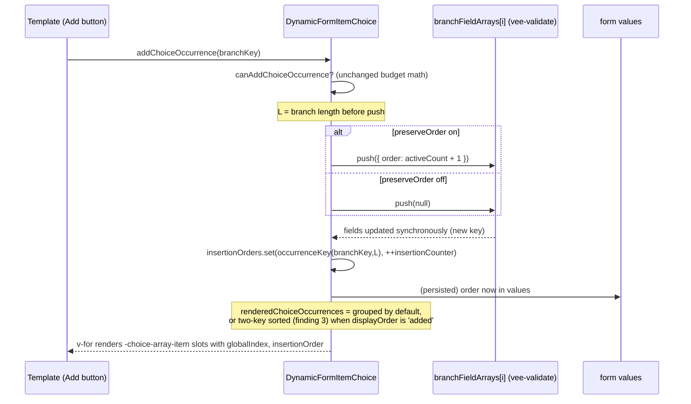
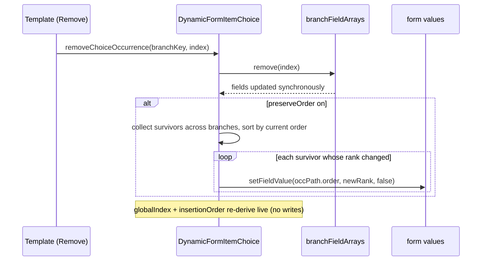

<!-- epic: optional. Set to the parent EPIC-XXX id when this feature belongs to an
     epic; leave "" for a standalone feature. Features are never nested under the
     epic folder, they only reference it here (flat model). -->

# Feature: Repeatable choice occurrence ordering

## Terminology note (2026-09-17, post-review rename)

After this spec's adversarial review, the choice slot families were split by occurrence count on the FEAT-002 branch: `*-choice`/`default-choice` now serve only single (`maxOccurs: 1`) choices, repeatable (`maxOccurs > 1`) choices render through the new `*-choice-array`/`default-choice-array` slots, and `*-choice-item`/`default-choice-item` was renamed to `*-choice-array-item`/`default-choice-array-item` (`ChoiceItemAttributes` → `ChoiceArrayItemAttributes`). The docs `ChoiceSectionCard.vue` was likewise split: it keeps only the single-select card picker, and the repeatable per-branch Add buttons moved to the new `ChoiceArraySectionCard.vue` (rendered from the `heading-choice-array` slot). This spec and its prototype have been updated to the new names throughout; quoted line numbers may be slightly off after that refactor.

## Decided without Jeroen (research)

Settled from research during discussion, not reviewed by Jeroen. Override any of these freely.

- Q7 → no Storybook story assumed; docs example is the demonstration surface (FEAT-001 precedent)
- AR-1 → prototype `#numbering-removal` panel re-rendered in true grouped order (engine fact, not a design choice)
- AR-2 → mount-time `order` backfill from grouped position for loaded occurrences missing it (upholds Q6's decided contiguity)
- AR-3 → deterministic ephemeral sort: occurrences without `insertionOrder` keep grouped position, ahead of session-added ones
- AR-4 → `preserveOrder` is a no-op with a dev-mode warning on scalar-leaf branches (fail loud over silent data corruption)
- AR-5 → `ChoiceOccurrence.insertionOrder` dropped; `insertionOrder` lives only on `ChoiceArrayItemAttributes`

## Problem & goal

FEAT-001 (`explicitChoiceSelection`, done) added a framework-native way to explicitly add/remove occurrences of a repeatable choice branch (`choice` non-empty, `maxOccurs > 1`, `explicitChoiceSelection: true`). `DynamicFormItemChoice.vue`'s `activeChoiceOccurrences` computed (`packages/core/src/components/DynamicFormItemChoice.vue:269-298`) reports every active occurrence, but two properties of that list are limiting for the "add several, each one of several kinds" UX (`docs/examples/choices.md`, "Add several, each one of several kinds" section):

1. **Numbering resets per branch.** Each occurrence's `index` (`ChoiceOccurrence.index`, `DynamicFormTemplate.vue:105-111`) is its position within its own branch's field array (`branchFieldArrays[index].fields.value`), not across the whole choice. Adding a CRM export, an API endpoint, a second CRM export, and a second API endpoint numbers as CRM export #1, API endpoint #1, CRM export #2, API endpoint #2 (badge/number reads `index + 1` inside each occurrence, e.g. `RepeaterCard.vue:32` and `AdvancedFormTemplate.vue`'s `default-choice-array-item` slot). Jeroen wants a way for the template to show a single continuous 1..N sequence across all active occurrences regardless of branch ("item 1", "item 2", "item 3", "item 4"), even though storage stays per-branch.

2. **Render order is grouped by branch, not by add-press order.** `activeChoiceOccurrences` is explicitly, by design (FEAT-001 Q8, DECIDED Jeroen 2026-09-10), grouped by branch declaration order then by index within branch, derived purely from the value tree, with no separate ordering list. `docs/examples/choices.md` states this guarantee explicitly and warns template authors not to build UI that assumes it mirrors click order ("do not build UI that assumes it mirrors click order"). Jeroen wants to explore an **optional** way to display occurrences interleaved, in the order their Add buttons were actually pressed, while keeping engine changes minimal. He is unsure whether true insertion-order rendering is possible without touching too much of the engine, and has named two candidate approaches he wants evaluated rather than pre-selected:
   - an opt-in `order` field stored in each occurrence's own values;
   - keep actual render/DOM order unchanged (grouped, as today) and use CSS `order` (flex/grid) driven by template-side data, so the engine itself stays untouched.

**Hard constraint from Jeroen: change as little of the engine as possible.** Both asks are explicitly framed as opt-in/optional; neither may alter today's `activeChoiceOccurrences` contract or default rendering for a consumer who does not opt in. FEAT-001's grouped-order guarantee (Q8) stays the default; this feature only adds an optional layer on top of it.

**Who this is for:** template authors building a `DynamicFormTemplate`-based template with a repeatable explicit choice (the same audience as FEAT-001), and by extension docs readers learning the pattern from the published "Add several, each one of several kinds" example.

**Success looks like:** a template author can render a continuous 1..N badge across branches, and can explore an interleaved, add-order display, both without the engine's core occurrence math or storage model changing, and both off by default so every existing FEAT-001 consumer is unaffected.

## Scope

### In scope

- A way for the `-choice-array-item` / `default-choice-array-item` slot (or the `-choice-array` slot's `activeChoiceOccurrences`) to expose enough information for a template to compute a continuous, cross-branch 1..N position for each active occurrence, for `maxOccurs > 1` explicit choices only.
- Optional add-order (click-order) display, decided (Jeroen, 2026-09-15, questions 1-2 below) as a two-tier mechanism, both tiers opt-in and the grouped default untouched:
  - **Default tier: ephemeral insertion counter.** Instance-local, inside the engine, keyed by the existing stable occurrence key (vee-validate field-array entry key); exposed via the choice slot props; never written to `values`; resets on page reload (display falls back to grouped order, documented).
  - **Opt-in tier: persisted `order` in values.** A consumer-selectable preserve-order mode writes an `order` field into each occurrence's own values (real, documented submitted data, question 4); survives reload and loaded saved data; compacted to 1..N on removal (question 6).
  - The CSS/template-only approach is rejected (fragile under removal, see the research finding under question 2). The architecture phase works out the exact API shape (flag name and placement, slot-prop names, how the two tiers share the ordering surface).
- Interaction with removal: both the continuous numbering and any add-order mechanism must keep behaving sensibly after an occurrence (from any branch) is removed (renumbering the survivors, or leaving gaps, is an explicit decision, not an accident).
- Interaction with persistence: what happens to continuous numbering and add-order display across a page reload / loaded saved data, for each candidate mechanism.
- Documentation updates to `docs/examples/choices.md`'s "Add several, each one of several kinds" section (and `docs/reference/field-metadata.md` if a new metadata property is added) reflecting whatever ships, including an explicit statement of what changes and what does not in the existing ordering guarantee.
- Updating `docs/.vitepress/theme/components/RepeaterCard.vue` and/or `AdvancedFormTemplate.vue`'s `default-choice-array-item` slot and `ChoiceArraySectionCard.vue` only as far as needed to demonstrate whatever ships (continuous numbering badge, and/or the add-order demo).

### Out of scope (explicit)

- Any change to `activeChoiceOccurrences`'s existing default contract or grouped-order guarantee (FEAT-001 Q8) for consumers who do not opt into this feature's mechanism. That default stays exactly as documented today.
- Any change to `maxOccurs: 1` explicit choice selection; both asks apply only to the repeatable (`maxOccurs > 1`) case.
- Any change to `xsd_choiceMinOccurs` validation semantics or to the occurrence-budget math (`occurrences`, `canAddChoiceOccurrence`) established in FEAT-001.
- Any change to the automatic (non-`explicitChoiceSelection`) choice rendering path.
- Global insertion-order tracking for anything other than a repeatable explicit choice's own occurrences (e.g. this does not touch plain `DynamicFormItemArray` ordering, which is already insertion-ordered by construction since it is backed by a single array).
- A prescribed or shipped visual widget for either the numbering badge or the add-order display; per FEAT-001's precedent, the engine ships primitives/data, template authors build the widget.
- Persisting an `order` value as meaningful business data the consumer is expected to read outside the form (if the `order`-in-values approach is chosen, its status as UI-only vs. real submitted data is an open question below, not assumed).

## Functional overview

- **Continuous numbering (ask 1).** Today a template rendering the `-choice-array-item` slot only receives `index` (per-branch) and, at the `-choice-array` slot level, the full `activeChoiceOccurrences` array (already in cross-branch, grouped order). A template could in principle compute an occurrence's global position by finding its own `(branchKey, index)` pair inside the parent's `activeChoiceOccurrences` array, but that requires plumbing the full list down into each item slot, which today's `*-choice-array-item` slot does not receive. This feature closes that gap so a continuous "item N of M" badge is achievable, either by:
  - adding a cross-branch position (e.g. `globalIndex`) directly to `ChoiceArrayItemAttributes`/`ChoiceOccurrence`, computed by the engine alongside the existing per-branch `index`, or
  - documenting a template-side pattern (pass `activeChoiceOccurrences` down via `slotProps` and look up the occurrence's position from within the item slot).
  The architecture phase picks between "small additive engine field" and "template-side pattern, zero engine change" against the hard constraint of touching the engine as little as possible.
- **Optional interleaved (add-order) display (ask 2).** DECIDED (Jeroen, 2026-09-15): ships in this feature as the two-tier mechanism described in Scope (default ephemeral engine counter; opt-in persisted `order` in values; CSS-only rejected). The paragraphs below record the trade-off analysis that led there:
  - **`order` value in occurrence data:** an opt-in per-occurrence `order` number, written when an occurrence is added, incrementing a shared counter across all branches of the same choice. Interleaved rendering becomes a template-side sort of `activeChoiceOccurrences` by that value. Costs: it is data living inside the value tree next to the occurrence's real fields (a shape / `removeNullValues` / validation consideration, see open questions), and it is a form of state FEAT-001 deliberately kept out of `values` for the selection concept itself (though an add-order counter is arguably a different kind of state than "is this branch selected").
  - **CSS `order` (flex/grid) driven by template data:** the engine's `activeChoiceOccurrences` and actual DOM/render order stay untouched (grouped, exactly as today); a template-side ref records add-press order (e.g. a `Map<occurrenceKey, number>` populated by the template's own `addChoiceOccurrence` wrapper) and applies it as a CSS `order` style per occurrence card. No engine change at all. Costs: DOM order and visual order diverge, which has accessibility/keyboard-tab-order implications (screen readers and Tab traversal follow DOM order, not visual `order`) that need to be flagged to consumers who pick this path; and a template-side-only record cannot survive a page reload / loading previously saved data (the click history is gone), so add-order display would silently revert to grouped order after a reload unless the template author accepts that.
- **Persistence.** Whichever mechanism ships (if any) for ask 2, the functional behavior on reload must be spelled out: an ephemeral, instance-local record (mirroring FEAT-001's `preserveOnSwitch` stash) cannot restore click order after a reload (the component remounts with no history); a value that is part of submitted/loaded data (`order` in values) can restore it, at the cost noted above.
- **Interaction with removal.** For continuous numbering: after removing occurrence 2 of 4, do the survivors renumber to 1, 2, 3, or does occurrence 4 keep displaying as "4"? This needs an explicit, tested answer (the natural, cheapest answer is "always live-derived from the current active list, so removal renumbers the survivors," mirroring how `RepeaterCard`'s existing per-branch `index + 1` badge already behaves on removal today). For add-order: if an `order` value approach ships, does removing an occurrence renumber the remaining `order` values or leave gaps? Both are open questions below with a recommendation, not decided here.

## Design (feature level)

Prototype: [`prototype.html`](./prototype.html) (self-contained, open in any browser; light/dark toggle top-right drives a `.dark` class on `<html>` exactly like VitePress). Every section has a stable anchor id so stories can deep-link its slice.

This design does not invent a new visual language. It reuses the docs example look already established by FEAT-001 (Tailwind slate/indigo/sky cards, `SectionCard`, `RepeaterCard`, `ChoiceArraySectionCard`, `AppButton`, `ToggleSwitch`) and the FEAT-001 prototype's CSS conventions. The only genuinely new visual elements are (a) the continuous-numbering value bound into `RepeaterCard`'s existing badge, and (b) a docs-demo toolbar (segmented control + toggle) that lets a reader flip ordering modes. No component is restyled.

Provisional API names are used in the prototype annotations; final names are the architect's call. Decided by Jeroen: the new `-choice-array-item` slot prop is `globalIndex`. Provisional (flagged as such in-prototype): the ephemeral per-occurrence add-order value is shown as `insertionOrder`; the opt-in metadata flag is shown as `preserveOrder` and it writes an `order` field into each occurrence's values; the display-order channel (Q8, decided Jeroen 2026-09-17) is a static per-choice metadata flag shown as `displayOrder?: 'grouped' | 'added'`. If the architect renames any of these, the prototype annotations and this section's names update with them; nothing in the visual design depends on the exact identifiers.

### Anchors (for story deep-links)

| Anchor | Covers |
| --- | --- |
| `#overview` | Page head, domain data, provisional-name legend |
| `#numbering-before-after` | Ask 1 teaching visual: per-branch `index + 1` (today) vs continuous `globalIndex + 1` |
| `#numbering-populated` | Populated occurrence list with continuous badge + kind badge (card anatomy) |
| `#numbering-removal` | Removal renumbers survivors (live-derived, Q5) |
| `#numbering-empty` | Empty state (0 occurrences, nothing to number) |
| `#ordering-toolbar` | Demo toolbar: segmented display-order control + `preserveOrder` toggle, default/focus/on states |
| `#ordering-grouped` | Grouped-by-kind display (default), badge = `globalIndex + 1` |
| `#ordering-interleaved` | Add-order (interleaved) display, ephemeral tier, reload caveat callout |
| `#ordering-preserve` | Add-order display with `preserveOrder` on (persisted tier), `order` in fields |
| `#ordering-values` | Submitted-values JSON compare (order absent vs present) |
| `#ordering-removal` | Removal compacts `order` to 1..N (persisted tier, Q6) |
| `#reload-behavior` | Ephemeral fallback-to-grouped vs persisted restore, side by side |
| `#states-error` | `xsd_choiceMinOccurs` error, inherited unchanged |
| `#states-limits` | Add buttons disabled (branch max, shared budget exhausted) |
| `#docs-impact` | Summary of docs + component + `components.md` changes |

### Design decisions

1. **Continuous numbering is a badge-value swap, not a new widget** (`#numbering-before-after`, `#numbering-populated`). `RepeaterCard`'s existing round `.rp-num` pill stays exactly as designed; the `default-choice-array-item` slot binds the new `globalIndex + 1` into it instead of the per-branch `index + 1`. The per-branch `kind-badge` (which names the branch: "CRM export" / "API endpoint") is kept alongside, so a continuous number never hides which branch an occurrence belongs to. The before/after two-column compare is the docs teaching visual and deliberately holds render order constant (grouped) so it isolates the numbering change from the ordering change.

2. **Badge always reads 1..N top-to-bottom in whatever order is displayed.** In grouped mode the display order equals `activeChoiceOccurrences` order, so the badge is literally `globalIndex + 1`. In interleaved mode the template physically reorders the rendered occurrences by their add-order value, and the badge is the occurrence's position in that displayed sequence. Either way the reader sees a clean 1, 2, 3 down the page. This keeps "continuous number" meaning "position in what you see", which is the intuitive reading.

3. **Two ordering tiers are surfaced as two independent demo controls** (`#ordering-toolbar`): a segmented control (Grouped by kind | Order added) that changes what you see, and a `preserveOrder` toggle that changes what gets submitted and whether add-order survives a reload. They are independent, and the default (Grouped + preserveOrder off) is byte-for-byte today's FEAT-001 behavior, so a reader who touches nothing sees no change. The toolbar is docs-demo chrome, not a shipped engine widget (consistent with FEAT-001's "engine ships primitives, template builds the widget"). Mechanism note (Q8, decided Jeroen 2026-09-17): both controls map to static per-choice metadata flags (`displayOrder`, `preserveOrder`), so the demo re-keys the form on either flip (ADR-5/ADR-6); flipping the display control mid-session wipes the ephemeral click history, which the demo surfaces as the same documented reload-fallback caveat shown at `#ordering-interleaved`.

4. **A faint mono `seq-chip` teaching aid** shows the underlying sort key (`insertionOrder: n` or `order: n`) on each card in the ordering sections. It is explicitly a teaching aid, not shipped UI; it exists so a reader can see *why* a card sits where it does (e.g. in grouped mode, Billing webhook shows `insertionOrder: 1` yet renders second). The docs example may keep or drop it; the shipped template need not render it.

5. **DOM order equals visual order in interleaved mode** (`#ordering-interleaved`). The template reorders the actual rendered nodes (not a CSS `order` trick), so keyboard Tab traversal and screen-reader order follow the interleaved sequence. This is the design consequence of Q2's rejection of the CSS-only approach, and it is a positive: no accessibility split to warn about.

6. **The reload trade-off is given its own side-by-side section** (`#reload-behavior`) because it is the single decision that separates the two tiers. Ephemeral: instance-local counter, gone on remount, silently falls back to grouped order (amber caveat callout at `#ordering-interleaved`). Persisted: `order` in values, reconstructs exactly, at the price of `order` living in the submitted shape.

7. **The live JSON dump is retained** (`#ordering-values`). The existing example already renders a `<pre>` of `values`; keeping it (with the `order` key highlighted when present) makes the "real submitted data" trade-off of Q4 concrete: the reader watches the `order` key appear and disappear as they flip `preserveOrder`.

### States policy

- **Default:** grouped display, `preserveOrder` off, continuous `globalIndex` badge. Identical to FEAT-001 apart from the badge value.
- **Empty:** the existing FEAT-001 dashed prompt ("No integrations added yet"); `globalIndex` never runs because the `-choice-array-item` loop is empty. Shown at `#numbering-empty`.
- **Error:** `xsd_choiceMinOccurs` message anchored to the section header, inherited unchanged from FEAT-001. Shown at `#states-error`.
- **Disabled:** per-branch Add button disabled at branch `maxOccurs`, all Add buttons disabled at shared budget; existing `AppButton` 40%-opacity/not-allowed style. Shown at `#states-limits`.
- **Loading:** no choice-level loading state (the selector is synchronous); async lives on individual fields inside an occurrence. Stated in-prototype, not separately mocked.
- **Focus/hover:** occurrence card and Add-button focus/hover are inherited from `RepeaterCard`/`AppButton`, unchanged, so not re-demonstrated. The new toolbar controls get explicit focus states: a 2px sky (`--primary`) focus ring on the segmented control (`#ordering-toolbar`), and the `ToggleSwitch`'s existing sky focus-visible outline.
- **Removal:** two variants shown. Continuous numbering renumbers survivors, live-derived, no stored value (`#numbering-removal`, Q5). Persisted `order` compacts to 1..N, rewriting survivors' values (`#ordering-removal`, Q6).
  - DECIDED (research, 2026-09-17, adversarial finding 1): the `#numbering-removal` prototype panel renders in true `activeChoiceOccurrences` grouped order: before removal `Salesforce (CRM) #1, HubSpot (CRM) #2, Billing (API) #3, Shipping (API) #4`; after removing Billing (`apiEndpoint[0]`) `Salesforce (CRM) #1, HubSpot (CRM) #2, Shipping (API) #3`. This keeps section 1 isolating the numbering change from the ordering change as design decision 1 states. Prototype updated accordingly (2026-09-17).
- **Ordering:** grouped (`#ordering-grouped`), interleaved-ephemeral (`#ordering-interleaved`), interleaved-persisted (`#ordering-preserve`), and the values/reload consequences (`#ordering-values`, `#reload-behavior`).

### Light / dark mode

Every color is a `--vp-c-*`-style CSS variable that flips in the `html.dark` block, mirroring FEAT-001's prototype and the docs Tailwind `dark:` classes; both modes come for free. Color-carrying states were walked in both modes: error (rose), the amber "ephemeral caveat" callout, the success (emerald) note lists and docs-impact callout, the indigo badge/`.hl` JSON highlight, the sky focus ring, and the JSON panel background (`--json-bg`, slate-100 / slate-800). No section needs dark-specific handling beyond the variable flip; there is no hardcoded color that would strand a state in one mode.

### Component mapping (against `specs/components.md` and the docs theme)

Reused unchanged (visual):
- `RepeaterCard.vue` (occurrence card + numbered badge + Remove) — only the badge's bound value changes (`index + 1` → `globalIndex + 1`); its markup/styling is untouched.
- `ChoiceArraySectionCard.vue` (per-branch Add buttons for the repeatable choice) — unchanged for the add affordances; gains the demo toolbar controls only where the example wires them.
- `SectionCard.vue`, `AppButton.vue` (incl. `danger-light` Remove and disabled styles), `AppIcon`, `ToggleSwitch.vue` (reused for the `preserveOrder` toggle), the existing `<pre>` JSON dump.
- FEAT-001's `activeChoiceOccurrences` / `addChoiceOccurrence` / `removeChoiceOccurrence` / `canAddChoiceOccurrence` slot-prop contract.

New surface the design implies (names are the architect's to finalize; see `components.md` line 33 where `ChoiceOccurrence` / `ChoiceArrayItemAttributes` live):
- `globalIndex` on the `-choice-array-item` slot props (`ChoiceArrayItemAttributes`), the cross-branch loop index over `activeChoiceOccurrences`. Decided.
- An ephemeral per-occurrence insertion counter on the choice slot props (provisional `insertionOrder`), keyed by the stable occurrence key, never in `values`.
- A `preserveOrder` metadata flag (provisional) next to `explicitChoiceSelection`, writing an `order` field into each occurrence's values (compacted 1..N on removal).
- A `displayOrder?: 'grouped' | 'added'` metadata flag (provisional; Q8, decided Jeroen 2026-09-17), static per-choice, selecting grouped vs add-order rendering for both tiers.

New visual element (docs demo only, not a shipped component): the **demo toolbar** (segmented display-order control + `preserveOrder` toggle). It is docs chrome that drives the example; it is not proposed for the published library surface. If the architect prefers, its two controls can be plain inputs rather than a dedicated component; the design does not require a new reusable component.

No new library-shipped visual component is genuinely needed. Everything renders through existing docs theme components; the feature is a data/primitive addition plus a docs-demo toolbar.

### Note on the live docs site

Re-checked 2026-09-15 (per the Constraints & assumptions note): vue-dynamic-form.bach.software still serves the pre-FEAT-001 `/examples/choices` page (no "Add several, each one of several kinds" section deployed). The repository `docs/` source is the authoritative target for these deltas; the deployed site catches up on the next merge to main. No conflict with any decided item; recorded so the architect and developer do not design against the stale live page.

## Architecture (feature level)

Filled by architect (2026-09-15). Verified against installed versions: `vee-validate@4.15.1`, `vue@3.5.35`. Confirmed with the vee-validate 4.x `useFieldArray` docs: `push()` mutates `fields` synchronously, accepts an initial value object, and each entry carries an auto-generated stable `key`. The engine already relies on this synchronous behaviour in `rawOccurrenceKey`/`removeItemHandlerFor` (`DynamicFormItemChoice.vue:616-661`).

### Summary of the shape that ships

Three additive engine primitives plus a thin docs layer, all off by default so any FEAT-001 consumer that ignores them is byte-identical:

1. **`globalIndex`** (ask 1): a new `-choice-array-item` slot prop, the loop index over the engine's occurrence render list. Decided (Q3).
2. **`insertionOrder`** (ask 2, ephemeral tier): an instance-local counter assigned at add-press time, keyed by the existing stable occurrence key, exposed as slot-prop DATA, never in `values`, gone on remount. Decided (Q2).
3. **`preserveOrder`** (ask 2, persisted tier): a static per-choice `FieldMetadata` boolean that makes the engine write an `order` field into each occurrence's own values (added on push, compacted to 1..N on remove). Decided (Q2, Q4, Q6).

Interleaved DOM display (grouped vs add-order) is realized by the **engine** re-sorting its own occurrence `v-for` (an internal computed distinct from the untouched `activeChoiceOccurrences` slot prop), never by CSS `order` and never by the template (a template cannot reorder slot output the engine emits, see ADR-4). The inbound channel is decided (Q8, Jeroen 2026-09-17): a fourth static per-choice `FieldMetadata` flag, `displayOrder?: 'grouped' | 'added'` (default `'grouped'`), which selects the sort of the render list for both tiers; `preserveOrder` controls persistence only. No `DynamicFormSettings` change ships (see ADR-5).

### Component / composable plan (against `specs/components.md`)

| Piece | Change | Backward compatibility |
| --- | --- | --- |
| `DynamicFormItemChoice.vue` | Modified. Add: an `insertionOrders` `Map<string, number>` + `insertionCounter` (instance-local refs); assignment in `addChoiceOccurrence` (maxOccurs > 1 path); a static `preserveOrder` capture (mirrors the `explicitChoiceSelection`/`preserveOnSwitch` capture at lines 72-77); `order` write on add (via `push({ [orderKey]: nextOrder })`) and a `compactOrder()` pass in the remove paths; a new internal `renderedChoiceOccurrences` computed feeding the occurrence `v-for` (line 729). `activeChoiceOccurrences` (lines 269-298) is untouched. | Every new behaviour is gated on `preserveOrder` or on the display-order channel; with both absent the component runs its exact FEAT-001 path. |
| `DynamicFormItem.vue` | Modified. Two new optional props (`globalIndex?: number`, `insertionOrder?: number`) forwarded onto the leaf `<component :is="template">` (lines 484-499), alongside the existing `branchKey`. | Optional props, `undefined` for every non-occurrence render; existing bindings unchanged. |
| `DynamicFormItemProps.ts` | Modified. Add `globalIndex?: number` and `insertionOrder?: number` next to `branchKey` (same FEAT-001 precedent). | Additive optional props. |
| `DynamicFormTemplate.vue` | Modified (types only). Add `globalIndex: number` and `insertionOrder?: number` to `ChoiceArrayItemAttributes`; `ChoiceOccurrence` is unchanged (DECIDED research 2026-09-17, adversarial finding 5, see API impact above). The `camelize` attr bridge already converts `global-index`/`insertion-order` with no code change. | Additive optional interface fields; no runtime change to slot dispatch. |
| `FieldMetadata.ts` | Modified. Add `preserveOrder?: boolean` and `displayOrder?: 'grouped' \| 'added'` (default `'grouped'`; Q8, decided Jeroen 2026-09-17) next to `preserveOnSwitch`; add both to the `ComputedPropsFieldType` `Omit` list (static-only, same rationale as their siblings). | Additive optional metadata; excluded from `computedProps` so no new runtime surface. |
| `DynamicFormSettings` | Unchanged (Q8 decided against the settings channel, Jeroen 2026-09-17). | No change. |
| `RepeaterCard.vue` (docs) | Modified. Add optional `displayNumber?: number`; badge and aria-label read `displayNumber ?? index + 1`. | Optional prop; array-item callers (which pass no `displayNumber`) keep `index + 1`. |
| `AdvancedFormTemplate.vue` `default-choice-array-item` (docs) | Modified. Bind `:displayNumber="globalIndex + 1"` on `RepeaterCard`; keep `:index` for keys/remove wiring; optionally render an `insertionOrder`/`order` teaching chip. | Docs-only, not published. |
| `ChoiceArraySectionCard.vue` + `FormExampleChoiceExplicitRepeatable.vue` + `heading-choice-array` slot (docs) | Modified. Host the demo toolbar (display-order segmented control + `preserveOrder` toggle); `FormExampleChoiceExplicitRepeatable` sets `displayOrder` and `preserveOrder` on the choice node and re-keys the form when either control flips (see ADR-5/ADR-6). | Docs-only. |
| `docs/examples/choices.md` | Modified. Add the numbering before/after, reframe the grouped-order guarantee (line 154) as "the default the ordering layer sits on top of", document the two tiers, the reload trade-off, the `order`-in-values shape, and the object-branch/`order`-key constraints. | Docs-only. |

No genuinely new library component or composable is needed: `globalIndex`/`insertionOrder` reach templates through the existing `-choice-array-item` slot contract, `preserveOrder` through the existing `FieldMetadata`/`defineMetadata` channel, and (if adopted) the display toggle through the existing `DynamicFormSettings` channel. All three are the sanctioned channels named in the library API rules.

### Public API impact and changeset

- New `FieldMetadata.preserveOrder?: boolean` and `FieldMetadata.displayOrder?: 'grouped' | 'added'` (both additive, defaults off/`'grouped'`, both excluded from `ComputedPropsFieldType`; Q8 decided Jeroen 2026-09-17).
- New slot props on `ChoiceArrayItemAttributes`: `globalIndex: number`, `insertionOrder?: number`. No change to `ChoiceOccurrence`.
  - DECIDED (research, 2026-09-17, adversarial finding 5): `ChoiceOccurrence.insertionOrder?` is dropped. `activeChoiceOccurrences` (the only `ChoiceOccurrence[]` a consumer can read) is literally untouched, so the field would be permanently `undefined` wherever it is observable, and exposing it on the choice-level list invites a template-side sort that ADR-4 says cannot reorder DOM. `insertionOrder` lives only on `ChoiceArrayItemAttributes`, the per-occurrence slot prop where it is actually delivered.
- New optional `DynamicFormItemProps.globalIndex`/`insertionOrder` (these are engine-internal wiring props; `DynamicFormItemProps` is exported, so they are technically public but only meaningful to the engine).
- No `DynamicFormSettings` change (Q8 decided against the settings channel).
- Every item above is optional with a safe default; no export is removed, renamed, or changed in signature; no existing consumer changes behaviour. **Changeset bump: `minor`.** (Confirmed against CLAUDE.md's definitions: new backwards-compatible exports/props = minor, not major.) `specs/components.md` gets the matching entries (the `ChoiceOccurrence`/`ChoiceArrayItemAttributes` rows and the `FieldMetadata` list) when implemented.

### Data flow

State locations:
- `globalIndex`: no stored state. It is the `v-for` loop index over `renderedChoiceOccurrences`; live-derived, renumbers on removal/reorder for free (Q5). Passed occurrence -> `DynamicFormItem` prop -> leaf `<component>` -> template slot.
- `insertionOrder` (ephemeral): instance-local `insertionOrders: Map<occurrenceKey, number>` + `insertionCounter` inside `DynamicFormItemChoice`, mirroring the `stashedBranchValues`/`explicitlySelectedBranch` ephemeral pattern (never in `values`, gone on remount). Assigned in `addChoiceOccurrence` immediately after `push`, using the just-created entry's stable key: snapshot the branch length `L` before push, then `insertionOrders.set(occurrenceKey({ branchKey, index: L }), ++insertionCounter)`. Read back per occurrence when building slot props; occurrences with no entry (loaded saved data) report `undefined` and sort as grouped (the documented reload fallback).
- `order` (persisted): lives in the vee-validate `values` tree, inside each occurrence's own object, under the key `order` (final name, see ADR-3). Written through the same `formContext`/field-array path machinery the component already uses.

DECIDED (research, 2026-09-17, adversarial finding 2): the load path for the persisted tier is a mount-time backfill. At setup, when `preserveOrder` is on, backfill `order` from the current grouped `activeChoiceOccurrences` position onto any occurrence missing it (a one-time `setFieldValue(..., n, false)` pass before the first add), so the counter and the sort always see a contiguous 1..N. Document that `preserveOrder` reconstructs interleaved order from `order` and that occurrences loaded without `order` are seeded from grouped position on mount. Pin in `.logic.test.ts`.
Why: Q6 (DECIDED Jeroen) makes contiguous 1..N `order` the invariant of the persisted tier; the alternative (document "requires contiguous order" and leave legacy data undefined) silently misbehaves in a published library. The write path mirrors the already-shipped `clearBranch`/`restoreStashedBranch` `setFieldValue(..., false)` pattern.
Sources: this spec's Q6 decision; `DynamicFormItemChoice.vue` stash/restore write pattern (checked 2026-09-17).

DECIDED (research, 2026-09-17, adversarial finding 3): the ephemeral-tier sort is a deterministic two-key sort. Occurrences with no `insertionOrder` (loaded data) keep their grouped position and sort ahead of session-added ones; occurrences with an `insertionOrder` follow in press order. A stable two-key comparator (missing-`insertionOrder` group first, ordered by grouped index; numbered group second, ordered by `insertionOrder`), never a raw numeric compare over `undefined`. Pin the mixed case in `.logic.test.ts`.
Why: loaded occurrences existed before any of this session's add-presses, so "ahead of session-added, in grouped order" is the only reading consistent with insertion semantics and with the documented "falls back to grouped" promise; a `NaN` comparator is a defect, not an option.
Sources: this spec's Q2 decision (documented grouped fallback); ECMA-262 `Array.prototype.sort` comparator contract (checked 2026-09-17).

Path handling: occurrence paths are unchanged (`occurrencePathOverride`, `branchPaths[i].value[index]`). The `order` write targets `${occurrencePath}.order` via `push({ order })` on add (so the initial field-array entry already carries it, avoiding a null->object transition and a second write) and via `formContext.setFieldValue(`${occurrencePath}.order`, n, false)` during compaction (`shouldValidate: false`, mirroring `clearBranch`/`restoreStashedBranch`).

Reactivity implications:
- Reordering a keyed `v-for` moves Vue component instances rather than remounting them (keys are the stable `occurrenceKey`, unchanged by display order), and vee-validate field registration is keyed by path, not DOM position, so interleaving preserves field state, focus, and validation with no remount. This is what makes DOM reorder cheap and is why it beats a CSS `order` split (ADR-4).
- `preserveOrder` writes flow into the existing `branchFieldArrays` watch (lines 364-377) -> `updateChildValue` -> `occurrences`/`valuesCount`. See the validation analysis below for why this does not change any validation outcome. The `combinedValidation` `watchEffect`/`computedField` cycle and `assertNoComputeLoop` guard are untouched: the `order` writes are imperative event-handler side effects, not writes inside a `computed`/`computedProps`, so they cannot form a compute loop.
- Compaction cost (Q6): removing one occurrence rewrites the `order` of every survivor whose rank shifted (worst case N-1 `setFieldValue` calls), each dirtying that occurrence and retriggering the `branchFieldArrays` watch once. This is the accepted price of contiguous `order`; it is bounded by the shared budget (<= `maxOccurs`, here 5) and each write is `shouldValidate: false`. `.analytics.test.ts` pins the bound.

### Validation semantics of the persisted `order` field (the load-bearing analysis)

Question: does writing `order` into an otherwise-empty occurrence make the engine think "the branch has a value" and corrupt `xsd_choiceMinOccurs`, the shared budget, or `removeNullValues`?

Answer: no, and here is the exact reason so the reviewer can check it:

- `checkTreeHasValue({ order: 1 })` returns `true` (order is a non-nullish leaf). So an occurrence that holds only `{ order: n }` DOES flip its `childValues[i].valuesCount` contribution from 0 to 1.
- But for a `maxOccurs > 1` explicit choice, `effectiveValuesCount` (lines 304-313) is `Math.max(valuesCount, activeChoiceOccurrences.length)`. `activeChoiceOccurrences` counts every field-array entry structurally (lines 281-287), independent of value, so the pushed placeholder already counted as 1 before any `order` was written. `valuesCount` can only ever rise to at most that same occurrence count, so the `Math.max` is unchanged. `xsd_choiceMinOccurs` (which reads `effectiveValuesCount`, lines 318-330) therefore produces byte-identical results with or without `order`.
- The shared occurrence budget (`occurrences.overrideChildMaxOccurrences`, `canAddChoiceOccurrence`) is derived from `childOccurrences` (raw field-array counts), not `valuesCount`, so it is likewise unaffected.
- `order` is not one of a branch's declared `children`, so it never satisfies a child field's own `xsd_required`/restriction validation; an empty required field inside the occurrence still errors correctly.
- `removeNullValues` keeps `order` (it is a number, not null/undefined). This is the intended, decided behaviour (Q4): `order` is real submitted data, no special stripping.

Intended, tested behaviour to state in the spec: **enabling `preserveOrder` changes the submitted value shape (adds `order`) and shifts the internal `valuesCount` bookkeeping, but changes no validation outcome and no occurrence-budget outcome.** `.validation.test.ts` asserts this directly (a choice at `minOccurs: 1` with one order-only placeholder is still invalid until a real field is filled, exactly as without `preserveOrder`).

### Interaction with prior decisions

- **FEAT-001 grouped-order default (Q8):** `activeChoiceOccurrences` and its grouped guarantee are literally untouched; the reorder lives in the separate `renderedChoiceOccurrences` computed, which equals `activeChoiceOccurrences` whenever no ordering is requested. A non-opted-in consumer's occurrence DOM order stays grouped and byte-identical.
- **`preserveOnSwitch` (ST-05):** orthogonal. It is `maxOccurs: 1` only; `preserveOrder`/`insertionOrder`/`globalIndex` are `maxOccurs > 1` only. They never co-fire on the same choice. Both are static, `ComputedPropsFieldType`-excluded flags, so they coexist in metadata without interaction.
- **Choice-inside-array (FEAT-001 AC11):** occurrence paths already resolve through `props.pathOverride`/reactive `branchPaths`, so a repeatable choice nested in a reindexing array keeps correct `order` write targets and stable `insertionOrder` keys; nothing new is path-sensitive here.
- **`removeNullValues`:** keeps `order` (see above), unchanged.

### ADR notes

**ADR-1 `globalIndex` is the render-loop index, not a stored/derived field.** Context: ask 1 needs a continuous cross-branch 1..N. Decision: expose the `v-for` loop index over `renderedChoiceOccurrences` as a `-choice-array-item` slot prop. Alternative: a computed mirroring `activeChoiceOccurrences`. Rejected: it would duplicate ordering logic and drift; the loop index is zero extra logic and auto-renumbers on removal/reorder (Q5). Result: in grouped mode `globalIndex + 1` reads 1..N down the page; in interleaved mode it reads 1..N of the displayed sequence (design decision 2 satisfied by construction).

**ADR-2 Ephemeral order is assigned at add-press, not lazily at render.** Context: cross-branch add order must reflect click order. Decision: assign `insertionCounter` inside `addChoiceOccurrence` right after `push`. Alternative: assign lazily while iterating `activeChoiceOccurrences`. Rejected: that list is grouped, so lazy assignment would encode grouped order, not press order, defeating the feature.

**ADR-3 Persisted key is `order`, occurrence values must be objects.** Context: the persisted tier needs a home in `values`. Decision: default key `order` inside each occurrence's own object, initial-seeded via `push({ order })`. Alternatives: a configurable settings key, or a wrapper object. Rejected for now: a settings key adds surface for a niche need (YAGNI); a wrapper changes the value shape drastically. Consequences to document as constraints: (a) a branch that declares a child literally named `order` collides (documented; the consumer renames the child or does not opt in); (b) `preserveOrder` only works for branches whose occurrences are objects (have `children`); a scalar-leaf branch has nowhere to attach `order`. The live example uses object branches, so it is unaffected; the docs `maxOccurs > 1` snippet (currently text-leaf branches, `choices.md:105-118`) must be shown with object branches wherever the persisted tier is demonstrated.

DECIDED (research, 2026-09-17, adversarial finding 4): the scalar-branch case is not documentation only. When `preserveOrder` is on and a branch's occurrence is not an object (no `children`), `preserveOrder` is a no-op for that branch, with a dev-mode `console.warn` naming the branch, so a misconfiguration fails loud rather than corrupting data in a published library (`push({ order })` would write an object where the child renders a scalar). Test the scalar-branch path asserts no `order` write and warns.
Why: silent data corruption in a published library versus a loud no-op is a one-sided trade-off; the warn-in-dev pattern is the standard Vue-ecosystem misconfiguration convention.
Sources: `docs/examples/choices.md:105-118` (scalar-leaf snippet that would hit this), Vue dev-warning convention (checked 2026-09-17).

**ADR-4 DOM reorder is engine-side; a template cannot reorder slot output.** Context: design decision 5 attributes the physical reorder to "the template". Mechanically the engine owns the occurrence `v-for`, and a parent cannot reorder the slot content a child emits, so the reorder must live in the engine (via `renderedChoiceOccurrences`). Decision: engine reorders; CSS `order` stays rejected (Q2). The user-visible outcome (true DOM/tab/AT order, no CSS split) is exactly what design decision 5 specifies; only the mechanism attribution is corrected. Recorded here rather than silently, per the "flag conflicts" rule.

**ADR-5 The interleave trigger is a static per-choice metadata flag (`displayOrder`), not a reactive channel.** Superseded by Q8's decision (Jeroen, 2026-09-17). Context: the demo flips grouped/interleaved at runtime, and reordering a keyed list is remount-free, so a reactive channel was considered: a reactive `DynamicFormSettings` field, or tying interleave to the persisted `preserveOrder` tier only. Decision: a static per-choice `FieldMetadata.displayOrder?: 'grouped' | 'added'` flag, captured at setup like its three siblings, selecting the sort of `renderedChoiceOccurrences` for both tiers (`order` when `preserveOrder` is on, `insertionOrder` otherwise, per the decided two-key comparator). Rationale: per-choice where a settings field is form-wide (adversarial finding 6), no new settings surface, display orthogonal to persistence. Consequence: not runtime-reactive; the docs demo re-keys the form to flip it (ADR-6 mechanism), and the flip wipes the session's ephemeral click history, truthfully mirroring the documented reload fallback. `slotProps` as a channel stays rejected: it is a user-shaped type, so keying engine behaviour off a magic `slotProps` field couples the engine to an undocumented convention.

**ADR-6 `preserveOrder` is static; the demo remounts to toggle it.** Context: the toolbar shows `preserveOrder` as a runtime toggle. Decision: keep `preserveOrder` static (captured at setup, `ComputedPropsFieldType`-excluded) for consistency with `explicitChoiceSelection`/`preserveOnSwitch` and to avoid mid-form backfill/leftover-`order` hazards; the docs demo re-keys (`:key`) the form when the toggle flips, so it remounts cleanly. Alternative: make it reactive. Rejected: flipping it mid-form would require backfilling `order` on pre-existing occurrences or leaving stale `order` behind, a surface not worth its cost.

### Flow diagrams

Add-press assigns both tiers' order, then the render list is (optionally) sorted:

Removal, persisted tier, compaction:

### Slicing seams (input for the scrum-master)

- **Slice A - `globalIndex` (engine, ask 1).** `DynamicFormItemProps` + `DynamicFormItem` forward + `ChoiceArrayItemAttributes` type + the `v-for` loop index. Smallest, self-contained, no dependency. Delivers continuous numbering. `renderedChoiceOccurrences` in this slice equals `activeChoiceOccurrences`.
- **Slice B - ephemeral `insertionOrder` + engine reorder infra (engine, ask 2 tier 1).** The `insertionOrders` map, add-time assignment, slot exposure, the `renderedChoiceOccurrences` sort, and (per Q8) the display-order channel. Depends on A (globalIndex becomes the loop index over the now-sortable render list).
- **Slice C - persisted `preserveOrder` (engine, ask 2 tier 2).** The `FieldMetadata` flag, `order` write on add, compaction on remove, and sort-by-`order`. Depends on B (shares `renderedChoiceOccurrences` sort infra).
- **Slice D - docs and example.** `choices.md`, `AdvancedFormTemplate` `default-choice-array-item`, `RepeaterCard.displayNumber`, `ChoiceArraySectionCard`/`FormExampleChoiceExplicitRepeatable` toolbar. Depends on whichever engine slices it demonstrates; can itself be split per tier (D1 numbering after A, D2 ordering after B/C). Docs and Storybook (none planned, Q7) slice separately from engine per the standard pattern.

Each engine slice carries its own `specs/components.md` update and tests; slice A can ship and be released independently of B/C if Jeroen wants numbering first.

### Test surface (FEAT-001 conventions)

- `DynamicFormItemChoice.logic.test.ts`: `globalIndex` values across branches (grouped 1..N); renumber-on-removal (Q5); `insertionOrder` assigned in press order across branches, stable per occurrence, `undefined` for loaded-data occurrences; `preserveOrder` writes `order` on add (`activeCount + 1`); compaction to contiguous 1..N on removal (Q6); `renderedChoiceOccurrences` equals `activeChoiceOccurrences` when no ordering requested, sorted when requested; interleave preserves field state/no remount.
- `DynamicFormItemChoice.validation.test.ts`: `xsd_choiceMinOccurs` byte-identical with `preserveOrder` on vs off (order-only placeholder does not satisfy the branch); shared budget/`canAddChoiceOccurrence` unaffected by `order`.
- `DynamicFormItemChoice.analytics.test.ts`: interleave reorder does not increase mount count; compaction write/re-render count is bounded by the shared budget.
- `DynamicFormItemChoice.test-helpers.ts`: add readers for `insertionOrders`/`renderedChoiceOccurrences` and an `enablePreserveOrder(metadata, choicePath)` helper mirroring `enablePreserveOnSwitch`.
- `TestForm`/`TestFormTemplate`: bind `globalIndex`/`insertionOrder` into the `default-choice-array-item` harness (add `${path}-global-index` / `${path}-insertion-order` testids) so slot delivery is asserted through the real slot contract, mirroring the existing `-kind-badge` pattern.
- `displayOrder` (Q8): `renderedChoiceOccurrences` equals `activeChoiceOccurrences` when `displayOrder` is absent/`'grouped'`; sorted per the decided comparator when `'added'` (both tiers); the flag is static (captured at setup) and `ComputedPropsFieldType`-excluded, mirroring the `preserveOrder` tests.

### Open risks reported to Jeroen

1. **Ephemeral runtime interleave needs a new inbound channel (Open question 8).** The design's two independent toolbar controls require the engine to reorder on a runtime toggle for the ephemeral (`preserveOrder` off) tier. Under the hard "minimal engine change" constraint this is the one place a genuinely new public API (a reactive `DynamicFormSettings` field) is needed, unless the ephemeral DOM interleave is dropped and interleave is delivered by `preserveOrder` only. This is a real product/API call, raised as Q8.
   - PROPOSED (adversarial review, finding 6): when weighing Q8, note that option (a)'s `choiceOccurrenceDisplayOrder` is a form-wide setting, so it cannot back the design's per-choice "Display order" control for a form that contains more than one repeatable explicit choice: it would interleave all of them or none. The docs example (a single choice) hides this, but the shipped public API would not match the per-choice affordance the design implies. If per-choice ephemeral interleave is genuinely wanted, the channel would have to be per-choice (which the `computedProps`-excluded metadata flags cannot carry reactively), which strengthens the case for option (b) or for scoping the setting's documented meaning to "all repeatable explicit choices in the form". This does not resolve Q8; it completes the trade-off for Jeroen.
   - RESOLVED via Q8 (Jeroen, 2026-09-17): the channel is a static per-choice `FieldMetadata.displayOrder` flag, giving up runtime reactivity instead of per-choice granularity. Finding 6's form-wide objection is thereby moot; no settings field ships.
2. **`preserveOrder` constrains occurrence shape and key namespace** (ADR-3): object-branch-only, and a reserved `order` child name. Both are documentable but they narrow where the persisted tier applies; the docs snippet needs object branches for the persisted example.
3. **Compaction dirties survivors** (Q6/ADR): removal now writes to surviving occurrences, so a removal marks more of the form dirty than before. Accepted per Q6 but worth Jeroen confirming it is acceptable UX for the persisted tier.

   DECIDED (Jeroen, 2026-09-17): confirmed acceptable. The dirty-state cost is bounded by the shared budget, each write is `shouldValidate: false`, the bound is pinned by an analytics test, and consumers who dislike it simply do not opt into `preserveOrder`.

## Adversarial review

Filled by adversarial-reviewer at feature level (2026-09-15). Model: claude-opus-4-8.

Verification done against the actual code paths (`DynamicFormItemChoice.vue`, `DynamicFormTemplate.vue`, `DynamicFormItemProps.ts`, `FieldMetadata.ts`, `checkTreeHasValue.ts`, `removeNullValues.ts`, `docs/examples/choices.md`, `RepeaterCard.vue`) and `specs/components.md`.

**Confirmed correct (the load-bearing claims hold):**
- The validation analysis is sound. `checkTreeHasValue({ order: 1 })` is `true` (object with a non-nullish leaf), so an order-only placeholder does flip `valuesCount`, but for `maxOccurs > 1` `effectiveValuesCount = Math.max(valuesCount, activeChoiceOccurrences.length)` and `activeChoiceOccurrences.length` counts field-array entries structurally (lines 281-287), so the `Math.max` and therefore `xsd_choiceMinOccurs` (lines 318-330) are byte-identical with or without `order`. The shared budget derives from `childOccurrences` (raw counts), not `valuesCount`, so it is also unaffected. Verified line by line.
- `removeNullValues` keeps `order` (number leaf), matching the decided Q4 behaviour.
- The reactivity claim holds: `order` writes are imperative event-handler side effects (`addChoiceOccurrence`/`removeChoiceOccurrence`), not writes inside a `computed`/`computedProps`, so they cannot form the `combinedValidation -> computedField -> value` loop nor trip `assertNoComputeLoop`.
- Reordering a keyed `v-for` (keys are the stable `occurrenceKey`, independent of display order) moves component instances rather than remounting, so the DOM-reorder-not-CSS-order approach (ADR-4/design decision 5) is achievable and the memoized remove handlers (lines 644-661) stay valid.
- Changeset `minor` is correct: every added surface is optional/additive; slot-prop types are engine-produced/consumer-received, so a new non-optional `ChoiceArrayItemAttributes.globalIndex` does not break consumers, and none of the additions change `defineMetadata` generic inference.

### Findings

1. **(should-fix) The `#numbering-removal` prototype panel renders occurrences in a non-grouped order, contradicting the section's own grouped premise.** Section 1 is explicitly the "numbering only, render order held constant (grouped)" teaching surface (design decision 1, section lede). But `#numbering-removal` (prototype lines 439-449) renders, before removal, `Salesforce (CRM) #1, Billing (API) #2, Shipping (API) #3, HubSpot (CRM) #4` and after removal `Salesforce (CRM) #1, Shipping (API) #2, HubSpot (CRM) #3`. That is interleaved, not grouped. The engine's `activeChoiceOccurrences` groups strictly by branch declaration order then index (verified lines 274-295), so the true grouped order for that data is `Salesforce, HubSpot, Billing, Shipping` (badges 1-4), and after removing Billing: `Salesforce, HubSpot, Shipping` (badges 1-3). A docs reader implementing grouped-default numbering would never see the order the prototype shows, so the teaching visual misrepresents the engine. Suggested resolution: reorder the cards in `#numbering-removal` to true grouped order (routed as PROPOSED into the States policy removal bullet).

   DECIDED (research, 2026-09-17): accepted as proposed; see the States policy removal bullet. The grouped order is an engine fact (`DynamicFormItemChoice.vue:274-295`, re-verified), not a design choice. `prototype.html` `#numbering-removal` updated to true grouped order.

2. **(should-fix) The persisted tier is unspecified for loaded/legacy data whose occurrences lack `order` or carry non-contiguous `order`.** The add-counter is `activeCount + 1` (data flow, mermaid line 259) and interleaved render sorts by `order`. Both assume every existing occurrence already carries a contiguous `order`. A form that mounts with `preserveOrder: true` and loads previously saved data that predates the feature (or was saved by a consumer who filtered `order`, or is partial) will have occurrences with `order === undefined`: `activeCount + 1` then collides with, or leaves gaps against, the newly written values, and the sort comparator sees `undefined`. The reload story in Scope/Functional overview only covers the clean "all occurrences carry order" case. Suggested resolution (routed as PROPOSED into Data flow): define a mount-time backfill (assign `order` from the current grouped position to any occurrence missing it, before the first add), or document `preserveOrder` as requiring that all loaded occurrences already carry contiguous `order` and state the behaviour when they do not.

   DECIDED (research, 2026-09-17): accepted as proposed (mount-time backfill from grouped position); see the Data flow section for the full rationale. The documentation-only alternative silently misbehaves on legacy data and contradicts Q6's decided contiguity invariant.

3. **(should-fix) Ephemeral interleave with a mix of loaded and session-added occurrences has an undefined sort.** The data-flow note sorts by `(order ?? insertionOrder)` (mermaid line 264). For the ephemeral tier (`preserveOrder` off), loaded occurrences report `insertionOrder === undefined` (documented, line 198) while occurrences added this session carry a number. A form that loads saved data and then adds new occurrences produces a mixed list; a numeric comparator over `undefined` yields `NaN` and an implementation-defined order, not the "falls back to grouped" the spec promises (which only holds when the counter is entirely empty). Suggested resolution (routed as PROPOSED into Data flow): specify the comparator's handling of `undefined` (e.g. occurrences without an `insertionOrder` keep their grouped position ahead of or behind the numbered ones deterministically) and pin it in `.logic.test.ts`.

   DECIDED (research, 2026-09-17): accepted, resolved as a stable two-key sort (missing-`insertionOrder` group first in grouped order, then session-added by `insertionOrder`); see the Data flow section for the full rationale.

4. **(should-fix) `preserveOrder` on a scalar-leaf branch silently corrupts occurrence values; the engine behaviour is undefined.** ADR-3 documents that the persisted tier is "object-branch-only" and that the current docs snippet (`choices.md:105-118`, verified: `crmExport`/`apiEndpoint` are `type: 'text'` scalars) must be shown with object branches. But nothing defines what the engine does when a consumer enables `preserveOrder` on a choice whose branch occurrences are scalars: `push({ order })` writes an object into a slot the child renders as a string, corrupting the value and the child's own validation. For a published library a documented footgun that silently corrupts data is not enough. Suggested resolution (routed as PROPOSED into ADR-3): make `preserveOrder` a no-op with a dev-mode `console.warn` when a branch's occurrence is not an object (no `children`), and test that path.

   DECIDED (research, 2026-09-17): accepted as proposed (no-op + dev-mode warn, tested); see ADR-3 for the full rationale. Fail-loud versus silent corruption is a one-sided trade-off for a published library.

5. **(should-fix) `ChoiceOccurrence.insertionOrder?` is added to a public type but is never populated on the `activeChoiceOccurrences` a consumer can observe.** The architecture both adds `insertionOrder?: number` to `ChoiceOccurrence` (component plan, API impact) and states `activeChoiceOccurrences` (lines 269-298) is "literally untouched". Since `activeChoiceOccurrences` is the only `ChoiceOccurrence[]` exposed as a slot prop, and the populated list is the internal `renderedChoiceOccurrences` (never a slot prop), the new field is permanently `undefined` wherever a consumer can actually read it. Worse, exposing it on the choice-level list tempts a template author to sort `activeChoiceOccurrences` themselves, which ADR-4 says cannot reorder DOM output. `insertionOrder` already reaches templates where it is meant to be used: the per-occurrence `-choice-array-item` slot prop. Suggested resolution (routed as PROPOSED into the API impact and component-plan rows): drop `insertionOrder` from `ChoiceOccurrence`; keep it only on `ChoiceArrayItemAttributes`.

   DECIDED (research, 2026-09-17): accepted as proposed; `ChoiceOccurrence` is unchanged, `insertionOrder` lives only on `ChoiceArrayItemAttributes`. A field that is permanently `undefined` wherever a consumer can observe it is dead API surface, and it invites the template-side sort ADR-4 rules out.

6. **(should-fix) Open question 8 understates that option (a)'s setting is form-wide and cannot back the design's per-choice toolbar for a form with more than one repeatable choice.** Q8(a) proposes a single `DynamicFormSettings.choiceOccurrenceDisplayOrder`, and correctly notes it is "form-wide", but does not draw the consequence: the design's "Display order" control lives on one `ChoiceArraySectionCard` and reads as per-choice, yet a consumer with two repeatable explicit choices could not interleave one and leave the other grouped. The docs example (one choice) hides this, but the shipped public API would not match the per-choice affordance the design implies. This is not a resolution of Q8 (that is Jeroen's call); it is a completeness gap in how Q8 is presented. Routed as PROPOSED into "Open risks reported to Jeroen" risk 1.

   Folded into Q8 (2026-09-17): this finding is input to Q8, not separately resolvable; it is weighed there.

7. **(nit) The prototype's demo-toolbar accessibility semantics are inconsistent and under-specified.** The `#ordering-toolbar` annotation calls the segmented control "a radio-style single-select" with "`aria-pressed` on each", but the markup uses `role="group"` around plain `<button>`s with no `aria-pressed` (lines 500-507, 517-524), and the `preserveOrder` control is a `
` with no `tabindex`, so it is not keyboard-focusable as mocked. This is docs-demo chrome (not shipped library surface), and the real controls will use `ToggleSwitch.vue` and real buttons, but the design leans on decision 5's "no accessibility split" as a selling point, so the one genuinely new interactive control should have defined, consistent semantics (a single-select segmented control is `role="radiogroup"`/`role="radio"` with `aria-checked`, or buttons with `aria-pressed`; pick one). Since this is docs-only and a nit, it does not force discussion.

8. **(nit) The docs example must convert from scalar-leaf to object branches throughout to render the prototype, not only "where the persisted tier is demonstrated."** The prototype shows object-field occurrences (CRM system/Export schedule, Endpoint URL/API key) in every section including the numbering ones, whereas the live `FormExampleChoiceExplicitRepeatable`/snippet uses `type: 'text'` scalar branches. ADR-3 scopes the object-branch requirement to the persisted demo; in practice the whole example is being rebuilt with object branches. Minor scope-accuracy note for the scrum-master/developer; no functional impact.

### Status rationale

No blockers: the shape that ships is implementable, the semver is correct, and the load-bearing validation and reactivity analyses check out against the code. Open question 8 is unresolved, so per `specs/README.md` this lands in `awaiting-discussion` regardless of findings. All six should-fixes are routed as `PROPOSED (adversarial review)` edits, so they do not independently add to the discussion load; Q8 is the item that needs Jeroen.

## Constraints & assumptions

- Must stay backward compatible: `activeChoiceOccurrences`'s existing shape and grouped-order guarantee (FEAT-001 Q8) is unchanged for any consumer that does not opt into whatever this feature ships. Any new field/behavior is additive and off by default.
- Both asks apply only to `explicitChoiceSelection: true` choices with `maxOccurs > 1` (the repeatable case). `maxOccurs: 1` explicit selection and automatic (non-explicit) choices are untouched.
- Vue code (props, events, slot prop names) must use camelCase, never kebab-case, per `CLAUDE.md`.
- Hard constraint from Jeroen: change as little of the `DynamicFormItemChoice.vue` engine internals as possible. A template-side-only solution is preferred over an engine change wherever it achieves the same outcome; where an engine change is unavoidable (e.g. continuous numbering needs the full cross-branch list at the point a single occurrence's slot is rendered), keep it additive and minimal.
- If a new core `FieldMetadata` property or slot prop is added, it needs a changeset (`packages/core/src/` is the published package); expected bump type is `minor` unless the architecture phase finds a reason otherwise.
- `specs/components.md` will need updating once implemented, matching whatever new surface (if any) ships on `ChoiceOccurrence` / `ChoiceArrayItemAttributes` / `FieldMetadata`.
- The published docs site (vue-dynamic-form.bach.software) could not be confirmed to already reflect FEAT-001's "Add several, each one of several kinds" section content at the time this spec was written (a WebFetch check of `/examples/choices` did not surface that section's text); the design phase should re-check the live site before finalizing the docs deltas, since the deployed content may lag the repository's `docs/` source.

## Open questions

Questions for Jeroen. Must be resolved before approval.

1. **Is ask 2 (interleaved/add-order display) even wanted as shipped functionality, or purely an exploration to report back on?** The problem statement frames it as "explore," and Jeroen is explicitly unsure it is worth the engine cost. Recommendation: treat ask 1 (continuous numbering) as committed scope, and let architecture produce a written recommendation for ask 2 (pick one of the two named approaches, or recommend neither) for Jeroen to accept or reject at the review gate, rather than pre-committing to shipping a working interleaved-display feature now.

   DECIDED (Jeroen, 2026-09-15): Ship it in this feature; not exploration-only. See question 2 for the mechanism.

2. **If ask 2 ships, which of the two approaches: `order` in values, or CSS `order` (template-only)?** Both are named by Jeroen as candidates, not decided. Trade-offs to weigh (laid out in the Functional overview above): the `order`-in-values approach survives reload/loaded data but adds UI-shaped state into the value tree next to the occurrence's real fields (affecting `removeNullValues`, and needing an explicit answer to question 4 below); the CSS-only approach touches zero engine code and keeps `values` clean, but cannot survive a page reload and creates a DOM-order/visual-order split with accessibility and keyboard-tab-order consequences that must be documented as a known trade-off wherever it is used. A third option, doing nothing for ask 2 and only shipping ask 1, is also on the table given question 1.

   Research finding (2026-09-15): the CSS/template-only approach is not robustly achievable with zero engine change. A template can only identify an occurrence by `(branchKey, index)`, and per-branch indices reindex on removal, so a template-side click record silently mislabels surviving occurrences unless the template mirrors the engine's reindex bookkeeping. The engine already holds a removal-proof stable key per occurrence (vee-validate's field-array entry key, used internally by `occurrenceKey()` and the memoized remove handlers in `DynamicFormItemChoice.vue:616-661`) but does not expose it to templates.

   DECIDED (Jeroen, 2026-09-15): Two-tier mechanism. Default: an ephemeral, instance-local insertion counter inside the engine, keyed by the existing stable occurrence key, exposed on the choice slot props; it never touches `values` and resets on page reload (display falls back to grouped order, documented). Opt-in: a "preserve order" mode the consumer can select, which writes an `order` field into each occurrence's own values; that the field appears in the value tree is the accepted price of opting in, for click order that survives reload and loaded saved data. The CSS/template-only approach is rejected per the research finding above.

3. **For continuous numbering (ask 1), is a small additive engine field the right cost, or should this be a documented template-side pattern with zero engine change?** `ChoiceArrayItemAttributes` could gain a `globalIndex` (or similarly named) number the engine computes once per render alongside the existing per-branch `index`, at the cost of one more computed field mirroring `activeChoiceOccurrences`'s own logic. The alternative is documenting how a template forwards `activeChoiceOccurrences` down via `slotProps` and does the lookup itself inside the `-choice-array-item` slot, at zero engine cost but real per-template-author boilerplate (an `Array.findIndex` per occurrence render). Given the hard constraint to minimize engine changes, is the boilerplate cost of the zero-engine-change option acceptable, or does Jeroen want the small additive field?

   DECIDED (Jeroen, 2026-09-15): Add the `globalIndex` slot prop (additive engine field). Research note: the global position is the loop index of the engine's existing `v-for` over `activeChoiceOccurrences` (`DynamicFormItemChoice.vue:731`), so the engine cost is minimal and no mirroring logic is needed.

4. **If an `order` value is written into occurrence values, is it real submitted data or purely presentational?** If it is meant to be stripped before submit (like the residue FEAT-001 accepts and cleans via `removeNullValues`), does `removeNullValues` need to know to strip it specifically (since it is not `null`/`undefined`, the existing strip logic would not remove it), or is a consumer expected to filter it out themselves? This affects whether the `order` field is a documented, permanent part of the submitted shape or an implementation detail consumers must manually clean up.

   DECIDED (Jeroen, 2026-09-15): Real submitted data. In the opt-in preserve-order mode the `order` field is a documented part of the value shape; its presence in `values` is the accepted price of opting in ("that is the price the user has to pay"). No special stripping in `removeNullValues`; a consumer who does not want it simply does not opt in.

5. **On removal, does continuous numbering renumber survivors, or preserve original numbers with gaps?** Recommendation: renumber survivors (always live-derived from the current `activeChoiceOccurrences` list, no stored number), mirroring the existing per-branch `RepeaterCard` badge behavior (`index + 1`, which already renumbers on removal today). Flagging as an open question rather than assuming, since "keep the original number" is a legitimate alternative if occurrences are meant to be referenced stably (e.g. in error messages) across removals elsewhere in the form.

   DECIDED (Jeroen, 2026-09-15): Renumber survivors. `globalIndex` is always live-derived from the current `activeChoiceOccurrences` list, never stored, matching existing per-branch badge and array behavior.

6. **On removal, if `order` values ship, do surviving occurrences' `order` values get renumbered (compacted) or keep their original values with gaps?** Same class of question as 5, but for the add-order counter specifically, since gaps versus compaction affects whether "next added item's order" is simply `max(existing) + 1` or requires a full renumber pass.

   DECIDED (Jeroen, 2026-09-15): Compact to 1..N. On removal the engine renumbers the surviving occurrences' `order` values so the submitted sequence stays contiguous; the next added occurrence gets `count + 1`. The architecture phase must account for the extra value writes this implies (dirty-state and re-render impact on surviving occurrences).

7. **Does this feature need a Storybook story, or does the docs example fully cover it?** Following FEAT-001's precedent (no Storybook change assumed unless design/architecture concludes it is necessary), is a Storybook demonstration required, or is the `docs/examples/choices.md` live example sufficient?

   DECIDED (research, 2026-09-15): No Storybook story assumed; the `docs/examples/choices.md` live example is the demonstration surface, and the design phase may still add one only if it concludes it is necessary.
   Why: FEAT-001 set exactly this precedent in its own scope ("Any change to Storybook/playgrounds/storybook is not assumed; only in scope if design/architecture concludes it is necessary", FEAT-001 spec.md line 62) and shipped all five stories without a Storybook change; `playgrounds/storybook` is a private, unpublished playground, so nothing consumer-visible or docs-reader-visible depends on this answer.
   Sources: specs/FEAT-001-explicit-choice-selection/spec.md (scope + stories table), root pnpm-workspace.yaml / playgrounds/storybook/package.json (private, not published), checked 2026-09-15.

8. **What inbound channel drives the runtime grouped/interleaved toggle for the EPHEMERAL tier (raised by architecture, 2026-09-15)?** The engine owns the occurrence `v-for`, so true DOM interleaving is engine-side, not template-side (ADR-4); a template cannot reorder slot output. For the PERSISTED tier this is clean and needs no new public API: the engine sorts by the `order` it already writes when `preserveOrder` is on. But the design's independent "Display order" control also wants interleaving for the EPHEMERAL tier (`preserveOrder` off), toggled at runtime. That toggle must reach the engine through a reactive channel, and the ordering flags are deliberately `computedProps`-excluded, so metadata cannot carry a live toggle. Two options:
   - **(a) Ship one optional reactive `DynamicFormSettings` field** (`choiceOccurrenceDisplayOrder?: 'grouped' | 'added'`, default `'grouped'`), which the demo toolbar flips. Delivers the full two-control design; cost is one new public setting that is form-wide (applies to every explicit choice in the form, not per-choice) and a small engine reorder. Recommended if the ephemeral interleave is wanted as shipped behaviour.
   - **(b) Do not add the setting.** Deliver DOM interleave only for the persisted tier (`preserveOrder` on sorts by `order`), and treat the ephemeral tier as data-only (`insertionOrder` exposed for numbering/labels/teaching chip, occurrences render grouped). Smallest engine change, honours the hard constraint most strictly; cost is that the design's `#ordering-interleaved` view (interleaved cards with `preserveOrder` off) is not delivered as a live DOM reorder, and the toolbar collapses to effectively one control.
   Recommendation: (a) if the ephemeral interleave is genuinely wanted; (b) if "minimal engine change" outranks it. Either maps cleanly to slice B. This is the only new decision architecture surfaced; everything else follows the decided items.

   DECIDED (Jeroen, 2026-09-17): option (c), raised in discussion: a static per-choice `FieldMetadata` flag (provisional name `displayOrder?: 'grouped' | 'added'`, default `'grouped'`), sitting next to `preserveOrder` and following the same static, `ComputedPropsFieldType`-excluded pattern as `explicitChoiceSelection`/`preserveOnSwitch`/`preserveOrder`. It is per-choice (resolves adversarial finding 6), adds no `DynamicFormSettings` surface, and keeps display (`displayOrder`) orthogonal to persistence (`preserveOrder`). It is not runtime-reactive: the docs demo flips it by re-keying the form (the ADR-6 mechanism), which wipes the session's ephemeral click history on flip, truthfully mirroring the documented reload fallback. No `DynamicFormSettings.choiceOccurrenceDisplayOrder` ships.

## Stories

Split by the scrum-master (2026-09-17) along the architecture's slicing seams. Five stories, in implementation order; each engine story carries its own changeset (`minor`), each docs story is changeset-free.

| # | Story | Slice | Scope (one line) | Depends on |
| --- | --- | --- | --- | --- |
| 1 | [ST-01-engine-global-index](./stories/ST-01-engine-global-index/spec.md) | A | Adds `globalIndex` (cross-branch position) to the `-choice-array-item` slot props; smallest, self-contained, no dependency. | none |
| 2 | [ST-02-engine-ephemeral-insertion-order](./stories/ST-02-engine-ephemeral-insertion-order/spec.md) | B | Adds the ephemeral `insertionOrder` counter, the static `displayOrder` metadata flag, and the `renderedChoiceOccurrences` engine reorder computed (deterministic two-key sort, AR-3); `globalIndex` now loops over the sortable list. | ST-01 |
| 3 | [ST-03-engine-persisted-preserve-order](./stories/ST-03-engine-persisted-preserve-order/spec.md) | C | Adds the static `preserveOrder` metadata flag: writes `order` into occurrence values on add, compacts it to 1..N on removal (Q6), mount-time backfill for legacy/loaded data (AR-2), scalar-branch no-op + dev warn (AR-4); reuses ST-02's sort infra with `order` as the key. | ST-02 |
| 4 | [ST-04-docs-continuous-numbering](./stories/ST-04-docs-continuous-numbering/spec.md) | D1 | Binds `globalIndex` into `RepeaterCard`'s badge (`displayNumber`) and documents it in `choices.md`'s "Add several" section; docs-only, no changeset. | ST-01 |
| 5 | [ST-05-docs-interleaved-ordering-demo](./stories/ST-05-docs-interleaved-ordering-demo/spec.md) | D2 | Adds the demo toolbar (`displayOrder` segmented control + `preserveOrder` toggle), documents both ordering tiers and the reload trade-off, and adds `displayOrder`/`preserveOrder` to the field-metadata reference; docs-only, no changeset. | ST-02, ST-03, ST-04 |

Implementation order follows the "engine slices first" convention: ST-01 -> ST-02 -> ST-03 -> ST-04 -> ST-05. ST-04 is functionally dependent only on ST-01 (it could in principle ship right after it), but is sequenced after the engine slices per that convention and because ST-05 builds on the docs example ST-04 leaves in place, avoiding converting the same example twice.

Every story is set to `status: qa` (ready for `/spec:qa`); none are approved. Only Jeroen may set a story to `approved`.
