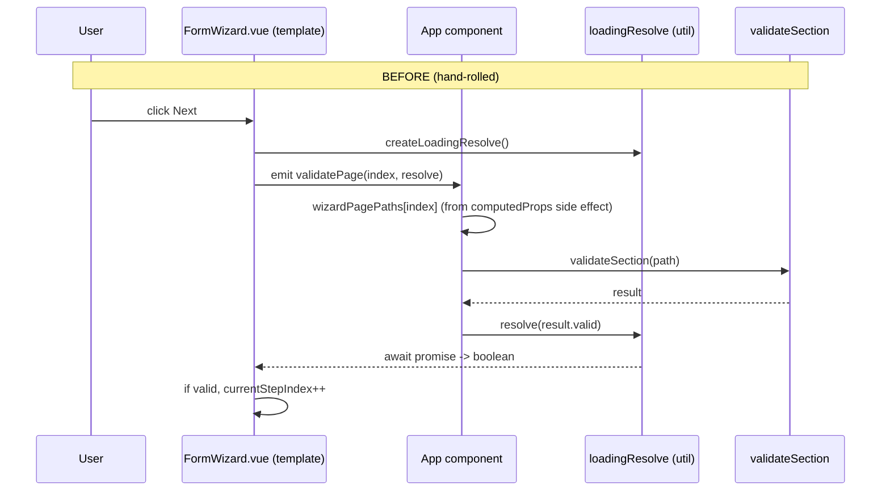
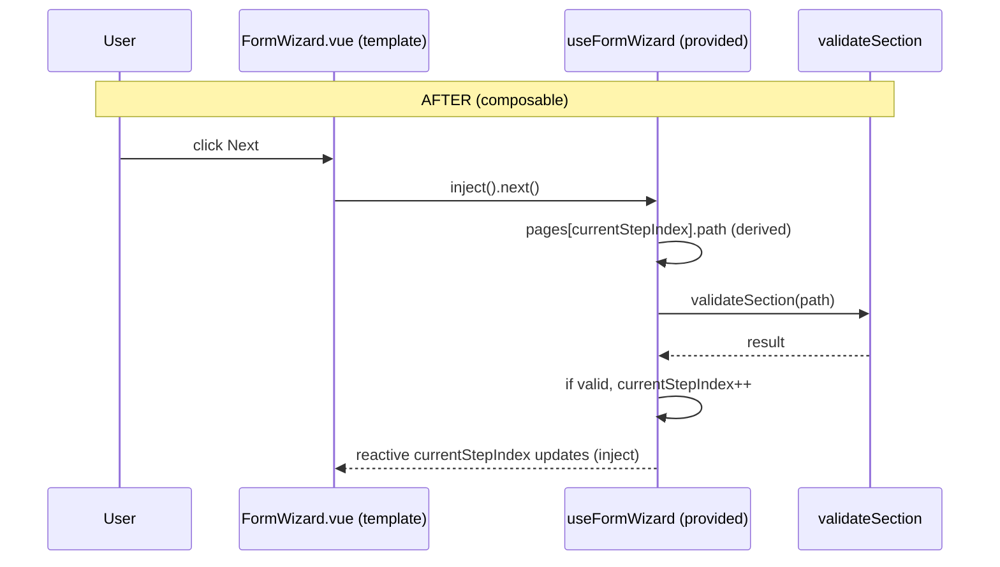

<!-- epic: optional. Set to the parent EPIC-XXX id when this feature belongs to an
     epic; leave "" for a standalone feature. Features are never nested under the
     epic folder, they only reference it here (flat model). -->


# Feature: useFormWizard composable

## Problem & goal

**Who this is for:** library consumers who build multi-step wizard forms with `DynamicForm` (app-component authors wiring up the wizard's data/validation, and template authors writing the `DynamicFormTemplate`-based wizard slots that render it).

**Problem.** The docs' onboarding-wizard example (`docs/.vitepress/theme/components/FormExampleClientOnboardingPlanner.vue`, `FormWizard.vue`, `AdvancedFormTemplate.vue`) currently hand-rolls three pieces of generic plumbing that every wizard-building consumer would have to reinvent:

1. **Step-index to page-path mapping.** `registerWizardPagePath`, a `computedProps` hook attached to every `wizardPage` node, writes into a module-level `wizardPagePaths` record, guarding against repeatable/array pages (`field.path.includes('[')`). It exists only because `correctMetadataAndSetDefaults()` (`packages/core/src/components/DynamicForm.vue`) produces a corrected copy of the metadata tree, with `path` filled in, that is internal to `DynamicForm` and never exposed to the app. There is today no supported way for an app component to ask "what is the path of page 2?" other than reconstructing it from a side effect.
2. **Navigation state with validation gating.** `currentStepIndex`, `next()` (awaits page validation, advances only on success), `prev()`, a backwards-only `gotoStep`, and `isFirst`/`isLast` all live inside `FormWizard.vue`, a presentational docs component, rather than in a reusable, headless place.
3. **Async transport between app and template.** `createLoadingResolve` (`docs/.vitepress/theme/utils/loadingResolve.ts`) plus `validatePage`/`submitForm` callback functions stored inside the metadata tree exist purely to carry a validation result from the app component (where `validateSection`, from `useDynamicForm`/`useValidatePartialForm`, lives) to the template component (where wizard navigation state lives). It is a workaround for those two pieces of state living in different places, not a feature in its own right.

None of this is domain-specific to the onboarding example; it is boilerplate any consumer building a wizard form on top of this library has to reproduce today, with no supported extension point to reuse it.

**Goal.** A headless `useFormWizard` composable, alongside `useDynamicForm`/`useValidatePartialForm` in `packages/core/src/core/`, that owns wizard step state, page-path derivation, and validation-gated navigation, so a consumer wires an app component and a template component to the composable instead of hand-rolling callbacks, module-level state, and a Promise-based transport layer.

**Success looks like:** the docs onboarding example is rebuilt on `useFormWizard` with `registerWizardPagePath`, `wizardPagePaths`, `validatePage`/`submitForm`-in-metadata, and `createLoadingResolve` gone from it, the wizard behaves identically from a reader's point of view, and a new consumer building their own wizard has a documented, typed composable to reach for instead of the docs' old pattern.

## Scope

### In scope

- A new exported composable `useFormWizard` in `packages/core/src/core/useFormWizard.ts`, exported from `packages/core/src/index.ts` (new public surface, so `specs/components.md` gets an entry once implemented).
- Step/page state: current step index, a `next()` that awaits section validation (via a `validateSection`-shaped function passed in, matching `useDynamicForm`'s return) and advances only on success, `prev()`, `gotoStep(index)`, `isFirst`, `isLast`.
- Page-path derivation reusing the same name-defaulting and parent-path-joining semantics `correctMetadataAndSetDefaults` already applies (`packages/core/src/components/DynamicForm.vue:75-76`), so a consumer no longer attaches a `computedProps` hook to every page node to learn its own path. This retires `registerWizardPagePath`, the module-level `wizardPagePaths` record, and its array-page guard (`field.path.includes('[')`).
- A provide/inject channel for the composable's state (current step, page list, navigation functions), following the existing `dynamicFormSettingsKey` Symbol pattern (`packages/core/src/types/DynamicFormSettings.ts`), so template-layer components can read wizard state without it being threaded through the five `wizardPage-*` slot variants (`wizardPage`, `wizardPage-array`, `wizardPage-array-item`, `wizardPage-choice`, `wizardPage-choice-array`) and the `currentStepIndex`/`gotoStepIndex` slot props in `AdvancedFormTemplate.vue`.
- Refactor of the docs onboarding example to use the composable: `FormExampleClientOnboardingPlanner.vue` (drop `registerWizardPagePath`, `wizardPagePaths`, `validatePage`, and the `validatePage`/`submitForm` metadata callbacks in favor of calling the composable), `FormWizard.vue` (drop its local `currentStepIndex`/`next`/`prev`/`gotoStep` in favor of the composable, or of the injected wizard state), and `AdvancedFormTemplate.vue` (drop the emit/slot-prop threading for step state in favor of the inject channel). The visual result stays the same: this is an internal-wiring refactor, not a redesign.
- Retiring `docs/.vitepress/theme/utils/loadingResolve.ts` (`createLoadingResolve`/`LoadingResolve`) once its only two callers (wizard `validatePage`/`submit`) no longer need it, unless investigation during architecture finds another caller (see open question below).
- Documentation updates: `docs/examples/advanced.md` (the onboarding wizard walkthrough) and `docs/reference/use-validate-partial-form.md` (its worked wizard example currently shows the `registerWizardPagePath`/`wizardPagePaths` pattern this feature retires). Whether a new dedicated reference page for `useFormWizard` is added to `docs/reference/` (alongside `dynamic-form.md`, `use-validate-partial-form.md`) is for the architecture/design phase to size.
- Tests for the new composable (unit tests for step navigation, page-path derivation, validation gating) following the project's `*.test.ts`/`*.logic.test.ts` conventions.
- A changeset (`packages/core/src/` changes): bump type per CLAUDE.md's rules, worked out in the architecture phase (a new additive export is minor unless it needs a breaking change elsewhere, which nothing in this scope currently suggests).

### Out of scope (explicit)

- Any visual redesign of the wizard UI (stepper, buttons, page transitions). The docs example keeps its current look; this feature only changes what powers it internally.
- The `wizard`/`wizardPage`/`wizardSummaryPage` field types themselves, `wizardSummary`, `choiceShowChoiceSelect`, and other `AdvancedFormTemplate`-specific `defineMetadata` extensions. Those are docs-template concepts, not engine concepts, and stay exactly as they are; `useFormWizard` is a composable the app/template layer consumes, not a new metadata field type.
- Building or shipping a stepper/progress UI component in `packages/core`. Per the library's three-layer contract, everything visual stays in userland; the engine ships state and gating logic, not a widget.
- Submit-flow redesign beyond whatever integration decision is made for question 3 below (e.g. no change to `handleSubmit`, `useDynamicForm`, or `removeNullValues` semantics).
- Changing `validateSection`/`useValidatePartialForm` itself; `useFormWizard` consumes it as-is via a passed-in function.
- Any change to how `DynamicForm` walks or corrects the metadata tree (`correctMetadataAndSetDefaults`) for non-wizard purposes; the composable reads/derives from the metadata a consumer passes it, it does not change engine tree-walking behavior.
- Wizard support inside `packages/element-plus/` (private package); not touched by this feature.

## Functional overview

A consumer building a wizard form today writes, roughly:

```ts
const { validateSection, handleSubmit } = useDynamicForm<Values>();
// ...hand-rolled wizardPagePaths, registerWizardPagePath computedProps hook attached
// to every page, validatePage()/submitForm() stored in metadata, FormWizard.vue owning
// currentStepIndex/next/prev/gotoStep locally, createLoadingResolve bridging the two.
```

After this feature, the same consumer writes:

```ts
const { validateSection, handleSubmit } = useDynamicForm<Values>();
const wizard = useFormWizard(metadata, { validateSection });
// wizard.currentStepIndex, wizard.pages (label/description/path per page),
// wizard.next(), wizard.prev(), wizard.gotoStep(i),
// wizard.isFirst, wizard.isLast, wizard.isValidating
```

- `wizard.pages` is derived from the metadata the consumer passes in (exact shape: see open question 1), giving each page's path without a `computedProps` side effect.
- `wizard.next()` calls the supplied `validateSection(currentPagePath)` and advances `currentStepIndex` only when it resolves valid; no `LoadingResolve`, no callback stored inside metadata.
- The template layer (`FormWizard.vue`, `AdvancedFormTemplate.vue`'s `wizardPage-*` slots) reads the current step and calls `next()`/`prev()`/`gotoStep()` either via props passed down from the app component, or via the provide/inject channel (architecture decides which, or offers both, matching how `dynamicFormSettingsKey` is injected independently of prop drilling).
- Everything visual (stepper markup, buttons, `v-show` page switching, the `wizardPage`/`wizardSummaryPage` slot types, building `wizardSummary`) stays exactly as it is today in userland; only the state and gating logic that currently lives split across a module-level object, a presentational component, and metadata-stored callbacks moves into one composable.

## Design (feature level)

Skipped: `useFormWizard` is a headless, type-level/engine composable with no visual surface of its own inside `packages/core`. Per `specs/README.md`, pure engine/type-level features skip the design phase and go straight to architecture.

The docs wizard example is refactored to consume the composable, but that refactor is explicitly an internal-wiring change, not a new visual pattern: the wizard must look and behave identically to a reader of `docs/examples/advanced.md` before and after. No new prototype is produced; the architecture phase documents the before/after wiring instead, and the existing rendered example (already live in the docs source) is the reference for "unchanged."

## Architecture (feature level)

> Scope of this section: it makes every architecture-level decision this headless composable needs, EXCEPT the five product/API calls parked in Open questions (page-derivation shape Q1, navigation policy Q2, submit ownership Q3, `isValidating` Q4, reference-doc placement Q5). Those stay open for Jeroen. Where a decision below depends on one of them, it is designed to hold across the plausible answers and the seam is named; nothing here pre-resolves an open question.

### Component / composable plan

**New (published surface):**

- `useFormWizard` in `packages/core/src/core/useFormWizard.ts`, exported from `packages/core/src/index.ts`. Justification: nothing in `specs/components.md` owns wizard step state, page-path derivation, or validation-gated navigation. `useDynamicForm`/`useValidatePartialForm` are form-level (values, validate, `validateSection`); this is a layer above them that a wizard-building consumer composes on top. It sits alongside them in `packages/core/src/core/` as the spec directs.
- A companion inject reader so template-layer components (`FormWizard.vue`, the `wizardPage-*` slots) read wizard state without prop-drilling. Working name `useFormWizardContext()`; it returns the same object `useFormWizard` produced, or throws/returns `undefined` when called outside a wizard-providing ancestor (error-vs-undefined is a small call for the implementing story, defaulting to a thrown error with a clear message, matching how a missing form context surfaces today). Justification: the alternative is to re-export a raw injection `Symbol` (the `dynamicFormSettingsKey` precedent), but a typed reader composable is the safer public shape (no consumer touches the Symbol, the return type is inferred, and it hides whether the channel is inject or something else later). The Symbol stays internal to `useFormWizard.ts`.
- Exported supporting types: the page descriptor (working name `FormWizardPage`, e.g. `{ path: string, label?: MaybeRefOrGetter<string | undefined>, description?: string }`), the options bag type, and the composable's return type. All additive.

**Reused as-is (no change):**

- `useDynamicForm` / `useValidatePartialForm` / `validateSection`. `useFormWizard` receives a `validateSection`-shaped function and calls it; it does not re-implement or inject the form context itself, so it inherits the caller's own context-resolution (including the `provides`-vs-`inject` quirk documented in `useValidatePartialForm.ts`). This keeps the composable decoupled from vee-validate entirely.
- The `dynamicFormSettingsKey` provide/inject pattern (`packages/core/src/types/DynamicFormSettings.ts`) is the model the wizard channel copies, not a thing that changes.

**Modified (docs only, non-published, no changeset):**

- `FormExampleClientOnboardingPlanner.vue`: drop `wizardPagePaths`, `registerWizardPagePath`, `validatePage`, and the `validatePage`/`submitForm` metadata callbacks; call `useFormWizard` in setup instead. The `registerWizardPagePath` entry is removed from all five pages' + summary page's `computedProps`; every OTHER `computedProps` entry stays untouched (industry/teamSize/migrationDeadline/trainingFormat logic, and the summary page's `field.wizardSummary = wizardSummary.value` line all remain).
- `FormWizard.vue`: delete its local `currentStepIndex`/`next`/`prev`/`gotoStep`/`submit`/`createLoadingResolve`; read state and call actions from the injected wizard. It stays a presentational component (Stepper + buttons + layout).
- `AdvancedFormTemplate.vue`: drop the `validatePage`/`submitForm` fields and the `LoadingResolve` import from its `defineMetadata` extended-properties generic, drop the `@validate-page`/`@submit` wiring and the `<slot :current-step-index :gotoStepIndex="gotoStep" />` threading in the `#wizard` slot, and drop `currentStepIndex`/`gotoStepIndex` from the `defineMetadata` SlotProperties generic. The `wizardPage-*` and `wizardSummaryPage` slots read `currentStepIndex`/`gotoStep` from the injected wizard instead of `slotProps`.
- Retire `docs/.vitepress/theme/utils/loadingResolve.ts`. Confirmed its only callers are the three files above (grep: `createLoadingResolve`/`LoadingResolve` appears solely in `AdvancedFormTemplate.vue`, `FormExampleClientOnboardingPlanner.vue`, `FormWizard.vue`, `loadingResolve.ts`, and this spec). No caller survives the refactor, so the file is deleted; Open question resolution is not needed to confirm this.
  > PROPOSED (adversarial review, finding 3): the grep is incomplete. `LoadingResolve` also appears in `docs/reference/use-validate-partial-form.md:68` (`async function validatePage(pageIndex: number, resolve: LoadingResolve)`), inside the worked wizard example this feature retires. Slice B's update of that reference page must remove the `LoadingResolve`/`validatePage` usage as well, not only the `registerWizardPagePath`/`wizardPagePaths` pattern.
  > PROPOSED (adversarial review, finding 2): "Open question resolution is not needed to confirm this" is only true under Q3 = option (a) (composable owns submit). Under Q3 = option (b) as written, the app-side submit handler has no remaining channel to reach `FormWizard` (the `submitForm` metadata callback and `loadingResolve` are both removed, and `FormWizard` is instantiated deep inside `AdvancedFormTemplate`, not by the app), so `loadingResolve.ts` cannot simply vanish unless the composable exposes a submit path through the inject channel. Make the unconditional deletion contingent on Q3 = (a), or on the composable owning a submit method regardless. See Q3 seam.

### Public API impact

- **New exports, all additive:** `useFormWizard`, `useFormWizardContext`, and the supporting types. No existing export changes signature or behaviour. `DynamicForm`, `DynamicFormItem`, `useDynamicForm`, `validateSection`, `FieldMetadata`, `DynamicFormSettings`, and every slot contract are untouched.
- **`specs/components.md`:** needs a new "Composables & core" row for `useFormWizard` (and `useFormWizardContext`) and, if the page/options/return types are exported by name, a mention in the Types section. Flagged here; the developer adds it when the slice lands (per the components.md upkeep rule).
- **Changeset bump: minor.** Purely additive new exports, no breaking change anywhere in `packages/core/src/`. This matches CLAUDE.md's "new feature or export that is backwards compatible" definition. Nothing in scope forces a major; if Q3 makes the composable own `submit`, that is still additive (a method on a new object), so the bump does not change.
- **Library API rules check:** the new capability reaches templates through an established channel (a provide/inject state channel modelled on `dynamicFormSettingsKey`), not a side channel; the old side channels (module-level `wizardPagePaths`, callbacks stored inside metadata, a `Promise`-transport util) are exactly what this removes. Every new option is optional with a safe default (see Q2/Q3/Q4 seams). No breaking change, so no major-changeset justification is needed.

### Data flow

- State is created in the app component's `setup` (where `useDynamicForm` already lives) by the single `useFormWizard(...)` call: a `currentStepIndex` ref, a `pages` computed derived from the metadata, and `isFirst`/`isLast` computeds. That one call also `provide()`s the wizard object under an internal Symbol, so no separate provide step is needed by the consumer (confirmed against the Vue provide/inject contract: `provide()` runs synchronously inside `setup` when called from a composable, and any descendant at any depth injects it reactively).
- The provider (app component, e.g. `FormExampleClientOnboardingPlanner`) is an ancestor of `DynamicForm`, which is an ancestor of the template (`AdvancedFormTemplate`/`FormWizard`). So the wizard state reaches the template the same way `dynamicFormSettingsKey` (provided by `DynamicForm`) reaches `DynamicFormItem`.
- **Page-path derivation** replays the engine's own name-defaulting and joining (`DynamicForm.vue:75-76`): `name ?? 'field-${index}'` and `[parent?.path, fieldName].filter(Boolean).join('.')`. Because the wizard root node carries `path: ''` (falsy, filtered out), each page path resolves to the bare child name (`company`, `projectContacts`, `launchApproach`, `systems`, `summaryPage`) which is exactly the prefix `validateSection` matches against and the path `DynamicFormItem` registers with vee-validate. For a wizard node with a non-empty path (a deeper/nested wizard), paths resolve to `wizardPath.childName`, still consistent, so derivation generalises beyond the demo.
- **Path handling / bracket notation:** deriving from the *static* metadata (not the runtime-corrected tree) means page paths never contain array indices, which is why the old `field.path.includes('[')` array-page guard exists and why it disappears here: the guard was a symptom of running `registerWizardPagePath` as a per-occurrence `computedProps` side effect inside a repeatable context. Static derivation removes the failure mode instead of guarding it. A repeatable wizard page (`projectContacts`, `maxOccurs: 3`) still validates correctly because `validateSection('projectContacts')` matches `projectContacts[0].*` by prefix.
- **Ordering invariant:** the composable's `pages` order must equal the engine's render order of the wizard node's children (the `v-for` `index` the `wizardPage`/`wizardSummaryPage` slots compare `currentStepIndex` against). Both derive from the same `children` array in declaration order, so they match; this is the invariant the `currentStepIndex === index` `v-show` gating relies on and is worth an explicit test.
  > PROPOSED (adversarial review, finding 4): there are actually **three** derivations of "the steps" that must agree in count and order: the composable's `pages` (drives `isFirst`/`isLast`), `FormWizard.vue`'s `Stepper` steps (today `fieldMetadata.children?.map(...)`, `AdvancedFormTemplate.vue:89`), and the engine's `index` (drives the `v-show` gating). They agree today only because all three enumerate the same `children` array; if Q1 makes `pages` a filtered or explicit subset, `isLast` (composable) and the last rendered step (engine `index`) desync and the submit button lands on the wrong page. Specify that `FormWizard.vue` derives its `Stepper` steps from the injected `wizard.pages`, so Q1's page definition is the single source of truth for all three.
- **Reactivity implications:** removing the six `registerWizardPagePath` `computedProps` closures is a net reduction in the reactive workload (fewer functions re-run inside each item's `computedProps` `computed()`), and there is no new `computedProps` loop-guard surface because the composable holds its state outside the item tree. `pages` is a `computed`; accept the metadata argument as `MaybeRefOrGetter<FieldMetadata | FieldMetadata[]>` (matching `useDynamicForm`'s `MaybeRefOrGetter` accessors) so a consumer passing a reactive/computed metadata still gets a live page list. `next()` reads `pages.value[currentStepIndex.value].path` at call time, so it always validates the current page even if the tree changed.

### Navigation, submit, and validating-state seams (depend on open questions)

- **`next()`** (stable across all answers): `await validateSection(currentPage.path)`, advance `currentStepIndex` only when `result.valid`. No `LoadingResolve`, no metadata callback. This is the core of the feature and is not gated on any open question.
- **`prev()`** (stable): decrement, floored at 0.
- **`gotoStep(index)` policy (Q2):** implement `gotoStep` behind an options bag so the default and any `allowForwardJump`/`validateOnJump` switch are one edit. The refactored docs example must keep today's backwards-only behaviour (it is also enforced independently by `Stepper.vue`'s `:disabled="i > currentStep"`), so whatever default Q2 picks, the composable's call site in `FormWizard.vue`/the summary "edit" buttons stays backwards-only for the demo. Designed so Q2's answer changes only a default and an options type, not the call sites.
- **`submit()` ownership (Q3):** two shapes, both additive and both leaving the demo visually identical. (a) Composable owns it: `useFormWizard(metadata, { validateSection, onSubmit })` where `onSubmit` wraps the consumer's `handleSubmit(...)`; `FormWizard.vue` calls `await wizard.submit()`. (b) Composable stops at navigation: `FormWizard.vue` calls a submit handler the app passes in, and `handleSubmit` stays entirely app-side (the shape the Functional overview sketch assumes). The `next()`/gating design is identical either way; Q3 only decides whether one method moves into the object. Do not build both.
  > PROPOSED (adversarial review, finding 2): option (b) as written is under-specified and, combined with the other removals, has no working transport. `FormWizard` is instantiated inside `AdvancedFormTemplate`'s `#wizard` slot, not by the app component, so "a submit handler the app passes in" cannot arrive as a prop; the two channels that carry it today (the `submitForm` metadata callback and `loadingResolve`) are both deleted by this feature. So option (b) requires either retaining one of those channels or, more consistently, having the composable expose the submit path over the inject channel even in the "stops at navigation" shape. Recommend Q3 lean toward option (a), or that option (b) be respecified with an explicit transport.
- **`isValidating` (Q4):** `next()` (and `submit()` if owned) is the only place a validation promise is in flight, so exposing an `isValidating` ref is a two-line internal addition (set true before `await`, false after) with no ripple. Left out of the committed return type pending Q4; the seam is named so adding it later is not a redesign. This is the capability `createLoadingResolve`'s `isRunningRef` used to provide.

### ADR notes

**ADR-1 — Replicate the path-join logic in the composable rather than reach the engine's corrected tree.**
Context: page paths must match what `correctMetadataAndSetDefaults` produces, but that corrected tree is internal to `DynamicForm` and never exposed. Decision: replicate the two-line name-default + join (`name ?? 'field-${index}'`, `[parent?.path, name].filter(Boolean).join('.')`) inside `useFormWizard`, covered by a unit test that pins the derivation.

> PROPOSED (adversarial review, finding 1): the derivation is **three**-part, not two, and the omitted part is load-bearing. `DynamicForm.vue:76` is `const fieldPath = fieldMetadata.path ?? [parent?.path, fieldName].filter(Boolean).join('.')` — an explicit `path` on a node wins before the join. The demo's wizard root sets `path: ''` explicitly, and the whole data-flow narrative (line 124) depends on that `''` being the parent prefix. Replicating only the two quoted lines recomputes the root name as `'wizard'` and derives every page path as `wizard.<child>`, which matches no vee-validate-registered path, so `validateSection` returns `valid: true` over zero fields and `next()` advances without validating. Replicate all three parts, `fieldMetadata.path ??` first. The pinning unit test must include (a) the empty-root-path case and (b) a page node carrying an explicit `path`, so a two-line regression is caught. Alternative considered: extract a shared internal helper (`resolveFieldName`/`joinFieldPath`) imported by both `DynamicForm.vue` and the composable, guaranteeing they can never drift. Rejected as the default because it edits `correctMetadataAndSetDefaults`'s internals, which the spec's Out-of-scope explicitly fences ("Any change to how `DynamicForm` walks or corrects the metadata tree"); the extraction is behaviour-preserving, so if Jeroen prefers drift-proofing over the two-line duplication, the fence note is amended and ADR-1 flips to the shared helper. The duplicated logic is trivial and has been stable for the life of the engine, so drift risk is low. (Flagged for review, not an Open question.)

**ADR-2 — State reaches the template via a provide/inject channel, not via slot-prop drilling.**
Context: the spec asks architecture to choose prop-drilling, inject, or both for template access. Decision: inject only, modelled on `dynamicFormSettingsKey`. Alternative considered: keep threading `currentStepIndex`/`gotoStepIndex` through the `#wizard` slot's `slotProps` (today's mechanism). Rejected: the whole point is to remove that threading (it is why `AdvancedFormTemplate` needs the `slotProps` SlotProperties generic and the `<slot :current-step-index>`); inject is the established channel for cross-`DynamicForm` state and matches how settings already flow. Offering both would keep the dead prop path alive for no consumer.

**ADR-3 — Expose a typed reader composable, keep the injection Symbol internal.**
Context: template authors need to read the provided state. Decision: export `useFormWizardContext()`; do not export the Symbol. Alternative considered: re-export the Symbol like `dynamicFormSettingsKey`. Rejected: a reader composable gives inferred types, a clear error when used outside a wizard, and freedom to change the channel later without a breaking change; the Symbol precedent predates that ergonomic option and is not a reason to repeat it. (This is an API-shape decision the adversarial review and `/spec:discuss` will vet; it is not one of the five parked questions.)

**ADR-4 — The single `useFormWizard()` call both creates and provides the state.**
Context: the consumer should not have to remember a second `provide()` step. Decision: `useFormWizard` calls `provide()` internally as part of setup. Alternative considered: return the object and require the consumer to `provide` it. Rejected: extra boilerplate and an easy-to-forget step; `provide` inside a composable run during `setup` is a supported Vue pattern (verified). Consequence to note for review: this assumes one wizard per provider subtree; nested/sibling wizards under one component would collide on the Symbol. That is out of scope for the demo (single wizard) but is called out as a known limitation for the reviewer.
  > PROPOSED (adversarial review, finding 5): keep the single-Symbol default, but for a published composable the constraint must be a documented contract rather than an unstated assumption a consumer hits at runtime (a second wizard, or a nested `DynamicForm`-with-wizard inside a page, silently injects the wrong outer wizard with no error). (a) Document the one-wizard-per-provider-subtree constraint in the reference doc (Q5) and in `specs/components.md`; (b) shape `useFormWizard`/`useFormWizardContext` so an optional injection key can be added later without a signature break (reserve the parameter position now). Both are additive, so this does not change the minor bump.

### Slicing seams (input for scrum-master)

- **Slice A — core composable (engine):** `useFormWizard` + `useFormWizardContext` + exported types + unit tests (page-path derivation incl. the empty-root-path and nested-path cases, `next()` validation gating via a stubbed `validateSection`, `prev`/`gotoStep`/`isFirst`/`isLast`, the pages-order invariant). Independently deliverable and independently testable without the docs. Carries the changeset and the `specs/components.md` update. Depends on nothing.
- **Slice B — docs refactor + docs pages:** rebuild `FormExampleClientOnboardingPlanner.vue`, `FormWizard.vue`, `AdvancedFormTemplate.vue` on the composable, delete `loadingResolve.ts`, update `docs/examples/advanced.md` and `docs/reference/use-validate-partial-form.md` (remove the `registerWizardPagePath`/`wizardPagePaths` teaching pattern), and add/extend the reference doc per Q5. Depends on Slice A. This is the "behaves identically to a reader" regression surface; the `launchApproach` choice page doubles as the choice-page regression check named in Constraints.
- Q2/Q3/Q4/Q5 answers land inside these two slices (Q2–Q4 shape Slice A's options/return; Q5 shapes Slice B's doc placement); none forces a third slice.

### Sequence: before vs after





### Open risks for Jeroen

- The five Open questions are unresolved by design; Q1 (page-derivation shape) most shapes the composable's first argument and how much of the join logic it duplicates (ADR-1), so it is the highest-leverage one to settle first.
- ADR-1's fence tension: drift-proofing via a shared helper would require a small, behaviour-preserving amendment to the Out-of-scope note. Recommended default (replicate) avoids it.
- ADR-4's one-wizard-per-provider assumption is fine for the demo but is a real constraint on any future multi-wizard page.

## Adversarial review

Filled by adversarial-reviewer at feature level. Findings and resolutions.

Reviewer note (verified, not a finding): the **ordering invariant** (architecture line 126) holds. The engine renders a parent's children with `v-for="(child, index) in computedField.children"` and passes that `index` straight to the slot (`DynamicFormItem.vue:503-510`), so the `index` each `wizardPage`/`wizardSummaryPage` slot compares `currentStepIndex` against is the child's position in the wizard's `children` array in declaration order. `computedProps` never reorder or drop children (`hide` is a `v-show`, so the node keeps its index), so a composable that derives `pages` from the same `children` array in declaration order matches. An explicit test for it is still worthwhile, as the architecture says.

1. **[BLOCKER] The path-derivation logic ADR-1 tells the developer to replicate is incomplete, and a literal implementation silently disables validation gating.** ADR-1 (line 140) and the Constraints note (line 209) both quote the derivation as "the two-line name-default + join": `name ?? 'field-${index}'` and `[parent?.path, name].filter(Boolean).join('.')`. But `DynamicForm.vue:75-76` is three-part, and the omitted part is load-bearing: `const fieldPath = fieldMetadata.path ?? [parent?.path, fieldName].filter(Boolean).join('.')`. The engine honours an **explicit `path`** before falling back to the join. The demo's wizard root sets `path: ''` explicitly (`FormExampleClientOnboardingPlanner.vue:205`); the data-flow narrative (line 124) depends on that `''` being used as the parent prefix so each page resolves to its bare child name (`company`, `projectContacts`, ...). A developer who replicates only the two quoted lines computes the root's name as `'wizard'` (from `name ?? field-0`) and derives page paths as `wizard.company`, `wizard.projectContacts`, etc. Those match no path `DynamicFormItem` ever registered with vee-validate, so `validateSection('wizard.company')` filters to zero fields and returns `valid: true` (`.every` over an empty array). The result is not a crash: `next()` advances on every click without validating anything, silently defeating the core feature. This bites regardless of how Q1 resolves, because any derivation still needs the wizard node's own resolved path (which is `''` only because the explicit `path` is honoured). Resolution: ADR-1 and the Constraints note must specify replicating all three parts, with the `fieldMetadata.path ??` precedence first, and the pinning unit test must include a page node that carries an explicit `path` (and the empty-root-path case) so a two-line regression is caught. Routed as PROPOSED into ADR-1 and Constraints.

2. **[SHOULD-FIX] The "delete `loadingResolve.ts` unconditionally, no open-question resolution needed" claim (line 111) is only true under Q3 = option (a).** Q3 (submit ownership) is open. Under option (b) as written ("`FormWizard.vue` calls a submit handler the app passes in, and `handleSubmit` stays entirely app-side"), there is no transport left for that handler to reach `FormWizard`: `FormWizard` is instantiated deep inside `AdvancedFormTemplate`'s `#wizard` slot, not by the app component, so the app cannot pass it a prop directly. The only channels that exist today are (i) the `submitForm` metadata callback, which this feature removes; (ii) the provide/inject wizard object, which under option (b) does not own submit; and (iii) `createLoadingResolve`, which this feature removes. Option (b) therefore has no wiring for submit, and the load-bearing claim that `loadingResolve.ts` "no caller survives the refactor" holds only if the composable owns submit (option a). Resolution: state that the unconditional deletion of `loadingResolve.ts` assumes Q3 resolves to option (a); if Q3 picks option (b), the composable must still expose a submit path through the inject channel (or a metadata/prop transport must be retained). Routed as PROPOSED into the loadingResolve bullet (line 111) and the Q3 seam (line 134).

3. **[SHOULD-FIX] The grep behind the `loadingResolve.ts` deletion is incomplete: `LoadingResolve` also appears in `docs/reference/use-validate-partial-form.md`.** Line 111 states `createLoadingResolve`/`LoadingResolve` "appears solely in `AdvancedFormTemplate.vue`, `FormExampleClientOnboardingPlanner.vue`, `FormWizard.vue`, `loadingResolve.ts`, and this spec." It does not: `docs/reference/use-validate-partial-form.md:68` uses `LoadingResolve` in its worked wizard example (`async function validatePage(pageIndex: number, resolve: LoadingResolve)`), and lines 59-108 there teach the whole `wizardPagePaths`/`registerWizardPagePath`/`validatePage` pattern this feature retires. Deleting `loadingResolve.ts` will break that doc's snippet. The scope already lists updating that reference page (line 43, 221), but the "appears solely in [5 places]" reasoning that justifies an unconditional delete rests on an incomplete grep. Resolution: correct the grep claim and make Slice B's update of `use-validate-partial-form.md` explicitly include removing the `LoadingResolve`/`validatePage` usage, not only the `registerWizardPagePath` pattern. Routed as PROPOSED into the loadingResolve bullet.

4. **[SHOULD-FIX] Two independent derivations of "the steps" must be pinned to one source, or `isFirst`/`isLast`/`v-show` gating can drift.** After the refactor the composable owns `currentStepIndex`, `isFirst`, `isLast` (computed from `pages.length`), while `FormWizard.vue` still builds its `Stepper` `steps` independently from `fieldMetadata.children?.map(...)` (`AdvancedFormTemplate.vue:89`) and the `wizardPage` slots gate on the engine's `index`. Three derivations (composable `pages`, `Stepper` steps, engine `index`) must agree on count and order for navigation to line up. Today they agree only because all three happen to enumerate the same `children` array; Q1 could make `pages` a filtered/explicit subset (e.g. "only `wizardPage`-typed children" or "an explicit page list"), at which point `isLast` (composable) and the last rendered step (engine `index`) desync and the submit button appears on the wrong page. Resolution: specify that `FormWizard.vue`'s `Stepper` steps derive from the injected `wizard.pages` (single source of truth) rather than re-mapping `fieldMetadata.children`, so Q1's page definition governs all three. Routed as PROPOSED into the data-flow section.

5. **[SHOULD-FIX] ADR-4's single-Symbol provide is a published-API constraint that must be documented, not just noted for the reviewer.** ADR-4 (line 149) has `useFormWizard` `provide()` under one internal Symbol and calls multi-wizard-per-subtree "a known limitation ... out of scope for the demo." That is a defensible default (adding an optional injection key later is additive, not breaking), but as shipped, a second `useFormWizard` under the same subtree, or a nested `DynamicForm`-with-wizard inside a wizard page, silently injects the wrong (outer) wizard with no error. For a published composable this needs to be a documented contract, not an unstated assumption a consumer discovers at runtime. Resolution: keep the single-Symbol default, but (a) document the one-wizard-per-provider-subtree constraint in the reference doc (Q5) and in `specs/components.md`, and (b) design `useFormWizard`/`useFormWizardContext` so an optional injection key can be added later without a signature break (reserve the parameter position). Routed as PROPOSED into ADR-4.

6. **[NIT] Page-descriptor type is internally inconsistent.** The working shape (line 99) is `{ path: string, label?: MaybeRefOrGetter<string | undefined>, description?: string }`: `label` accepts a getter/ref but `description` is a plain `string`, though the demo's `helpText`/`description` are equally candidates for reactivity and the `Stepper` renders both. Resolution: either make both `MaybeRefOrGetter<string | undefined>` or document why only `label` is reactive. Not blocking; the implementing story can settle it.

## Constraints & assumptions

- Builds directly on `useDynamicForm`'s existing `validateSection` (`packages/core/src/core/useDynamicForm.ts`) and `useValidatePartialForm`'s quirk (it reads form context from the calling component's own `provides` rather than via `inject` when called alongside `useDynamicForm` in the same component; `packages/core/src/core/useValidatePartialForm.ts`). `useFormWizard` does not reimplement or bypass this; it is called with a `validateSection`-shaped function, so it inherits whatever context-resolution behavior the caller's own `useDynamicForm()`/`useValidatePartialForm()` call already has.
- Page-path derivation must stay behaviorally consistent with `correctMetadataAndSetDefaults`'s own name-defaulting and path-joining (`packages/core/src/components/DynamicForm.vue:75-76`: `fieldMetadata.name ?? 'field-${index}'`, `fieldMetadata.path ?? [parent?.path, fieldName].filter(Boolean).join('.')`), since the whole point is that a page's derived path matches the path `DynamicFormItem` actually registers with vee-validate.
  > PROPOSED (adversarial review, finding 1): note the full line 76 includes the `fieldMetadata.path ??` precedence (explicit path wins before the join). This is not optional detail: the demo's wizard root's explicit `path: ''` is what makes each page path resolve to its bare child name. See ADR-1. Because that corrected tree is internal to `DynamicForm` and not exposed, `useFormWizard` will need to either reimplement the same minimal joining logic against the raw metadata the consumer passes it, or the architecture finds another way to reach the corrected tree; this is not assumed away, see open question 1 and the architecture note below.
- `explicitChoiceSelection`/`preserveOnSwitch` (FEAT-001) and any repeatable-choice ordering work (FEAT-002) are orthogonal: neither changes page-level navigation, so `useFormWizard` should not need special-case logic for a wizard page that happens to contain a choice, beyond what `validateSection` already handles for that page's subtree.
- The onboarding example's `launchApproach` wizard page is itself a choice (`explicitChoiceSelection`/`preserveOnSwitch`), so the refactored example doubles as a regression check that `useFormWizard`'s page-path derivation and validation gating keep working when a page's own root node is a choice, not just a plain group.

## Open questions

Questions for Jeroen. Must be resolved before approval.

1. **What counts as "a page"?** Deriving pages from the metadata root's direct children fits the onboarding example (the root `wizard` node has path `''`, and its children are the pages), but a wizard whose relevant node is not the tree root, or whose pages sit at a deeper level, needs an escape hatch. Candidate shapes for the composable's first argument: (a) the full metadata array/tree plus an implicit "root's children are pages" rule, (b) the wizard node's `children` array directly, (c) an explicit array of page paths/labels the consumer supplies. Jeroen decides the API shape; this also determines how much of `correctMetadataAndSetDefaults`'s path-joining logic the composable needs to duplicate (see the Constraints note above).
2. **Navigation policy.** The docs example's `gotoStep` is backwards-only (`_index <= currentStepIndex.value`); that is the demo's choice, not a library rule. Should `useFormWizard` take options such as `allowForwardJump` or `validateOnJump`, and what should the default be (backwards-only, matching today's docs behavior, or something else)?
3. **Submit integration.** Should `useFormWizard` also own a `submit()` step that wires `handleSubmit` (mirroring how it wires `validateSection` for `next()`), or should it stop at navigation and leave `handleSubmit` entirely to the app component, as the proposed shape above assumes?
4. **Loading/validating state.** Should the composable expose an `isValidating` (or similarly named) ref so a template can show a spinner or disable the Next button while `validateSection` is in flight? This is the direct replacement for what `createLoadingResolve`'s `isRunningRef` gave the old plumbing; without it, the retiring of `loadingResolve.ts` loses a capability the docs example currently has no visible use for today but could plausibly want.
5. **Reference documentation placement.** Does `useFormWizard` get its own new page under `docs/reference/` (matching the existing one-composable-per-page pattern of `use-validate-partial-form.md`), or is it documented as a section within an existing reference page? Either way, `docs/reference/use-validate-partial-form.md`'s current worked wizard example (which demonstrates exactly the `registerWizardPagePath`/`wizardPagePaths` pattern this feature retires) needs to change so it does not keep teaching the pattern this feature replaces.
