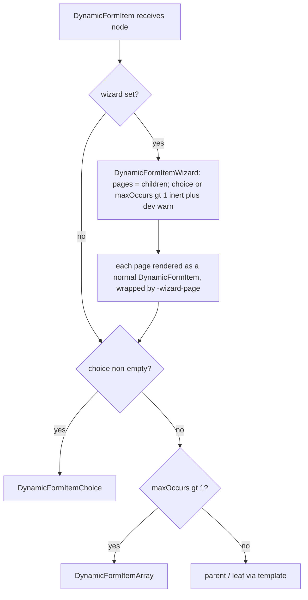
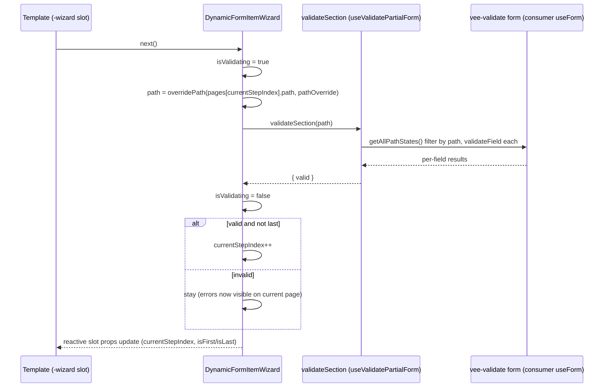

<!-- epic: optional. Set to the parent EPIC-XXX id when this feature belongs to an
     epic; leave "" for a standalone feature. Features are never nested under the
     epic folder, they only reference it here (flat model). -->


# Feature: Wizard as a first-class metadata shape

## Note on history

This is the third attempt at `FEAT-003`, reusing the id. The first two were discarded:

1. A `useFormWizard` composable, implemented and then reverted by Jeroen: the composable + provide/inject construction was too complex for consumers to wire up correctly.
2. A hand-written "metadata-driven wizard" spec draft, removed by Jeroen because he wants the normal `/spec:feature` → `/spec:design`/`/spec:arch` → `/spec:review` workflow followed instead of a hand-authored spec.

This spec captures the direction Jeroen gave in conversation for a third approach: **wizard as an engine-recognized metadata shape**, delivered purely through slot props (the same channel every other shape already uses), with no composable and no provide/inject.

## Problem & goal

**Problem.** Multi-step ("wizard") forms are a common pattern for this library's consumers, but the engine has no concept of a wizard today. The library's own docs example (`FormExampleClientOnboardingPlanner.vue` + `FormWizard.vue` + `AdvancedFormTemplate.vue`) proves this by hand-rolling everything a wizard needs:

- Step state (`currentStepIndex`) lives in a plain UI component (`FormWizard.vue`), not in the engine, and is threaded down to every page through the `slotProps` channel (`currentStepIndex`/`gotoStepIndex`) that `defineMetadata`'s fourth generic exists for arbitrary consumer data, not step state.
- Per-page validation and submit are wired as **functions stored directly on `FieldMetadata`** (`validatePage`, `submitForm`), which breaks the "metadata is data" contract every other shape (array, choice) upholds.
- Knowing which vee-validate path belongs to which page requires the docs example to reimplement a piece of the engine's own path logic: `registerWizardPagePath`, a `computedProps` callback that reads `field.parent.children.findIndex(...)` to reconstruct a page's path by index into a hand-kept `wizardPagePaths` record. This is exactly the class of duplication that made the reverted `useFormWizard` composable fail review: that composable had no access to the engine's already-corrected metadata tree (`correctMetadataAndSetDefaults` in `DynamicForm.vue`, which fills in every node's `path`), so it had to rebuild the three-part path join itself, and got it wrong at first.
- An async gating helper (`docs/.vitepress/theme/utils/loadingResolve.ts`) exists only to bridge the callback-in-metadata pattern with the `FormWizard.vue` component's `validatePage`/`submit` events.

**Goal.** Make `wizard` a first-class shape the engine recognizes, alongside the existing array / choice / parent / leaf shapes documented in `CLAUDE.md`'s Architecture section. A new `DynamicFormItemWizard` component (sibling to `DynamicFormItemArray` and `DynamicFormItemChoice`) owns step state (`currentStepIndex`, `isFirst`, `isLast`, `isValidating`) and validation-gated navigation (`next()`, `prev()`, `gotoStep()`), and delivers all of it to the template **only** as slot props on a new `-wizard` slot family, exactly like `addChoiceOccurrence`/`activeChoiceOccurrences` are delivered on the `-choice` family today. Page paths are read from the engine's own corrected tree, so no consumer or template ever re-derives a path. No public composable, no provide/inject channel, no callback stored in metadata.

**Who this is for.**
- **Library consumers** building multi-step forms: they get wizard behavior by adding one metadata property instead of hand-building step state and per-page validation wiring.
- **Template authors** (including the maintainers of `AdvancedFormTemplate.vue`): they gain a `-wizard`/`-wizard-*` slot family with the same shape-dispatch contract every other slot family already follows.
- **Docs readers** of the onboarding example: see the same finished form, built without the hand-rolled plumbing.

## Scope

### In scope

- A new `wizard` property on `FieldMetadata` that marks a node as a wizard. Exact shape (boolean flag vs. a small config object) is an open question below.
- A new `DynamicFormItemWizard` component, positioned next to `DynamicFormItemArray` / `DynamicFormItemChoice`, wired into `DynamicFormItem`'s existing shape-detection branch (`isArray` / `isChoice` / `isParent` / `isInput`).
- Engine-owned wizard state, delivered as slot props on the `-wizard`/`default-wizard` slot: `currentStepIndex`, `isFirst`, `isLast`, `isValidating`, `next()`, `prev()`, `gotoStep(index, options?)`. This is the state shape Jeroen decided for the reverted composable attempt and confirmed still stands.
- `next()` validates only the current page's fields before advancing, using the existing `validateSection` partial-validation machinery (`useValidatePartialForm`) against a page path read from the corrected metadata tree — not re-derived.
- `gotoStep()` is backward-only by default (matching the decision), with opt-in forward jumping and opt-in validate-on-jump behavior.
- A **page-level slot family**: the wizard node's pages (its `children`, in declaration order) each render through a dedicated slot family, mirroring how `-array`/`-array-item` and `-choice`/`-choice-array`/`-choice-array-item` compose today. Exact suffix naming is an open question below.
  > DECIDED (Jeroen, discussion): pages come from `children` only. The earlier "choice branches as pages" reading is dropped together with the composition promise below; see the next bullet and ADR 3.
- `type`-scoped dispatch composes with the new families the same way it does for every existing shape: a wizard node with a `type` gets a dedicated `<type>-wizard` slot (falling back to `default-wizard`), and each page gets a dedicated page-level slot (falling back to the page-level default), per `DynamicFormTemplate.vue`'s existing priority-fallback pattern.
- Composition on the wizard node itself: **`wizard` wins**. Pages come from `children` only; a non-empty `choice` or a `maxOccurs > 1` set alongside `wizard` is ignored and triggers a single dev-mode `console.warn` naming the node's path and the ignored property. Constructions like a "choice of wizards" or a repeated wizard are modeled by nesting wizard nodes inside a plain `choice` branch or inside an array item's children instead.

  > DECIDED (Jeroen, discussion): this replaces both this bullet's original "keeps working as array/choice" promise and the reviewer's PROPOSED reconciliation (which kept the choice-as-pages reading). Rationale: the compositions are speculative with no known consumer need, both remain fully expressible by nesting `wizard: true` nodes inside a choice branch or an array item, and the alternatives conflate concerns (`maxOccurs` carries XSD occurrence semantics and must not double as a UI-flow trigger; routing to `DynamicFormItemChoice` would strip the wizard semantics the author explicitly opted into). Ignoring the inert props with a warning is deterministic and honest. Tests verify: the warning fires, pages come from `children`, and the nested constructions (choice of wizards, wizard inside an array item) render and navigate. Resolves adversarial finding 1 (blocker).
- Pages themselves keep working as arrays or choices exactly as today (the docs example already has a repeatable page, `projectContacts`, and a choice page, `launchApproach`) — this is unaffected by the new wizard shape and continues through the existing `-array`/`-choice` families layered under the new page-level family.
- Submit stays consumer-owned: native form submit + `handleSubmit` from `useDynamicForm` (already exported, already spreads vee-validate's `useForm()` return). The engine's only contribution toward submit is `isLast`, so a template knows when to render a submit button instead of a "next" button. No submit method is added to the wizard state.
- Rebuilding the docs onboarding example (`docs/.vitepress/theme/components/FormExampleClientOnboardingPlanner.vue`, `FormWizard.vue`, `AdvancedFormTemplate.vue`) on the new shape, with the visual result unchanged for a docs reader. Retiring in the process:
  - `registerWizardPagePath` and the hand-kept `wizardPagePaths` record.
  - `validatePage`/`submitForm` callbacks stored on `FieldMetadata`.
  - `docs/.vitepress/theme/utils/loadingResolve.ts` (used only by the wizard's `validatePage`/`submit` event bridge — confirmed by investigation: it has no other consumer in the codebase).
  - The `currentStepIndex`/`gotoStepIndex` slot-prop threading in `AdvancedFormTemplate.vue`'s `defineMetadata` fourth generic (`slotProperties`) and its manual `v-show="... === index"` per-page gating, replaced by the new page-level slot family's own props.
- Doc updates:
  - `docs/examples/advanced.md` — currently describes the `wizard` type's `validatePage` callback; update to describe the new metadata shape.
  - `docs/reference/field-metadata.md` — currently has no wizard content at all; add a section documenting the new `wizard` property.
  - `docs/reference/dynamic-form-template.md` — currently has no wizard content at all; add a section documenting the new `-wizard`/`-wizard-*` slot families, following the existing per-family documentation pattern used for `-choice`/`-choice-array`/`-choice-array-item`. Must include, prominently: **wizard page slots gate visibility with `v-show`, never `v-if`**; a `v-if` unmounts the page's fields, clears their values on navigation, and deregisters their validation (see ADR 6's DECIDED note). `v-if` is acceptable only for field-less pages.
  - `docs/reference/use-validate-partial-form.md` — its "Wizard example" section (lines ~53-108) currently teaches consumers to hand-build `wizardPagePaths` and a `registerWizardPagePath` `computedProps` callback. This is the exact pattern being retired; replace or reframe this section so it no longer teaches it.
- Tests covering the new engine shape (component-level, mirroring the existing `DynamicFormItemArray`/`DynamicFormItemChoice` test suites) and the rebuilt docs example.
- A minor changeset (additive: new optional `FieldMetadata` property, new component, new slot family; see the semver open question below for what still needs confirming).
- A `specs/components.md` update (performed by the developer at implementation time, per the standard workflow, not by this spec).

### Out of scope (explicit)

- **No public `useFormWizard` composable and no provide/inject channel.** This is the one thing the reverted attempt got structurally wrong; the whole point of this attempt is to deliver wizard state purely as slot props, the same channel every other shape already uses.
- **No callbacks stored in metadata.** `validatePage`/`submitForm`-style function properties on `FieldMetadata` are retired, not replicated under a new name.
- **No engine-owned submit.** The engine never calls `handleSubmit` itself; it only exposes `isLast` so a template can decide when to show a submit control.
- **No changes to the XSD-inspired validation rule set or to `validateSection`'s own semantics.** The wizard's `next()`/`gotoStep()` reuse `validateSection` as-is; this feature does not change what "validate a section" means.
- **No new global wizard settings on `DynamicFormSettings`** beyond whatever the `wizard` metadata property itself carries (see the open question below on that property's shape). If a global default turns out to be needed, that is new scope, not assumed here.
- **No new Storybook story is required by this feature.** Investigation found no existing wizard-related Storybook content to update or restore; if the architecture phase decides engine-level wizard behavior needs headless test coverage beyond the existing `packages/core/src/components/__tests__/` pattern, that is an architecture decision, not asserted here.
- **No visual redesign of the docs onboarding example.** The rebuild must produce the same result a docs reader already sees; any visual change is a defect, not a goal, of this feature.

## Functional overview

From a consumer's perspective:

1. A metadata node becomes a wizard by carrying the new `wizard` property (exact shape: open question below).
2. The wizard's pages are its `children` in declaration order. A non-empty `choice` or a `maxOccurs > 1` on the wizard node itself is inert and triggers a dev-mode warning (see the composition DECIDED entry in Scope and ADR 3); a choice of wizards or a repeated wizard is expressed by nesting `wizard: true` nodes inside a plain choice branch or an array item instead.
3. The engine tracks which page is current and exposes navigation state and actions as slot props on the wizard node's own slot (`<type>-wizard` / `default-wizard`): `currentStepIndex`, `isFirst`, `isLast`, `isValidating`, `next()`, `prev()`, `gotoStep(index, options?)`.
4. `next()` runs partial validation scoped to the current page only (via `validateSection`, using the page's engine-resolved `path`) and only advances `currentStepIndex` if that validation passes. `isValidating` is `true` while that validation is in flight.
5. `prev()` moves back one page unconditionally (no validation gate going backward).
6. `gotoStep(index, options?)` is backward-only by default (jumping to an already-visited earlier page); forward jumps and jump-time validation are opt-in per the decision.
7. Each page renders through its own page-level slot (the new family, suffix TBD — see open question), receiving what it needs to know whether it is the currently active page.
8. `isLast` lets the template decide whether to render a "next" control or defer to the consumer's own submit control (native `<form>` submit or a button wired to `handleSubmit` from `useDynamicForm`).
9. A page that is itself an array or a choice keeps behaving exactly as an array or choice does today (repeatable page, choice page), composed under the new page-level family the same way `-choice-array` composes under `-choice` today.

**Investigation finding relevant to architecture (not a design decision, a fact worth flagging so it is not missed):** `DynamicFormItem.vue`'s `onBeforeUnmount` clears a field's value (`value.value = undefined`) whenever it unmounts, **unless** `props.partOfArrayField` is set. Today's hand-rolled docs example never actually unmounts inactive pages — `FormWizard.vue`'s `<main><slot /></main>` combined with `AdvancedFormTemplate.vue`'s `v-show="... === index"` keeps every page mounted and merely hides the inactive ones. If `DynamicFormItemWizard` instead conditionally unmounts (`v-if`) non-current pages, navigating back to an earlier page would find its fields' values wiped, since nothing currently exempts a wizard page from this clear-on-unmount behavior the way `partOfArrayField` exempts an array item. Whatever the architecture phase decides (keep all pages mounted-but-hidden like today, or add a wizard-page exemption analogous to `partOfArrayField`), this needs a deliberate answer, not an accident.

## Design (feature level)

**Skipped, with justification, matching the same call the reverted attempt made.** This feature's only visual surface is the docs onboarding example, and the explicit requirement is that its rebuild produces an *unchanged* visual result for a docs reader — there is no new visual design to prototype. The engine work itself (the new shape, the new component, the new slot families) is headless. If the architecture phase concludes a genuinely new visual affordance is needed anywhere (for example, if the page-level slot family turns out to need a new default rendering in `AdvancedFormTemplate.vue` beyond what already exists), it should flag that back rather than silently design it here.

## Architecture (feature level)

### Summary of the shape

`wizard` becomes a fifth engine-recognized shape alongside array / choice / parent / leaf. A new `DynamicFormItemWizard` sits next to `DynamicFormItemArray` and `DynamicFormItemChoice`, owns the step state, and delivers navigation state and actions to templates purely as slot props on two new slot families (`-wizard` for the wizard container, `-wizard-page` for each page), dispatched through `DynamicFormTemplate`'s existing priority-fallback ladder. Page paths are read from the corrected metadata tree. Page validation reuses `useValidatePartialForm().validateSection` unchanged. All pages stay mounted; the template owns visibility. No composable, no provide/inject, no callbacks in metadata.

### Component / composable plan (against `specs/components.md`)

**Reused as-is (no change):**
- `DynamicFormItemArray` — unchanged. Repeatable pages (`projectContacts`, `systems`) keep rendering through it, because a page is a normal `DynamicFormItem` and its own `maxOccurs > 1` still routes to the array component.
- `DynamicFormItemChoice` — unchanged. Choice pages (`launchApproach`) keep rendering through it for the same reason.
- `useValidatePartialForm` / `validateSection` — reused verbatim. `DynamicFormItemWizard` calls `useValidatePartialForm()` internally; being a descendant of the consumer's `useForm()` (via `useDynamicForm`), its `inject(FormContextKey)` resolves the consumer's form context (the same resolution `DynamicFormItemChoice` relies on with `useFormContext()`). No new form-context channel is introduced. `validateSection`'s semantics are untouched.
- `useDynamicForm` / `handleSubmit` — unchanged. Submit stays consumer-owned; the engine contributes only `isLast`.
- `correctMetadataAndSetDefaults` (`DynamicForm.vue`) — unchanged. It already fills every node's `path`, including a wizard node's page children / choice branches, so `DynamicFormItemWizard` reads page paths straight off the corrected tree.

**Modified (backward compatible):**
- `DynamicFormItem.vue` — add an `isWizard` shape flag and a new first branch in the render that delegates to `DynamicFormItemWizard`. `isWizard` defaults `false` for every existing node, so no current behavior changes (see ADR 1 for precedence). Also: restore the static `wizard` property inside `computedField` (next to the existing `explicitChoiceSelection` / `preserveOnSwitch` restorations at lines ~206-207) and add `&& !isWizard.value` to the `isInput` predicate. No new props on `DynamicFormItemProps` are required (see ADR 4).
- `DynamicFormTemplate.vue` — add the `-wizard` and `-wizard-page` slot families to `SlotsFromMetadata`, two new branches to the `typeWithFallback` ladder, and two new `WizardAttributes` / `WizardPageAttributes` interfaces next to `ChoiceAttributes`. Purely additive; templates that define none of the new slots are unaffected (see ADR 5 for the ladder ordering).
- `FieldMetadata.ts` — add optional `wizard?: boolean | WizardConfig`; add `wizard` to the `ComputedPropsFieldType` `Omit` list (static-only, matching the `explicitChoiceSelection` / `preserveOnSwitch` / `maxOccursTotal` precedent). Both additive.

**Genuinely new:**
- `DynamicFormItemWizard.vue` — justification: nothing in `specs/components.md` owns ordered, non-repeatable, validation-gated step state. `DynamicFormItemArray` models homogeneous repetition and `DynamicFormItemChoice` models mutually-exclusive branches; neither expresses "one active page at a time with `next`/`prev`/`gotoStep`." It is the direct structural sibling Jeroen specified.
- `WizardConfig` and `WizardGotoStepOptions` types — justification: the `wizard` property's object form and `gotoStep`'s call-time options have no existing type; they are the public shape of the configured behavior.
- `WizardAttributes` and `WizardPageAttributes` slot-prop interfaces — justification: no existing slot-prop interface carries step state; these are the typed contract for the two new slot families, mirroring how `ChoiceAttributes` types the `-choice` family.

### The new metadata property

```ts
export interface WizardConfig {
  /** Allow gotoStep to jump forward to a not-yet-visited page. Default false (backward-only). */
  allowForwardJump?: boolean
  /** Validate the current page before a gotoStep jump. Default false. */
  validateOnJump?: boolean
}

// on FieldMetadata:
/** Marks this node as a wizard. `true` selects the defaults (backward-only gotoStep, no
 *  validate-on-jump); an object opts into per-wizard configuration. Static, render-mode-defining
 *  metadata: excluded from ComputedPropsFieldType so computedProps cannot flip it mid-form. */
wizard?: boolean | WizardConfig
```

`WizardConfig` lives in `FieldMetadata.ts` so it is re-exported through the existing `export *` in `index.ts`. `wizard: true` resolves to `{ allowForwardJump: false, validateOnJump: false }`; the object form merges over those defaults.

### Wizard state, ownership, and delivery

`DynamicFormItemWizard` owns:
- `currentStepIndex: ref(0)` — the only step-state source of truth.
- `pages = computed(() => field.value.children ?? [])` — the single source for the page list, `children` only per the composition DECIDED entry. A non-empty `choice` or `maxOccurs > 1` on the node triggers a one-time dev `console.warn` at setup (naming the path and the ignored property) and is otherwise inert. `isLast` is derived from `pages.value.length`, so step count and `isLast` can never desync (a lesson from the reverted attempt).
- `isFirst = currentStepIndex === 0`, `isLast = currentStepIndex === pages.length - 1`.
- `isValidating: ref(false)` — `true` while a `next()` / gated `gotoStep()` validation is in flight.
- Static wizard config captured once at setup from `props.fieldMetadata.wizard` (like `DynamicFormItemChoice` captures `explicitChoiceSelection`), resolved to a `{ allowForwardJump, validateOnJump }` pair.

Navigation:
- `next()` (async): sets `isValidating = true`, awaits `validateSection(currentPagePath)`, clears `isValidating`; advances `currentStepIndex` only if the result is valid and not already last.
- `prev()`: decrements unconditionally when not first (no validation gate).
- `gotoStep(index, options?)`: clamps `index` to `[0, pages.length - 1]`. A backward move (`index < currentStepIndex`) is always allowed. A forward move is allowed only when `allowForwardJump` (config, overridable by `options.allowForwardJump`) is set. When `validateOnJump` (config, overridable by `options.validateOnJump`) is set, the current page is validated first and the jump is gated on it. Call-time `options` override the metadata config per call.

`currentPagePath = overridePath(pages.value[currentStepIndex].path, props.pathOverride)` — read from the corrected tree, never re-derived. This is the exact page-path resolution the reverted composable got wrong; here it reuses `overridePath` the same way `DynamicFormItemChoice` resolves branch paths.

All state reaches templates ONLY as slot props on the two families below. There is no provide/inject, no public composable, and the `slotProps` fourth-generic channel is not used for step state.

### The two slot families and their prop types (in `DynamicFormTemplate.vue`)

```ts
// Wizard container slot: <type>-wizard -> default-wizard -> default
export interface WizardAttributes<TMetadataConfiguration extends MetadataConfiguration>
  extends Attributes<TMetadataConfiguration> {
  fieldContext: LimitedFieldContext           // label/errors for the wizard title, like ArrayChoiceAttributes
  currentStepIndex: number
  /** The engine's resolved page list (the corrected page metadata nodes, read-only), in page order.
   *  Single source of truth for steppers: templates map labels/descriptions from this, never from
   *  re-deriving fieldMetadata.children themselves. */
  pages: ReadOnlyFieldType<...>[]
  pageCount: number
  isFirst: boolean
  isLast: boolean
  isValidating: boolean
  next: () => Promise<void>
  prev: () => void
  gotoStep: (index: number, options?: WizardGotoStepOptions) => Promise<void> | void
}

// Per-page slot: <type>-wizard-page -> default-wizard-page -> default
export interface WizardPageAttributes<TMetadataConfiguration extends MetadataConfiguration>
  extends Attributes<TMetadataConfiguration> {
  isCurrent: boolean
  pageIndex: number
  currentStepIndex: number
  isFirst: boolean
  isLast: boolean
  next: () => Promise<void>
  prev: () => void
  gotoStep: (index: number, options?: WizardGotoStepOptions) => Promise<void> | void
}
```

`WizardGotoStepOptions` = `{ allowForwardJump?: boolean; validateOnJump?: boolean }`, declared in `FieldMetadata.ts` next to `WizardConfig` so it is re-exported. `WizardAttributes` / `WizardPageAttributes` are declared in `DynamicFormTemplate.vue` and surface through slot typing, following the same "declared here, not re-exported from `index.ts`" convention as `ChoiceAttributes` (see `specs/components.md`).

The container slot delivers the stepper chrome props (`isFirst`/`isLast`/`isValidating`/`next`/`prev`/`gotoStep`); the page slot delivers `isCurrent`/`pageIndex` (for visibility gating) plus the full nav bundle (so a summary page can wire "edit -> `gotoStep(i)`", replacing today's `slotProps.gotoStepIndex`).

> **PROPOSED (adversarial review) — expose the resolved page list on `WizardAttributes` so the stepper does not re-derive it (should-fix).** As specified, the container slot receives `pageCount` but not the pages, so `FormWizard` must still build its stepper from `fieldMetadata.children?.map(...)` (as it does today, `AdvancedFormTemplate.vue:89`). That is the exact metadata re-derivation this feature exists to remove, and it splits the source of truth between the engine's `pages` computed and the stepper's own mapping. Add a resolved page list to `WizardAttributes` derived from the same `pages` computed the engine navigates on, so the container slot renders the stepper from the engine's single source of truth and never re-runs the derivation itself.
>
> DECIDED (Jeroen, discussion): accepted. `WizardAttributes.pages` exposes the engine's resolved page list, the corrected page metadata nodes themselves (read-only, same objects the engine navigates on), so templates map their own display fields (label, helpText) from it without a second derivation. The interface above is updated accordingly. Resolves adversarial finding 3 (should-fix).

### Rendering flow and page delivery

`DynamicFormItemWizard` mirrors `DynamicFormItemArray`'s structure: it renders the container template once, and inside its default slot renders every page, each wrapped by a `-wizard-page` dispatch whose own default slot contains a plain `DynamicFormItem` for that page node:

```
<component :is="template" :type="`${type}-wizard`" ...wizardState>       <!-- container: stepper + buttons -->
  <template #default>
    <template v-for="(page, pageIndex) in pages" :key="page.path">
      <component :is="template" :type="`${page.type}-wizard-page`"
                 :field-metadata="page" :is-current="pageIndex === currentStepIndex"
                 :page-index="pageIndex" ...nav>                          <!-- per-page visibility wrapper -->
        <template #default>
          <DynamicFormItem :field-metadata="page" :path-override="pathOverride"
                           :template :slot-props />                        <!-- page renders through its OWN shape -->
        </template>
      </component>
    </template>
  </template>
</component>
```

Consequences that make composition fall out with no bespoke code (ADR 2, ADR 3):
- A page is a normal `DynamicFormItem`, so a parent page renders through its `default`/type slot, an array page through `-array`, a choice page through `-choice` — all reached by the existing mechanism. The `-wizard-page` wrapper is shape-agnostic: it only adds visibility + nav, so there is NO `-wizard-page-array` / `-wizard-page-choice` combinatorial family to invent. DECIDED question 1's `-wizard-page` / `default-wizard-page` pair is exactly sufficient.
- Because the wrapper is a pure `<component :is="template">` dispatch (no `useField`), it does not double-register the page with vee-validate; only the inner `DynamicFormItem` registers.

### Shape detection and precedence (`DynamicFormItem.vue`)

New flag: `isWizard = computed(() => !!field.value?.wizard)` (reads raw `field`, like `isChoice`). Render order becomes:

```
v-if     isWizard  -> DynamicFormItemWizard   (NEW, first)
v-else-if isChoice -> DynamicFormItemChoice   (unchanged)
v-else-if isArray  -> DynamicFormItemArray    (unchanged)
v-else             -> template (parent / input, unchanged)
```

`isWizard` first means every existing (non-wizard) node is untouched, so the change is strictly additive. Composition outcomes are covered in ADR 3: a non-empty `choice` or `maxOccurs > 1` alongside `wizard` is inert, and `DynamicFormItemWizard` emits a one-time dev `console.warn` at setup naming the node's path and the ignored property.



### Validation-gated navigation (sequence)



### Data flow and reactivity

- State lives in `DynamicFormItemWizard` local refs; nothing new is provided/injected. Settings still come from the existing `dynamicFormSettingsKey` inject.
- Path handling: page paths come from `page.path` (corrected tree) through `overridePath(page.path, props.pathOverride)`, correct through nesting (e.g. a wizard inside an array occurrence), identical to `DynamicFormItemChoice`'s branch-path handling. Dot / bracket notation is untouched.
- Reactivity: `currentStepIndex` changes update `isCurrent` per page and toggle `v-show` in the template. Since all pages stay mounted (ADR 6), navigation triggers no mount/unmount, no `computedProps` re-seeding, and no `onBeforeUnmount` value clears. Render-count impact is limited to the container slot and the per-page `isCurrent` binding.
- The wizard node's own `DynamicFormItem` still calls `useField` at the wizard path (as every non-array node does today); `DynamicFormItemWizard` may additionally anchor a `useField` for a `LimitedFieldContext` (label/errors) exactly as `DynamicFormItemChoice` does. Same-path multi-registration is already the norm for choice nodes and is safe in vee-validate 4.15.

### Public API impact and changeset

Additive only:
- New exported type `WizardConfig`, `WizardGotoStepOptions` (via `FieldMetadata.ts`).
- New optional `FieldMetadata.wizard`; new `ComputedPropsFieldType` exclusion for it.
- New component `DynamicFormItemWizard` exported from `index.ts`.
- New slot-prop interfaces `WizardAttributes` / `WizardPageAttributes` and the `-wizard` / `-wizard-page` slot families in `DynamicFormTemplate` (declared in-file, surfaced through slot typing, matching the `ChoiceAttributes` convention).
- No new `DynamicFormItemProps`, no new `DynamicFormSettings`, no new/changed validation rules, no signature changes to any existing export.

Every existing consumer, template, and metadata tree keeps working unchanged. **Changeset: `minor`.** Sanity-checked against the export list above: nothing is removed, renamed, or re-signed, and no existing behavior changes, so `minor` per CLAUDE.md's rules is correct (DECIDED question 4 confirmed).

### ADR notes

**ADR 1 — `isWizard` is a first-class flag detected in `DynamicFormItem`, checked first.**
Context: the new shape must join the `isChoice`/`isArray`/parent/leaf chain without disturbing it. Decision: add `isWizard = !!field.wizard` as the first render branch. Alternative considered: check it last (after choice/array). Rejected: a wizard node commonly carries `children` (parent) and can carry `choice`, so a later check would let the parent/choice branch capture it first and strip the wizard semantics. Checking first, with a flag that is `false` for every existing node, keeps the change strictly additive.

**ADR 2 — Pages are rendered as normal `DynamicFormItem`s wrapped by a shape-agnostic `-wizard-page` slot.**
Context: pages are heterogeneous (parent, array, choice) and their shape rendering already exists. Decision: `DynamicFormItemWizard` renders a `-wizard-page` visibility/nav wrapper per page and puts a plain `DynamicFormItem` for the page node inside it. Alternative considered: give each page a compound family (`-wizard-page-array`, `-wizard-page-choice`) and reimplement array/choice mechanics in the wizard. Rejected: it duplicates `DynamicFormItemArray`/`Choice`, invents a combinatorial slot family DECIDED question 1 did not sanction, and is exactly the bespoke work DECIDED question 3 forbids. The wrapper being shape-agnostic is what makes `-wizard-page` / `default-wizard-page` sufficient.

**ADR 3 — On the wizard node itself, `wizard` wins: pages come from `children` only, and a co-declared `choice` or `maxOccurs > 1` is inert with a dev warning.**
Context: the original Scope promised that `maxOccurs > 1` / `choice` "keep working" on the wizard node, the first architecture draft read `choice` branches as pages, and the adversarial review flagged the contradiction as a blocker. Jeroen resolved it in discussion. Decision and outcomes:
- `pages = field.children ?? []`. A wizard node declaring a non-empty `choice` or a `maxOccurs > 1` gets ONE dev-mode `console.warn` at setup naming the node's path and the ignored property; the props are otherwise inert. Deterministic and honest: a node the author explicitly marked `wizard: true` is always a wizard.
- A genuine "choice of wizards": model it as a plain `choice` node whose branches each carry `wizard: true`. That node is a choice (not a wizard), so `DynamicFormItemChoice` renders each branch as a `DynamicFormItem`, which then routes to `DynamicFormItemWizard`. Falls out for free.
- A repeated wizard: model it as an array node whose item children contain a `wizard: true` node. Same mechanics, same for-free routing.
Alternatives considered and rejected: (a) shapes win, flag ignored: a node explicitly marked `wizard: true` would silently not be one; (b) `maxOccurs: 'wizard'` as the marker: overloads the one property that carries XSD occurrence semantics with a pure UI-flow concept and infects every occurrence calculation with a string type; (c) choice-as-pages (the first draft): keeps two readings of `choice` alive on one node and silently drops mutual exclusivity and the `xsd_choiceMinOccurs` anchor. Tests must cover: the warning fires for both inert props, pages come from `children`, and both nested constructions (choice of wizards, wizard inside an array item) render and navigate, per DECIDED question 3.

**ADR 4 — No new `DynamicFormItemProps`; wizard slot props flow as attrs.**
Context: `-array-item`/`-choice-array-item` needed `partOfArrayField`/`branchKey` props because the suffix decision happens inside `DynamicFormItem`. Decision: the wizard renders the `-wizard-page` wrapper itself and passes `isCurrent`/`pageIndex`/nav as attributes on `<component :is="template">`, which `DynamicFormTemplate` already camelizes into slot props. Alternative considered: add `partOfWizardField` + wizard-state props to `DynamicFormItemProps` and thread them through `DynamicFormItem`/`Array`/`Choice`. Rejected: it enlarges the most complex file's prop surface and the public `DynamicFormItemProps` type for no gain, since the wrapper approach delivers the same props without touching `DynamicFormItem`'s prop contract.

**ADR 5 — `-wizard` / `-wizard-page` ladder placement, type optionality, and the reserved `wizard` type name.**
Context: `typeWithFallback` has a documented ordering trap (`-choice-array` before `-array`). Decision: add `if (type.endsWith('-wizard-page')) ...` and `if (type.endsWith('-wizard')) ...` branches; check `-wizard-page` before `-wizard` for clarity. Alternative considered: rely on the trailing-`else`. Rejected: explicit branches keep the fallback (`<type>-wizard-page` -> `default-wizard-page` -> `default`) correct and self-documenting. Safety check: neither suffix ends in `-array`, `-array-item`, `-choice`, `-choice-array`, `-choice-array-item`, or `-input`, so they cannot be captured by, and cannot capture, any existing branch. The bottom-of-template `<slot>` dispatch gains matching `v-if` branches binding `WizardAttributes`/`WizardPageAttributes` (runtime `v-bind` already spreads every attr; the branch only fixes the TS cast).
Honesty note on the safety check (adversarial finding 4): the suffixes are collision-proof only under CLAUDE.md's camelCase field-type convention. A userland kebab type literally ending in `-wizard` or `-wizard-page` would misroute to the family defaults, exactly as a type ending in `-array` does today; ADR 5 relies on the convention rather than claiming absolute safety.
> DECIDED (Jeroen, discussion): a wizard node needs no `type`, but MAY carry one. A typeless wizard dispatches through its engine-default type (`text-wizard`, which no template defines) and falls back to `default-wizard`; a typed wizard gets dedicated chrome variants, e.g. types `horizontal`/`vertical` giving `horizontal-wizard`/`vertical-wizard` slots. The literal field-type name `wizard` is reserved at the type level in `defineMetadata` (excluded from valid `FieldValueTypes` keys, alongside the auto-injected `default`), so the awkward `wizard-wizard` slot name cannot arise; the docs rebuild drops the example's current `type: 'wizard'` marker accordingly. Resolves adversarial findings 4 and 5 (nits).

**ADR 6 — All pages stay mounted; the template owns visibility.**
Context: `DynamicFormItem.onBeforeUnmount` clears a field's value on unmount unless `partOfArrayField`; today's example avoids data loss only because `v-show` keeps every page mounted. Decision: the engine renders every page's `-wizard-page` dispatch unconditionally; the slot delivers `isCurrent` so the TEMPLATE gates visibility with `v-show`, exactly as today. Provided page slots use `v-show` (never `v-if`), values of non-current pages are preserved and their fields remain registered with vee-validate, so `validateSection` works for any page and the final submit validates the whole form. Alternative considered: `v-if`-unmount non-current pages plus a wizard-page exemption in `onBeforeUnmount` (analogous to `partOfArrayField`) and `keepValuesOnUnmount`. Rejected: it reintroduces the exact clear-on-unmount data-loss risk the investigation flagged, adds engine complexity and a new prop, and buys nothing (a wizard must keep every page's data for submit anyway). This decision also honors the reverted-attempt lesson that the `-wizard-page` slot props alone must suffice to gate visibility, with no inject or `slotProps` threading.

> **PROPOSED (adversarial review) — the preservation guarantee is shared with the template, not engine-owned; state the contract and test it (should-fix).** "The engine renders every page's `DynamicFormItem` subtree unconditionally" is only half true: the engine renders the `-wizard-page` wrapper unconditionally, but the inner page `DynamicFormItem` sits inside the template's `-wizard-page` slot, so the template controls whether it mounts. A page slot written with `v-if="isCurrent"` (the current docs summary slot uses `v-if`, `AdvancedFormTemplate.vue:101`) unmounts a form page and triggers `DynamicFormItem.onBeforeUnmount`'s value clear (`DynamicFormItem.vue:408-424`), which is the very data loss this ADR set out to prevent. Two concrete requirements to add: (1) reword the guarantee to "non-current page values are preserved provided page slots gate visibility with `v-show`, never `v-if`"; (2) make "wizard page slots must use `v-show`, not `v-if`, or their values are cleared on navigation" an explicit, prominent contract in `dynamic-form-template.md`, and add a test asserting that data entered on page 1 survives navigating to page 2 and back through the rebuilt docs template. Jeroen may alternatively prefer the rejected `onBeforeUnmount` exemption if he wants the guarantee to hold regardless of template author behavior; that is his call to make.
>
> DECIDED (Jeroen, discussion): accepted, both requirements, template-owned visibility confirmed. Rationale: `v-if` is not merely a data-loss risk the engine could patch around; unmounting also deregisters the fields, so their validation rules, error state, and touched state disappear and `handleSubmit` would submit those values unvalidated. Keeping pages mounted is therefore the correct behavior, not a workaround, and the engine cannot apply `display: none` itself without rendering a wrapper element (layout belongs to the template per the three-layer contract). The `onBeforeUnmount` exemption is rejected for v1. The `v-show`-not-`v-if` contract is documented prominently in `docs/reference/dynamic-form-template.md`'s new wizard section AND called out in the `field-metadata.md` wizard property docs; `v-if` remains acceptable for field-less pages (like the current summary page). A test asserts data entered on page 1 survives navigating away and back. Resolves adversarial finding 2 (should-fix).

### Docs rebuild (retirements confirmed against the current code)

- `FormExampleClientOnboardingPlanner.vue`: drop `registerWizardPagePath`, the `wizardPagePaths` record, the `validatePage`/`submitForm` callbacks on metadata, and the `computedProps: [registerWizardPagePath]` on every page. The `wizard` node gets `wizard: true` (or a `WizardConfig`); pages are its `children`. Submit stays a consumer `handleSubmit` wired to the container slot's `isLast` button.
- `FormWizard.vue`: no longer owns `currentStepIndex`/`next`/`prev`/`gotoStep`/`submit` or emits `validatePage`/`submit`; it becomes presentational, driven by the `-wizard` slot props. Its stepper derives its step list from the slot's `pages` prop (the engine's resolved list, per the accepted should-fix), so step count cannot desync from `isLast` and no template re-derives `fieldMetadata.children`.
- `AdvancedFormTemplate.vue`: replace the `#wizard` slot with a `#default-wizard` slot bound to the new `WizardAttributes` (the node drops its `type: 'wizard'` marker per ADR 5's DECIDED note; the name `wizard` is reserved); replace `#wizardPage`, `#wizardPage-array`, `#wizardPage-array-item`, `#wizardPage-choice`, `#wizardPage-choice-array` with a single `#default-wizard-page` (or `<type>-wizard-page`) visibility wrapper that `v-show`s on `isCurrent`; drop the `currentStepIndex`/`gotoStepIndex` entries from the `defineMetadata` fourth generic and the manual `v-show="... === index"` per-page gating.
- `loadingResolve.ts`: delete (its only consumers were the `validatePage`/`submit` event bridge, confirmed by grep; no other importer exists).
- Docs pages `advanced.md`, `field-metadata.md`, `dynamic-form-template.md` updated for the new property and slot families; `use-validate-partial-form.md`'s wizard worked example replaced per DECIDED question 5 (the implementing story records whether it becomes a non-wizard section-validation example or a pointer to the wizard shape).

### Natural slicing seams (input for `/spec:split`)

Independently deliverable in principle:
1. Engine: `FieldMetadata.wizard` + `ComputedPropsFieldType` exclusion, `isWizard` detection, `DynamicFormItemWizard`, the two slot families and their types in `DynamicFormTemplate`, plus core component tests.
2. Docs rebuild: `FormExampleClientOnboardingPlanner.vue` / `FormWizard.vue` / `AdvancedFormTemplate.vue` on the new shape, `loadingResolve.ts` retirement, and the four doc-page updates, with before/after screenshots.

Dependency: seam 2 depends on seam 1's public surface. Per Jeroen's Constraints-and-assumptions direction, the split phase is expected to collapse these into a SINGLE story so the whole feature lands without intermediate commits; the seams are recorded only for the record.

## Adversarial review

Reviewed against the actual source (`DynamicFormItem.vue`, `DynamicFormItemChoice.vue`, `DynamicFormTemplate.vue`, `useValidatePartialForm.ts`, `useDynamicForm.ts`, `overridePath.ts`, `FieldMetadata.ts`) and the docs example (`FormExampleClientOnboardingPlanner.vue`, `FormWizard.vue`, `AdvancedFormTemplate.vue`). Installed versions confirmed: vee-validate `4.15.1` (so the "safe in vee-validate 4.15" same-path multi-registration claim holds).

### Findings

1. **[blocker] Scope line 53 contradicts Architecture ADR 3 on BOTH composition axes; the architect flagged only the `choice` half.** Scope says a wizard node with `maxOccurs > 1` "still makes it an array field" and a non-empty `choice` on a wizard node "still makes it a choice field, composing ... the way `-choice-array` composes with `-choice`." The chosen architecture (`isWizard` checked FIRST, ADR 1/ADR 3) makes NEITHER true: a `maxOccurs > 1` wizard renders once as a single wizard (no array of wizards, ADR 3 bullet 3), and a `choice` on a wizard node is consumed as the page list (`pages = children ?? choice`), so `DynamicFormItemChoice` never renders and the node loses mutual-exclusivity, branch-clearing, and the `xsd_choiceMinOccurs` anchor. ADR 3 raises the `choice` divergence for Jeroen but leaves the `maxOccurs` divergence buried in "Alternative considered" without flagging it. This is material, not cosmetic: DECIDED question 3 mandates that "tests must verify the composed cases render and navigate," so whatever these lines say gets encoded into shipped tests, and Scope currently promises behavior the architecture deliberately does not build. Both readings genuinely diverge in what ships and only Jeroen can reconcile his own Scope direction with the architecture. See PROPOSED edit in Scope.
   > RESOLVED (Jeroen, discussion): neither reading. `wizard` wins and the co-declared props are inert with a dev warning; pages come from `children` only. Scope, Functional overview point 2, the `pages` computed, the flowchart, and ADR 3 are all updated to this model. The nested constructions (choice of wizards, wizard inside an array item) replace the composition promise and get test coverage.

2. **[should-fix] ADR 6's value-preservation guarantee is not engine-owned; it silently depends on the template gating page visibility with `v-show` rather than `v-if`.** ADR 6 states "the engine renders every page's `DynamicFormItem` subtree unconditionally (all mounted)" and "the engine guarantees that values of non-current pages are preserved (never unmounted, never cleared)." That is inaccurate given the chosen render flow: the engine renders the `-wizard-page` wrapper unconditionally, but the inner page `DynamicFormItem` lives inside the TEMPLATE's `-wizard-page` slot, so whether it stays mounted is the template author's choice. A template that writes `v-if="isCurrent"` (the current docs summary slot already uses `v-if`, `AdvancedFormTemplate.vue:101`) unmounts a form page and triggers `DynamicFormItem.onBeforeUnmount` (`DynamicFormItem.vue:408-424`), which clears the field value unless `partOfArrayField` is set (it is not for a page). That is the exact clear-on-unmount data loss the Functional-overview investigation finding flagged, merely relocated from engine to template. The rejected alternative (a wizard-page exemption in `onBeforeUnmount`) is the only way to make the guarantee robust regardless of template. See PROPOSED edit in ADR 6.
   > RESOLVED (Jeroen, discussion): PROPOSED accepted in full (reworded guarantee, prominent `v-show`-not-`v-if` contract in the docs, navigation-preserves-values test); the `onBeforeUnmount` exemption stays rejected because unmounting also deregisters validation, so `v-if` pages would submit unvalidated values even with their data preserved. See ADR 6's DECIDED note.

3. **[should-fix] The container `-wizard` slot cannot see the engine's resolved page list, so the stepper must re-derive it from `fieldMetadata.children` — the precise re-derivation this feature exists to eliminate — and it silently breaks the `choice`-as-pages case.** `WizardAttributes` exposes `pageCount` but not the pages themselves. The rebuilt `FormWizard` still has to build its stepper from `fieldMetadata.children?.map(...)` (as today, `AdvancedFormTemplate.vue:89`). When a wizard's pages come from `choice` (the ADR 3 reading in finding 1), `fieldMetadata.children` is empty and the stepper renders no steps, while the engine's own `pages = children ?? choice` still drives `isFirst`/`isLast`/navigation — a split source of truth of exactly the kind the reverted composable failed on. See PROPOSED edit in "The two slot families and their prop types."
   > RESOLVED (Jeroen, discussion): PROPOSED accepted; `WizardAttributes.pages` exposes the engine's resolved page list and the docs rebuild pins `FormWizard`'s stepper to it. (The choice-as-pages half of this finding is moot after finding 1's resolution, since `choice` no longer supplies pages.)

4. **[nit] ADR 5's ladder safety analysis holds only under the camelCase-type convention and should say so.** A userland field type literally ending in `-wizard` or `-wizard-page` (kebab) would misroute to `default-wizard` / `default-wizard-page`, exactly as a type ending in `-array` misroutes to `default-array` today. This is safe in practice only because CLAUDE.md mandates camelCase field types (`myWizard`, `wizardPage` do not contain the `-wizard`/`-wizard-page` substring at a suffix boundary), so the trap is unreachable without violating the convention. ADR 5 should state this reliance explicitly rather than implying the suffixes are collision-proof in the absolute.
   > RESOLVED (Jeroen, discussion): reliance stated in ADR 5's honesty note. Additionally, the literal type name `wizard` is reserved at the type level in `defineMetadata`, per ADR 5's DECIDED note.

5. **[nit] A wizard node that keeps `type: 'wizard'` produces the container slot name `wizard-wizard`.** The current example marks the node with `type: 'wizard'` (`FormExampleClientOnboardingPlanner.vue:206`); once `wizard: true` is the marker, the rebuild should drop or repurpose that `type` so the container dispatches through `default-wizard` (or an intentional `<type>-wizard`) rather than the awkward `wizard-wizard`. Harmless, but worth calling out for the rebuild story.
   > RESOLVED (Jeroen, discussion): the rebuild drops `type: 'wizard'`; the name `wizard` becomes a reserved type name in `defineMetadata`. A wizard needs no type but may carry one for dedicated chrome variants (e.g. `horizontal-wizard`/`vertical-wizard`). See ADR 5's DECIDED note.

6. **[nit] `WizardPageAttributes` omits `isValidating` and `pageCount` that `WizardAttributes` carries.** Acceptable if intentional (the next control and its in-flight spinner live in the container slot, not per-page), but confirm no page-level chrome needs the in-flight flag before freezing the public interface.
   > RESOLVED (discussion): intentional. Navigation chrome and its in-flight state live in the container slot; the page slot stays minimal (visibility + nav actions). Adding `isValidating`/`pageCount` to `WizardPageAttributes` later is additive and non-breaking, so nothing is lost by starting minimal.

### Checked and confirmed correct (no finding)

- **Point 5 (path handling).** `overridePath(pages[currentStepIndex].path, props.pathOverride)` is correct for a root wizard (`path: ''` on the node, but pages carry real paths like `company`, and `overridePath('company', undefined) === 'company'`) and for a wizard nested in an array item (`overridePath('teams.wiz.company', 'teams[2]') === 'teams[2].wiz.company'`). Critically, the SAME `props.pathOverride` is used both to render each page (`:path-override="pathOverride"`) and to compute `currentPagePath` for `validateSection`, so where fields register and what `validateSection` targets cannot drift.
- **Point 6 (`useValidatePartialForm` context resolution).** For `DynamicFormItemWizard` (a descendant, not the same instance as `useForm`), `getFormContext()` resolves the consumer's context either via the own-`provides` check (Vue shares the parent's `provides` object by reference when a component provides nothing, and `in` walks the prototype chain) or the `inject(FormContextKey)` fallback. Both paths reach the consumer's `useForm()` context. The ADR claim holds.
- **Semver.** `minor` is correct: `wizard?` is a new optional `FieldMetadata` property, the new export/types/slots are additive, `ComputedPropsFieldType` only gains an `Omit` for the brand-new `wizard` key, and no existing signature or behavior changes.

## Constraints & assumptions

- **Page paths must come from the engine's corrected metadata tree** (`correctMetadataAndSetDefaults` in `DynamicForm.vue`, which fills in every node's `path`), never re-derived by `DynamicFormItemWizard` or by consumer code. This was the reverted composable's one review blocker; it must not recur.
- **No provide/inject, no public composable.** Hard constraint per Jeroen's direction, not a default to be revisited during architecture.
- **Submit stays consumer-owned.** The engine contributes `isLast` only.
- Precedent from `explicitChoiceSelection`, `preserveOnSwitch`, and `maxOccursTotal` in `FieldMetadata.ts`: each of those is excluded from `ComputedPropsFieldType` because they are static, render-mode-defining metadata that must not flip mid-form via `computedProps`. The new `wizard` property is very likely the same kind of property and should probably get the same treatment; flagging this as a strong precedent for architecture to confirm, not asserting it here since it is a type-level decision.
- **Single-story delivery.** Jeroen wants this feature sliceable into a single story, so the whole feature can be implemented without intermediate commits. This is input for the scrum-master at `/spec:split` time, not a constraint on the architecture's content — the architecture should still note its natural seams as usual, but the split is expected to collapse them into one story.
- The rebuilt docs example's visual result must be unchanged; screenshot comparison (before/after) is expected evidence at verification time even though no new design work happens here.

## Open questions

1. **Page-level slot suffix naming.** Jeroen suggested `-wizard-item`; Claude recommended `-wizard-page` on the reasoning that in the existing slot grammar `-item` specifically means "one occurrence of a repeatable, same-shaped thing" (`-array-item`, `-choice-array-item`), whereas wizard pages are heterogeneous, ordered, non-repeatable steps — closer in kind to `-choice`'s branches (which get no `-item` suffix at all) than to an array's items. The docs template has also always called these `wizardPage`, for what that naming-consistency argument is worth. Jeroen has not ruled on this; needs a decision before the slot family is implemented, since it is public API.
   > DECIDED (Jeroen): `-wizard-page`. The page-level slot family is `default-wizard-page` and `<type>-wizard-page`.

2. **Shape of the new `wizard` metadata property.** Two live candidates:
   - A boolean flag (`wizard: true`), mirroring `explicitChoiceSelection`/`preserveOnSwitch`, with `allowForwardJump`/`validateOnJump` passed only as `gotoStep(index, options)` call-time options.
   - A small config object (`wizard: { allowForwardJump?: boolean, validateOnJump?: boolean }` or similar), letting a wizard declare its own defaults for those behaviors instead of every call site repeating them.
   This affects the public API shape directly and should be settled before architecture designs the slot-prop types.
   > DECIDED (Jeroen): both, as a union: `wizard?: boolean | WizardConfig`. `wizard: true` selects the defaults (backward-only `gotoStep`, no validate-on-jump); an object form (`wizard: { allowForwardJump?: boolean, validateOnJump?: boolean }`) opts into per-wizard configuration. Rationale: options travel with the flag instead of polluting `FieldMetadata` with sibling top-level properties, and future options are additive inside the config object without touching `FieldMetadata` again. The architect names the exported config type.

3. **What does composing `wizard` with the node's own `maxOccurs > 1` or `choice` concretely render?** Jeroen's direction is explicit that these must keep working "the way `-choice-array` composes today," but there is no prior art for a *repeatable wizard* or a *choice of wizards* anywhere in the codebase or the docs examples, and it is not obvious what real consumer need this serves (a repeating wizard would mean N independent step-state instances; a choice of wizards would mean picking which of several distinct wizards to run). Is genuine bespoke rendering behavior required here for this feature, or is "must not crash, generic array/choice-of-parent-nodes behavior is enough" sufficient for v1, with a dedicated bespoke composition deferred to a future feature if a real need shows up?
   > DECIDED (Jeroen): no bespoke composition work. If `DynamicFormItemWizard` is built correctly (slotting into the existing shape-detection chain the way `-Array` and `-Choice` do), composition should fall out of the existing mechanics and work out of the box. The architecture must structure the component so this holds naturally, and tests must verify the composed cases render and navigate without special-case code; no dedicated bespoke rendering is designed for v1.

4. **Changeset bump type confirmation.** Expected to be `minor` (additive: new optional `FieldMetadata` property, new component, new slot family, plus whatever new exported types the slot props need), but the exact set of new type exports is an architecture decision, so treat `minor` as the working assumption for the architect to confirm rather than a settled fact.
   > DECIDED (Jeroen): `minor`. Everything is additive and all original functionality keeps working as is. The architect still sanity-checks this against the final export list, per CLAUDE.md's bump rules.

5. **`use-validate-partial-form.md`'s "Wizard example" section:** now that wizards are first-class, should this section be removed outright (validateSection's wizard use case is now handled by the engine, not hand-built), or reframed around a different, still-valid manual use case (for example, validating an arbitrary non-wizard section on demand, such as a "save draft" action on one sub-form)? Low-stakes relative to the others above, but flagging so the doc update at implementation time has a clear target rather than guessing.
   > DECIDED (Jeroen): evaluate whether the section is still needed and integrate the outcome into this feature's doc updates. `validateSection` stays public API (the wizard consumes it internally), so the reference page itself stays; the wizard worked example is replaced, either by a non-wizard section-validation example (such as validating one sub-form for a "save draft" action) or, if no still-valid manual use case survives, by a short pointer to the wizard shape. The implementing story makes the final call and records it.

## Stories

Not yet filled. To be created by the scrum-master after this feature is approved (`/spec:split FEAT-003`), per Jeroen's stated preference for a single story covering the whole feature (see Constraints & assumptions above).
