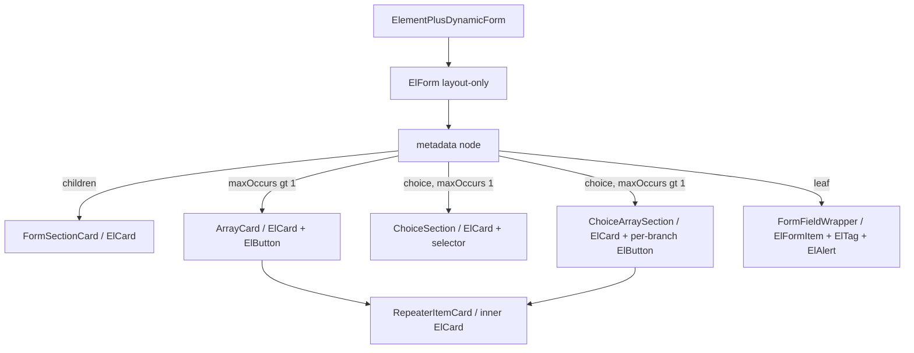

<!-- epic: optional. Set to the parent EPIC-XXX id when this feature belongs to an
     epic; leave "" for a standalone feature. Features are never nested under the
     epic folder, they only reference it here (flat model). -->


# Feature: Element Plus Form Template

## Decided without Jeroen (research)

Settled from research during `/spec:discuss`, not reviewed by Jeroen. Override any of these freely.

- AR-2 → scope item 6 qualified: group/leaf share the single `default` slot, not independently overridable
- AR-3 → `ElFormItem.error` corrected from "immediately" to "~100ms debounced"; tests must await it
- AR-4 → label alignment pinned: the label must render through `ElFormItem`'s own label region, not a sibling `<label>`
- AR-5 → reused `ElRadio` migrates from `:label` to `:value`; full audit of other reused controls deferred to implementation
- AR-7 → cost claim corrected: layout-only usage pushes nothing to `ElForm.fields` (no `prop` is ever set)
- AR-8 → clarified: `labelWidth="auto"` alignment only runs in label-beside mode, it is a no-op in the default label-above position

## Problem & goal

`packages/element-plus` (`@bach.software/vue-dynamic-form-element-plus`) is currently a stub: one component (`ElementPlusDynamicForm.vue`), `private: true`, version `0.1.0`. It maps a fixed set of field types to Element Plus inputs, but:

- It wraps every field in `ElFormItem` but renders no `ElForm` anywhere, so the form-level context (`labelPosition`, `labelWidth="auto"` alignment, size defaults) never exists and none of `ElFormItem`'s form-aware behavior activates. `DynamicForm` + vee-validate already own validation and field state, so `ElForm` used fully (with `model`/`rules`) would be a second source of truth. Investigation (recorded under Architecture) showed `ElForm` degrades to a pure layout provider when given no `model`/`rules`; Jeroen decided it is allowed strictly in that layout-only mode, never for validation.
- Only the `default` and `default-input` slots forward to a consumer override (`<slot name="default"><ElFormItem>...</ElFormItem></slot>`). Every other slot (`text-input`, `select-input`, `checkbox`, `switch`, `heading`, `divider`, etc.) is hardcoded with no `<slot>` passthrough, so a consumer cannot override an individual input's rendering without reimplementing the whole template.
- It has no structural slots at all: no array (`default-array`, `*-array-item`), no choice (`default-choice`, `default-choice-array`, `*-choice-array-item`), no group/parent rendering distinct from a leaf field, no wizard, and no handling for `hide`, `fullWidth`, `errorMessage`, or a "dependent on" placeholder. Any metadata tree that uses these core shapes (see `CLAUDE.md`'s Metadata Tree Shapes table) currently has nothing to render into.
- The field types and their extended properties are hardcoded in the component; a consumer cannot register a new field type (e.g. a domain-specific input) and give it a slot the way core's `DynamicFormTemplate` already supports generically via `defineMetadata`'s `TMetadataConfiguration['fieldTypes']`.

This feature is for **library consumers who build forms with Element Plus** and for **template authors** extending or overriding parts of the shipped template. The goal is a production-quality, capability-complete Element Plus template: it renders anything the docs site's `AdvancedFormTemplate.vue` can render (groups, arrays, choices, repeatable choices, error messages, required/optional indicators, hide/fullWidth), built from genuine Element Plus primitives instead of Tailwind-styled custom docs components, with every one of its ~40 slots individually overridable by a consumer and its field-type set open to extension.

Success looks like: a consumer can `import { ElementPlusDynamicForm } from '@bach.software/vue-dynamic-form-element-plus'` and drop `<ElementPlusDynamicForm :metadata="...">` straight into their app to get a fully working, Element-Plus-styled, labeled and submittable form for any metadata shape the core engine supports, with no composition of their own required. To change how anything renders, they create their own `FormTemplate.vue` with `<ElementPlusFormTemplate>` as its root element and redefine only the slots they want to change, down to a single input control, then hand that file to `ElementPlusDynamicForm` via its `template` prop; every slot they leave undefined keeps rendering the package default. The same override principle extends to `metadata` and `settings`: `ElementPlusDynamicForm` is a thin, fully overridable composition of `ElForm` and core's `DynamicForm`, not a closed black box.

## Scope

### In scope

1. **Rename the existing stub and add the new wrapper**: today's `ElementPlusDynamicForm.vue` (the stub) is renamed to `ElementPlusFormTemplate.vue`, exporting `ElementPlusFormTemplate`. A new `ElementPlusDynamicForm.vue` is added that reuses that name for the batteries-included wrapper component described below (scope item 4), a deliberate rename-and-repurpose rather than a compatibility alias. `packages/element-plus/src/index.ts` exports both `ElementPlusFormTemplate` and `ElementPlusDynamicForm`.
2. **Capability parity with `docs/.vitepress/theme/components/AdvancedFormTemplate.vue`**, rebuilt with Element Plus primitives instead of Tailwind/custom docs components. Concretely, parity means slot coverage (final list confirmed by the architect) for:
   - Leaf input rendering (`default`/`default-input` + per-type `*-input`), already present but needs slot passthrough added throughout.
   - Group/parent rendering (`default` branch for `fieldMetadata.children?.length`, mirroring `GroupField`).
   - Array rendering: `default-array` (add button, item count, error) and `default-array-item` (mirroring `ArrayField` + `RepeaterCard`).
   - Choice rendering: `default-choice` (single, `maxOccurs: 1`), `default-choice-array` (repeatable), `default-choice-array-item` (one occurrence), covering `explicitChoiceSelection`'s `addChoiceOccurrence`/`removeChoiceOccurrence`/`canAddChoiceOccurrence`/`activeChoiceOccurrences`/`usedChoiceOccurrences` (mirroring `ChoiceField`/`ChoiceSectionCard`/`ChoiceArraySectionCard`).
   - Section/heading rendering for grouped content (mirroring `SectionCard`).
   - Error message, required/optional tag, and `hide`/`fullWidth`/`dependentOnMessage` handling, applied consistently across the slot families above (today's component ignores all four).
   - Whether wizard parity (`wizard`/`wizardPage`/`wizardSummaryPage`, mirroring `FormWizard`/`ReviewGroup`) is included in this feature or deferred is an open question below; if deferred, the slot contract still leaves room for it later without a breaking change.
3. **New layout primitives inside `packages/element-plus`**, built from standard Element Plus components wherever one exists (survey below), with custom code only where Element Plus has no equivalent (notably: a `FormField`-equivalent wrapper built around a standalone `ElFormItem`, adding what `ElFormItem` lacks: description, help text, optional/required tag, dependent-on placeholder).
4. **`ElementPlusDynamicForm`: a batteries-included wrapper component.** It composes a single layout-only `ElForm` around core's `DynamicForm`, defaulting `DynamicForm`'s `template` prop to `ElementPlusFormTemplate`. A consumer drops in `<ElementPlusDynamicForm :metadata="...">` and gets a fully working, submittable, labeled form with no composition of their own required; `metadata`, `template`, and `settings` are all plain, independently overridable props (see Functional overview and Architecture). The `ElForm` receives no `model` and no `rules`, and no `ElFormItem` ever gets a `prop`, which keeps ElForm's entire validate/reset/initial-values machinery inert (verified against the installed 2.14.2 source: every such code path is guarded by `props.model`, and the initial-value `cloneDeep` only runs for items with a `prop`). It contributes only the `<form>` element, the `labelPosition`/`size` context, and the label-width registry that powers equal-width labels; `DynamicFormItem` + vee-validate remain the single source of truth for validation and field state. A named `#actions` slot renders inside the `<form>`, after the fields, so a consumer's own `<ElButton type="submit">` triggers real native form submission; the component's `@submit.prevent` handler runs vee-validate's `handleSubmit` and, on success, calls a `submit` prop/emit.
5. **FormField label layout**: support both label-above (today's only option) and label-beside (label left, input right) rendering, driven by a `labelPosition` prop on `ElementPlusDynamicForm` (it maps directly onto `ElForm`'s `labelPosition`), with all labels in a label-beside form aligned to the width of the longest label. The primary mechanism is `ElForm labelWidth="auto"` plus `ElFormItem`'s built-in `FormLabelWrap` ResizeObserver registry, which the layout-only `ElForm` provides for free and which aligns labels across the whole form at any nesting depth. CSS grid/subgrid or a package-owned measured-width provider remain fallbacks only if per-section alignment turns out to be needed (one ElForm registry cannot scope alignment to a single card, and nesting ElForms would nest `<form>` elements, which is invalid HTML).
6. **Slot overridability for every slot**, not just `default`/`default-input`: wrap each of the package's own slot templates in `<slot name="X" v-bind="p"><PackageDefault v-bind="p" /></slot>` (or equivalent) so a consumer overriding `ElementPlusFormTemplate` can replace any individual slot and get the package default everywhere else. Whether this scales cleanly to the full slot count (over 40, once every field type is multiplied by its `-input`/`-array`/`-array-item`/`-choice`/`-choice-array`/`-choice-array-item` variants) or needs a different mechanism is for the architect.

   DECIDED (research): qualified per AR finding 2. Core dispatches both group nodes and leaf nodes to the single `default` slot (there is no `default-group`), so "replace any individual slot" does not hold for group vs. leaf: overriding `#default` takes over both at once. Every other slot family remains independently overridable as stated. If independent group/leaf overridability is genuinely wanted, that is a core gap (a new `default-group`/`group` slot family) and belongs to its own feature, not this one.
7. **Extensible field types**: a consumer must be able to register additional field types (via their own `defineMetadata` generic, same mechanism core already supports) and supply slots for them without modifying the package. The built-in type set (currently text, select, checkbox, radio, date, time, datetime, switch, number, rate, slider, color, cascader, transfer, upload, heading, divider) is reviewed for which stay in the parity milestone (open question below).
8. **Update in-repo consumers of the renamed/added exports**: `playgrounds/storybook/components/ElementPlusDynamicFormImplementation.vue` and `playgrounds/storybook/stories/ElementPlusForm.vue` both import today's `ElementPlusDynamicForm` (the stub) directly as `DynamicForm`'s `template`; they move to the new component split, consuming the new `ElementPlusDynamicForm` wrapper directly for the simple case and/or a `FormTemplate.vue` around `ElementPlusFormTemplate` to demonstrate slot overrides (see Functional overview and Open question 7).
9. **A demonstration surface** showing the new capabilities (Storybook story and/or docs page); exact placement is an open question below.
10. **`specs/components.md`** gets its "Non-published surfaces" entry for the element-plus package updated to reflect the new component name and capability once implemented (developer's job at implementation time, not this spec).

### Out of scope (explicit)

- Any change to `packages/core/src/`: this feature only touches `packages/element-plus` (and its demonstration surface in `docs/`/`playgrounds/storybook`). No new core slots, settings, or validation rules. If parity work surfaces a genuine core gap, that becomes its own feature, not a silent addition here.
- Other framework templates (Ant Design Vue, Vuetify, PrimeVue, etc.). This feature is Element Plus only.
- A full design-system/theming pass (dark mode parity, custom Element Plus theme tokens) beyond what is needed for one cohesive default look.
- An accessibility audit beyond what the underlying Element Plus components already provide.
- Whether the package becomes publishable (`private: false`) is an open question, not a decision baked into scope; see below.

#### Future ideas from the Element Plus catalog survey (not in scope)

Element Plus's full catalog (~82 components across Basic, Form, Data, Navigation, Feedback) was surveyed for ideas beyond direct parity. Two kinds of findings came out of it:

**Usable now, within this feature's scope** (composition candidates, not new library capabilities):
- `ElSegmented` as an alternative, more compact choice-branch selector than a card grid.
- `ElResult`/`ElEmpty` for empty-array and wizard-completion states.
- `ElDescriptions` as a natural fit if wizard-summary parity (`ReviewGroup` equivalent) is in scope.
- `ElAffix` for sticky step navigation if wizard parity is in scope.

**Genuinely new library-level ideas, explicitly out of scope for this feature** (recorded here so they are not lost, not because they are approved for any roadmap):
- A generic "review/summary" rendering mode at the core level (today's `wizardSummaryPage` is a docs-template convention built entirely from existing slots, not a core feature; `ElDescriptions` suggests core could offer a first-class summary slot family usable by any template).
- A multi-value "tag input" field value type at the core level (inspired by `ElInputTag`/`Mention`), i.e. a value type that is neither a scalar leaf nor a `maxOccurs > 1` array of leaves.
- Guidance/tooling for very large option lists (`ElVirtualizedSelect`/`Virtualized Table`/`Virtualized Tree` exist in Element Plus for this reason); core has no position today on what a template should do when `options` is large.
- A guided-tour capability (`ElTour`) for walking a user through a complex, multi-section form.

## Functional overview

A consumer who wants a complete, working form with no composition of their own does:

```ts
import { ElementPlusDynamicForm } from '@bach.software/vue-dynamic-form-element-plus';
```

```vue
<ElementPlusDynamicForm :metadata="metadata">
  <template #actions>
    <ElButton type="submit" native-type="submit">Submit</ElButton>
  </template>
</ElementPlusDynamicForm>
```

and gets, out of the box:

- Every leaf field type mapped to its matching Element Plus input.
- Groups (metadata nodes with `children`) rendered as a titled section built from `ElCard` (or equivalent), not the current flat divider/heading treatment.
- Repeatable groups and repeatable leaf fields rendered with Add/Remove controls built from `ElButton`, one card per occurrence.
- Choice branches (mutually exclusive) rendered with a selection UI built from Element Plus primitives (`ElRadioGroup`, `ElCard`, or `ElSegmented`, still open, see Open question 8), including the repeatable-choice (`explicitChoiceSelection`, `maxOccurs > 1`) case.
- Error messages surfaced via a consistent Element Plus pattern (e.g. `ElAlert` or inline validation text), required/optional indicated via `ElTag`.
- A single, real `<form>` element: `ElementPlusDynamicForm` renders one layout-only `ElForm` (no `model`/`rules`) that provides the `labelPosition`/`size` context and the label-width registry, with a native, working submit button placed via the `#actions` slot.
- A field wrapper built on a standalone `ElFormItem` (stock label and error styling, error text piped in from vee-validate via the `error` prop) extended with description, help text, and required/optional tag, offered in two layouts via the `labelPosition` prop: label-above (default) and label-beside, where every label in the form shares the width of the longest one through `ElForm`'s own label-width registry.

To change how any part renders, a consumer creates their own `FormTemplate.vue` around the pure template layer:

```vue
<!-- FormTemplate.vue -->
<script setup lang="ts">
import { ElementPlusFormTemplate } from '@bach.software/vue-dynamic-form-element-plus';
</script>

<template>
  <ElementPlusFormTemplate>
    <template #text-input="p">
      <MyCustomTextInput v-bind="p" />
    </template>
  </ElementPlusFormTemplate>
</template>
```

and hands it to `ElementPlusDynamicForm`'s `template` prop:

```vue
<ElementPlusDynamicForm :metadata="metadata" :template="FormTemplate" />
```

`ElementPlusFormTemplate` wraps every one of its own slots in `<slot name="X"><PackageDefault v-bind="p" /></slot>`, so `FormTemplate.vue` only needs to define the slots it wants to change; every other slot keeps rendering the package default. `ElementPlusDynamicForm` forwards every slot it itself receives straight through to whichever `template` it renders, so a consumer who only needs to override one or two slots can skip the intermediate `FormTemplate.vue` file and define them directly on `<ElementPlusDynamicForm>`, exactly as shown for `#actions` above. `metadata`, `template`, and `settings` follow the same principle: all three are plain props with sensible defaults, and a consumer can extend the type union with their own field types (their own `defineMetadata` call) and supply slots for those types; anything not supplied falls through the same `default-input`/`default-array`/`default-choice`/`default` fallback chain core's `DynamicFormTemplate` already implements, so a new type "just works" with at least a generic rendering before a consumer writes a dedicated slot for it.

## Design (feature level)

DECIDED (Jeroen): design phase skipped, no prototype produced. This feature's visual surface is composed entirely of Element Plus's own, already-designed components; there is no novel visual language to prototype, since element-plus.org's own docs and live examples already show what an `ElCard`, `ElRadioGroup`, `ElButton`, etc. look and behave like. What is left is a composition question, not a visual design question: which Element Plus component maps to which core metadata shape (group/section, array, choice), which is the architect's normal component/composable-plan job, not a separate design deliverable.
Why: a hand-built HTML/CSS mockup would only approximate Element Plus's real look and (for the label-width-auto alignment behavior in particular) could not demonstrate the actual ResizeObserver-driven behavior at all; a CDN-loaded live Vue+Element Plus prototype would demonstrate it for real but adds a build/maintain cost for something element-plus.org already shows authoritatively.
How to apply: the architect resolves the container-mapping questions below directly in the Architecture section (citing the relevant element-plus.org component docs as evidence), and the couple of remaining aesthetic judgment calls stay in Open questions for Jeroen, to be settled in `/spec:discuss` by pointing at the relevant element-plus.org examples rather than a custom prototype.
Precedent: future template-package features (Ant Design Vue, Vuetify, etc.) facing the same situation, an entirely pre-designed component library with a composition question rather than a visual design question, should skip the design phase the same way and fold the mapping into architecture; a feature that needs genuinely new visual language (not just Element Plus component selection) should not skip it.

PROPOSED (adversarial review) — AR finding 6: skipping the prototype is defensible for individual component *look*, but it also removes the only artifact that captures cross-slot cohesion (two-column grid density, the nested-card visual weight of an array-item card inside an array card inside a group card inside the form, the choice-selector look in OQ8, and label-beside behavior on narrow viewports in OQ6), which is exactly what a feature review checks against a prototype. There is now no such artifact. Rather than reinstate a full prototype, make the demonstration surface (Slice G / OQ7) the standing cohesion review: it must be screenshotted in both light and dark color modes and reviewed for cross-section cohesion before the feature is marked `done`, and its coverage must include a group-with-arrays-and-choices tree (not just a flat input list). Also narrow the precedent sentence: the "skip design" default applies only when the composition raises no layout/nesting/selector decisions of its own; where it does (as here), the demonstration surface must stand in for the prototype's cohesion role.

## Architecture (feature level)

All decisions below concern `packages/element-plus` only. Core (`packages/core/src`) is untouched (see Out of scope); its public surface, exports, slots, settings and validation rules are unchanged and this section adds nothing to `specs/components.md`'s published-surface tables. The only `specs/components.md` edit this feature causes is the "Non-published surfaces" row for the element-plus package (rename + capability), which is the developer's job at implementation time.

### Container component mapping (resolves the design-phase hand-off)

Each core metadata shape (see `CLAUDE.md`'s Metadata Tree Shapes) maps to Element Plus primitives as follows. Every mapping mirrors the behavior of the named `docs/.vitepress/theme/components/*` reference, rebuilt from Element Plus primitives (the docs components are Tailwind-styled and cannot be imported by the package).

| Core shape | Slot family | Element Plus mapping | Mirrors | Evidence |
| --- | --- | --- | --- | --- |
| Leaf input | `*-input` / `default-input` | The existing per-type controls (`ElInput`, `ElSelect`/`ElOption`, `ElCheckbox`, `ElRadioGroup`/`ElRadio`, `ElDatePicker`, `ElTimePicker`, `ElInputNumber`, `ElSwitch`, `ElRate`, `ElSlider`, `ElColorPicker`, `ElCascader`, `ElTransfer`, `ElUpload`), each wrapped by a package `FormFieldWrapper` around a standalone `ElFormItem` | `FormField` + `TextInput`/`SelectInput`/... | `ElFormItem` standalone + `error` prop verified against installed 2.14.2 source (below) |

PROPOSED (adversarial review) — AR finding 5: the reused controls are not all on current 2.14.2 API. The existing component renders `<ElRadio :label="option.value">{{ option.label }}</ElRadio>`; in 2.14.2 `ElRadio` splits `label` (display text) from `value` (bound value), and binding the value via `label` is the deprecated back-compat path ("Removed after 3.0.0") that emits a runtime warning. The parity rebuild must migrate radio to `:value="option.value"` with the display text in the default slot, and audit the other reused controls for the same 2.6+ renames before treating them as "reuse as-is".

DECIDED (research): confirmed against the current `ElementPlusDynamicForm.vue`, which does render `<ElRadio :label="option.value">{{ option.label }}</ElRadio>`, the deprecated binding. The parity rebuild migrates this to `:value="option.value"` with display text in the default slot. The broader "audit every other reused control for the same rename" is implementation-time work (developer's job during Slice A/E), not a spec-level decision; no other reused control's binding was checked here.
| Leaf field chrome | `default` (leaf branch) | `FormFieldWrapper`: standalone `ElFormItem` (label + inline error via its `error` prop) extended with description, help text, an optional/required `ElTag`, and a dependent-on placeholder | `FormField.vue` | `ElFormItem` lacks description/help/optional-tag/dependent-on, so the wrapper is genuinely new package code |
| Group / parent (`children`) | `default` (group branch) | `ElCard`: `#header` = title + description + container-level error `ElAlert`; body (default slot) = the two-column children grid | `GroupField` / `SectionCard` | `ElCard` is a pure layout container with `#header`/`#footer`/default slots and no form coupling ([element-plus.org/card](https://element-plus.org/en-US/component/card.html)) |
| Section / heading | `heading` (or a section slot) | `ElCard` (grouped section); `ElDivider` retained for the flat `divider` type | `SectionCard` | `ElCard`; `ElDivider` already in use |
| Array (`maxOccurs > 1`) | `*-array` / `default-array` | Outer `ElCard`: `#header` = title + item-count `ElTag` + Add `ElButton`; body = one occurrence per `*-array-item` | `ArrayField` | `ElCard` + `ElButton` + `ElTag` |
| Array item | `*-array-item` / `default-array-item` | Inner `ElCard` (`RepeaterItemCard`): index badge + occurrence title + Remove `ElButton`; body = the item's children grid | `RepeaterCard` | `ElCard` + `ElButton` |
| Single choice (`maxOccurs: 1`) | `*-choice` / `default-choice` | `ElCard` container; a branch selector (widget = Open question 8) whose selection is driven purely by the core slot props `addChoiceOccurrence(branchKey)` / `removeChoiceOccurrence` / `activeChoiceOccurrences`; selected branch renders in the default slot | `ChoiceField` / `ChoiceSectionCard` | `ElCard`; selector widget deferred to OQ8 |
| Repeatable choice (`maxOccurs > 1`) | `*-choice-array` / `default-choice-array` | `ElCard` container: per-branch Add `ElButton` disabled via `canAddChoiceOccurrence(branchKey)`, a "`usedChoiceOccurrences` of `maxOccurs`" count `ElTag`; occurrences render via `*-choice-array-item` | `ChoiceArraySectionCard` | `ElCard` + `ElButton` + `ElTag` |
| Repeatable-choice item | `*-choice-array-item` / `default-choice-array-item` | Inner `ElCard` (reuses `RepeaterItemCard` with the `branchKey` badge) | `RepeaterCard` (via `default-choice-array-item`) | `ElCard` + `ElButton` |
| Required / optional indicator | all wrappers | `ElTag` (small), driven by the `showRequiredOrOptional` extended setting; `ElFormItem`'s own `required` asterisk is purely visual and may back the "required" case | `OptionalRequiredTag` | `ElTag` |
| Error surfacing | leaf vs container | Leaf: vee-validate `errorMessage` piped into `ElFormItem`'s `error` prop (stock inline validation text). Container (group/array/choice): `ElAlert` `type="error"` inline, non-closable | `ErrorMessage` | `ElFormItem` `error` verified in source; `ElAlert` inline error, types include `error` ([element-plus.org/alert](https://element-plus.org/en-US/component/alert.html)) |

PROPOSED (adversarial review) — AR finding 2: the "Group / parent (`default` group branch)" and "Leaf field chrome (`default` leaf branch)" rows above are not two independently overridable slots. Core dispatches both group nodes and leaf nodes to the single `default` slot (there is no `default-group`); the package's `#default` must branch internally on `fieldMetadata.children?.length` exactly as `AdvancedFormTemplate.vue` does. Consequence: a consumer who overrides `#default` overrides both group and leaf rendering at once and cannot keep the package's group card while replacing only the leaf chrome. Scope item 6's "replace any individual slot and get the package default everywhere else" must be qualified to say group-vs-leaf is a single shared slot. If independent overridability is actually wanted, that is a core gap (a `default-group`/`group` slot family) and must be raised as its own feature, not solved silently here.

DECIDED (research): confirmed against core's `DynamicFormTemplate.vue` slot dispatch, there is no `default-group` slot; group and leaf nodes both resolve through `default`. The package's `#default` branches internally on `fieldMetadata.children?.length`, matching `AdvancedFormTemplate.vue`. Scope item 6 is qualified accordingly (see above). No core change is in scope for this feature; independent group/leaf overridability, if ever wanted, is a future core feature.

The choice non-aesthetic wiring is entirely core-driven: the package binds `ElButton`s / the selector to the `ChoiceAttributes` slot props already delivered by core's `DynamicFormTemplate` (`addChoiceOccurrence`, `removeChoiceOccurrence`, `canAddChoiceOccurrence`, `activeChoiceOccurrences`, `usedChoiceOccurrences`), holding no choice state of its own. This is independent of the selector-widget aesthetic, so it is settled here while **Open question 8 (choice-branch selector look) stays open** and **Open question 6 (label-beside per-field override + narrow-viewport collapse) stays open**.

### Component / composable plan

Reused as-is from core (no change): `DynamicFormTemplate`, `defineMetadata`, and every core export. The package continues to wrap a single `DynamicFormTemplate` and author named slots, exactly as today.

Element Plus components consumed directly (no package wrapper): the leaf controls listed above plus `ElForm`, `ElFormItem`, `ElCard`, `ElButton`, `ElTag`, `ElAlert`, `ElDivider`, and (if wizard is in scope, OQ2) `ElSteps`/`ElStep`, `ElDescriptions`/`ElDescriptionsItem`. `ElSegmented` is a candidate only if OQ8 chooses it. No new runtime dependency: all come from the existing `element-plus` peer dependency (catalog `framework`, `>=2.0.0`; pinned dev at `2.14.2`).

New package-local components (each justified because the docs Tailwind equivalents cannot be imported and Element Plus ships no single component with the combined responsibility):

| New component | Responsibility | Why nothing fits |
| --- | --- | --- |
| `ElementPlusFormTemplate.vue` | Renamed root template (was `ElementPlusDynamicForm.vue`); wraps `DynamicFormTemplate`, authors all slots | It is the template itself |
| `ElementPlusDynamicForm.vue` | Batteries-included wrapper: one layout-only `ElForm` around core's `DynamicForm` (`template` defaults to `ElementPlusFormTemplate`); forwards its own slots through, owns `@submit.prevent` and the `#actions` slot | Neither core nor Element Plus composes `ElForm` + `DynamicForm` together; this is genuinely new package glue |
| `FormFieldWrapper.vue` | Standalone `ElFormItem` + description + help text + optional/required `ElTag` + dependent-on placeholder | `ElFormItem` alone lacks all four extras (mirrors `FormField`) |
| `FormSectionCard.vue` | `ElCard`-based section for groups/headings (header title/description/error + grid body) | Composes `ElCard` with the standard header/error/grid layout (mirrors `SectionCard`/`GroupField`) |
| `ArrayCard.vue` | `ElCard` + count `ElTag` + Add `ElButton` for `*-array`/`default-array` | Mirrors `ArrayField` |
| `RepeaterItemCard.vue` | Inner `ElCard` + index/branch badge + Remove `ElButton` for `*-array-item` and `*-choice-array-item` | Mirrors `RepeaterCard`; one component serves both item families |
| `ChoiceSection.vue` / `ChoiceArraySection.vue` | `ElCard` + selector/Add buttons bound to the choice slot props | Mirrors `ChoiceField`/`ChoiceSectionCard`/`ChoiceArraySectionCard` |
| `WizardShell.vue` (only if OQ2 in scope) | `ElSteps`/`ElStep` + nav `ElButton`s, exposes `currentStepIndex`/`gotoStep` via `slotProps` | Mirrors `FormWizard`/`Stepper` |
| `SummaryGroup.vue` (only if OQ2 in scope) | `ElDescriptions`/`ElDescriptionsItem` read-only summary | Mirrors `ReviewGroup` |

No new composable is needed: all reactive state (field values, validation, choice occurrence math, add/remove) already arrives through the core slot props. These package components are presentational.

### `ElementPlusDynamicForm`, wizard nesting, and the submit affordance

DECIDED (Jeroen): the `ElForm` wrapping is owned by the new `ElementPlusDynamicForm` component (scope item 4), not by a `type: 'form'` metadata convention. This replaces the root-`form`-type mechanism described in an earlier draft of this spec and resolves AR finding 1 (the flat-form submit contract) by construction, since the wrapper component can offer a real slot inside the real `<form>` element.

- `ElementPlusDynamicForm` renders exactly one `<ElForm labelWidth="auto" :labelPosition="labelPosition ?? 'top'" @submit.prevent="onSubmit">` around a `<DynamicForm :metadata :template="template ?? ElementPlusFormTemplate" :settings>`, forwarding every slot `ElementPlusDynamicForm` itself receives straight down to `DynamicForm`'s template. The `ElForm` gets no `model` and no `rules`. Because the `ElForm` is owned by this one component rather than triggered by any metadata convention, exactly one `<form>` element exists per `ElementPlusDynamicForm` instance, and there is no metadata node for a consumer to add or forget.
- `@submit.prevent` fallthrough is safe: `ElForm` is a single-root component rendering one `<form>`, so the listener falls through via standard attrs fallthrough (confirmed against 2.14.2 source: `ElForm`'s render is a single `<form :class>` element).
- Submit contract: a named `#actions` slot renders inside the `<form>`, after the field tree, so a consumer's own `<ElButton type="submit">` is a genuine descendant of the real `<form>` element and native submission (including Enter-to-submit) works. `onSubmit` runs vee-validate's `handleSubmit` (via `useDynamicForm()`, so validation gates submission and vee-validate remains the only validation engine) and, on success, calls the component's `submit` prop/emit with the validated values.
- Wizard nesting: because the `ElForm` is structural rather than metadata-driven, a `wizard` child type (if in scope, OQ2) needs no special interaction with `ElementPlusDynamicForm` at all. `ElSteps`/`ElStep` are ordinary block content and nest legally inside the `<form>` that `ElementPlusDynamicForm` already renders; the wizard's own step-navigation buttons live inside the wizard's own slot content, and its final step renders its submit action into the same `#actions` slot a flat form uses.
- A consumer who uses `ElementPlusFormTemplate` directly (composing their own `<DynamicForm>` without an `ElForm` ancestor, bypassing `ElementPlusDynamicForm` entirely) still gets a fully working form: every `ElFormItem` works standalone. They simply lose the `<form>` element and cross-field label alignment (the `labelWidth="auto"` registry needs an `ElForm` ancestor). This is documented graceful degradation, not an error.

### Label alignment mechanism (decided in principle: layout-only `ElForm`)

Source verification against installed element-plus **2.14.2** established the layout-only approach is safe:

- `ElForm` renders exactly one element (`<form :class>` with a default slot) and publishes everything (`labelPosition`, `size`, `labelSuffix`, the field registry, `useFormLabelWidth()`'s max-width registry) from its own `setup()` via `provide(formContextKey, ...)`. Vue's `inject` resolves along the runtime parent chain, so every `ElFormItem` rendered anywhere inside `ElementPlusDynamicForm`'s slotted `DynamicForm` subtree receives the context regardless of slot-nesting depth.
- All validation machinery (`validate`, `validateField`, `resetFields`, `setInitialValues`) is guarded by `if (!props.model)` and inert without a `model`; the `rules` watcher deep-watches `undefined`; the per-field `cloneDeep` snapshot in `addField` only runs when an `ElFormItem` has a `prop`. Layout-only usage therefore pushes nothing to `ElForm`'s `fields` array (no `ElFormItem` is ever given a `prop`) and costs only one `ResizeObserver` per label, and only when `labelWidth="auto"` in label-beside mode, which is the alignment feature itself.
- `ElFormItem` works standalone (its `formContext` inject defaults to `undefined` and every use is optional-chained); its `error` prop shows a message with `ElFormItem`'s built-in ~100ms debounce, so vee-validate errors pipe straight in (see finding below for the test implication).
- `labelPosition` maps `top` (label-above, default) and `left`/`right` (label-beside); label-beside alignment across the whole form comes for free from `labelWidth="auto"` + the `FormLabelWrap` ResizeObserver registry. Whether label-beside also needs a per-field `ElFormItem.labelPosition` override and a narrow-viewport collapse to label-above is **Open question 6, left open**.
- Fallbacks, only if per-section alignment is ever required (one `ElForm` registry spans the whole form, and nesting `ElForm`s would nest `<form>` elements, invalid HTML): CSS grid `subgrid`, or a package-owned provide/inject + `ResizeObserver` width provider (the pattern `FormLabelWrap` itself implements). `display: table` was ruled out: sections/arrays/choices need real block-level cards, which a table row/cell model does not compose with.

PROPOSED (adversarial review) — AR finding 4: pin the label-placement constraint the wrapper must obey. `FormLabelWrap` only measures the label `ElFormItem` renders in its own label region (via the `label` prop or the `#label` slot). So `FormFieldWrapper` must render the aligned label *through* `ElFormItem` (not as its own sibling `<label>` the way the parity reference `FormField.vue` does), and the optional/required `ElTag`, description, help text, and dependent-on placeholder must live in the content area (or in `#label` deliberately if they are meant to count toward column width). A naive port of `FormField.vue`'s structure (own `<label>` + tag outside any `ElFormItem`) registers no measurable label and silently breaks cross-field alignment. This interacts with OQ6 (per-field `labelPosition` override).

DECIDED (research): confirmed against `FormField.vue` (its own `<label>` sits outside any form-item wrapper) and against `FormLabelWrap`'s source (it measures only the `ElFormItem` label region). `FormFieldWrapper` renders its label through `ElFormItem`'s `#label` slot (needed anyway to place the optional/required `ElTag` next to the label text), and puts description, help text, and the dependent-on placeholder in the content area below the input, not in the measured label region. This is a straight implementation constraint, not a design choice; it interacts with OQ6 but does not resolve it.

PROPOSED (adversarial review) — AR finding 7 (nit): correct the cost claim in the second bullet above. `ElFormItem.onMounted` calls `formContext.addField` only when `props.prop` is set; the layout-only usage never sets `prop`, so nothing is pushed to `ElForm`'s `fields` array. The only runtime cost is the per-label `ResizeObserver`, and only in label-beside auto mode (see next note).

DECIDED (research): confirmed against 2.14.2 source; the bullet above is corrected to say layout-only usage pushes nothing to `ElForm.fields` (no `prop` is ever set on any `ElFormItem`), with the only runtime cost being the per-label `ResizeObserver` in label-beside auto mode.

PROPOSED (adversarial review) — AR finding 8 (nit): `labelWidth="auto"` alignment is a no-op in the default label-above (`top`) position: `ElFormItem.labelStyle` returns `{}` for `top`, `is-auto-width` is false, and no `ResizeObserver` runs. State that cross-field label alignment applies only in label-beside (`left`/`right`) mode, so readers do not expect it in the default layout.

DECIDED (research): confirmed against 2.14.2 source (`ElFormItem.labelStyle` returns `{}` for `top`). The spec text is corrected to state cross-field label alignment applies only in label-beside mode; it is a no-op in the default label-above layout.

### Slot-override at scale

The `<slot name="X" v-bind="p"><PackageDefault v-bind="p" /></slot>` passthrough (proven today at `default` and `default-input`) is applied to every slot the package authors. Decision: keep explicit per-slot template blocks, but push each default's markup into the small package components above, so each block is a one-liner (`<template #X="p"><slot name="X" v-bind="p"><SomeCard v-bind="p" /></slot></template>`). A generated or renderless approach is rejected: `defineSlots` requires statically-declared slot names for the type inference the whole template contract depends on.

The real block count is well under the ~40 upper bound: core's `DynamicFormTemplate` already resolves any unauthored slot through its `default-input`/`default-array`/`default-array-item`/`default-choice`/`default-choice-array`/`default-choice-array-item` → `default` fallback chain. So the package authors the seven family-default slots plus one `*-input` slot per built-in type that needs type-specific control markup (roughly the ~16 today, trimmed by OQ4), and every other per-type variant (`text-array`, `select-choice`, ...) falls through for free. A consumer's own new field type likewise "just works" via the family defaults before they write a dedicated slot.

Core needs nothing new. `ElementPlusDynamicForm` re-exposes every slot it receives with `<template v-for="(_, name) in $slots" #[name]="slotProps"><slot :name v-bind="slotProps" /></template>` (the same forwarding pattern already used by the storybook `ElementPlusDynamicFormImplementation.vue`) down into its `DynamicForm`'s `template`, and `ElementPlusFormTemplate` exposing every slot name means a consumer's `<template #text-input>`, whether placed directly on `<ElementPlusDynamicForm>` or inside an intermediate `FormTemplate.vue`, overrides just that slot while all others keep the package default.

### Wizard parity mapping (conditional on Open question 2)

If wizard support is in this milestone (OQ2, left open), map: `FormWizard`/`Stepper` -> `ElSteps` + `ElStep` (the active step is the numeric `active` prop bound to `currentStepIndex`; `ElStep` takes `title`/`description`/`status`; renders standalone with no form, [element-plus.org/steps](https://element-plus.org/en-US/component/steps.html)); nav buttons -> `ElButton`; `wizardSummaryPage`/`ReviewGroup` -> `ElDescriptions` + `ElDescriptionsItem` (read-only label/value summary list, [element-plus.org/descriptions](https://element-plus.org/en-US/component/descriptions.html)); optional sticky nav -> `ElAffix` (from the catalog survey). The step-state (`currentStepIndex`/`gotoStep`) flows through `slotProps` exactly as `AdvancedFormTemplate` does today, so no core change is needed. If OQ2 defers wizard, the slot contract already leaves room (the `wizard`/`wizardPage`/`wizardSummaryPage` types are just additional entries in the package's `defineMetadata` union, additive later with no breaking change).

### Public API impact and changeset

- **Core:** none. No exports, props, slots, `defineMetadata` generics, or validation rules change.
- **Package (currently `private: true`):** `packages/element-plus/src/index.ts` exports two components: `ElementPlusFormTemplate` (renamed from today's `ElementPlusDynamicForm.vue`, the pure slot-authoring template) and a new `ElementPlusDynamicForm` (the batteries-included `ElForm` + `DynamicForm` wrapper; it reuses the old export name for a genuinely new implementation, a deliberate rename-and-repurpose rather than a compatibility alias, see **Open question 5**). `ElementPlusDynamicForm`'s own props are `metadata`, `template` (default `ElementPlusFormTemplate`), `settings`, and `labelPosition`, plus a `submit` emit fired on successful validation. `ElementPlusFormTemplate`'s `defineMetadata` generics gain extended properties mirroring the docs reference (`description`, `helpText`, `dependentOnMessage`, `hide`, `fullWidth`, array item-naming props, choice options, and per OQ2 possibly `wizard`/`wizardPage`/`wizardSummaryPage`); there is no `form` root type. All are additive to the package surface. The two in-repo consumers (`playgrounds/storybook/components/ElementPlusDynamicFormImplementation.vue`, `playgrounds/storybook/stories/ElementPlusForm.vue`) are updated mechanically.
- **Changeset bump type:** `CLAUDE.md`'s changeset rule is gated on `packages/core/src/` changing. This feature does not touch `packages/core/src/`, so **the existing changeset rule does not apply and no core changeset is required** (stated as fact, not an assumption). Whether `packages/element-plus` gains its own release/changeset flow is tied to publishability, **Open question 1, left open**. If OQ1 flips `private: false`, this is a first public release at `0.1.0` (a new package entering the registry), not a breaking change from a prior published version; the correct starting version (stay `0.1.0` pre-release vs jump to `1.0.0`) and extending the Changesets config to cover the package are the two sub-decisions OQ1 must settle.

### Data flow

- vee-validate form context + `DynamicForm` settings (provide/inject) remain the single source of truth for values, validation, and settings (core, unchanged).
- The `ElForm` inside `ElementPlusDynamicForm` provides `formContextKey` from its own `setup()`; every nested `ElFormItem` injects it along the runtime parent chain, so `labelPosition`/`size`/label-width alignment reach all fields at any depth. `ElForm` receives no `model`/`rules` and the template never calls its `validate`/`resetFields`.
- Errors are one-way: vee-validate `errorMessage` -> `ElFormItem.error` (leaf) or `ElAlert` (container). `ElForm` never produces or consumes validation state.
- Choice occurrence state is fully owned by core; the package renders buttons/selector bound to `ChoiceAttributes` slot props and holds no local choice state.
- Reactivity: the package adds no `computedProps` and no new watch/computed cycles; it is presentational over the props core already computes, so the `combinedValidation` watchEffect and `computedProps` loop-guard concerns in `DynamicFormItem` are unaffected.

### ADR notes

1. **Layout-only `ElForm`, owned by a wrapper component.** Context: cross-field label-width alignment needs `ElForm`'s `FormLabelWrap` registry, but `DynamicForm` + vee-validate own validation. Decision: `ElementPlusDynamicForm` renders one `ElForm` around `DynamicForm`, with no `model`/`rules` and no `prop` on any `ElFormItem`. Alternatives rejected: full `ElForm` with `model`/`rules` (a second validation source of truth); no `ElForm` + a package-built width provider (reinvents `FormLabelWrap`); a metadata-driven root `form` type (an earlier draft of this decision, dropped in favor of a plain wrapper component, which needs no metadata convention and lets the wrapper own the submit affordance directly). Evidence: 2.14.2 source guards all validation behind `props.model`; `ElFormItem` standalone verified.
2. **`ElCard` as the universal container** for group/section/array/choice. Alternatives rejected: `ElCollapse` (adds collapse semantics not wanted by default), raw `<div>`s (loses stock elevation/spacing), `ElDivider`-only (no body/header structure). Evidence: [element-plus.org/card](https://element-plus.org/en-US/component/card.html) (pure layout container, `#header`/`#footer`/default slots).
3. **Split error surfacing:** `ElFormItem.error` inline for leaves, `ElAlert` for container-level. Alternatives rejected: `ElAlert` everywhere (too heavy under a single input), `ElFormItem` everywhere (a section/array is not a form item). Evidence: `ElFormItem.error` verified in source; `ElAlert` supports inline `error` type ([element-plus.org/alert](https://element-plus.org/en-US/component/alert.html)).

   PROPOSED (adversarial review) — AR finding 3: correct the "shows a message immediately" claim (Architecture item 4 and this ADR). `ElFormItem` in 2.14.2 gates the visible error on `validateStateDebounced = refDebounced(validateState, 100)`, so a vee-validate error piped through the `error` prop appears with a ~100ms debounce (and clears with the same lag). This is acceptable UX, but (a) the spec text should say "with `ElFormItem`'s built-in ~100ms debounce" rather than "immediately", and (b) the package's validation tests must await the debounce (advance timers / `await flushPromises` + tick) before asserting error text, or they will false-pass/flake. If truly synchronous error display is required, the wrapper must render its own error node instead of relying on `ElFormItem.error`; that is a larger change and not recommended.

   DECIDED (research): confirmed against 2.14.2 source (`validateStateDebounced = refDebounced(validateState, 100)`). Spec text corrected above and in Architecture item 4 to "~100ms debounce" instead of "immediately". The package's validation tests must await the debounce before asserting error text; noted as a QA-plan requirement for the relevant story rather than a design change. The synchronous-error alternative (wrapper renders its own error node) is not adopted: ~100ms is imperceptible UX and matching stock `ElFormItem` behavior keeps the wrapper thin.
4. **Wizard on `ElSteps` + `ElDescriptions`** (if OQ2 in scope). Alternatives rejected: `ElTabs` (no progress/step semantics), a custom stepper (reinvents `ElSteps`). Evidence: [element-plus.org/steps](https://element-plus.org/en-US/component/steps.html) (numeric `active`, standalone), [element-plus.org/descriptions](https://element-plus.org/en-US/component/descriptions.html) (read-only summary list).
5. **Explicit per-slot passthrough blocks + extracted default components**, over generated/renderless slots. Reason: `defineSlots` needs static slot names for the template type contract; core's fallback chain already keeps the authored count low.

### Slicing seams (input for the scrum-master)

Independently deliverable, engine work separate from docs/Storybook per the arch guidance:

- **Slice A (foundation):** rename `ElementPlusDynamicForm.vue` to `ElementPlusFormTemplate.vue`, add the new `ElementPlusDynamicForm.vue` wrapper, update `index.ts` and the two in-repo consumers, add `FormFieldWrapper`, add slot passthrough for every existing leaf input and `default`/`default-input`. Depends on nothing. Delivers an override-complete leaf form with a working `<form>` and submit.
- **Slice B (labels):** label-above/label-beside via `ElementPlusDynamicForm`'s `labelPosition` prop, riding the layout-only `ElForm` Slice A already stood up. Depends on A. Blocked in aesthetics only by OQ6 (per-field override / narrow-viewport collapse), which does not block the core mechanism.
- **Slice C (groups/sections):** `FormSectionCard` on `ElCard`, group/heading rendering. Depends on A.
- **Slice D (arrays):** `ArrayCard` + `RepeaterItemCard`, `*-array`/`*-array-item`. Depends on A and C.
- **Slice E (choices):** `ChoiceSection`/`ChoiceArraySection`, single and repeatable choice wiring, reusing `RepeaterItemCard`. Depends on A and C; selector widget blocked on OQ8 (the wiring is not).
- **Slice F (wizard, conditional on OQ2):** `WizardShell` on `ElSteps`, `SummaryGroup` on `ElDescriptions`. Depends on B and C.
- **Slice G (demonstration surface, OQ7):** Storybook story and/or docs page. Depends on the slices it demonstrates; slices separately from engine work.

### Diagrams

Slot dispatch and error/label context flow for a leaf field inside `ElementPlusDynamicForm`:

```mermaid
sequenceDiagram
  participant EPDF as ElementPlusDynamicForm
  participant Form as ElForm (layout-only)
  participant DF as DynamicForm (core)
  participant DFI as DynamicFormItem (core)
  participant EPT as ElementPlusFormTemplate (or consumer FormTemplate.vue)
  participant DFT as DynamicFormTemplate (core)
  participant FFW as FormFieldWrapper
  participant Item as ElFormItem (standalone)
  EPDF->>Form: render one <form>, provide(formContextKey)
  Form->>DF: render DynamicForm inside, forward slots
  DF->>DFI: walk metadata, provide settings
  DFI->>DFT: leaf field attrs (type ...-input)
  DFT->>EPT: dispatch to #default / #<type>-input (fallback chain)
  EPT->>FFW: render default (or consumer override)
  FFW->>Item: label + error=errorMessage (vee-validate, one-way)
  Item-->>Form: inject formContext -> labelWidth="auto" alignment
```



Container mapping by shape:



## Adversarial review

model: claude-opus-4-8[1m]

Reviewed in FEATURE (full) mode. The architect's load-bearing factual claims were checked against the installed `element-plus@2.14.2` source (not just the spec's prior assertions) and against core's `DynamicFormTemplate.vue` slot dispatch. Most held; the ones that did not, and the design holes, are below.

SUPERSEDED (Jeroen): the root-`form`-metadata-type mechanism this review was checking against was replaced by the `ElementPlusDynamicForm` wrapper component (see Architecture). Finding 1 below no longer applies, and no `type: 'form'` root type exists to dispatch to, but the surrounding verified facts about `ElForm`/`ElFormItem` still hold and now describe `ElementPlusDynamicForm`'s internals instead.

### Verified correct (checked against source, no action needed)

- `ElForm` renders exactly one `<form>` element (`form.vue_...mjs` render fn returns a single `createElementBlock("form", ...)`), so `@submit.prevent` bound on `<ElForm>` reaches the real `<form>`. `formEmits` declares only `validate` (not `submit`), so `@submit` is a genuine native listener, not a swallowed component emit. Claim in Architecture "Root form type" is correct.
- All `ElForm` validation machinery is guarded by `props.model`: `setInitialValues`, `resetFields` early-return on `if (!props.model)`; `validate`/`validateField` gate on `isValidatable` (`!!props.model`); the `rules` watcher's `validate()` is itself gated. Layout-only usage (no `model`/`rules`, no `prop`) is inert. Claim correct.
- `ElFormItem` works standalone: `inject(formContextKey, void 0)` defaults to `undefined` and every use is optional-chained. The `error` prop drives `validateMessage`/`validateState` via a watch. Claim correct.
- Label-width alignment works for `prop`-less items: `FormLabelWrap` registers widths through its own `ResizeObserver` + `registerLabelWidth` (gated on `updateAll = formContext.labelWidth === 'auto'` and `isAutoWidth`), independent of `addField`. So the layout-only `ElForm` + `labelWidth="auto"` mechanism genuinely aligns labels without any field ever registering as a validated field. Core claim of the feature is sound.
- Core's `DynamicFormTemplate` fallback chain (`*-input`/`*-array`/`*-choice*` → family default → `default`) is exactly as the spec describes, so the "author 7 family defaults + one `*-input` per type, everything else falls through for free" slot-scale claim holds. `ElCard`/`ElAlert`/`ElTag`/`ElSegmented`/`ElSteps`/`ElDescriptions` all exist in 2.14.2 and the cited slots/props are accurate.
- Root custom type dispatch (`type: 'form'` → `#form` slot) is proven by the existing `type: 'wizard'` root in `AdvancedFormTemplate.vue`. `provide(formContextKey)` from the slotted `ElForm` reaches nested `ElFormItem`s along the instance parent chain (slot content mounts inside `ElForm`'s subtree). Sound.

### Findings

1. **should-fix — Flat-form submit button placement contradicts itself.** Architecture item 4 introduces a `submitForm` hook driven by `<ElForm @submit.prevent="onFormSubmit">`, then says "the submit button is rendered by the consumer inside the form body (matching how the docs `BasicForm`/`AdvancedForm` place their own submit button)." But Constraints forbids the consumer from wrapping `DynamicForm` in their own `<form>` (nested forms), and there is no described affordance for the consumer to inject a `type=submit` button *inside* the layout-only `ElForm`'s slot (that slot only renders child `DynamicFormItem`s). A `<button type=submit>` placed outside the `<form>` element never fires the form's submit event, so `onFormSubmit`/`submitForm` never runs for a flat form. The referenced docs pattern is precisely the one the feature replaces. Resolution routed as PROPOSED in the Architecture "Root form type" section.

   SUPERSEDED (Jeroen): resolved by construction. `ElementPlusDynamicForm` now owns the `ElForm`/`<form>` directly and exposes a named `#actions` slot inside it, so a consumer's `type="submit"` button is a genuine descendant of the real `<form>`. See "`ElementPlusDynamicForm`, wizard nesting, and the submit affordance" in Architecture.

2. **should-fix — Group and leaf rendering are the same core slot, not two overridable slots.** Core dispatches both group nodes (`children?.length`) and leaf nodes to the single `default` slot (there is no `default-group`); `AdvancedFormTemplate`'s `#default` branches internally with `v-if fieldMetadata.children?.length`. The container-mapping table lists "Group / parent | `default` (group branch)" and "Leaf field chrome | `default` (leaf branch)" as if independently addressable, and scope item 6 promises "replace any individual slot and get the package default everywhere else." A consumer overriding `#default` necessarily takes over *both* group and leaf rendering; they cannot override just the leaf chrome and keep the package's group card. Resolution routed as PROPOSED in the container-mapping section.

3. **should-fix — Standalone `ElFormItem` error display is debounced 100ms, not "immediate".** `form-item` uses `validateStateDebounced = refDebounced(validateState, 100)` and `shouldShowError` reads the *debounced* state; `validateMessage` is set immediately but the message only becomes visible after ~100ms. Architecture item 4 and ADR-3 state the `error` prop "shows a message immediately". This is a factual inaccuracy and, more practically, a trap for the package's own validation tests (assertions on error text must await the debounce, or they flake/false-pass). Resolution routed as PROPOSED in ADR-3.

4. **should-fix — Label placement constraint for `labelWidth="auto"` is unstated and the parity reference violates it.** `FormLabelWrap` only measures/aligns the label that `ElFormItem` renders in its own label region (via the `label` prop or `#label` slot). The parity reference `FormField.vue` renders its own `<label>` (with the optional/required tag inside it) *outside* any `ElFormItem`, and its description below. A naive port that keeps that structure and merely wraps an `ElFormItem` for the input will register a zero-width (or absent) label and break cross-field alignment; conversely, putting the `ElTag`/description inside the measured label inflates every column. The architecture should pin that the aligned label goes through `ElFormItem`'s label region and that tag/description/dependent-on live in the content area (interacts with OQ6). Resolution routed as PROPOSED in the label-alignment section.

5. **should-fix — Reused radio control is on a deprecated 2.14.2 binding.** The existing component (which the spec plans to "reuse as-is ... with slot passthrough added") renders `<ElRadio :label="option.value">{{ option.label }}</ElRadio>`. In 2.14.2 `ElRadio` splits `label` (display text) from `value` (bound value); binding the value through `label` is the backward-compat path that warns and is "Removed after 3.0.0". The parity rebuild should migrate radio to `:value` and audit the other reused controls for the same 2.6+ renames. Resolution routed as PROPOSED in the container-mapping leaf row.

6. **should-fix — Skipping the prototype removes the only cross-slot cohesion artifact.** The design-skip reasoning (Element Plus components are pre-designed) is defensible for *component look*, but the composition still carries real cohesion decisions no element-plus.org example answers: two-column grid density, nested-card visual weight (array item card inside array card inside group card inside form), the choice-selector look (OQ8), and label-beside narrow-viewport behavior (OQ6). Cross-section cohesion is exactly what a feature review normally checks against a prototype, and there is now none. Rather than reinstate the prototype, make the demonstration surface (Slice G / OQ7) the standing cohesion check, reviewed via screenshots in both VitePress/Storybook color modes before the feature is `done`. Resolution routed as PROPOSED in the Design section. (The broad precedent sentence should be narrowed accordingly.)

7. **nit — "one array push per field at mount" is wrong (cost is even lower).** Architecture's label-alignment evidence says layout-only usage "costs one array push per field at mount plus one `ResizeObserver` per label." `ElFormItem.onMounted` only calls `formContext?.addField(context)` when `props.prop` is set; the package never sets `prop`, so `fields` stays empty and nothing is pushed. The only cost is the per-label `ResizeObserver`, and only in label-beside auto mode. Harmless (strengthens the safety argument), but correct the claim.

8. **nit — `labelWidth="auto"` is a no-op in the default (top) label position.** `ElFormItem.labelStyle` returns `{}` when `labelPosition === 'top'`, so `is-auto-width` is false and no `ResizeObserver` runs; alignment only exists in label-beside (`left`/`right`). The spec's blanket "aligns labels across the whole form" should note it applies only in label-beside mode (the default is label-above), so readers do not expect alignment machinery to run in the default layout.

### Status rationale

Set to `awaiting-discussion`: seven Open questions remain unresolved (mechanical trigger 1). No blockers. Six should-fixes, all routed as `PROPOSED (adversarial review)` edits in their sections, plus two nits. The verified-correct list above means the core mechanism (layout-only `ElForm` + `labelWidth="auto"`) is sound; the should-fixes are design-contract clarifications and one deprecated-API correction, not foundation failures.

## Constraints & assumptions

- Vue conventions: camelCase everywhere in Vue code (component names, props, events), per `CLAUDE.md` and the user's global instruction; no kebab-case slot/prop names.
- No em dashes in any spec, code comment, or generated text (`CLAUDE.md`).
- Code comments and test names must never reference spec/story/finding IDs (`CLAUDE.md`).
- `packages/element-plus` is currently `private: true`; whether that changes is an open question, not assumed.
- The package's peer dependencies are `@bach.software/vue-dynamic-form`, `element-plus`, `vee-validate`, `vue` (all via pnpm catalogs); no new runtime dependency should be added without a reason tied to a capability Element Plus itself does not provide.
- `docs/.vitepress/theme/components/*` (Tailwind-styled) are the parity *behavior* reference, not a code source: they cannot be imported by `packages/element-plus` (it must not depend on the docs site), so every equivalent is rebuilt from Element Plus primitives or new package-local code.
- Existing in-repo consumers of the current export (`playgrounds/storybook/components/ElementPlusDynamicFormImplementation.vue`, `playgrounds/storybook/stories/ElementPlusForm.vue`) must keep working after the rename-and-repurpose; this is a mechanical update, not new scope.
- Element Plus's own `label-width="auto"` (`ElForm`/`FormLabelWrap`) is the production-proven width-matching mechanism, and the package reuses it directly by rendering `ElForm` in layout-only mode (no `model`, no `rules`, no `prop` on any `ElFormItem`; verified against the 2.14.2 source where all validation paths are guarded by `props.model`). `ElForm` must never be given `model` or `rules`, and the template never calls its `validate`/`resetFields`; vee-validate remains the only validation engine.
- Consumers must not wrap `ElementPlusDynamicForm` (or their own `ElForm` + `DynamicForm` composition built on `ElementPlusFormTemplate`) in an outer `<form>`; nested forms are invalid HTML. The docs examples that currently wrap a bare `<form>` (`AdvancedForm.vue`, `BasicForm.vue`) illustrate the pattern `ElementPlusDynamicForm` replaces.
- Per `CLAUDE.md`'s changeset rule, changesets today are only required when `packages/core/src/` changes; this feature does not touch `packages/core/src/` in its current scope, so whether `packages/element-plus` needs its own release/changeset process is itself an open question rather than an assumed "no".

## Open questions

Must be resolved before approval (`/spec:discuss` researches these first; genuine judgement calls go to Jeroen).

1. **Publishability.** Should `packages/element-plus` become publishable (`private: false`) as part of this feature? If yes, does the Changesets flow (currently gated on `packages/core/src/` only) need to extend to cover it, and what is the correct starting version (stay `0.1.0` pre-release, or jump to `1.0.0` on first public release)?
2. **Wizard parity.** Is wizard support (`wizard`/`wizardPage`/`wizardSummaryPage`, `ElSteps`/`ElDescriptions`-based) part of this feature's parity milestone, or does parity mean "sections, arrays, choices, groups, inputs" only, with wizard support deferred to a follow-up feature?
3. **`ElForm`/`ElFormItem`.** Decided (Jeroen): allowed strictly in layout-only mode; refined (Jeroen) to be owned by the `ElementPlusDynamicForm` wrapper component rather than a metadata root type. `ElementPlusDynamicForm` renders a single `ElForm` (no `model`, no `rules`, `@submit.prevent`); `ElFormItem` is used standalone inside `FormFieldWrapper` for label and error chrome (driven by its `error` prop from vee-validate), never with a `prop`. Validation stays exclusively with `DynamicFormItem` + vee-validate. Listed for the record, no longer open.
4. **Field type set.** Which of the current 16 types (text, select, checkbox, radio, date, time, datetime, switch, number, rate, slider, color, cascader, transfer, upload, heading, divider) stay in the parity milestone, and which (if any, e.g. transfer, upload, cascader, rate, slider, color) are deferred as "extend it yourself using the new extensibility mechanism" examples rather than built-in?
5. **Reusing the `ElementPlusDynamicForm` name.** DECIDED (Jeroen): the old stub's behavior (the raw, fully slot-authoring template) moves to `ElementPlusFormTemplate`; the name `ElementPlusDynamicForm` is deliberately reused for the new wrapper component rather than kept as a compatibility alias, since the package is private with only in-repo consumers and no prior behavior needs preserving under that name. No longer open.
6. **Label side-by-side scope.** Partially resolved: the layout is a per-form choice via `ElementPlusDynamicForm`'s `labelPosition` prop, which maps directly onto `ElForm`'s `labelPosition`. Still open: is a per-field override needed (`ElFormItem` accepts a per-item `labelPosition`, so it would be cheap), and should label-beside collapse to label-above below a breakpoint on narrow viewports (matching how responsive admin UIs typically handle `ElForm label-width="auto"` on mobile)?
7. **Demonstration surface.** Storybook story only (consistent with today's playground-only presence), a new docs page (`docs/` currently has zero mentions of `element-plus`), or both? If a docs page, does it live under the existing guide/examples structure or as a new top-level section, and does the package's `private: true` status change that recommendation?
8. **Choice branch selector look.** For the choice/choice-array parity slots, is a card-grid selector (matching `ChoiceSectionCard`'s current docs behavior) preferred, or should the default be `ElRadioGroup`/`ElSegmented` for a more "stock Element Plus" feel? An aesthetic judgment call with a real tradeoff (card-grid matches today's docs behavior most closely; `ElRadioGroup`/`ElSegmented` is more idiomatic stock Element Plus), settled directly against element-plus.org's own examples rather than a custom prototype (design phase skipped, see Design section above).

## Stories

Filled by scrum-master AFTER approval. Links to story folders with implementation order and dependency notes.
