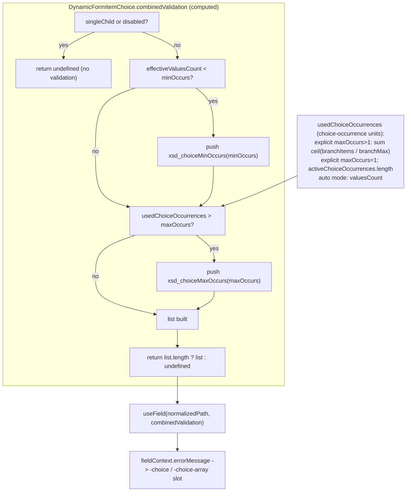

<!-- epic: optional. Set to the parent EPIC-XXX id when this feature belongs to an
     epic; leave "" for a standalone feature. Features are never nested under the
     epic folder, they only reference it here (flat model). -->


# Feature: XSD max-occurs validation for arrays and choices

## Problem & goal

`packages/core/src/core/validation.ts` registers `xsd_minOccurs` and `xsd_choiceMinOccurs` (occurrence *minimums*) but has no `xsd_maxOccurs` or `xsd_choiceMaxOccurs` (occurrence *maximums*). The gap is real and symmetric, confirmed by reading both components:

- **`DynamicFormItemArray.vue`**: `_canAddItems = computed(() => maxOccurs.value > fields.value?.length)` disables the "Add" affordance once the array reaches `maxOccurs`, and `combinedValidation` only ever pushes `xsd_minOccurs` (when `required`). There is no rule that fails when the array already holds more items than `maxOccurs` allows.
- **`DynamicFormItemChoice.vue`**: `canAddChoiceOccurrence` disables adding a new branch occurrence once the shared occurrence budget (or a branch's opt-in `maxOccursTotal`) is exhausted, and `combinedValidation` only ever pushes `xsd_choiceMinOccurs` (when `effectiveValuesCount < minOccurs`). There is no rule that fails when `usedChoiceOccurrences` already exceeds `maxOccurs`.

In both cases the maximum is enforced **structurally only**: it stops the user from adding a new item/occurrence through the UI, but data that arrives already over the limit (loaded `initialValues`, a prop set programmatically, data from an API or import) renders and passes validation with no error at all. For the choice case this was found during the adversarial review chain around FEAT-001 (explicit choice selection, now `done`): loading a `maxOccurs: 1` choice with two populated branches renders both and self-heals on the first `addChoiceOccurrence` call, but the over-limit state itself is never flagged.

XSD's `maxOccurs` is a particle-cardinality constraint (on `<xs:element>`, `<xs:choice>`, `<xs:group>`, etc.), the same kind of constraint `minOccurs` already is, not a `simpleType` facet like `minLength`/`pattern`. The library already models both as first-class `FieldMetadata` properties (not `restriction` facets) and already validates the minimum half of that pair with `xsd_`-prefixed rules, so adding the maximum half with the same naming and wiring is a direct, low-risk extension of an existing, working pattern rather than new territory.

**Who this is for:** library consumers whose forms load or receive data from outside the form itself (API responses, imports, programmatic `initialValues`) where that data can violate a `maxOccurs`/choice `maxOccurs` cap the metadata declares; and, more generally, any consumer who wants "too many items/occurrences" to be a validation error they can catch, style, and message like every other `xsd_*` rule, not only a disabled button the user never sees the reason for.

**Goal:** add `xsd_maxOccurs` (for array/repeatable nodes, `DynamicFormItemArray`) and `xsd_choiceMaxOccurs` (for choice nodes, `DynamicFormItemChoice`), mirroring `xsd_minOccurs`/`xsd_choiceMinOccurs` exactly in naming, wiring, and message-resolution behavior, so an over-limit occurrence count becomes a real validation failure using the same pipeline every other rule already uses.

This feature extends the occurrence-validation surface established by FEAT-001 (`done`, closed) and refined by QUICK-001 (XSD occurrence-math fix). It references both by name; neither is reopened.

## Scope

### In scope

- A new `xsd_maxOccurs` rule registered in `packages/core/src/core/validation.ts`, symmetric to `xsd_minOccurs`.
- A new `xsd_choiceMaxOccurs` rule, symmetric to `xsd_choiceMinOccurs`, evaluated in choice-occurrence units via `usedChoiceOccurrences` (the same unit `xsd_choiceMinOccurs` already validates in via `effectiveValuesCount`), so it stays correct once a branch's raw items and its choice slots diverge (per QUICK-001).
- Wiring both new rules into the existing `combinedValidation` computed in `DynamicFormItemArray.vue` and `DynamicFormItemChoice.vue`, alongside (not replacing) the existing min-rule pushes.
- `ruleParamNames` entries (`xsd_maxOccurs: 'max'`, `xsd_choiceMaxOccurs: 'max'`) so messages get a named `{max}` placeholder alongside positional `{0}`, mirroring the existing `{min}` pattern.
- Two new optional `DynamicFormSettings.messages` keys (`maxOccurs`, `choiceMaxOccurs`), documented with the same placeholder conventions as `minOccurs`/`choiceMinOccurs`.
- Applies uniformly to both automatic and explicit choice selection modes (FEAT-001): `combinedValidation` is shared by both, so no mode-specific branching is expected, only confirmation at architecture/test time.
- **(Added by Open question 2's resolution.)** A validation-layer backstop for the non-XSD `maxOccursTotal` per-branch cap (FEAT-001/QUICK-001), so a branch whose raw item count exceeds its declared `maxOccursTotal` fails validation rather than only having its add affordance disabled. This rule is **not** `xsd_`-prefixed (it has no XSD equivalent), counts raw per-branch items (not choice-occurrence units), and its name/anchoring are Open questions 5 and 6 for the architect. It is opt-in: it only applies to branches that declare `maxOccursTotal`.
- Documentation updates: `docs/guide/validation.md` (Built-in Rules table, example config), `docs/examples/choices.md` (slot-prop / rule mentions where relevant), `docs/reference/field-metadata.md` (occurrence section), the `DynamicFormSettings.messages` JSDoc in `packages/core/src/types/DynamicFormSettings.ts`, and `specs/components.md`'s validation rules list and messages surface (developer obligation at implementation time, not this spec).
- Tests: direct unit coverage for both new rules in `validation.ts`, plus integration coverage in `DynamicFormItemArray`'s and `DynamicFormItemChoice`'s existing `*.validation.test.ts` files (both choice modes, and the array/repeatable-choice-inside-array case already covered by existing suites).

### Out of scope (explicit)

- Any change to `xsd_minOccurs` or `xsd_choiceMinOccurs` semantics, wiring, or validation timing.
- Any change to the existing structural enforcement (`_canAddItems`, `canAddChoiceOccurrence`) that disables the add affordance at the limit; this feature adds a validation-layer backstop on top, it does not redesign the add/remove UX.
- ~~Validating the non-XSD `maxOccursTotal` per-branch cap~~ — **moved IN scope by Open question 2's resolution (Jeroen).** See the new in-scope bullet above and Open questions 5 and 6.
- Any visual/design surface: no new slots, no new template components, no new docs example component. The new messages surface through the exact same `fieldContext.errorMessage` path `xsd_minOccurs`/`xsd_choiceMinOccurs` already use.
- Changing what the engine does structurally when `initialValues` arrives already over `maxOccurs` (e.g. truncating extra items on load). This feature only adds the validation signal; whether the engine should also clip/reject such data structurally is a separate, larger question not raised by this feature.

## Functional overview

- An array field (`maxOccurs > 1`) whose occurrence count exceeds `maxOccurs` fails `xsd_maxOccurs` and shows an error through the same slot/message mechanism as every other rule, once validation runs for that field.
- A choice field whose `usedChoiceOccurrences` exceeds `maxOccurs` fails `xsd_choiceMaxOccurs`, anchored to the same nearest-ancestor path `xsd_choiceMinOccurs` already anchors to, in both automatic and explicit selection modes.
- Both new messages resolve through the existing priority chain (`settings.messages` → vee-validate `generateMessage` → rule default) and support `{max}` and `{0}` placeholders, exactly like `{min}` does for the min-rules today.
- No new slot props, no new template surface: a consumer who already handles `errorMessage` for `xsd_minOccurs`/`xsd_choiceMinOccurs` sees the new rule's message the same way, with no template changes required to observe it.

## Design (feature level)

**Skipped: this is a pure engine/validation-model feature with no visual surface of its own.** It reuses the exact error-display mechanics `xsd_minOccurs`/`xsd_choiceMinOccurs` already exercise (`fieldContext.errorMessage`, the existing `-array`/`-choice` slot error rendering already shown in every relevant docs example) and introduces no new slot, prop, component, or docs example. Status is set straight to `architecture`, per `specs/README.md`'s guidance for features with no design phase.

## Architecture (feature level)

### Summary

Two new globally-registered XSD occurrence rules (`xsd_maxOccurs`, `xsd_choiceMaxOccurs`), each a mirror of its existing min counterpart, wired into the two `combinedValidation` computeds that already carry the min rules. No new component, composable, type export, prop, or slot. The only new *public* surface is two optional keys on the exported `DynamicFormSettings.messages` object (`maxOccurs`, `choiceMaxOccurs`) and the `{max}` named placeholder they resolve. Everything else changed (`ValidationRule` union, `ruleParamNames`, the `defineRule` registrations, the two `combinedValidation` bodies) is internal (`ValidationRule`, `createValidation`, `resolveMessage` are confirmed *not* re-exported from `index.ts`).

**Summary addendum (re-architecture, `maxOccursTotal` backstop).** Open question 2 was resolved by Jeroen to also backstop the non-XSD `maxOccursTotal` per-branch cap in this feature. That adds **one more** globally-registered rule, `maxOccursTotal` (deliberately *not* `xsd_`-prefixed, see ADR-5), and one more optional `DynamicFormSettings.messages` key (`maxOccursTotal`). It reuses the exact same machinery as the two XSD rules: a stub rule that always returns `false` (the real condition lives in a guard, like `xsd_choiceMinOccurs`/`xsd_choiceMaxOccurs`), pushed into the same restructured `DynamicFormItemChoice` `combinedValidation` list, anchored at the same single choice-level `useField` path (ADR-6). No new component, composable, type export, prop, slot, reactive source, or timing gate. The `minor` bump is unaffected (ADR-5, and the confirmation appended to the backwards-compatibility section): the rule is additive and inert unless a branch opts in by declaring `maxOccursTotal`, and no existing exported signature changes.

### Component / composable plan (against `specs/components.md`)

| Piece | Verdict | What changes |
| --- | --- | --- |
| `packages/core/src/core/validation.ts` | **modify** | Add `'xsd_maxOccurs'` and `'xsd_choiceMaxOccurs'` to the `ValidationRule` union; register both with `defineRule`; add two `ruleParamNames` entries (`'max'` each). Additive only, no existing rule touched. |
| `DynamicFormItemArray.vue` | **modify** | Add one `createValidation('xsd_maxOccurs', ...)` push into the existing `combinedValidation` computed, beside the existing `xsd_minOccurs` push. No other change: it already registers via `useField`, already owns its own validation timing through `firstValueSet` + `validate()`, and the new rule rides that unchanged. |
| `DynamicFormItemChoice.vue` | **modify** | Restructure the existing `combinedValidation` computed from "return one rule or `undefined`" into "build a (0- or 1-element) list": keep the `xsd_choiceMinOccurs` push (now behind an explicit `effectiveValuesCount < minOccurs` guard rather than an early return), add an `xsd_choiceMaxOccurs` push behind a `usedChoiceOccurrences > maxOccurs` guard. The two are mutually exclusive (`minOccurs <= maxOccurs`), so at most one is ever present. No new reactive source: both `usedChoiceOccurrences` and `maxOccurs` already exist as computeds. |
| `DynamicFormSettings.ts` | **modify** | Add `maxOccurs?` and `choiceMaxOccurs?` to the `messages` object with JSDoc mirroring `minOccurs`/`choiceMinOccurs`, documenting `{field}`, `{0}`, `{max}`. |
| `createValidation.ts` / `resolveMessage.ts` | **reuse as-is** | No change. `createValidation` already builds `{ 0: param, [paramName]: param }` from `ruleParamNames`, so adding `xsd_maxOccurs: 'max'` there is all that is needed for `{max}` and `{0}` to resolve. The message-priority chain (`settings.messages` -> vee-validate `generateMessage` -> rule default) flows through unchanged. |
| Any new component / composable / type export | **none** | Confirmed. This is a pure validation-rule extension over existing wiring; nothing in `specs/components.md` needs a new entry beyond the two message keys and the two rule names in the "Validation rules" list (developer's `specs/components.md` update at implementation time). |

**Component / composable plan addendum (`maxOccursTotal` backstop).** These rows are additive on top of the two-XSD-rule plan above; no existing row is altered.

| Piece | Verdict | What changes |
| --- | --- | --- |
| `packages/core/src/core/validation.ts` | **modify** | Add `'maxOccursTotal'` to the `ValidationRule` union (widen its doc comment from "XSD-derived" to note it also carries this one non-XSD occurrence extension); register it with `defineRule('maxOccursTotal', () => false)` (a stub returning `false`, exactly like `xsd_choiceMinOccurs`/`xsd_choiceMaxOccurs`, since a choice has no inspectable value at its anchor path); add one `ruleParamNames` entry (`maxOccursTotal: 'max'`). Additive only. See ADR-5. |
| `DynamicFormItemChoice.vue` | **modify** | Add a small `computed` that returns the offending branch's `maxOccursTotal` cap (or `undefined`) by scanning the branches for `child.maxOccursTotal !== undefined && rawBranchItemCount(i) > child.maxOccursTotal`, where `rawBranchItemCount(i)` is `occurrences.value[i]?.childOccurrences` (the component's own raw per-branch item count, equal to `branchFieldArrays[i].fields.value.length`, the exact quantity `canAddChoiceOccurrence` governs). Push a third `createValidation('maxOccursTotal', cap, _messages?.maxOccursTotal)` into the same `combinedValidation` list restructured for `xsd_choiceMaxOccurs`, gated by that guard. No new reactive source: `occurrences` is already a transitive dependency of `combinedValidation`. See ADR-6. |
| `DynamicFormSettings.ts` | **modify** | Add an optional `maxOccursTotal?: ValidationMessage` key to the `messages` object with JSDoc documenting `{field}`, `{0}` or `{max}` (the per-branch cap), noting it names no XSD facet and applies to the choice branch whose total raw occurrence count exceeds its declared `maxOccursTotal`. **PROPOSED (adversarial review, finding 7):** the JSDoc must also state that this is a single choice-level aggregate that (1) does **not** name the offending branch (`{field}` is the choice anchor label, not the branch) and (2) when several branches breach at once, `{max}`/`{0}` carry the *first* offending branch's cap in declaration order, not every breached cap. A consumer authoring this message should not phrase it as if it identifies a specific branch or a single global cap. |

### Public API impact

- **New validation rules (runtime-observable, internal type):** `xsd_maxOccurs`, `xsd_choiceMaxOccurs`. Added to the internal `ValidationRule` union. The union type itself is not exported from `index.ts`, so this is not a typed public-surface change; the rules are observable only through error messages, exactly like every other `xsd_*` rule.
- **New `ruleParamNames` entries:** `xsd_maxOccurs: 'max'`, `xsd_choiceMaxOccurs: 'max'` (internal map).
- **New `DynamicFormSettings.messages` keys (public, additive, optional):** `maxOccurs?: ValidationMessage`, `choiceMaxOccurs?: ValidationMessage`. `DynamicFormSettings` is exported, so this grows the public type surface. Both optional; omitting them keeps today's default-message behavior.
- **New placeholder:** `{max}` on the two new messages (plus positional `{0}` and `{field}`, as the min rules already have `{min}`).
- **No change to any existing exported signature:** no export removed or renamed, no component prop, slot, event, or `defineMetadata` generic altered, no change to `FieldMetadata` (`maxOccurs` already exists). Existing consumer code compiles and runs unchanged.

**Public API impact addendum (`maxOccursTotal` backstop).**

- **New validation rule (runtime-observable, internal type):** `maxOccursTotal`. Added to the internal `ValidationRule` union, which is *not* exported from `index.ts` (verified in the earlier pass), so this is not a typed public-surface change; the rule is observable only through its error message, exactly like the `xsd_*` rules. It is deliberately **not** `xsd_`-prefixed (ADR-5): the `xsd_` prefix is the library's marker of XSD fidelity, and `maxOccursTotal` has no `<xs:choice>` equivalent (`FieldMetadata.maxOccursTotal`'s own doc already states this).
- **New `ruleParamNames` entry:** `maxOccursTotal: 'max'` (internal map), yielding `{max}` alongside positional `{0}`.
- **New `DynamicFormSettings.messages` key (public, additive, optional):** `maxOccursTotal?: ValidationMessage`. Optional; omitting it keeps today's default-message behaviour. This is the only new public-type surface the backstop adds, on top of the two XSD message keys above.
- **New placeholder:** `{max}` on this message (plus positional `{0}` and `{field}`, the same set the XSD max messages carry). The message does **not** name the offending branch: the resolver's `{field}` resolves to the choice's anchor-field label, not the branch, and `createValidation` carries a single param (the cap). Branch-naming is the rejected richer-message alternative in ADR-6.
- **No change to any existing exported signature, and no change to `FieldMetadata`:** `maxOccursTotal?: number` already exists on `FieldMetadata` (added by FEAT-001) and is unchanged. This feature only reads it. Existing consumer code compiles and runs unchanged; the rule is inert for any branch that does not declare `maxOccursTotal`.

### Backwards-compatibility analysis and changeset bump type

**DECIDED (architecture) — bump type: `minor`.** (Settles Open question 4.)

Reasoning against `CLAUDE.md`'s definitions:

- Not **patch**: patch is "no API impact". This adds public surface, two optional keys on the exported `DynamicFormSettings.messages` type (and two consumer-facing rule names / a new `{max}` placeholder). Growing an exported type past a pure bug fix is more than patch.
- Not **major**: the only behavioral change is that data *already* exceeding the metadata's declared `maxOccurs`/choice `maxOccurs` now raises a validation error where before it silently passed. This manifests **only** in a state the metadata itself declares invalid, and one the UI already prevents a user from reaching (`_canAddItems` / `canAddChoiceOccurrence` disable the add affordance at the cap). For every UI-driven form, `value.length <= maxOccurs` and `usedChoiceOccurrences <= maxOccurs` already hold at all times (and `minOccurs <= maxOccurs`, so auto-added placeholders never breach the cap), so those forms see **zero** change. The behavior delta is confined to externally-loaded over-limit data, which is precisely the bug this feature fixes, not a contract consumers could legitimately rely on.
- Therefore **minor**: new, backwards-compatible public surface (optional message keys, new rules mirroring the existing min pair), no existing signature changed, existing code keeps working unchanged. This matches how the original min rules would have been classified.

Honest risk note carried to review: a consumer who today *submits* over-declared-limit data and depends on it passing will newly see a failure. Since the metadata declares that data invalid, this is the intended correction, but the adversarial reviewer / Jeroen should confirm they agree it does not rise to major.

**PROPOSED (adversarial review) — strengthen the reasoning, keep the `minor` verdict, leave the stamp to Jeroen (finding 1).** Two corrections to the argument above:

- The strongest argument for `minor` is **precedent, not "invalid state"**. `xsd_minOccurs`/`xsd_choiceMinOccurs` already fail on submit when externally-loaded data violates an occurrence *minimum* (a `required` array loaded with too few filled items blocks submit today). The library has therefore already established that occurrence-invalid loaded data does not submit; `xsd_maxOccurs`/`xsd_choiceMaxOccurs` are the symmetric completion of a contract existing consumers are already subject to, not a new kind of restriction. This is a firmer basis than "the state is one the metadata declares invalid".
- Be honest that the change **is** observable for existing consumers: loading over-limit data from an API/import into an edit form and calling submit flips from success to a blocked submit plus a new error message. That is a real runtime change; the case for `minor` is that it is the intended correction and consistent with the established min-rule contract, not that no consumer can observe it. Because semver judgement is Jeroen's to make (post-approval tie-breaker ladder), this stays flagged for his confirmation rather than settled here.

**DECIDED (Jeroen): `minor` confirmed.** Accepts the precedent-based reasoning (the min rules already block submit on occurrence-invalid loaded data; the max rules are the symmetric completion of that established contract). Finding 1's PROPOSED edit above is accepted as the backwards-compatibility reasoning of record. Finding 2's PROPOSED edit is also accepted: the `minOccurs <= maxOccurs` invariant is documented as an unenforced assumption, and no dev-time metadata warning is added (the engine emits no metadata warnings anywhere today, so a warning would be off-pattern; contradictory metadata already produces undefined behaviour on the min side). Note: the `maxOccursTotal` scope expansion below (Open question 2) does not change this `minor` verdict, since `maxOccursTotal` validation is likewise additive and behind an opt-in metadata flag, but the architect must confirm no existing exported signature is affected once its rule shape is designed.

**PROPOSED (adversarial review) — state the `minOccurs <= maxOccurs` invariant as an assumption (finding 2).** The claim "For every UI-driven form ... `minOccurs <= maxOccurs`, so auto-added placeholders never breach the cap" relies on an invariant that is **not enforced** anywhere (`correctMetadataAndSetDefaults` does not validate it). With contradictory metadata (`minOccurs: 5, maxOccurs: 3`), the array's auto-add `watchEffect` fills to `minOccurs`, so even a never-touched UI-driven form would fail `xsd_maxOccurs` with an unresolvable error. This is confined to already-broken metadata and does not change the `minor` verdict, but the reasoning should read: "assuming well-formed metadata (`minOccurs <= maxOccurs`, which the library does not currently enforce), UI-driven forms see zero change; contradictory metadata is out of scope and already produces undefined behaviour on the min side too." The choice side already notes this caveat in ADR-4.

**CONFIRMED (architecture, re-architecture) — `minor` still holds with the `maxOccursTotal` backstop added.** This is the confirmation Jeroen's DECIDED note above explicitly requested ("the architect must confirm no existing exported signature is affected once its rule shape is designed"). The backstop is additive on the same three axes as the two XSD rules: (1) one new internal `ValidationRule` union member (`maxOccursTotal`) and one `ruleParamNames` entry, both internal, not exported; (2) one new **optional** `DynamicFormSettings.messages` key (`maxOccursTotal?`), the only new public-type surface, omission of which preserves today's behaviour; (3) no change to any existing exported signature and no change to `FieldMetadata` (`maxOccursTotal?: number` already exists from FEAT-001; this feature only reads it). The behaviour delta is strictly opt-in behind that metadata flag: a branch with no `maxOccursTotal` sees the guard return `undefined` and no rule is ever pushed, so every existing form is byte-for-byte unchanged. This is a strictly narrower blast radius than the XSD rules (which apply to every array/choice), so it cannot push the verdict past `minor`; it does not re-open the semver, which Jeroen has stamped.

### Data flow

**Array (`xsd_maxOccurs`).** The rule is a plain array-cardinality check, structurally identical to `xsd_minOccurs`:

```ts
// validation.ts
defineRule('xsd_maxOccurs', (value: unknown, [max]: [number]) => {
  if (!Array.isArray(value))
    return true;        // no array => 0 items => always within any max
  return value.length <= Number(max);
});
```

It reads **raw item count** (`value.length`), not filled count. `value` is the array vee-validate holds at `normalizedPath`, including empty placeholders (`push(null)`), so `value.length === fields.value.length`, the exact quantity `_canAddItems = maxOccurs > fields.value.length` governs. Wiring in `DynamicFormItemArray.vue`'s existing `combinedValidation` computed, beside the min push:

```ts
if (required.value)
  _validations.push(createValidation('xsd_minOccurs', minOccurs.value, _messages?.minOccurs));

if (!disabled.value)
  _validations.push(createValidation('xsd_maxOccurs', maxOccurs.value, _messages?.maxOccurs));
```

Gated by `!disabled` (`disabled = maxOccurs === 0`): a disabled array does not render as a live field, so it should not raise a max error, symmetric with how `required` (which folds in `!disabled`) gates the min push. Validation *timing* is inherited with no new code: the rule sits in the same `combinedValidation` consumed by the same `useField(..., { validateOnValueUpdate: false })`, and only runs when the component calls `validate()` behind the `firstValueSet` gate (or on form submit, which validates all fields regardless). See ADR-3.

**Choice (`xsd_choiceMaxOccurs`).** A choice has no real entry in the vee-validate value tree (its `combinedValidation` is anchored to the nearest-ancestor `normalizedPath`), so, exactly like `xsd_choiceMinOccurs`, the rule cannot inspect a meaningful value and instead always fails when present; the *count comparison lives in the computed's guard*, which is the real condition:

```ts
// validation.ts — mirrors the existing xsd_choiceMinOccurs stub
defineRule('xsd_choiceMaxOccurs', () => false);
```

```ts
// DynamicFormItemChoice.vue — combinedValidation, restructured to a list
const combinedValidation = computed(() => {
  if (singleChild.value) return;      // validated by the child itself
  if (disabled.value) return;

  const _messages = settings?.value?.messages;
  const _validations = [];

  if (effectiveValuesCount.value < minOccurs.value)
    _validations.push(createValidation('xsd_choiceMinOccurs', minOccurs.value, _messages?.choiceMinOccurs));

  if (usedChoiceOccurrences.value > maxOccurs.value)
    _validations.push(createValidation('xsd_choiceMaxOccurs', maxOccurs.value, _messages?.choiceMaxOccurs));

  return _validations.length ? _validations : undefined;
});
```

The max guard reads **`usedChoiceOccurrences`**, the choice-occurrence-unit count (`sum of ceil(branch item count / branch maxOccurs)` in the repeatable explicit case, `activeChoiceOccurrences.length` in the single explicit case, `valuesCount` in auto mode), *not* raw item count. This is the exact unit `canAddChoiceOccurrence` and `xsd_choiceMinOccurs` already reason in, so the max rule and the structural cap stay in lock-step, and the rule stays correct once a branch's raw items and its choice slots diverge (per QUICK-001). It applies uniformly to both automatic and explicit modes because `usedChoiceOccurrences` already encodes both; no mode branching is added. The min guard keeps its existing `effectiveValuesCount` basis untouched (this feature does not alter min semantics). The FEAT-001 review scenario (a `maxOccurs: 1` choice loaded with two populated branches) resolves to `usedChoiceOccurrences === 2 > 1` and now flags.



Note the two guards are mutually exclusive under `minOccurs <= maxOccurs`, so the list is always 0 or 1 element; the list shape is used only for clarity and future symmetry, not because both can fire at once.

**`maxOccursTotal` backstop (choice-level aggregate).** The per-branch cap is validated by a **third** push into the *same* `combinedValidation` list, anchored at the *same* single choice-level `useField(normalizedPath, ...)` as the two XSD choice rules (ADR-6 explains why choice-level, not per-branch). The guard reads each branch's **raw per-branch item count** (not choice-occurrence units, contrast `xsd_choiceMaxOccurs`):

```ts
// DynamicFormItemChoice.vue — the offending branch's cap, or undefined
const maxOccursTotalBreach = computed(() => {
  const branches = field.value?.choice ?? [];
  for (let i = 0; i < branches.length; i++) {
    const cap = branches[i]?.maxOccursTotal;
    // childOccurrences is the raw item count (incl. empty placeholders), equal to
    // branchFieldArrays[i].fields.value.length — the exact quantity canAddChoiceOccurrence governs.
    const rawCount = occurrences.value[i]?.childOccurrences ?? 0;
    if (cap !== undefined && rawCount > cap)
      return cap;
  }
  return undefined;
});

// ...inside the restructured combinedValidation, after the two XSD pushes:
if (maxOccursTotalBreach.value !== undefined)
  _validations.push(createValidation('maxOccursTotal', maxOccursTotalBreach.value, _messages?.maxOccursTotal));
```

Key points, each grounded in the real code:

- **Unit.** `occurrences.value[i].childOccurrences` is `calculateValues.length` from `updateChildValue` (raw items, empty placeholders included), populated in every mode: auto mode via the template `@update:model-value`, explicit `maxOccurs: 1` likewise, and explicit `maxOccurs > 1` via the branch-field-array sync watch that calls `updateChildValue(branchValues, i, branchMax)`. In the repeatable explicit case it equals `branchFieldArrays[i].fields.value.length`, the same value `canAddChoiceOccurrence`'s `branchCount` reads, so the backstop and the structural cap measure the identical quantity. This is `> cap`, not `>= cap`, symmetric with `xsd_maxOccurs` (`value.length <= max`): being *at* the cap is the last legal state (`canAddChoiceOccurrence` disables the *next* add there), being *over* it is the failure.
- **Lock-step with `canAddChoiceOccurrence`.** For `maxOccurs > 1`, `canAddChoiceOccurrence` returns `branchCount < overrideChildMaxOccurrences`, and pass 2 of the `occurrences` computed folds `maxOccursTotal` into `overrideChildMaxOccurrences` via `Math.min`. So the add affordance already stops the UI at `maxOccursTotal`; the backstop fires only when loaded/programmatic data pushes a branch *past* it, exactly the structural-vs-validation gap this feature closes for the XSD rules.
- **Both modes, no branching.** The guard scans `field.value.choice` and reads `occurrences` (which encodes all three modes), so no mode-specific code path is added, mirroring how `usedChoiceOccurrences`/`combinedValidation` already stay mode-agnostic.
- **Inert unless opted in.** A branch with no `maxOccursTotal` contributes `undefined` and is skipped, so a choice with no capped branch never carries this rule.
- **No new reactive source.** `occurrences` is already a transitive dependency of `combinedValidation` (via `effectiveValuesCount → valuesCount → occurrences`), so adding a direct read introduces no new dependency and no new render, consistent with ADR-2's no-new-cycle finding.
- **Timing.** Rides the same `combinedValidation`/`useField` gate as the two XSD choice rules, so it inherits ADR-3's timing verbatim: surfaces on first interaction or on submit, never eagerly on mount.
- **Interaction with `xsd_maxOccurs` (slice 1).** In *auto* mode and in the `maxOccurs: 1`-choice-with-array-branch case, a branch renders as a real `DynamicFormItemArray` whose `maxOccursOverride` is already `Math.min`'d with `maxOccursTotal`, so slice 1's `xsd_maxOccurs` *also* fires against that branch when it is over-limit. That is a benign, redundant overlap (both errors point at the same over-limit branch, in an already-invalid loaded state) and is *not* suppressed: slice 1 validates the dynamic `min(sharedBudget, maxOccursTotal)`, this backstop validates the stable `maxOccursTotal` alone, giving a clear dedicated signal. The **explicit `maxOccurs > 1`** case is the one with *no other* coverage (each occurrence renders as a single non-array `DynamicFormItem`, so no branch-array `xsd_maxOccurs` exists), which is precisely why a choice-level backstop is required rather than leaning on slice 1.
- **List can now hold more than one rule.** Unlike the two XSD choice rules (mutually exclusive under `minOccurs <= maxOccurs`), `maxOccursTotal` measures a *different* quantity (per-branch raw count) and is not mutually exclusive with them, so `combinedValidation` may legitimately hold two rules at once. It is pushed **last**, so a co-occurring `xsd_choiceMinOccurs`/`xsd_choiceMaxOccurs` message wins `errorMessage`'s first-error display; the `maxOccursTotal` message surfaces as the primary error only when no choice-level occurrence rule is also failing. This is the same "first push wins the single visible message" behaviour the existing review already notes for the array min-before-max ordering (nit 3); tests asserting message *content* in a co-occurring corner should expect the choice-occurrence message, not the `maxOccursTotal` one.

### ADR notes

**ADR-1 — `xsd_maxOccurs` counts raw items, not filled values. (Settles Open question 1.)**
*Context:* `xsd_minOccurs` counts *filled* items (`value.filter(checkTreeHasValue).length >= min`); the structural cap it pairs with (`_canAddItems = maxOccurs > fields.value.length`) counts *all* items, including empty placeholders auto-added for `minOccurs`. The two bases can disagree.
*Decision:* `xsd_maxOccurs` counts raw item count (`value.length <= max`).
*Alternative considered:* count filled values (`value.filter(checkTreeHasValue).length <= max`), symmetric with the min rule's basis.
*Why rejected:* filled-count would let the rule *pass* in a state where the "Add" button is already disabled (an array at exactly `maxOccurs` raw items, some empty, has fewer filled items than `maxOccurs`), so the validation message and the UI affordance would disagree. Raw count keeps `xsd_maxOccurs` and `_canAddItems` governing the exact same quantity, which is the whole point of a validation backstop for the structural cap. XSD `maxOccurs` is a particle-count constraint (how many element instances may appear), which maps to raw occurrences, not to "how many are non-empty"; filled-vs-declared is the min rule's separate concern. Confirms the spec's recommendation.

**ADR-2 — `xsd_choiceMaxOccurs` counts in choice-occurrence units via `usedChoiceOccurrences`. (Confirms the Q1 analog for choices.)**
*Context:* a choice's raw branch-item count and its choice-occurrence count diverge once a branch's own `maxOccurs > 1` batches items into slots (QUICK-001).
*Decision:* compare `usedChoiceOccurrences > maxOccurs`, the same unit `canAddChoiceOccurrence` enforces and `xsd_choiceMinOccurs` validates in.
*Alternative considered:* compare raw item counts summed across branches.
*Why rejected:* raw-item comparison would over-count and fire spuriously exactly in the batched case QUICK-001 fixed for the min rule, and would disagree with the structural add-cap. Choice-occurrence units keep the rule XSD-faithful and in lock-step with the cap. The rule stub returns `false` (like `xsd_choiceMinOccurs`) because the choice has no inspectable value in the vee-validate tree; the real condition is the computed's guard.

**ADR-3 — mirror existing validation timing; do not fire eagerly on over-limit `initialValues`. (Settles Open question 3.)**
*Context:* the array's min rule is present in `combinedValidation` whenever `required`, but only actually runs once `firstValueSet` flips true (on first interaction) or on submit; on mount with `{ immediate: true }` it sees `firstValueSet === false` and skips `validate()`. The choice's rules run on submit / value-update (no eager mount validation, vee-validate `validateOnMount` defaults false). So today a min violation is not shown until interaction or submit.
*Decision:* both max rules inherit exactly that timing by construction, they share the same `combinedValidation` / `useField` / gate as their min siblings, with no separate eager-validate path. An over-limit form shows the error on first interaction or on submit, not eagerly on mount.
*Alternative considered:* fire the max error immediately on mount when `initialValues` arrive over-limit, on the argument that bad data is already invalid the moment it loads, independent of user action.
*Why rejected:* introducing a *second*, different timing behavior for two rules living in the *same* `combinedValidation` on the *same* field would be a surprising asymmetry a consumer must learn and cannot configure separately; consistency inside one field's validation wins. Eager-on-mount validation is a broader, cross-cutting timing concern (it would equally apply to the min rules and to every other rule) and belongs to a dedicated `validateOnMount`-style setting, not smuggled in for one rule. Deferring costs nothing: the error still surfaces on the first submit, which is when a consumer acts on validity. Confirms the spec's recommendation.

**ADR-4 — additive list shape in the choice `combinedValidation`, not an added early-return branch.**
*Context:* the choice computed currently early-returns a single-rule array or `undefined`.
*Decision:* build a small list and push each applicable rule, returning `undefined` when empty.
*Alternative considered:* add a second `if (over max) return [maxRule]` early-return after the existing min early-return.
*Why rejected:* the list shape reads symmetrically with the array component's `combinedValidation` (which already builds a `_validations` array), keeps the min and max guards visibly parallel, and avoids ordering pitfalls if the mutual-exclusivity invariant (`minOccurs <= maxOccurs`) is ever relaxed. Behavior is identical today since the guards are mutually exclusive. (The list shape is now load-bearing rather than merely tidy: ADR-6's `maxOccursTotal` rule is a genuine third element that can co-exist with a choice-occurrence rule.)

**ADR-5 — the `maxOccursTotal` backstop rule is named `maxOccursTotal` and is deliberately not `xsd_`-prefixed; its message key is `maxOccursTotal`. (Settles Open question 5.)** `DECIDED (architecture)`.
*Context:* the two other rules in this feature are `xsd_`-prefixed because `maxOccurs`/choice `maxOccurs` are genuine XSD particle-cardinality constraints; the library uses the `xsd_` prefix as its marker of XSD fidelity across all 15 currently-registered rules. `maxOccursTotal` is a non-XSD library extension: `FieldMetadata.maxOccursTotal`'s own doc states plainly that `<xs:choice>` has no equivalent (XSD bounds only how often the choice repeats and how many items one repetition of a branch holds, never a branch's running total across the whole choice). There is no existing non-`xsd_` rule to match, so the convention is set here.
*Decision:* register the rule as `maxOccursTotal` (no prefix) and add the settings key as `messages.maxOccursTotal`, with `ruleParamNames['maxOccursTotal'] = 'max'` so messages resolve `{max}` and positional `{0}` (plus `{field}` from ctx), the same placeholder set the XSD max messages carry. The name mirrors the `FieldMetadata.maxOccursTotal` property it enforces exactly, which is the established pattern for every other rule/message pair (`xsd_minOccurs` ↔ `minOccurs`, `xsd_maxLength` ↔ `maxLength`, etc.); the `messages` keys are already un-prefixed (`minOccurs`, `choiceMinOccurs`, ...), so `maxOccursTotal` fits that object with no stylistic seam.
*Alternatives considered:* (a) `xsd_maxOccursTotal` — rejected: it would falsely claim XSD provenance for a rule that has none, eroding the one signal the prefix carries; (b) a coined non-mirroring name such as `branchMaxOccurs` or `choiceBranchMaxTotal` — rejected: it breaks the rule-name-mirrors-metadata-property convention, forces consumers to learn a second vocabulary for the same concept, and reads as a new feature rather than the backstop for an existing metadata flag; (c) prefixing with a library namespace (e.g. `vdf_maxOccursTotal`) — rejected: no such convention exists in the codebase (only `xsd_` does), so it would introduce a second prefix scheme for a single rule.

**ADR-6 — the `maxOccursTotal` error is a single choice-level aggregate anchored at the existing choice `useField` path, counted in raw per-branch item units, reporting the offending branch's cap. (Settles Open question 6.)** `DECIDED (architecture)`.
*Context:* `xsd_choiceMaxOccurs` is a choice-level error anchored to the nearest-ancestor `normalizedPath`, counted in choice-occurrence units (`usedChoiceOccurrences`). `maxOccursTotal` is fundamentally different: a **per-branch** cap counted in **raw per-branch item count** (`occurrences[i].childOccurrences`, equal to `branchFieldArrays[i].fields.value.length`), the exact quantity `canAddChoiceOccurrence` governs. `DynamicFormItemChoice` today owns exactly one `useField`, at the choice's nearest-ancestor path; it does not register per-branch fields (the branches' own `DynamicFormItem`/`DynamicFormItemArray` children do that).
*Decision:* surface it as a single **choice-level aggregate** error, pushed as a third rule into the existing `combinedValidation` list on the existing single `useField(normalizedPath, ...)`. The guard fires when *any* branch's raw item count exceeds its declared `maxOccursTotal`, and passes the first offending branch's cap as the rule param (`{max}`/`{0}`). The count is raw per-branch items, staying in exact lock-step with `canAddChoiceOccurrence`, in both automatic and explicit modes and across a repeatable branch's multiple occurrences, because `occurrences[i].childOccurrences` is populated identically in all three render modes (see the data-flow addendum). Timing follows ADR-3 unchanged (same `combinedValidation`/`useField` gate).
*Alternative considered:* (a) a **per-branch** error attached to each offending branch's own field/path, so the message could name the branch via `{field}` and render inline next to it. Rejected: the only mode where a branch is a real vee-validate array field is auto mode (and the `maxOccurs: 1`-with-array-branch case), where slice 1's `xsd_maxOccurs` *already* fires against the `maxOccursTotal`-clamped override; the mode that genuinely lacks coverage, explicit `maxOccurs > 1`, renders each occurrence as a *single* non-array `DynamicFormItem` with no branch-level array field to anchor a total-count rule to. Per-branch anchoring there would force `DynamicFormItemChoice` to register N *extra* `useField`s (one per branch) purely for this rule, colliding on paths already owned by the branch children and duplicating error aggregation, to gain a branch label the aggregate can approximate. The choice-level aggregate reuses the one field the component already owns, works uniformly across all three modes with zero new registrations, and matches how every other choice-level occurrence rule (`xsd_choiceMinOccurs`/`xsd_choiceMaxOccurs`) already anchors. (b) A richer message that *names* the branch inside the aggregate. Rejected for now: `createValidation` carries a single param and `resolveMessage`'s `{field}` resolves to the choice anchor label, not the branch, so branch-naming would need a bespoke message-resolution path outside the shared pipeline this feature is required to reuse. The message therefore reports the cap (`{max}`) and the choice label (`{field}`) only; naming the specific branch is a possible later enhancement, noted so it is a conscious limitation rather than an oversight.

### Natural slicing seams (for the scrum-master)

Three independently deliverable slices; the two engine slices share only the small `validation.ts` diff and can otherwise proceed in parallel. Suggested order:

1. **Array-rule slice** — `xsd_maxOccurs` registration + `ruleParamNames` entry + `ValidationRule` union member + the `maxOccurs` message key/JSDoc, and the `DynamicFormItemArray.vue` `combinedValidation` push. Unit tests in `validation.ts`'s suite + integration tests in `DynamicFormItemArray`'s `*.validation.test.ts` (over-limit `initialValues`, exactly-at-limit passes, timing mirrors min). Self-contained.
2. **Choice-rule slice** — `xsd_choiceMaxOccurs` registration + `ruleParamNames` entry + `ValidationRule` union member + the `choiceMaxOccurs` message key/JSDoc, and the `DynamicFormItemChoice.vue` `combinedValidation` restructure. Integration tests in `DynamicFormItemChoice`'s `*.validation.test.ts` covering both auto and explicit modes, the `maxOccurs: 1` two-branch load case, and the repeatable-branch batched-unit case. Depends on slice 1 only for the shared `validation.ts` edits (trivially rebaseable; if slices land together the `ValidationRule` union / `ruleParamNames` edits merge cleanly). Otherwise independent. **This slice also owns the `maxOccursTotal` backstop** (see below).

   **`maxOccursTotal` backstop — folded into slice 2 (not a separate slice).** Rationale: it touches the exact same two files as `xsd_choiceMaxOccurs` (`validation.ts` registration + `ruleParamNames` + union member + a `maxOccursTotal` message key/JSDoc in `DynamicFormSettings.ts`, and one more push into the *same* `DynamicFormItemChoice.vue` `combinedValidation` list this slice is already restructuring). Splitting it out would mean two stories editing the same `combinedValidation` computed and the same `ruleParamNames`/union, guaranteeing a rebase conflict for no isolation benefit. Its tests live in the same `DynamicFormItemChoice.*.validation.test.ts` file, and its highest-value case (an explicit `maxOccurs > 1` branch loaded past its `maxOccursTotal` erroring; a branch *at* `maxOccursTotal` passing; and the auto-mode overlap with `xsd_maxOccurs` per the data-flow addendum) is a natural addition to that suite. Dependency: same as slice 2's dependency on slice 1 (the shared `validation.ts` additive edits). If the scrum-master merges slices 1 and 2 into one engine story, `maxOccursTotal` rides along with the choice half of it.
3. **Docs slice** — `docs/guide/validation.md` (Built-in Rules table + example config for the two XSD messages *and* the non-XSD `maxOccursTotal` message, called out as a non-XSD extension so readers do not expect a `<xs:choice>` equivalent; **PROPOSED (adversarial review, finding 7):** also note that the `maxOccursTotal` message is a single choice-level aggregate that names no branch and, when multiple branches breach, reports the first offending branch's cap only — and that in automatic mode an over-limit branch may additionally surface its own inline `xsd_maxOccurs` error against the clamped override, per second-pass finding 8), `docs/reference/field-metadata.md` (occurrence section, and cross-reference `maxOccursTotal`'s existing entry to note it now has a validation backstop, not only a disabled add affordance), `docs/examples/choices.md` where relevant. No `packages/core/src/` change, so no changeset of its own; can land last, after both engine slices, since it documents their behavior. `specs/components.md`'s validation-rules list and messages surface is a developer obligation folded into whichever engine slice touches each rule, per the standing update rule (the `maxOccursTotal` rule/message is added by slice 2).

If the scrum-master prefers, slices 1 and 2 can be merged into a single "both rules" engine story (they touch the same two files' neighborhoods and are small); the docs slice should stay separate regardless. The `validation.ts` union/registration/`ruleParamNames` edits are the only shared file between 1 and 2 and are additive, so either split is safe.

## Adversarial review

Reviewed at feature level (full mode). The architecture was checked against the real code in `DynamicFormItemArray.vue`, `DynamicFormItemChoice.vue`, `validation.ts`, `createValidation.ts`, `DynamicFormSettings.ts`, and `index.ts`, not just the prose.

**What holds up (verified, not assumed):**

- The internal-surface claim is correct. `index.ts` re-exports only components, `defineMetadata`/`useDynamicForm`/`useValidatePartialForm`, the listed types, and four utils. `ValidationRule`, `createValidation`, and `resolveMessage` are **not** exported, and no exported type references them, so adding two union members and two `ruleParamNames` entries is genuinely internal. The only new public surface is the two optional `DynamicFormSettings.messages` keys. This part of the semver argument is sound.
- The choice min/max mutual-exclusivity holds under `minOccurs <= maxOccurs`: when the max guard fires (`usedChoiceOccurrences > maxOccurs`), `effectiveValuesCount >= usedChoiceOccurrences > maxOccurs >= minOccurs` in every mode (auto: both equal `valuesCount`; explicit `maxOccurs>1`: `effectiveValuesCount = max(valuesCount, usedChoiceOccurrences)`; explicit `maxOccurs:1`: an explicitly-selected-but-empty branch counts 1 in both `effectiveValuesCount` and `activeChoiceOccurrences.length`), so the min guard cannot also fire. The FEAT-001 two-branch-load case resolves to `usedChoiceOccurrences === 2 > 1` and flags, as claimed.
- `usedChoiceOccurrences` is the correct unit and `canAddChoiceOccurrence` enforces the same unit (QUICK-001), so the rule and the structural cap stay in lock-step; no new reactive cycle is introduced (in the `maxOccurs>1` case `usedChoiceOccurrences` is already a transitive dependency of `combinedValidation` via `effectiveValuesCount`).
- ADR-3's array-timing claim is accurate: `shouldValidateOnValueUpdate` returns falsy while `firstValueSet === false`, so the `{ immediate: true }` mount watch skips `validate()`; the max rule inherits this by sharing the same `useField`.
- The `{max}` + `{0}` placeholder wiring is correct by symmetry with `{min}`: `createValidation` builds `{ 0: param, max: param }` from `ruleParamNames['xsd_maxOccurs'] = 'max'`, and the message-priority chain is untouched.

**Findings:**

1. **(should-fix, routed)** The `minor` classification is defensible but the reasoning under-states the real observable change and mis-frames the strongest supporting argument. The change flips a form's submit from *passing* to *failing* whenever externally-loaded data is over-limit, which is precisely this feature's target scenario (API/import/`initialValues`), and a consumer whose app loads server data into an edit form can routinely be in that state, so "a contract consumers could [not] legitimately rely on" is too dismissive. The genuinely strong argument the spec omits is the **precedent**: `xsd_minOccurs`/`xsd_choiceMinOccurs` already block submit on occurrence violations of loaded data today, so the library has *already* established that occurrence-invalid data does not submit, and the max half is the symmetric completion of a contract consumers were already subject to. `minor` is the right call on that basis, but semver judgement is explicitly reserved for Jeroen (per the post-approval tie-breaker ladder), and the spec should carry the precedent argument rather than the weaker "state metadata declares invalid" framing. Routed as a PROPOSED edit to the backwards-compatibility section; final stamp is Jeroen's.

2. **(should-fix, routed)** The `minor` proof and the choice mutual-exclusivity both rest on an **unenforced** `minOccurs <= maxOccurs` invariant. Nothing in `correctMetadataAndSetDefaults` or elsewhere validates it. With contradictory metadata (`minOccurs: 5, maxOccurs: 3`), the array's auto-add `watchEffect` pushes placeholders up to `minOccurs`, so a freshly-rendered, never-touched **UI-driven** form would sit at raw count 5 and fail `xsd_maxOccurs` with an error the user cannot clear (they cannot remove below `minOccurs`, and cannot get under `maxOccurs`). That contradicts the spec's flat claim that UI-driven forms see "zero change". The impact is confined to already-broken metadata, so this does not change the `minor` verdict, but the spec states the invariant as fact where it is an assumption. Routed as a PROPOSED edit: state `minOccurs <= maxOccurs` as an assumption and name the misconfigured-metadata edge. (ADR-4 already half-acknowledges this for the choice; the array reasoning and the "auto-added placeholders never breach the cap" sentence do not.)

3. **(nit)** For an array loaded with over-limit data that is *also* under-filled (e.g. `minOccurs:1, maxOccurs:2` loaded with 3 empty placeholders), both `xsd_minOccurs` and `xsd_maxOccurs` are present and fail; because the min push precedes the max push in `_validations`, `errorMessage` shows the "at least N required" message while the actual defect is "too many". Reachable only with loaded trailing-null data, so low value, but a test asserting message content in that corner should expect the min message, and the spec/tests should not claim the max message surfaces there.

4. **(nit)** A non-required array (`minOccurs: 0`) today has an **empty** `combinedValidation` (no `xsd_minOccurs`, gated by `required`); after this change it carries `xsd_maxOccurs` (gated only by `!disabled`), so such a field goes from "no registered rule" to "has a rule". This is intended, but existing "optional array has no errors" tests may assert the old shape. The test scope should explicitly cover a non-required over-limit array erroring, and the developer should re-check existing optional-array validation tests at implementation time.

5. **(nit)** XSD `maxOccurs="unbounded"` has no representation in `FieldMetadata` (`maxOccurs?: number`, default 1); a consumer wanting unbounded must supply a finite number, which `xsd_maxOccurs` will now enforce as a hard cap. Pre-existing limitation, not introduced here, but worth one line in the docs slice so a consumer who used a "large finite" value as a proxy for unbounded understands it is now validated.

6. **(nit)** ADR-3 reads as if array and choice share one timing mechanism. They do not: the array is gated by `firstValueSet` + explicit `validate()`, the choice by vee-validate's default `validateOnValueUpdate` with `validateOnMount` false. The observable outcome (error on interaction or submit, never eagerly on mount) is identical and each max rule correctly inherits *its own* min sibling's timing, so the decision stands; a one-line clarification that the two components reach the same outcome by different gates would prevent a reader inferring a single shared gate.

### Second pass: the `maxOccursTotal` backstop (ADR-5 / ADR-6)

Scoped to the re-architecture that folded the non-XSD `maxOccursTotal` per-branch cap into slice 2. The two XSD rules' design (ADR-1..4), the `minor` semver, and findings 1-6 above are closed and were not re-opened. The new design was checked against the real code in `DynamicFormItemChoice.vue` (the `occurrences` computed, `combinedValidation`, `canAddChoiceOccurrence`, the branch-field-array sync watch), `useFieldArrayExtended.ts`, `createValidation.ts`, `resolveMessage.ts`, `validation.ts`, and `DynamicFormItemArray.vue`, and the array-validator ordering was verified against vee-validate 4.15.1 behaviour.

**What holds up (verified, not assumed):**

- **The `occurrences[i].childOccurrences == branchFieldArrays[i].fields.value.length` equivalence is real, not merely a test aspiration.** `useFieldArrayExtended` defines `values = computed(() => fields.value.map(({ value }) => value))`, so `values.value.length === fields.value.length` by construction. In explicit `maxOccurs > 1` mode the sync watch calls `updateChildValue(branchValues, i, branchMax)` with `branchValues = branchFieldArrays[i].values.value`; inside `updateChildValue`, `totalChildOccurrences = maxOccurs.value * branchMax` is always `> 1` in this mode, so the `undefined`-filter path is skipped and `childOccurrences = branchValues.length = fields.value.length`. The batching case (branch `maxOccurs: 3`, `maxOccursTotal: 4`, loaded 5 raw items) resolves to `childOccurrences === 5 > 4` and fires, while `usedChoiceOccurrences` for that branch is `ceil(5/3) === 2` and would not trip `xsd_choiceMaxOccurs`, confirming the backstop is the *only* signal in the explicit `maxOccurs > 1` case, exactly as ADR-6 claims. Both `{ immediate: true }` watches run during setup, so loaded data is counted before `combinedValidation` is ever evaluated (validation runs on interaction/submit, after reactivity has flushed), so no stale-count read is reachable at validation time.
- **No unclearable-error analog to finding 2 exists for `maxOccursTotal`.** Choice children never auto-fill (`DynamicFormItemArray`'s auto-add `watchEffect` returns early under `partOfChoiceField`, and `overrideChildMinOccurrences` defaults to 0 inside a choice), so no UI-driven form can be pushed past a branch's `maxOccursTotal` by placeholder auto-add. The breach is reachable only via loaded/programmatic data, which is precisely the gap being closed.
- **No new reactive cycle or render storm.** `maxOccursTotalBreach` reads `occurrences`, already a transitive dependency of `combinedValidation` via `effectiveValuesCount → valuesCount → occurrences`; `occurrences` is a cached computed, so reading it from a second computed forces no extra recompute. The choice's `combinedValidation` is a plain `computed` with no dependency on its own field value (unlike `DynamicFormItem`), so the third push introduces no loop.
- **Array-validator ordering supports the "pushed last, occurrence rule wins `errorMessage`" claim.** vee-validate evaluates a chain of `GenericValidateFunction`s in array order and fills `errorMessage` from the first error in that order; the array component already relies on this (it returns `[xsd_minOccurs, ...fieldValidations]`). Since the choice `min`/`max` rules are mutually exclusive and `maxOccursTotal` is pushed last, the list is at most `[occurrenceRule, maxOccursTotal]` and `errorMessage` resolves to the occurrence rule when both fail, as the addendum states.

**Findings (second pass):**

7. **(should-fix, routed + open item)** When two or more branches each breach their *own* `maxOccursTotal`, the proposed `maxOccursTotalBreach` guard `return cap` on the **first** offending branch, so `{max}` reports an arbitrary (declaration-order-first) branch's cap. Combined with ADR-6's acknowledged inability to name the branch via `{field}` (which resolves to the choice anchor label), the single aggregate message can be *actively misleading*, not merely under-specified: a form where branch A (`maxOccursTotal: 2`, loaded 5) and branch B (`maxOccursTotal: 10`, loaded 12) both overflow shows one error reading "at most 2" with no branch name, while the reader may be staring at branch B. ADR-6 frames branch-naming as a conscious limitation, but it does not surface that the reported *cap number itself* is that of an arbitrary branch when several breach. Routed as a PROPOSED edit to the `DynamicFormSettings.ts` row and the docs slice: document that the aggregate reports the first offending branch's cap and names no branch. Whether a non-branch-naming aggregate is acceptable for a many-branch choice (versus a per-branch signal or a richer message outside the shared pipeline) is a UX call reserved for Jeroen, raised as Open question 7.

8. **(nit)** The auto-mode double-error overlap is acceptable as designed, retracting it as a defect. In auto mode (and the `maxOccurs: 1`-with-array-branch case) the over-limit branch's own `DynamicFormItemArray` fires `xsd_maxOccurs` against its `Math.min(sharedBudget, maxOccursTotal)`-clamped override *and* the choice-level `maxOccursTotal` guard fires. Traced through: both messages are correct, the child-array error renders inline at the branch's own `-array` slot while the `maxOccursTotal` error renders at the choice anchor's `-choice`/`-choice-array` slot, so the consumer sees an inline error next to the offending branch plus a choice-level summary, not two duplicate summaries. No false positive is reachable: the clamp only makes `xsd_maxOccurs` fire when the branch genuinely exceeds `maxOccursTotal` (or the shared budget), never on a within-limit branch. This is documented in the data-flow addendum; no change needed beyond the existing note.

9. **(nit)** Co-occurrence masking, the choice analog of first-pass nit 3. `maxOccursTotal` can fire alongside `xsd_choiceMinOccurs` (e.g. choice `minOccurs: 3`, a branch with `maxOccursTotal: 1` loaded with 2 items: `effectiveValuesCount 1 < 3` and branch raw count `2 > 1`), and `errorMessage` then shows the "at least 3" choice message while the actual per-branch overflow is masked. Reachable only with loaded data that is simultaneously choice-under-min and branch-over-total. The addendum already says tests asserting message content in a co-occurring corner should expect the choice-occurrence message; the QA plan should carry that expectation rather than asserting the `maxOccursTotal` message surfaces there.

10. **(nit)** The equivalence in finding-that-holds #1 depends on two invariants that the architecture prose asserts but does not flag as load-bearing: (a) `useFieldArrayExtended.values` is always `fields.map(f => f.value)`, and (b) the `totalChildOccurrences > 1` no-filter path in `updateChildValue` for explicit `maxOccurs > 1`. Both hold today. The architect's requested test (a branch loaded past `maxOccursTotal` in explicit `maxOccurs > 1` erroring; a branch *at* the cap passing) should additionally assert the count is read structurally (add-then-remove back to the cap clears the error), so a future refactor of either invariant is caught by a test rather than by a silent wrong-count in the guard.

## Constraints & assumptions

- Must not alter `xsd_minOccurs`/`xsd_choiceMinOccurs` behavior or timing; the new rules are additive alongside them in the same `combinedValidation` computeds.
- Must reuse the existing `createValidation`/`resolveMessage` message pipeline; no parallel message-resolution path.
- `xsd_choiceMaxOccurs` must validate in choice-occurrence units (`usedChoiceOccurrences`), not raw item count, so it stays correct once a branch's items and its choice slots diverge (per QUICK-001's fix to `xsd_choiceMinOccurs`'s own unit).
- FEAT-001 and QUICK-001 are both closed/shipped-in-spirit; this feature links forward to both by name and does not reopen either.
- A changeset is required (`packages/core/src/` is touched); the exact bump type is the architect's call per `CLAUDE.md`, but the change as scoped here (new rule names, new optional message keys, no changes to existing exported signatures) reads as additive.

## Open questions

1. **What should `xsd_maxOccurs` count: filled values or raw occurrence count?** `xsd_minOccurs` counts *filled* values (`value.filter(checkTreeHasValue).length >= min`), but the structural cap it mirrors (`_canAddItems = maxOccurs > fields.value?.length`) counts *all* items, including empty placeholders auto-added to satisfy `minOccurs`. These two counting bases can disagree: an array sitting at exactly `maxOccurs` raw items, some empty, has fewer *filled* items than `maxOccurs`. Counting filled values would let `xsd_maxOccurs` pass in a state where the "Add" button is already disabled (message and UI disagree); counting raw items keeps the validation rule and the structural cap in exact agreement. Recommendation: raw occurrence/item count, matching what `_canAddItems` already governs. Flagged for the architect to decide and record (see Architecture section above), not resolved here since it is a concrete rule-semantics call best made against the actual code, not asserted in advance.

   **RESOLVED — see ADR-1 (Architecture). DECIDED (architecture): `xsd_maxOccurs` counts raw item count (`value.length <= max`), keeping it in exact agreement with `_canAddItems`; `xsd_choiceMaxOccurs` counts in choice-occurrence units via `usedChoiceOccurrences` (ADR-2). Rationale in the Architecture section.**

2. **Should the non-XSD `maxOccursTotal` per-branch cap (FEAT-001/QUICK-001) also gain validation in this feature, or stay structural-only?** `maxOccursTotal` is an opt-in, non-XSD hard cap on a choice branch's total raw occurrence count, independent of the XSD batching `maxOccurs` drives; today it is enforced only by disabling `canAddChoiceOccurrence` for that branch, with the same "structural only, no validation-layer backstop" gap this feature closes for the two XSD rules. Recommendation: keep this feature scoped to the two XSD rules only, and treat `maxOccursTotal` validation as a separate, later quick-lane or small feature spec. Reasoning: `maxOccursTotal` is a different, non-XSD budget (a raw-item total cap, not a choice-occurrence-unit cap), and folding it into this feature would blur the "these two rules are XSD-faithful" framing that is this feature's whole point. This is a scope call for Jeroen; recorded here, not decided.

   **RESOLVED — DECIDED (Jeroen): include `maxOccursTotal` validation in this feature.** Jeroen chose to add a validation-layer backstop for the non-XSD `maxOccursTotal` per-branch cap now, rather than deferring it, so all three structural caps (`maxOccurs` array, choice `maxOccurs`, and per-branch `maxOccursTotal`) gain a validation backstop together. This expands scope beyond the two XSD rules and introduces design questions the current architecture (which was written to *exclude* `maxOccursTotal`) does not yet answer, so the feature is sent back to `architecture` for a focused pass on this rule before it returns to review and the approval gate. The new design questions are captured as Open questions 5 and 6 below for the architect to settle. The two XSD rules' design (ADR-1..4) is unaffected and stands as-is.

3. **Validation timing: should the max rules fire immediately on mount with over-limit `initialValues`, or defer until first interaction like the min rules do?** Verified in code: `DynamicFormItemArray`'s `combinedValidation` unconditionally includes `xsd_minOccurs` whenever `required`, but validation only actually *runs* once `firstValueSet` flips to `true` (set inside `guardAndNotifyItemUpdate`, only after a real value/interaction occurs); the initial `watch(values, ..., { immediate: true })` sees `firstValueSet.value === false` on mount and skips `validate()` entirely. So a form loaded with too few items today shows no error until the user touches something. An over-limit state is arguably different: the data already violates the constraint the moment it is loaded, independent of anything the user does, so an immediate error may be more useful here than the same deferral is for a min-items nudge on an empty form. Recommendation: mirror the existing min-rule timing exactly, for consistency inside the same `combinedValidation` computed (introducing two different timing behaviors for two rules on the same field would be a surprising asymmetry a consumer would have to learn), but this changes what a consumer sees on first render with bad data, so it should be confirmed rather than assumed.

   **RESOLVED — see ADR-3 (Architecture). DECIDED (architecture): mirror the existing min-rule timing exactly. Both max rules inherit the same `firstValueSet`/submit gate by sharing the same `combinedValidation` and `useField`; no eager-on-mount path is added. The over-limit error surfaces on first interaction or on submit, not eagerly on mount. Rationale in the Architecture section.**

4. **Changeset bump type.** The new surface (two rule names, two `ruleParamNames` entries, two new optional `DynamicFormSettings.messages` keys) looks additive by inspection with no changes to any existing exported signature, which would normally mean `minor`. The architect should confirm this formally once the exact shape (especially the answer to question 1) is finalized, per `CLAUDE.md`'s bump-type rules.

   **RESOLVED — see "Backwards-compatibility analysis and changeset bump type" (Architecture). DECIDED (architecture): `minor`. Additive public surface (two optional `DynamicFormSettings.messages` keys, two new rules, `{max}` placeholder), no existing exported signature changed; not patch (grows an exported type past a bug fix), not major (the only behavior delta, over-limit external data now erroring, occurs only in a state the metadata already declares invalid and the UI already prevents, so UI-driven forms see zero change). One honest risk carried to review: a consumer submitting over-limit data would newly fail; flagged for Jeroen to confirm it does not rise to major. CONFIRMED by Jeroen — see the DECIDED note in the backwards-compatibility section.**

5. **`maxOccursTotal` rule naming (added by Open question 2's resolution).** `maxOccursTotal` is a **non-XSD** extension (an opt-in per-branch raw-item total cap with no `<xs:choice>` equivalent), so its rule must **not** carry the `xsd_` prefix that signals XSD fidelity, unlike the two rules that are the rest of this feature. The architect should choose a rule name consistent with the library's conventions for non-XSD rules (e.g. a `maxOccursTotal` / `branchMaxOccurs`-style name), decide the corresponding `DynamicFormSettings.messages` key and any placeholder (a `{max}` mirror), and record the choice as an ADR. This is a concrete API-design/naming call the architecture phase is positioned to make.

   **RESOLVED — see ADR-5 (Architecture). DECIDED (architecture): rule name `maxOccursTotal` (no `xsd_` prefix, as it has no XSD equivalent), message key `messages.maxOccursTotal`, `ruleParamNames['maxOccursTotal'] = 'max'` (placeholders `{field}`, `{0}`/`{max}`). The name mirrors the `FieldMetadata.maxOccursTotal` property it enforces, matching the rule-name-mirrors-metadata convention every other rule/message pair follows. Alternatives `xsd_maxOccursTotal`, `branchMaxOccurs`, and a `vdf_`-namespaced name rejected in ADR-5.**

6. **`maxOccursTotal` error anchoring and unit (added by Open question 2's resolution).** Unlike `xsd_choiceMaxOccurs` (a single choice-level error anchored to the nearest-ancestor path, counted in choice-occurrence units via `usedChoiceOccurrences`), `maxOccursTotal` is a **per-branch** cap counted in **raw per-branch item count** (the same quantity `canAddChoiceOccurrence` already governs for that branch). The architect must design where the resulting error surfaces — a per-branch error attached to the offending branch, or a choice-level aggregate naming the branch — and how it wires through `DynamicFormItemChoice` (which today anchors choice-level validation at the choice path, not per branch), so the backstop stays in lock-step with the existing structural `canAddChoiceOccurrence` cap in both automatic and explicit modes. Record as an ADR.

   **RESOLVED — see ADR-6 and the data-flow addendum (Architecture). DECIDED (architecture): a single choice-level aggregate error, pushed as a third rule into the existing `combinedValidation` list on the choice's one existing `useField(normalizedPath, ...)`. It fires when any branch's raw item count (`occurrences[i].childOccurrences`, equal to `branchFieldArrays[i].fields.value.length`, the exact quantity `canAddChoiceOccurrence` governs) exceeds that branch's `maxOccursTotal`, reporting the offending branch's cap as `{max}`. Counted in raw per-branch item units (not choice-occurrence units), uniform across auto and explicit modes and repeatable multi-occurrence branches, inheriting ADR-3's timing. Per-branch anchoring was rejected because the only uncovered mode (explicit `maxOccurs > 1`) has no branch-level array field to anchor to and would need N extra `useField` registrations colliding with the branch children's own paths; branch-naming in the message was rejected because it would require a message path outside the shared `createValidation`/`resolveMessage` pipeline this feature must reuse (noted as a possible later enhancement).**

7. **Is a single non-branch-naming `maxOccursTotal` aggregate acceptable for a many-branch choice? (raised by adversarial review finding 7, second pass.)** ADR-6 surfaces one choice-level error that cannot name the offending branch (`{field}` resolves to the choice anchor), and the proposed guard additionally reports only the *first* offending branch's cap when several branches breach different `maxOccursTotal` values, so the message can read "at most 2" while the reader is over-filling a different branch with cap 10. ADR-6 already rejected per-branch anchoring (no branch-level field exists in the explicit `maxOccurs > 1` mode) and richer in-message naming (would need a resolution path outside the shared `createValidation`/`resolveMessage` pipeline this feature must reuse). The remaining question is a product/UX judgement reserved for Jeroen: (a) accept the aggregate as-is with the documentation clarification proposed in finding 7; (b) accept it but change the guard to report the *tightest* breached cap (`Math.min` over offenders) or a count of breached branches, still within one param; or (c) decide branch-level identification matters enough to justify the extra machinery ADR-6 rejected, which would reopen ADR-6. No option changes the `minor` semver. Recommendation carried, not decided: (a), since it ships the backstop consumers lack today and leaves branch-naming as a clearly-scoped later enhancement; flagged here because it changes what a consumer sees and every option trades off differently.

## Stories

Filled by scrum-master AFTER approval. Links to story folders with implementation order and dependency notes.
