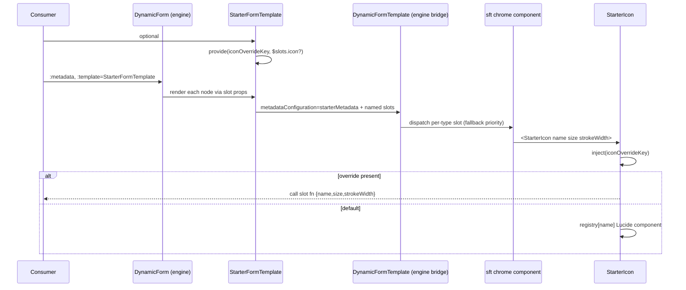

<!-- epic: optional. Set to the parent EPIC-XXX id when this feature belongs to an
     epic; leave "" for a standalone feature. Features are never nested under the
     epic folder, they only reference it here (flat model). -->


# Feature: A portable starter form template package

## Decided without Jeroen (research)

Settled from research during discussion, not reviewed by Jeroen individually. Override any of these freely.

- Finding 2 (icon slot only reachable via wrapper) → confirmed real, documentation-only clarification already written into the spec
- Finding 3 (deprecated Lucide aliases) → switched to canonical `CircleCheck`/`LoaderCircle`, catalog range capped `>=1 <2`
- Finding 5 (slot list accuracy) → confirmed accurate against engine source, already corrected in-place
- Finding 7 (prototype hardcodes colours) → no action needed, Decision A already explains the override
- Finding 8 (date stamp in ADR 2) → removed
- Open question 1 (Basic's `SectionCard`) → stays docs-local, package surface stays narrow
- Decision C (story prep, ST-03) → corrected: `ArrayField` keeps its count pill (`sft-pill`), lacking only the empty-state card; the original "no count pill" claim was a factual error against the ported component's own source

## Problem & goal

**Problem.** `docs/.vitepress/theme/components/AdvancedFormTemplate.vue` (and the roughly twenty presentational Vue components it composes: `ArrayField`, `ArraySectionCard`, `CheckboxField`, `ChoiceArraySectionCard`, `ChoiceCard`, `ChoiceField`, `ChoiceSectionCard`, `ErrorMessage`, `FormField`, `FormWizard`, `GroupField`, `OptionalRequiredTag`, `PasswordInput`, `PasswordStrengthBar`, `RepeaterCard`, `ReviewGroup`, `SectionCard`, `SelectInput`, `Stepper`, `SubmissionSuccess`, `TextInput`, `ToggleSwitch`, `AppButton`, `AppIcon`) is a genuinely good, full-coverage default skin for `DynamicFormTemplate`: it already covers every structural shape the engine supports (plain fields, groups, repeatable arrays, choices in both automatic and explicit mode, multi-step wizards), and it is what readers see live on every page under vue-dynamic-form.bach.software/examples/. But it only exists inside the docs site's own VitePress theme. Confirmed by reading the source:

- It is built with 190 Tailwind utility-class usages across 36 files (including `dark:` variants in 34 of them, and arbitrary-value overrides like `!px-3 !py-2`), with no stylesheet of its own. A consumer app without Tailwind configured gets unstyled markup.
- It lives under `docs/.vitepress/theme/components/`, wired into the VitePress theme rather than packaged as an installable unit; nothing outside `docs/` can `import` it today.
- Its only icon affordance, `AppIcon.vue`, is a hand-rolled, fixed enum of 12 SVG icons (`chevronLeft`, `chevronRight`, `check`, `bin`, `plus`, `bolt`, `users`, `grid`, `edit`, `checkCircle`, `spinner`, `refresh`), used by `ChoiceSectionCard` to decorate choice-field options (the `iconName` extended property). Twelve names is not "quite some icons" for pre-selecting a choice option's icon in a real project.

A library consumer who wants a working, good-looking, non-Element-Plus default today has exactly two options: hand-build a template from scratch against `DynamicFormTemplate`/`defineMetadata` (the documented but time-consuming path), or install `@bach.software/vue-dynamic-form-element-plus` and take on Element Plus as a dependency even if their project doesn't use it. There is no portable, framework-agnostic, Tailwind-free default.

**Goal.** Extract the Advanced template's components into a new, installable package following the same packaging shape FEAT-004 established for `@bach.software/vue-dynamic-form-element-plus`: a drop-in `template` for `DynamicForm` with full slot-family coverage, shipped CSS that needs no Tailwind (or any CSS framework) in the consumer app, plain semantic class names a consumer can override without specificity fights, and a materially larger, real icon library wired into choice-field icon pre-selection.

**Who this is for.**
- **Library consumers** starting a new project who want a working, styled form template without building one from scratch and without taking on Element Plus as a dependency.
- **Template authors** who want a well-structured, slot-complete starting point to override piece by piece (one control, one section) rather than starting from an empty `DynamicFormTemplate`.
- **Docs readers** who today can only read the Advanced template's source on GitHub; this makes it something they can actually `pnpm add`.

## Scope

### In scope

- A new workspace package under `packages/`, named `@bach.software/vue-dynamic-form-starter` (folder `packages/starter`), scaffolded the way `packages/element-plus` is: `package.json` using the shared `catalog:*` dependency groups, an `exports` map with `.` and a `./style.css` subpath, `private: true` until Jeroen has seen it work and explicitly flips it (same precedent FEAT-004 followed), the same `build`/`test`/`lint`/`typecheck`/`ci` script set, and a package README mirroring `packages/element-plus/README.md`'s shape (install, stylesheet import, bare usage, override pattern, icon usage, customization guidance).
- Porting `AdvancedFormTemplate.vue` and its supporting presentational components (the list above, confirmed from `docs/.vitepress/theme/components/`) into the new package's `src/` as the package's source of truth. The exact final component boundary (what moves, what stays docs-local, whether any component is split or merged) is for the architect; this scope item fixes the starting inventory, not the final file layout.
- Converting every Tailwind utility class in the ported components to plain, semantic CSS classes, shipped as an exported stylesheet (the same `./style.css` subpath pattern FEAT-004 built for the Element Plus package), so the package renders correctly with no Tailwind/PostCSS build step in a consumer app. The conversion must preserve existing behavior and not silently drop it: dark-mode variants (today's `dark:` classes), disabled/hover/focus states, and the responsive two-column field grid.
- Classes must be named so a consumer can override them by cascade (importing the stylesheet, then adding their own CSS with equal or higher specificity) without fighting Tailwind-style utility specificity or `!important`. The exact naming convention (BEM, a scoped prefix like the Element Plus package's `epft-`, CSS custom properties for themable values, or another scheme) is for the architect.
- Expanding the icon capability with **Lucide** (`lucide-vue-next`) as the default icon rendering, replacing today's 12-name hand-rolled `AppIcon` enum, while keeping a clear migration path for the existing `AppIconName` call sites (`ChoiceSectionCard`'s `icon` option, the docs examples that set `iconName`). The template exposes an **icon slot** so a consumer can swap the rendering entirely: slot props are `name` (string), `size` (number, default matching today's 16), and `strokeWidth` (number, default 2, matching the current hand-rolled stroke width). Color is deliberately not a slot prop; the default rendering uses `stroke="currentColor"` so color flows in from CSS and stays overridable by the consumer's stylesheet. The default rendering marks icons `aria-hidden="true"` (they are decorative next to text labels). Architecture constraint: resolving arbitrary string names to Lucide components at runtime would defeat tree-shaking and pull in the full catalogue, so the default implementation needs a bounded resolution strategy (for example a curated registry); the icon slot is the escape hatch that lets a consumer import exactly the Lucide icons they use, tree-shaken in their own bundle. The exact mechanism is for the architect.
- Dark-mode support is a v1 requirement (decided, was Open question 7). The converted stylesheet must preserve today's dark rendering; the exact plain-CSS mechanism (a `.dark` ancestor class the consumer toggles, `prefers-color-scheme`, or both) is for the architect, with the constraint that the dogfooding docs site toggles dark mode via VitePress's `.dark` class on `<html>`, so that case must keep working.
- Dogfooding (decided, was Open question 2): `docs/.vitepress`'s own Advanced example switches to consuming the new package, removing the duplicate local copy of the ported components. The rest of the docs theme keeps its own Tailwind usage.
- A Storybook playground page for the new template (decided, was Open question 5), mirroring what FEAT-004 added for the Element Plus template.
- Updating `specs/components.md` for the new package, consistent with how FEAT-004's `packages/element-plus` entry is tracked (first under "Non-published surfaces" while `private: true`, moved once published).

### Out of scope (explicit)

- No changes to `packages/core`'s engine, `DynamicFormTemplate`, or the `defineMetadata` runtime contract. This feature is a template-layer consumer of the existing slot contract described in `CLAUDE.md`, the same boundary FEAT-004 kept.
- No work on `BasicFormTemplate.vue` (docs' simpler, non-Advanced template). Decided (was Open question 4): this package covers the Advanced template only; the other docs templates stay docs-local as examples.
- No CLI scaffolding tool (a `create-vue-dynamic-form`-style project generator). Jeroen's "starter" framing is about an importable template package, the same shape as `packages/element-plus`, not a cloneable/scaffoldable project. A generator is a materially different deliverable.
- No new validation rules, XSD facet work, or engine-level metadata additions; this feature is presentation only.
- No change to the rest of the VitePress theme's own Tailwind usage (site chrome, nav, non-form pages); only the form template components in scope above are converted.
- No icon license/attribution footer work: Lucide is permissively licensed (ISC) and needs no attribution UI.

## Functional overview

- A library consumer installs the new package alongside `@bach.software/vue-dynamic-form`, `vue`, and `vee-validate` (final peer list for the architect), imports the exported stylesheet once, and gets a fully styled default template covering every structural shape `DynamicFormTemplate` exposes, rendering the same way the published Advanced example already does, with no Tailwind build step required.
- A template author overrides one slot at a time (say, swap the text input for their own component) the same way any `DynamicFormTemplate`-based template is overridden, and restyles any part of the default rendering by adding their own CSS rules on top of the shipped stylesheet, without needing Tailwind configured or fighting utility-class specificity.
- A template author decorating choice-field options with icons (the "pick a plan"-style card UI already in the docs example) chooses from Lucide's catalogue through the default rendering, or supplies any icon component they like via the icon slot (`name`, `size`, `strokeWidth` slot props). Like any slot override, `#icon` is supplied on a wrapper component around `StarterFormTemplate`, not on `DynamicForm` directly, the same pattern documented for `@bach.software/vue-dynamic-form-element-plus`.
- Docs readers keep seeing the same Advanced example on the published site, now powered by the new package itself (the docs site is the package's first consumer).

## Design (feature level)

**Prototype:** [`prototype.html`](./prototype.html) in this folder. Single self-contained file, no build step, opens in any browser. Fixed top-right button toggles `.dark` on `<html>` exactly as VitePress does. Every section is wrapped in an element with a stable anchor id so stories can deep-link their slice: `#buttons`, `#text-field`, `#select-field`, `#switch-field`, `#password-field`, `#group`, `#array-empty`, `#array-filled`, `#choice-explicit`, `#choice-auto`, `#choice-array`, `#wizard`, `#review`, `#success`, `#icons`.

This feature does not invent a new look. The prototype reproduces the visual language already live under vue-dynamic-form.bach.software/examples/ (the Advanced template and its ~20 presentational components), with exactly two deliberate changes: the styling is expressed as plain prefixed CSS classes instead of Tailwind utilities, and choice-card icons come from the Lucide catalogue instead of the hand-rolled 12-name `AppIcon` enum. The architect and developer should treat the existing docs components (`docs/.vitepress/theme/components/`) as the behavioural source of truth and this prototype as the visual target; where they disagree, the existing components win on behaviour and this document calls out the handful of visual decisions.

### What the design is (so it can be built from text alone)

**Class naming and override model.** Every package class is prefixed `sft-` (starter-form-template), mirroring the Element Plus package's `epft-` convention (FEAT-004). Classes are semantic and low-specificity (single class selectors, no `!important`, no utility stacks), so a consumer imports `./style.css` and overrides any rule by adding their own CSS of equal or higher specificity without a specificity fight. State is expressed with `is-*` modifier classes on the same element (`is-invalid`, `is-disabled`, `is-selected`, `is-on`, `is-done`, `is-current`, `is-pending`), never by toggling between two unrelated class strings the way the Tailwind source does. The responsive two-column field grid is `.sft-grid` (one column, two at `min-width: 768px`); a full-width field adds `.sft-col-span` (the Tailwind `md:col-span-2`). Array/group item containers add `.sft-hide-tag` to suppress the per-field optional/required marker, matching today's `hide-optional-required`.

**Theming and dark mode.** Theme-carrying values are CSS custom properties defined once on `.sft-root` (the template's outer element) and re-declared under a `.dark .sft-root` ancestor selector. This is the recommended mechanism for the architect: it keeps the entire dark skin in one block, it works unchanged when VitePress toggles `.dark` on `<html>` (the dogfooding constraint), and it keeps dark mode "mostly free" because almost no rule needs a dark-specific duplicate. The prototype demonstrates the full variable set (surfaces, text, inputs, the sky primary/focus accent, the indigo choice accent, danger reds/roses, success emerald). A consumer can retheme the whole template by overriding these variables alone. The architect may instead choose a `.dark`-only or dual `prefers-color-scheme` mechanism, but the VitePress `.dark`-ancestor case must keep working, so the ancestor-class approach is the safe default and what the prototype ships.

**States policy (one policy, applied everywhere).** Inputs: `pristine` is the resting gray border with no message; `invalid` adds a red (light) / rose (dark) border plus one error line below via `.sft-error`; `valid` is a filled value with no error and deliberately has NO green success state (the design signals validity by the absence of an error, matching the source). `focus` adds a 3px sky ring, a 3px rose ring when invalid. `disabled` dims the whole field to 60% opacity and greys the control. Loading lives in exactly one place in this feature, the submission-success timeline's in-progress item (a spinning loader glyph); there is no per-field loading spinner. Empty state is the dashed `.sft-empty` card used by repeatable arrays (icon, title, hint, primary Add button). Error state exists at field level (`.sft-error` under the control) and at section level (`.sft-error` in the section header, e.g. an array below its minimum). These are all shown in the prototype in both modes.

**Icons (the one genuinely new capability).** The default rendering draws Lucide glyphs. Default props: `size` 16, `strokeWidth` 2, `stroke="currentColor"` (so color flows from CSS and is never a slot prop), `aria-hidden="true"` (decorative next to text). The template exposes an icon slot whose slot props are exactly `name` (string), `size` (number), `strokeWidth` (number), letting a consumer render any icon component instead and import only the Lucide icons they use (tree-shaken in their own bundle). The architect must give the default rendering a bounded name-to-component resolution (for example a curated registry keyed by name), because resolving arbitrary strings against the full Lucide export would defeat tree-shaking. The prototype's `#icons` section shows the registry's starting set: the original 12 names carried over (the old `AppIcon` already drew Lucide glyphs stroke-for-stroke, so `bin`->`trash`, `bolt`->`zap`, `edit`->`pencil`, `spinner`->`loader`, `refresh`->`refreshCw`), plus a sample of the materially larger catalogue a consumer can now pre-select for choice cards (`building2`, `rocket`, `calendar`, `briefcase`, `shield`, `sparkles`). The exact registry contents and the `AppIconName`->Lucide-name migration map are the architect's to finalise; the slot contract and defaults above are fixed by this design.

### Component / pattern mapping

Each prototype section maps one-to-one onto an existing docs component. The developer ports the component and swaps its Tailwind for the named `sft-` classes; no structural redesign.

| Prototype section (anchor) | Existing component | `sft-` classes introduced |
| --- | --- | --- |
| `#buttons` | `AppButton` | `sft-btn` + `sft-btn-{default,primary,danger,danger-light,ghost}` |
| `#text-field` | `FormField` + `TextInput`, `OptionalRequiredTag`, `ErrorMessage` | `sft-field`, `sft-field-label`, `sft-field-desc`, `sft-field-control-row`, `sft-input`, `sft-tag-optional`, `sft-tag-required`, `sft-error`, `sft-dependent` |
| `#select-field` | `SelectInput` | `sft-select` |
| `#switch-field` | `CheckboxField` + `ToggleSwitch` | `sft-switch-field`, `sft-switch` (+ `sft-switch-track`, `sft-switch-thumb`) |
| `#password-field` | `PasswordInput` + `PasswordStrengthBar` | `sft-password`, `sft-password-toggle`, `sft-strength` (+ `-track`, `-seg`, `-label` with tier modifiers) |
| `#group` | `GroupField` | `sft-choice-group-title`, `sft-choice-group-body` (shared grid), `sft-hide-tag` |
| `#array-empty` / `#array-filled` | `ArraySectionCard` + `RepeaterCard` (and `ArrayField`, the lighter variant) | `sft-section` (+ `-header`, `-title`, `-desc`), `sft-pill`, `sft-grid`, `sft-col-span`, `sft-empty` (+ `-icon`, `-title`, `-hint`), `sft-repeater` (+ `-header`, `-title-group`, `-badge`, `-title`), `sft-array-footer` |
| `#choice-explicit` | `ChoiceSectionCard` + `ChoiceCard` | `sft-choice-grid`, `sft-choice-card` (+ `is-selected`), `sft-choice-body`, `sft-choice-radio` (+ `-dot`), `sft-choice-text`, `sft-choice-title-row`, `sft-choice-icon`, `sft-choice-title`, `sft-choice-desc` |
| `#choice-auto` | `ChoiceField` | `sft-choice-group` (+ `-title`, `-desc`, `-body`) |
| `#choice-array` | `ChoiceArraySectionCard` | `sft-choice-addbar` (+ `-item`, `-reason`), reuses `sft-pill` and `sft-repeater` |
| `#wizard` | `FormWizard` + `Stepper` | `sft-wizard-head` (+ `-eyebrow`, `-title`), `sft-stepper`, `sft-step` (+ `is-done`, `is-current`, `-dot`, `-label`, `-connector`), `sft-wizard-footer` (+ `-helper`) |
| `#review` | `ReviewGroup` + the summary-page confirmation banner | `sft-review-group` (+ `-header`, `-title`, `-list`, `-row`, `-key`, `-val`), `sft-confirm` (+ `-strong`) |
| `#success` | `SubmissionSuccess` | `sft-success-hero` (+ `-badge`, `-title`, `-ref`), `sft-timeline` (+ `-title`, `-dot`), `sft-spin`, `sft-success-actions` |
| `#icons` | `AppIcon` (replaced) | `sft-icon` rendering via Lucide registry + icon slot; `sft-spin` for the loader glyph |

No genuinely new component is needed: the inventory is the existing one, re-skinned. The one new primitive is the Lucide-backed icon renderer that replaces `AppIcon`, covered above.

### Dark mode sign-off

The whole prototype was walked in both modes. Sections that need no dark-specific styling because they are purely structural (grids, spacing, flex rows: `sft-grid`, `sft-field-control-row`, `sft-wizard-footer`, `sft-success-actions`) are intentionally silent on dark. Everything that carries colour flips through the `.dark .sft-root` variable block. Three spots are faithful ports of source that has NO dark variant and therefore stay light-coloured in dark mode: the indigo accent pills (`sft-pill`, `sft-repeater-badge`), the emerald review confirmation banner (`sft-confirm`), and the emerald submission-success badge circle (`sft-success-badge`). The pills read fine as colour chips on a dark card; the two emerald blocks look light-on-dark and are **flagged for the architect** to decide whether to add dark variants (a visual improvement over today) or preserve today's exact rendering (the stricter reading of "preserve today's dark rendering"). The resting input border also stays light-gray in dark mode for the same faithful-port reason, noted in the prototype.

## Architecture (feature level)

### Shape of the whole feature

This is a template-layer package, a second sibling to `packages/element-plus`. It consumes the existing `DynamicFormTemplate` slot contract and `defineMetadata` type carrier unchanged; `packages/core/src/` is not touched. The work is an extraction plus a re-skin: lift the Advanced template and its presentational components out of `docs/.vitepress/theme/components/`, swap their Tailwind utilities for the prototype's prefixed `sft-` CSS, replace the hand-rolled `AppIcon` with a Lucide-backed icon primitive plus an icon slot, ship one stylesheet, and make the docs site consume the package instead of its local copies.

The engine already does all the structural dispatch (array / choice / wizard / parent / input detection, path handling, validation wiring). Nothing in this feature re-implements any of that; every component below is a pure presentational slot target or a composition of them.

### Package scaffold and build (mirror `packages/element-plus` exactly)

New workspace package `packages/starter`, npm name `@bach.software/vue-dynamic-form-starter`, `private: true`.

- `package.json`: copy the element-plus shape verbatim, changing only name/description/keywords. Same `exports` map (`.` with `types`/`import`/`require`, plus `./style.css`), same `main`/`module`/`types`/`files`, same `publishConfig.access: public`, same script set (`build` = `rm -rf dist && vite build && vue-tsc -p tsconfig.build.json --emitDeclarationOnly && tsc-alias -p tsconfig.build.json`, plus `build:watch`, `typecheck`, `lint`(+`:fix`), `test`, `ci`/`ci:test`/`ci:test:coverage`/`ci:lint`/`ci:typecheck`).
- `peerDependencies`: `@bach.software/vue-dynamic-form` (`catalog:framework`), `vee-validate` (`catalog:framework`), `vue` (`catalog:framework`). No `element-plus`. This matches the spec's stated consumer install set (core + vue + vee-validate only).
- `dependencies`: `@lucide/vue` (NOT a peer, NOT external in the bundle; see ADR 1). A new catalog entry `framework` or a dedicated pin is added for it in `pnpm-workspace.yaml` (recommend `catalog:framework` with a `>=1 <2` range, capped below the next major since this package is bundled into `dist` rather than externalized; see ADR 1).
- `devDependencies`: same list as element-plus (`@antfu/eslint-config`, workspace core, `@types/node`, `@vitejs/plugin-vue`, `@vitest/coverage-v8`, `@vue/test-utils`, `eslint`, `eslint-plugin-format`, `jsdom`, `tsc-alias`, `typescript`, `vee-validate`, `vite`, `vitest`, `vue`, `vue-tsc`) plus `@lucide/vue` (so tests and typecheck resolve it; even though it is also a runtime dependency, listing it is harmless and keeps the intent explicit).
- `vite.config.ts`: copy element-plus's config, change `lib.name` to `VueDynamicFormStarter`, `fileName` to `vue-dynamic-form-starter.${format}.js`, keep `cssCodeSplit: false` and `cssFileName: 'style'` so the one stylesheet builds to `dist/style.css`. `rollupOptions.external` = `['vue', 'vee-validate', '@bach.software/vue-dynamic-form']` only; `@lucide/vue` is deliberately absent so its referenced icons bundle into dist and tree-shake to the registry set.
- `tsconfig.json` / `tsconfig.build.json` / `src/tests/test-setup.ts` / `vite-env.d.ts`: copy element-plus's, adjusting only paths. `test-setup.ts` keeps `enableAutoUnmount(afterEach)`.
- Root `eslint.config.js`: add `packages/starter/**/*.vue` to the existing hyphenation-off override block (the block already lists `docs`, `packages/element-plus`, `playgrounds/storybook`). This is a root-config edit, no changeset. See the in-flight coordination note below, because that same file is mid-edit on this branch.

### Component / composable plan (against `specs/components.md`)

No core composable or component changes. No new engine shape. Everything is a presentational component inside the new package. Classification of the ported inventory:

**Reused as-is in behaviour, re-skinned (Tailwind to `sft-`), renamed into the package:**
- `AdvancedFormTemplate.vue` to `StarterFormTemplate.vue` (the single exported template; its `defineMetadata<...>()` call carries over unchanged in type content, see Public API).
- The slot-rendered chrome: `FormField`, `TextInput`, `SelectInput`, `CheckboxField`, `ToggleSwitch`, `PasswordInput`, `PasswordStrengthBar`, `GroupField`, `SectionCard`, `ArrayField`, `ArraySectionCard`, `RepeaterCard`, `ChoiceField`, `ChoiceCard`, `ChoiceSectionCard`, `ChoiceArraySectionCard`, `FormWizard`, `Stepper`, `ReviewGroup`, `OptionalRequiredTag`, `ErrorMessage`, `AppButton`. These stay internal to the package (not exported); they are implementation detail of the template's slots, exactly as they are implementation detail of the docs theme today.
- `SubmissionSuccess` and `ReviewGroup`: these two are additionally **exported** as standalone presentational components (with their `TimelineItem` and `Props` types), because the docs demo pages import them directly (`FormExampleWizard`, `FormExampleClientOnboardingPlanner`) and dogfooding removes the local copies, so the package must provide them. `SubmissionSuccess` is a post-submit screen the engine never dispatches to; it is a consumer-composed extra, documented as such. `ReviewGroup` is rendered by the template's `wizardSummaryPage` slot AND consumed directly for its `Props` type, so it is exported too.

**Genuinely new (one primitive):**
- `StarterIcon.vue`, the Lucide-backed icon renderer that replaces `AppIcon.vue`. Justification: nothing in `specs/components.md` or the ported set provides a bounded, tree-shakeable, slot-overridable icon primitive; `AppIcon` was a fixed 12-name hand-rolled enum. This is the one new capability the feature adds, called out in Scope and the Design. Exported (component + `StarterIconName` type + the registry name list).

**Renamed-only (no behaviour change) exported type carriers mirroring element-plus:**
- `starterMetadata` (the built-in `defineMetadata<StarterValueTypes, StarterFieldProperties, StarterSlotProperties, StarterSettingsProperties>()` instance) and `extendMetadata<...>()` (same Omit-and-merge helper as element-plus's), with `StarterValueTypes` / `StarterFieldProperties` exported.

**Not ported (stay docs-local):**
- `AdvancedForm.vue` (the `<form>` wrapper that bakes in English default validation messages) stays docs-local as a thin wrapper that now imports `StarterFormTemplate` from the package. It is demo glue, not a ported presentational component; element-plus likewise ships no form wrapper and documents writing your own. This is the honest reading of "remove the duplicate local copies of the ported components": the presentational components are removed, the demo's own form-composition wrapper is rewired.
- `BasicFormTemplate.vue`, `BasicForm*`, all `FormExample*` pages: out of scope per the spec; they stay docs-local (and `BasicFormTemplate` keeps its own `SectionCard` usage, so note that the docs theme retains a `SectionCard` for Basic even after the Advanced copies are deleted, unless Basic is also rewired to the package export; see Open question 1).

### Public API impact (the section that matters most)

This package has no effect on `@bach.software/vue-dynamic-form`'s published surface. No core export, prop, slot, `defineMetadata` generic, or validation rule changes. The engine slot contract and `defineMetadata` are consumed, not extended.

New public surface, all on the new (private) package `@bach.software/vue-dynamic-form-starter`:

| Export | Kind | Notes |
| --- | --- | --- |
| `StarterFormTemplate` | component | The template. Generic over its optional `metadataConfiguration` prop (default `starterMetadata`); like element-plus, passing it directly as `DynamicForm`'s `:template` needs the `DefineComponent<object, object, any>` cast, a wrapper needs none. |
| `starterMetadata` | type carrier | The built-in catalogue, default `metadataConfiguration`. |
| `extendMetadata` | function (type carrier) | Same Omit-and-merge shape as element-plus; `<ExtraValueTypes, ExtraFieldProperties, ExtraSlotProperties, ExtraSettingsProperties>`, all optional, consumer wins on collision. |
| `StarterValueTypes`, `StarterFieldProperties` | types | Generic bodies behind `starterMetadata`. |
| `StarterIcon` | component | Props `name: StarterIconName`, `size?: number` (default 16), `strokeWidth?: number` (default 2). Renders a Lucide glyph via the bounded registry, `stroke="currentColor"`, `aria-hidden="true"`. |
| `StarterIconName` | type | Union of the registry's names (see icon section). |
| `starterIconNames` | value | The ordered name list (for the Storybook catalogue and consumer discovery). |
| `SubmissionSuccess`, `ReviewGroup` | components | Standalone presentational extras; `TimelineItem` and the `ReviewGroup` props type exported alongside. |
| `FieldMetadata`, `GetMetadataType`, `GetDynamicFormSettingsType`, `MetadataConfiguration` | re-exported types from core | For convenience, mirroring element-plus. |
| `@bach.software/vue-dynamic-form-starter/style.css` | stylesheet subpath | The one shipped stylesheet (`dist/style.css`). |

`defineMetadata` generics carried by `starterMetadata` (lifted verbatim from `AdvancedFormTemplate.vue`'s `defineMetadata` call, types unchanged):
- `StarterValueTypes`: `{ wizardSummaryPage: never; heading: never; text: string; select: string; checkbox: boolean | undefined; password: string }`.
- `StarterFieldProperties`: `description`, `helpText`, `arrayItemName`, `arrayItemNamePlural`, `arrayItemFieldForTitle`, `arrayNoItemsMessage`, `choiceShowChoiceSelect`, `iconName` (type changes from `AppIconName` to `StarterIconName`, see ADR 2), `dependentOnMessage`, `placeholder`, `options`, `fullWidth`, `disabled`, `hide`, `showStrengthBar`, `falseAsUndefined`, `wizardSummary`, `wizardSummaryConfirmation`, `submitButtonText`.
- `StarterSlotProperties`: `{ gotoStep?: (index: number, options?: WizardGotoStepOptions) => Promise<void> | void }`.
- `StarterSettingsProperties`: `{ showRequiredOrOptional?: 'optional' | 'required' }`.

**Slots.** The template exposes exactly the engine slot families it wires today (`default`, `default-input`, `default-choice`, `default-choice-array-item`, `default-array`, `heading`, `heading-choice`, `heading-choice-array`, `heading-array`, `heading-array-item`, `checkbox`, `checkbox-input`, `select-input`, `password-input`, `default-wizard`, `default-wizard-page`, `wizardSummaryPage`), plus one new non-engine slot: `#icon`, a scoped slot whose props are exactly `{ name: string, size: number, strokeWidth: number }` (fixed by the Design). Supplying `#icon` replaces every glyph the template renders (see icon architecture). Omitting it uses the Lucide default. New optional slot with a safe default: backwards-compatible by construction.

> **DECIDED (research) - corrects should-fix 5.** Confirmed against `AdvancedFormTemplate.vue` directly: it wires `checkbox-input` (line 335, the `ToggleSwitch` input slot) and has no `default-array-item` template, only `heading-array-item` and `default-choice-array-item`. The list above is already the corrected set. The README seeded from this section must carry it. No product call here, this was a factual error in a first draft.

> **DECIDED (research) - clarifies should-fix 2.** Confirmed against `DynamicForm.vue` and `DynamicFormItem.vue`: `DynamicForm` forwards only the engine's render to the template, never a consumer's own slots, so `#icon` is not reachable through the bare `<DynamicForm :template="StarterFormTemplate" />` usage. Supplying `#icon` (like any slot override) requires the wrapper pattern `packages/element-plus/README.md` documents: the consumer writes a component that renders `<StarterFormTemplate><template #icon="{ name, size, strokeWidth }">...</template></StarterFormTemplate>` and passes that wrapper as `:template`. The icon `provide`/`inject` (ADR 3) works in exactly that case. This is the existing, already-documented slot-override mechanism applying as-is, not a new constraint, so it needed no product call; state it in both the Functional overview and the package README so consumers do not expect to pass `#icon` directly to `DynamicForm`.

**Backwards-compatibility and changeset bump.**
- Published core library: untouched. No changeset for `packages/core`.
- The new package is `private: true` and ships no changeset while private (FEAT-004 precedent). When Jeroen later flips it public, that first publish gets its own changeset in the same style as element-plus's eventual one.
- `docs/` and `playgrounds/storybook/` are not published: no changeset for the dogfooding or Storybook work.
- The in-flight modified files in `git status` (`docs/package.json`, `docs/pnpm-lock.yaml`, `eslint.config.js`, `packages/core/package.json`, `packages/core/vite.config.ts`, `packages/element-plus/*`) are FEAT-004 element-plus work on this same branch (`feature/004-element-plus-form-template`), not FEAT-007. None of it is a published-surface change that FEAT-007 introduces. FEAT-007 must not revert or restyle those; it layers on top (its own new `packages/starter`, its own additions to `docs/package.json` and `eslint.config.js`). Net: **no changeset is required for FEAT-007** as specified. (`packages/element-plus` is private, so even its in-flight changes need none; that is FEAT-004's concern regardless.)

### The three flagged decisions

**Decision A: dark-mode gaps (indigo pills, emerald confirm banner, emerald success badge, resting input border).** Preserve today's exact rendering in v1; do NOT add new dark variants. The spec's binding, repeated instruction is "preserve today's dark rendering" and "this feature does not invent a new look"; adding variants is a visual improvement that is a faithful-extraction violation, so it is deferred. To make the gap a one-line fix later (and consumer-overridable now), the three color spots are expressed as CSS custom properties on `.sft-root` rather than hardcoded literals: add `--sft-confirm-bg`/`--sft-confirm-border`/`--sft-confirm-text` and `--sft-success-badge-bg`/`--sft-success-badge-text` to join the already-variable `--sft-pill-bg`/`--sft-pill-text`. v1 leaves their `.dark .sft-root` values equal to light (exact current rendering); a future improvement, or a consumer, sets dark values by overriding those variables alone, touching no rules. The resting input border stays variable-driven too (`--sft-input-border` with no dark override), matching the prototype's note. This honours the literal instruction while removing the cost of ever closing the gap.

**Decision B: icon registry strategy.** A curated, static name-to-component map, not runtime string resolution. `StarterIcon.vue` statically imports a bounded set of Lucide components by their PascalCase named exports from `@lucide/vue` and holds them in a plain object keyed by the stable `sft` name:

```
import { ChevronLeft, ChevronRight, Check, Trash2, Plus, Zap, Users, LayoutGrid, Pencil, CircleCheck, LoaderCircle, RefreshCw, Eye, EyeOff, Building2, Rocket, Calendar, Briefcase, Shield, Sparkles } from '@lucide/vue';
const registry = { chevronLeft: ChevronLeft, chevronRight: ChevronRight, check: Check, trash: Trash2, plus: Plus, zap: Zap, users: Users, grid: LayoutGrid, pencil: Pencil, checkCircle: CircleCheck, loader: LoaderCircle, refreshCw: RefreshCw, eye: Eye, eyeOff: EyeOff, building2: Building2, rocket: Rocket, calendar: Calendar, briefcase: Briefcase, shield: Shield, sparkles: Sparkles } as const;
```

Because the imports are static named bindings, the package bundle includes only these components and tree-shaking drops the rest of the Lucide catalogue. `StarterIconName = keyof typeof registry`. The exact Lucide component chosen per name is a developer-level detail (for example `grid` maps to `LayoutGrid`, the 2x2-square glyph the old `AppIcon` drew); the name set and the migration map are fixed here. The `#icon` slot is the unbounded escape hatch: a consumer who needs a glyph outside the registry supplies `#icon` and imports exactly the icons they use, tree-shaken in their own bundle. `eye`/`eyeOff` are added so `PasswordInput`'s show/hide toggle routes through the one icon pipeline too, so the `#icon` slot genuinely covers every glyph the template draws. See ADR 1 for the `@lucide/vue` vs `lucide-vue-next` package identity, and Open question 2.

> **DECIDED (research) - resolves should-fix 3.** Applied above: Decision B now imports the canonical `CircleCheck` (the plain circle-with-check glyph `AppIcon` drew, not the arc-style `CircleCheckBig`) and `LoaderCircle` (the partial-ring spinner) instead of the deprecated `CheckCircle2`/`Loader2` aliases, and the catalog range is capped `>=1 <2` rather than open-ended `>=1.0.0`. Why: `CheckCircle2` and `Loader2` are Lucide v1 aliases flagged for removal in a future major; since `@lucide/vue` bundles into `dist` at our build time (ADR 1), an open-ended range risks a routine lockfile bump silently breaking our own build. This is a pure implementation detail: the stable `sft` names (`checkCircle`, `loader`) are our own public surface and stay unchanged regardless of which Lucide export backs them, so it needed no product call. The developer should still confirm the exact glyph match against the installed `@lucide/vue` version at implementation time.

> **DECIDED (Jeroen): route the password toggle through Lucide, resolves should-fix 4.** `PasswordInput` renders its show/hide glyph through `StarterIcon` with Lucide `Eye`/`EyeOff` (already in the registry per Decision B), so `#icon` genuinely covers every glyph the template draws with no documented exception. This is a deliberate, small, reviewed visual change from today's inline Heroicons eye; the developer updates the prototype's `#password-field` section to show the Lucide eye so the change is visible in the one place a reader would compare against.

**Decision C: `ArrayField` vs `ArraySectionCard`.** Port both; keep the two-slot wiring. They are not two skins of one thing: `ArrayField` is wired to `#default-array` (inline arrays of non-heading nodes, lighter chrome: label, description, an item-count pill, add button, no empty-state card) and `ArraySectionCard` is wired to `#heading-array` (arrays declared as `heading` sections, richer chrome: count pill, dashed empty-state card, add-another, each item through `RepeaterCard`). Consolidating would change which chrome a non-heading `default-array` array receives, a behaviour change the spec forbids. The prototype only visualises the richer `ArraySectionCard` + `RepeaterCard` path because that is the one the onboarding demo exercises; `ArrayField` remains the preserved fallback. Migration note for the developer: `ArrayField` reuses `sft-section`/`sft-section-header`/`sft-grid`/`sft-array-footer`/`sft-pill` minus `sft-empty` only; `ArraySectionCard` uses the full set including `sft-pill` and `sft-empty`.

> **DECIDED (research, story prep): corrects an earlier draft that said `ArrayField` has no count pill.** `docs/.vitepress/theme/components/ArrayField.vue` (the behavioural source of truth per the Design section) renders an item-count pill identical in styling to `sft-pill`; it only lacks the dashed empty-state card. This is a factual correction verified directly against the ported component's source, not a design change, and it follows the Design section's own stated rule that the existing docs components win on behaviour where this spec's prose disagrees with them.

No slot-usage change in `StarterFormTemplate` relative to today's `AdvancedFormTemplate`.

### Icon architecture: how one slot swaps every glyph

The glyphs live deep in the tree (inside `ChoiceCard`, `FormWizard`, `AppButton` uses, `SubmissionSuccess`, `RepeaterCard`, `ArraySectionCard`), not at the template's top level, so the `#icon` slot is threaded down with `provide`/`inject`:

- `StarterFormTemplate` captures its own `$slots.icon` (if supplied) and `provide()`s it under an internal `Symbol` key (not exported; the public contract is the slot, not the key).
- `StarterIcon` injects that optional override. If present, it calls the override as a render function with `{ name, size, strokeWidth }` and renders whatever the consumer returned. If absent, it renders `registry[name]` (the Lucide component) with `:size`, `:stroke-width` (Lucide's `strokeWidth` prop), `stroke="currentColor"` inherited, `aria-hidden="true"`.
- A name missing from the registry with no override is a dev-mode `console.warn` and renders nothing (fail-soft, never throws in a form).

`SubmissionSuccess` and `ReviewGroup`, used standalone outside the template, render their icons through `StarterIcon` with no injected override, so they always get the Lucide default (there is no template above them to provide a slot); that is acceptable because they are post-submit/summary chrome, and a consumer wanting custom icons there composes their own.

### Styling and theming architecture

- One plain CSS file, no Tailwind/PostCSS, built via Vite's `cssCodeSplit: false` + `cssFileName: 'style'` to `dist/style.css`, exported as the `./style.css` subpath. The `sft-` prototype stylesheet is the source of truth for class names and values.
- Theme-carrying values are CSS custom properties declared on `:root`/`html`, re-declared under `:root.dark`/`html.dark` (see the resolution below; the template has no single outer element to carry a scoping class). VitePress toggling `.dark` on `<html>` flows through this unchanged (the dogfooding constraint).

  > **Resolved (blocker 1 and should-fix 6).** There is no single "template outer element" to carry `sft-root`: the engine instantiates `StarterFormTemplate` once per node and `DynamicFormTemplate` renders no host element (confirmed in `DynamicForm.vue` and `DynamicFormTemplate.vue`), and wrapping each per-node render in a `sft-root` div breaks `.sft-grid`/`sft-col-span`. Pick one implementable carrier instead:
  > - **(a) Document-root scope (recommended).** Declare the variables on `:root` (or `html`) and the dark overrides under `:root.dark` / `html.dark`, with every `sft-*` rule reading them. No wrapper is needed, the VitePress `.dark`-on-`<html>` toggle works directly, and the exported `SubmissionSuccess`/`ReviewGroup` are themed wherever they render (closes finding 6). The prefix keeps the global names collision-safe; the consumer retheme story becomes "override the `:root` `--sft-*` variables".
  > - **(b) Consumer-applied `sft-root`.** Document that the consumer puts `class="sft-root"` on the element wrapping their `<DynamicForm>` (and the dogfooding `AdvancedForm.vue` wrapper does so), matching the prototype where each section carries `sft-root`. Then `.dark .sft-root` works and fields inherit the variables. This leaves finding 6 needing an extra line: the two standalone extras must also be wrapped in a `sft-root` element when used outside the form.
  >
  > **DECIDED (Jeroen): option (a), document-root scope.** Variables are declared on `:root`/`html`, dark overrides under `:root.dark`/`html.dark`. No consumer action needed, VitePress's existing `.dark`-on-`<html>` toggle works unchanged, and the standalone `SubmissionSuccess`/`ReviewGroup` exports are themed wherever they render, which also closes finding 6. Drop the "template's outer element carries `sft-root`" wording from the Design and Architecture text above, it is not achievable with the current engine and is superseded by this decision. Low-specificity single-class selectors, no `!important`, no utility stacks, so a consumer overrides by importing `style.css` then adding equal-or-higher-specificity rules. `is-*` modifier classes carry state (`is-invalid`, `is-disabled`, `is-selected`, `is-on`, `is-done`, `is-current`, `is-pending`). `sft-hide-tag` suppresses the per-field optional/required marker inside array/group items. The responsive grid is `sft-grid` (one column, two at `min-width: 768px`) with `sft-col-span` for full-width fields.
- The Vue components must NOT use `<style scoped>` for these classes (scoping would add a data-attribute and raise specificity, defeating override-by-cascade). All `sft-` rules live in the single shipped stylesheet; components only set class names. A test mirrors element-plus's `noTailwind`/`layoutClasses`/`stylesheetExport` tests: assert no Tailwind utility class names survive in the ported `.vue` files and that every `sft-` class the components reference exists in the stylesheet.

### Data flow

State ownership is unchanged from the current Advanced template because the engine owns it:
- Field values, validation, touched state: vee-validate via the engine (`DynamicFormItem` registers each field). The template components are pure props-in / events-out against the slot props the engine hands them.
- Settings (`showRequiredOrOptional`, message overrides): the engine's existing `provide`/`inject` of the settings `ComputedRef`. The template reads `settings.showRequiredOrOptional` from its slot props exactly as today.
- Local component state only: `PasswordInput` show/hide `ref`, `SubmissionSuccess` show-JSON `ref`, wizard step index (owned by the engine's `DynamicFormItemWizard`, surfaced as slot props). No new provide/inject except the internal icon-override key.
- Path handling, reactivity (`combinedValidation` watchEffect, `computedProps` loop guards, render counts): all inside the engine, untouched. The `analytics` setting's render-count test ids keep working because they are emitted by `DynamicFormItem`, not the template.



### ADR notes

**ADR 1: bundle `@lucide/vue` as a dependency, do not externalize.** Context: icons must render out of the box with the spec's stated install set (core + vue + vee-validate only), yet tree-shaking must not pull the full catalogue. Decision: add `@lucide/vue` as a regular `dependency` and leave it out of `rollupOptions.external`, so the ~20 statically-imported registry icons bundle into `dist` and tree-shake there (pinned `>=1 <2`, capped below the next major so a routine lockfile bump cannot silently remove an icon our registry depends on); the `#icon` slot is the escape hatch for anything else. Alternative considered: make it a `peerDependency` like `element-plus`. Rejected because element-plus is a framework the consumer explicitly opts into, whereas Lucide here is an internal rendering detail of our default skin; forcing a consumer to install it contradicts the spec's "installs alongside core, vue, vee-validate" line. The bundled cost is a handful of small SVG-path render functions, acceptable for a drop-in default.

**ADR 2: use `@lucide/vue`, not `lucide-vue-next`.** Context: the spec's Resolved decision 3 names `lucide-vue-next`. Verified against the official Lucide docs: in Lucide Version 1 the Vue package was renamed from `lucide-vue-next` to `@lucide/vue`, and `lucide-vue-next` is now deprecated and points at `@lucide/vue`. Same ISC license, same tree-shakeable standalone PascalCase icon components, same `size`/`stroke-width` props, Vue 3. Decision: depend on `@lucide/vue`. Alternative considered: honour the literal `lucide-vue-next` string. Rejected because it is a deprecated alias of the same library; shipping a deprecated dependency to consumers is worse than using the maintained name, and the product decision (Lucide) is unchanged. This is a packaging-identity update, not a product change, but because it diverges from a literally recorded Jeroen decision it is also raised as Open question 2 for a one-line confirmation.

**ADR 3: icon swap via provide/inject of the `#icon` slot, not per-component props.** Context: glyphs are scattered deep in the chrome; the Design fixes a single `#icon` slot with `{name,size,strokeWidth}`. Decision: `StarterFormTemplate` provides its captured `$slots.icon` under an internal Symbol; `StarterIcon` injects and prefers it, else the registry. Alternative considered: thread an icon-renderer prop through every intermediate component. Rejected as invasive and fragile (every new chrome component would have to re-forward it); provide/inject keeps the override a single top-level concern.

**ADR 4: keep the ported chrome components internal, export only the template, the icon, the two standalone extras, and the type carriers.** Context: the docs theme has ~20 components; over-exporting them all freezes a large private surface as public API. Decision: export `StarterFormTemplate`, `starterMetadata`/`extendMetadata`, `StarterValueTypes`/`StarterFieldProperties`, `StarterIcon`/`StarterIconName`/`starterIconNames`, and `SubmissionSuccess`/`ReviewGroup` (the only two the dogfooding demo imports directly), plus the re-exported core types. Alternative considered: export every presentational component so consumers can compose them. Rejected for v1 as premature surface; the slot-override model is the sanctioned extension path, and more components can be exported later additively without breakage.

**ADR 5: no `<style scoped>`; all `sft-` rules in the shipped stylesheet.** Context: override-by-cascade requires low, predictable specificity. Decision: components carry class names only; the single `style.css` holds every rule. Alternative considered: `<style scoped>` per component (co-located styles). Rejected because Vue scoping injects a data-attribute selector that raises specificity and would make consumer overrides fight the scope, breaking the core promise.

### Slicing seams (input for the scrum-master)

Independently deliverable slices, in dependency order:

1. **Package scaffold + stylesheet + icon primitive.** Create `packages/starter` (package.json, vite/tsconfig, test-setup, eslint wiring, `@lucide/vue` + catalog entry), the `sft-` `style.css`, `StarterIcon.vue` + registry + types, and the stylesheet/no-Tailwind/icon-registry tests. Depends on nothing. Everything else depends on this.
2. **Port the chrome + `StarterFormTemplate`.** Move and re-skin all internal components and the template, lift the `defineMetadata` carrier into `starterMetadata`/`extendMetadata`, export the public surface. Depends on slice 1. Largest slice; could sub-split by shape (inputs/fields, arrays+groups, choices, wizard+review+success) if the scrum-master wants finer grain, since each shape's components are independent files behind independent slots.
3. **Dogfood the docs site.** Rewire `docs/AdvancedForm.vue` and the demo pages to import `StarterFormTemplate`/`SubmissionSuccess`/`ReviewGroup` from the package, delete the duplicated local presentational copies, update `docs/package.json` (add the package link + confirm no stray Tailwind dependence remains for these), migrate `iconName` values to the new names (ADR 2 / Decision B map). Depends on slice 2. This is the slice that also touches the in-flight `docs/package.json`.
4. **Storybook playground page.** A story mirroring the element-plus story, deep-linking the prototype's section anchors where useful. Depends on slice 2 (needs the package). Independent of slice 3.

Slices 3 and 4 are the docs/Storybook work the scrum-master should keep separate from the engine-adjacent package work (there is no engine work here, but the package-build slice 1 and chrome slice 2 are the "library" slices; 3 and 4 are the consumer slices).

### In-flight coordination note

This branch (`feature/004-element-plus-form-template`) carries uncommitted FEAT-004 element-plus work: `docs/package.json`, `docs/pnpm-lock.yaml`, `eslint.config.js`, `packages/core/package.json`, `packages/core/vite.config.ts`, and many `packages/element-plus/*` files. FEAT-007 should treat the finished element-plus package as its template and must not revert or restyle any of it. Two shared files FEAT-007 also edits, `eslint.config.js` (add `packages/starter/**/*.vue` to the hyphenation-off block) and `docs/package.json` (add the starter package link), are mid-edit by FEAT-004; FEAT-007's edits are additive to the same blocks and must be applied on top of FEAT-004's final state, not against the pre-FEAT-004 version. Ideally FEAT-007 starts from a branch taken after FEAT-004 merges; if it shares this branch, rebase/merge order matters and the developer should re-read both files before editing.

## Adversarial review

Filled by adversarial-reviewer at feature level. Claims were checked against the installed engine source (`DynamicForm.vue`, `DynamicFormTemplate.vue`), the `packages/element-plus` precedent, the ported docs components, and the Lucide v1 upstream docs.

1. **[blocker] The `.sft-root` theming mechanism has no element to live on, because the engine renders the template per node with no wrapping element.** **Resolved (Jeroen): document-root scope, see Styling and theming architecture below.** The Design ("CSS custom properties defined once on `.sft-root` (the template's outer element)") and the Architecture ("`StarterFormTemplate`'s outer element carries `sft-root` so the variable scope wraps the whole form") both assume one `sft-root` element that wraps the whole form. There is none. `DynamicForm.vue` renders one `DynamicFormItem` per top-level node, each `DynamicFormItem` renders `:template` (so `StarterFormTemplate` is instantiated once **per node**, not once per form), and `DynamicFormTemplate.vue`'s own `<template v-if>` renders no host element at all, it just dispatches a slot. So "the template's outer element" does not exist as a single whole-form wrapper. Wrapping `StarterFormTemplate`'s render in a `<div class="sft-root">` is not a fix either: every field, item, and section would then get its own wrapping div, which breaks the `.sft-grid` direct-child relationship and the `sft-col-span` grid spanning. Dark mode is an explicit Jeroen requirement (resolved decision 7) and the whole `.dark .sft-root` ancestor approach (plus the consumer-retheme story) rests on this, so if the developer builds it as written it ships broken or breaks the grid. See the PROPOSED resolution in Styling and theming architecture. Because the fix changes a consumer-facing requirement (the consumer, or the dogfooding wrapper, applies `sft-root`, or the variables move to document-root scope), it needs Jeroen's sign-off.

2. **[should-fix] The `#icon` slot is unreachable in the documented bare `:template` usage; it only works through a wrapper component.** `DynamicForm.vue` passes only the engine's render to the template and never forwards a consumer's own slots (confirmed: `packages/element-plus/README.md` states "Vue slots are the only way to hand your markup to the `:template`" and shows the wrapper pattern). So `<DynamicForm :template="StarterFormTemplate">` with a `#icon` slot does nothing; `$slots.icon` on the per-node `StarterFormTemplate` instances stays empty. The provide/inject in ADR 3 works only when the consumer writes a wrapper that renders `<StarterFormTemplate><template #icon=...>`. The Functional overview ("supplies any icon component they like via the icon slot") and Public API ("Supplying `#icon` replaces every glyph") read as if `#icon` is passable directly. See the PROPOSED clarification in Public API > Slots.

3. **[should-fix] The icon registry pins to deprecated Lucide aliases (`CheckCircle2`, `Loader2`) under a `>=1.0.0` range that admits the major that removes them.** Verified against Lucide v1 docs: the Vue package rename to `@lucide/vue` is real (ADR 2 holds), and in v1 the legacy aliases still ship, so the build will not break today. But `CheckCircle2` and `Loader2` are deprecated aliases (canonical v1 names: `CircleCheck` and `LoaderCircle`) that Lucide has flagged for removal in a future major. ADR 1 proposes `@lucide/vue` at `catalog:framework` with `>=1.0.0`; since `@lucide/vue` is bundled into `dist` at our build time, a future lockfile bump to that removing major would break our own build with a confusing missing-export error. See the PROPOSED fix in Decision B (use canonical names, cap the range below the next major).

4. **[should-fix] The password show/hide glyph silently changes from the current Heroicons eye to a Lucide eye, contradicting the prototype and the "faithful port" principle.** **Resolved (Jeroen): switch to Lucide, see Decision B.** Today's `PasswordInput.vue` draws Heroicons eye/eye-off SVGs inline (not `AppIcon`), and the prototype's `#password-field` section still draws those exact Heroicons paths. But Decision B adds `eye`/`eyeOff` to the Lucide registry "so `PasswordInput`'s show/hide toggle routes through the one icon pipeline", which would render Lucide's `Eye`/`EyeOff` glyphs instead, a visible change to a shipped control. The architecture and the prototype disagree on what ships. See the PROPOSED resolution in Decision B.

5. **[should-fix] The Public API slot list is inaccurate and will mislead the README it seeds.** The spec says the template exposes `checkbox`, `select-input`, `password-input` but omits `checkbox-input` (the `ToggleSwitch` input slot, wired in `AdvancedFormTemplate.vue`), and lists a `default-array-item` slot "via the heading family" that the template does not define (it defines `heading-array-item` and `default-choice-array-item`). For a published package the slot contract is API surface. See the PROPOSED corrected list in Public API > Slots.

6. **[should-fix] The exported standalone extras (`SubmissionSuccess`, `ReviewGroup`) lose their theme when used outside a `sft-root` ancestor.** They are exported for direct use by docs demo pages (and consumers), but all their colours come from `--sft-*` variables. Used standalone, with no `sft-root` ancestor to define those variables, every `var(--sft-...)` falls back to its initial value and the components render unthemed. This is a direct consequence of finding 1 and should be settled by the same resolution (root-scoped variables make standalone use work for free; a consumer-applied `sft-root` requires documenting that these two components must be wrapped too). Flagged separately so it is not lost.

   **Resolved by the Decision (Jeroen) in Styling and theming architecture below: option (a), document-root scope.** Closed as a side effect; no separate action needed.

7. **[nit] The prototype hardcodes the confirm-banner and success-badge colours as literals while Decision A says to express them as CSS variables.** `.sft-confirm` and `.sft-success-badge` use literal hex in `prototype.html`, but Decision A directs the developer to add `--sft-confirm-*` / `--sft-success-badge-*` variables so the dark gap is a one-line fix later. The architecture explicitly overrides the prototype here (Decision A is intentional), so this is only a reminder that the prototype is not literally the source of truth for those two values. No action needed beyond following Decision A.

   **DECIDED (research): no action.** Confirmed this is the review flagging its own intentional note, not a defect; Decision A already stands as written.

8. **[nit] The spec stamps an approximate date ("Lucide Version 1 ... released around April 2026") in ADR 2 and Open question 2.** `specs/README.md` says never stamp dates into specs (git records when). The claim stands without the date; drop "around April 2026" and "(released around April 2026)".

   **DECIDED (research): fixed.** Removed from ADR 2 (Open question 2 never had the date).

## Constraints & assumptions

- The docs site currently runs Tailwind CSS v4 (`tailwindcss: 4.1.12`, `@tailwindcss/vite: 4.1.12`, confirmed in `docs/package.json`); that is the version of Tailwind syntax being converted away from, including v4-specific arbitrary-value and gradient utilities seen in the source (e.g. `ChoiceCard.vue`'s `bg-gradient-to-b from-indigo-50 ... to-white`).
- The existing hand-rolled `AppIcon.vue` icon set already visually matches Lucide/Feather-style stroke icons on inspection of its SVG paths: `bolt` draws the Lucide `zap` glyph, `bin` draws `trash-2`, `edit` draws `pencil`, `refresh` draws `refresh-cw`, `checkCircle`/`check`/`grid`/`users`/`chevronLeft`/`chevronRight`/`plus`/`spinner` all match their Lucide/Feather namesakes stroke-for-stroke. This is why Lucide was recommended and confirmed (Resolved decision 3): it continues the current visual language instead of replacing it.
- This feature follows the packaging precedent FEAT-004 set for `packages/element-plus`: a new template package starts `private: true` in the workspace, ships no changeset while private, and is only flipped to published (with a changeset) once Jeroen has explicitly seen it work. `packages/core/src/` is untouched by this feature either way, so no core changeset is needed regardless of the publish decision.
- The npm package name is `@bach.software/vue-dynamic-form-starter` (decided). The `vue-dynamic-form-` prefix is kept deliberately: the `@bach.software` scope is an org-level namespace, so the prefix is what groups the product family (core, `-element-plus`, `-starter`) in npm search. No rename of `@bach.software/vue-dynamic-form-element-plus` is needed; it already follows this convention.

## Open questions

Two raised by the architecture phase:

1. **Does the Basic docs template keep its own local `SectionCard` after the Advanced copies are deleted?** The dogfooding slice removes the duplicated presentational components from `docs/.vitepress/theme/components/`, but `BasicFormTemplate.vue` (out of scope, stays docs-local) imports the local `SectionCard`. Options: (a) keep a docs-local `SectionCard` for Basic only, (b) rewire Basic to import `SectionCard` from the package (would require exporting it, widening the package surface beyond ADR 4), or (c) leave Basic's `SectionCard` as a small docs-local duplicate.

   **DECIDED (research): option (a)/(c), a docs-local `SectionCard` stays for `BasicFormTemplate.vue`.** Why: Resolved decision 4 already scopes this package to the Advanced template only, and ADR 4 already commits to a narrow exported surface for v1; exporting `SectionCard` to serve a template this feature explicitly excludes would widen public API for a consumer this feature isn't building for. (a) and (c) describe the same outcome, so there is nothing left to pick between. No new dependency, no API change, trivially reversible (export it later if a real need shows up). Source: this spec's own Resolved decision 4 and ADR 4.

2. **Confirm the Lucide package identity change from the recorded decision.** Resolved decision 3 names `lucide-vue-next`. Research shows that package was renamed to `@lucide/vue` in Lucide Version 1 and `lucide-vue-next` is now deprecated (same library, ISC, same tree-shakeable API). The architecture uses `@lucide/vue` (ADR 2). This is a packaging-identity update, not a change to the Lucide product decision, but it diverges from the literally recorded name, so a one-line confirmation is requested before implementation.

   **DECIDED (Jeroen): confirmed, use `@lucide/vue`.** The product decision (Lucide) is unchanged; only the npm package name updates to the current, maintained one. `lucide-vue-next` is not used anywhere in the implementation.

### Resolved decisions (Jeroen)

All seven original questions were answered by Jeroen; the decisions are recorded below and folded into Scope and Constraints above.

1. **Package name: `@bach.software/vue-dynamic-form-starter`.** Jeroen's pick from the evaluated options ("example" was rejected for colliding with the internal `packages/core/src/examples/` fixture template, "home-kit" for ambiguity and the Apple HomeKit association). The `vue-dynamic-form-` prefix stays: the `@bach.software` scope is org-level, so the prefix is what groups the product family in npm search. No rename of the element-plus package; it already follows this convention. The README should state explicitly that this is an installable dependency, not a cloneable scaffold, since "starter" often suggests a `create-*` CLI.
2. **Dogfooding: yes.** The docs' Advanced example switches to consuming the new package; the duplicate docs-local copies of the ported components are removed. The architect designs against a package with a real internal consumer.
3. **Icons: Lucide (`lucide-vue-next`), confirmed, plus an icon slot.** (Package name later updated to `@lucide/vue`, Lucide's current maintained name for the same library; see Open question 2.) The package renders icons through Lucide by default and exposes an icon slot with `name`, `size`, and `strokeWidth` slot props so a consumer can supply any icon component instead. Color is intentionally not a slot prop (`currentColor` inheritance keeps it CSS-overridable); the default rendering is `aria-hidden="true"`. Tree-shaking constraint for the architect: arbitrary runtime name-to-component resolution would pull in the full Lucide catalogue, so the default rendering needs a bounded resolution strategy (for example a curated registry), with the slot as the unbounded escape hatch. Alternatives evaluated and not chosen: Tabler (~5900 icons, stylistic departure), Phosphor (~9000, biggest departure), Heroicons (~300, too small), Iconify (200k+ but needs runtime fetch or a build plugin).
4. **Component scope: Advanced template only.** `BasicFormTemplate.vue` and the other docs templates stay docs-local as examples.
5. **Storybook parity: yes.** A Storybook playground page for the new template, mirroring FEAT-004's Element Plus story.
6. **Publishing: stays `private: true` until everything is done** and Jeroen has seen it work, per the FEAT-004 precedent; only then flipped with a changeset.
7. **Dark mode: included in v1.** The converted stylesheet must preserve today's dark rendering. Mechanism is for the architect, with the constraint that the dogfooding docs site toggles dark mode via VitePress's `.dark` class on `<html>`.

## Stories

Split along the architecture's four slicing seams, with seam 2 ("port the chrome + `StarterFormTemplate`") sub-split by structural shape exactly as the architecture invited, since each shape's chrome sits behind independent slots. Seven stories total, all at `status: qa`, in dependency order:

1. [ST-01: Package scaffold, stylesheet, and icon primitive](./stories/ST-01-scaffold-stylesheet-and-icon-primitive/spec.md). Depends on nothing. Ships `packages/starter`'s build tooling, the complete `sft-` stylesheet (document-root CSS variable scope, Decision A's variable-driven color spots) up front, and the `StarterIcon` primitive with its bounded Lucide registry. Everything else depends on it.
2. [ST-02: Template foundation, metadata catalogue, and input/field chrome](./stories/ST-02-template-foundation-and-input-chrome/spec.md). Depends on ST-01. Creates `StarterFormTemplate`, `starterMetadata`/`extendMetadata`, the icon slot's provide side, and the inputs/fields shape (text, select, checkbox/switch, password with the Lucide eye/eyeOff toggle).
3. [ST-03: Array and group chrome](./stories/ST-03-array-and-group-chrome/spec.md). Depends on ST-02. The arrays+groups shape: both `ArrayField` (inline, `default-array`) and `ArraySectionCard`/`RepeaterCard` (heading-declared, `heading-array`) per Decision C, plus `GroupField`/`SectionCard`.
4. [ST-04: Choice chrome](./stories/ST-04-choice-chrome/spec.md). Depends on ST-02 and ST-03 (`ChoiceArraySectionCard` reuses ST-03's pill/repeater conventions). The choices shape: automatic and explicit selection, repeatable choice arrays, choice-card icons via the migrated `StarterIconName`.
5. [ST-05: Wizard, review, and success chrome, public API finalization, and package README](./stories/ST-05-wizard-review-success-and-public-api/spec.md). Depends on ST-02; structurally independent of ST-03/ST-04 but sequenced after both so the finalized export list and README describe the complete package. The wizard+review+success shape, plus locking down the full public API (ADR 4) and writing the package README.
6. [ST-06: Dogfood the docs site](./stories/ST-06-dogfood-docs-site/spec.md). Depends on ST-02 through ST-05 (needs the complete package). Rewires `docs/AdvancedForm.vue` and the demo pages to the package, deletes the duplicated local components, migrates `iconName` values.
7. [ST-07: Storybook playground page](./stories/ST-07-storybook-playground-page/spec.md). Depends on ST-02 through ST-05. Independent of ST-06. Mirrors FEAT-004's Element Plus Storybook story, including the icon-override wrapper pattern.

No story carries a changeset: `packages/core/src/` is untouched by this feature, and `packages/starter` stays `private: true` throughout (the publish flip, when Jeroen is ready, is a separate future action per the Backwards-compatibility section, not one of these stories).

## Final review

Whole-branch audit with fresh eyes, focused on what falls between the stories: cross-slice interactions, behaviour nobody specified, and the gap between passing planned tests and covered behaviour. Every bug below was substantiated by running code (headless Chromium measurements, a live docs dev server probed over the Chrome DevTools protocol, screenshots compared against the production site at vue-dynamic-form.bach.software), not by reading alone.

### Verdict: audit loop closed, all blocker and should-fix findings and all test and manual gaps resolved, nice-to-haves intentionally open for Jeroen

The package itself is solid: 429 tests pass, the port is faithful at the component level, the icon architecture works as designed, and the Storybook surface demonstrates every shape. The serious findings are in exactly the place per-story verification could not see: the dogfooded docs site's rendered output was never compared against production, and it is visibly broken there.

Re-audit status: the blocker and all three should-fix findings, all four test gaps, and all four manual-test gaps are verified resolved (see "Re-audit after fix round 1" below for the evidence). The fix-round diff itself introduced one new should-fix (finding 5: the new render-verification script hung instead of failing when the Playwright browser was missing); fix round 2 addressed it and the confirmation pass verified it resolved (see "Re-audit after fix round 2" below). With that, every blocker and should-fix finding and every test and manual gap in this audit loop is resolved. The two nice-to-have items remain open by design, as documentation for Jeroen.

### Bugs

| # | Severity | Where | Failure | Evidence | Suggested fix |
| --- | --- | --- | --- | --- | --- |
| 1 | blocker (resolved in fix round 1) | `docs/.vitepress/theme/custom.css` lines 8-13 and 15-54, interacting with the stylesheet import in `docs/.vitepress/theme/index.ts` | The docs theme's pre-existing `.form-demo input, ... button { all: revert-layer; }` rule (plus its sibling block covering `h1`-`h6`, `p`, `ol`, `li`, `dl`, `pre`, `code`, ...) strips the starter package's styles from every form control and every text/list element inside the `.form-demo` wrapper that all `FormExample*` pages use. The rule was written for the Tailwind era: Tailwind utilities live in `@layer` blocks, so `revert-layer` fell through to them; the starter stylesheet is unlayered plain CSS, so `revert-layer` discards it entirely. Result on every dogfooded example page (wizard, advanced, arrays-and-groups, choices, validation, dynamic-fields): invisible inputs (0px border), transparent unstyled buttons, a vertically stacked bare stepper, unstyled eyebrow/title/description text. The feature's core promise ("docs readers keep seeing the same Advanced example") and ST-06's AC7/AC8 are not met; the ST-06 verifier took the developer's screenshots at face value ("not independently re-captured"). | Dev-server page probed via CDP `CSS.getMatchedStylesForNode`: `.form-demo button { all: revert-layer }` wins over `.sft-btn-primary` (computed background `rgba(0,0,0,0)` while `--sft-accent` resolves to `#0284c7` on the same element); `.sft-input` computed border-width 0px; `.sft-stepper ol` display `block`. Confirmed on both `/examples/wizard` and `/examples/arrays-and-groups`. Side-by-side screenshots against the live production pages show the full visual delta. | Load the starter stylesheet into a cascade layer declared after Tailwind's (for example, replace the `index.ts` side-effect import with an `@import '@bach.software/vue-dynamic-form-starter/style.css' layer(starter);` in `custom.css` after the Tailwind import, so `revert-layer` falls through to it), or scope the two `.form-demo` revert blocks away from starter chrome. Then re-screenshot every example page against production, light and dark. |
| 2 | should-fix (resolved in fix round 1) | `packages/starter/src/StarterFormTemplate.vue` lines 120-155 (`#heading`) | Heading-typed sections lost their card chrome. The behavioural source (`docs/.vitepress/theme/components/AdvancedFormTemplate.vue` at HEAD) wires `#heading` to `SectionCard` (the white rounded card every docs section and every wizard page renders inside); the starter wires `#heading` to `GroupField` (borderless 14px group title). Every wizard page and every heading section in the docs examples loses its card; the live site shows cards, the dogfooded branch does not (visible in the screenshots even under bug 1, since `section`-level card styling survives the revert rule and still does not appear). This slipped between stories: ST-03's AC1 wording ("recursive default/heading dispatch ... styled by GroupField") was derived from a review blocker about plain groups, and nobody reconciled it with the source's separate `#heading` to `SectionCard` wiring or with this feature's "renders the same way the published Advanced example already does" promise. This does not touch the settled "GroupField does not render through SectionCard" decision: `GroupField` stays card-free for `#default` groups; `SectionCard` returns as the `#heading` target, exactly as the source wires it. ST-03's AC1 text needs a matching correction note when fixed. | Source comparison: HEAD `AdvancedFormTemplate.vue` `#heading` renders `SectionCard`; working-tree `StarterFormTemplate.vue` `#heading` renders `GroupField`/`FormField` and never `SectionCard` (which only appears in `#wizardSummaryPage`). Screenshot of local `/examples/wizard` shows the Attendee page without a card; the production page shows the card. | In `#heading`, render `SectionCard` for a children-bearing heading node (label, description, errorMessage, dataTestid, default slot into its grid), keeping `GroupField` for `#default` groups, mirroring the source's wiring. Update the retargeted ST-02/ST-03 heading assertions accordingly. |
| 3 | should-fix (resolved in fix round 1) | `packages/starter/src/style.css`: `.sft-choice-grid`, `.sft-choice-group`, `.sft-choice-addbar`, `.sft-review-group`, `.sft-confirm`, `.sft-success-hero`, `.sft-timeline`, `.sft-success-actions` | These rules declare `grid-column: span 2` unconditionally, while the Tailwind source used `md:col-span-2` (no span below 768px). In a one-column `.sft-grid` the span forces an implicit second track, so on mobile every non-spanning field is one grid-gap narrower than the grid: measured 359px in a 375px viewport (computed `grid-template-columns: 359px 0px`), a 16px right-edge misalignment between plain fields and any choice/review/confirm block sharing the grid. The prototype carries the same flaw, but the scope's conversion rule says the existing behaviour (the responsive grid) wins. | Headless Chromium measurement against `src/style.css` at 375px and 1024px viewports: mobile `grid-template-columns` is `359px 0px` with a `.sft-choice-group` present; desktop is `504px 504px` as intended. | Replace the unconditional `grid-column: span 2` in those eight rules with `grid-column: 1 / -1` (full width in both column counts), or move the span declarations into the existing `min-width: 768px` media query. |
| 4 | should-fix (resolved in fix round 1) | `packages/starter/src/GroupField.vue` line 30 (root carries only `sft-field`) and `packages/starter/src/style.css` (no rule ships the group separator) | The group's visual separator was dropped in conversion. The source root is `mt-6 border-t pt-6` (top border divider); the prototype's `#group` section carries the same as an inline style (`border-top: 1px solid var(--sft-card-border); padding-top: 24px; margin-top: 8px`) precisely because it never got an `sft-` class. Nothing in the shipped stylesheet reproduces it, so nested groups render flush with their siblings with no divider, in both the package and the dogfooded docs. | `.sft-field` block in `style.css` (flex column, gap 8px) has no border/padding-top; grep confirms no other rule targets the group root; prototype line 642 shows the intended declarations inline. | Give `GroupField`'s root its own class (for example `sft-group`) with the border-top/padding-top/margin rule in `style.css`, and extend the class-usage test to cover it. |

Nice-to-have (documentation for Jeroen, not auto-fixed):

- **Icon override drops fall-through classes, so the loading glyph stops spinning under `#icon`.** Already disclosed in ST-03 (deviation 6) for `sft-empty-icon`; the same mechanism also drops `sft-spin` on `SubmissionSuccess`'s pending-timeline loader (`SubmissionSuccess.vue` line 51), so a consumer supplying `#icon` gets a static glyph where the default spins. A fix would be wrapping the override's output in a host element inside `StarterIcon.vue` so attrs always land somewhere.
  - **Fixed at Jeroen's request.** `packages/starter/src/StarterIcon.vue` now wraps a present override's output in a `span.sft-icon-host` so fall-through attrs always have somewhere to land; `packages/starter/src/style.css` adds the `.sft-icon-host` rule.
- **The toggle switch has no accessible name in the default wiring.** `StarterFormTemplate.vue` line 350 never passes `label` to `ToggleSwitch`, so the `role="switch"` span exposes no name (`aria-label` is undefined). This is parity with the ported source (which also never passed a label to its hidden checkbox), so it is a faithful wart, not a regression; passing `:label="toValue(s.fieldContext.label)"` would fix it cheaply.
  - **Fixed at Jeroen's request.** `packages/starter/src/StarterFormTemplate.vue` now passes `:label="toValue(s.fieldContext.label)"` to `ToggleSwitch` in the `checkbox-input` slot.

Unverified questions: none outstanding; every suspicion raised during the read was either substantiated above or cleared against the source (the `ArraySectionCard` add-button text, the `FormWizard` prop set, the `ToggleSwitch` markup change, the `ArrayField` two-column grid, and the `dist` bundle's `import.meta.env` replacement were all checked and are fine or already settled in the specs).

### Test gaps

1. **Nothing exercises the dogfooded docs site's rendered output** (which is how bug 1 passed every gate: `verifyDogfood.mjs` checks imports and class strings, never a computed style). Suggested: `docs/scripts/verifyDogfoodRender.mjs` (wired as `verify:dogfood:render` in `docs/package.json`), a Playwright smoke against the dev server or built preview that opens `/examples/wizard` and asserts a handful of computed styles: `.sft-btn-primary` background equals the resolved `--sft-accent`, `.sft-input` border-width is 1px, `.sft-stepper ol` display is flex; repeat once with `.dark` on the document root.
2. **No guard keeps full-width spans out of the mobile cascade** (bug 3's class). Suggested: extend `packages/starter/src/__tests__/themeScope.test.ts` (or a sibling stylesheet test) to assert that outside the `min-width: 768px` media block no rule declares `grid-column: span 2`, directing full-width rules to `grid-column: 1 / -1`.
3. **No test pins the heading section's card chrome** (bug 2 was invisible to the suite because the assertions were retargeted to `GroupField` classes). Suggested: once bug 2's direction is confirmed, a case in `packages/starter/src/__tests__/StarterFormTemplate.test.ts` mounting a heading-typed parent node and asserting `.sft-section`/`.sft-section-title` card chrome renders around its children.
4. **The group separator has no stylesheet-presence test** (bug 4). Suggested: after introducing the group root class, assert in `classUsage.test.ts`'s reverse direction (or `themeScope.test.ts`) that the rule exists and carries a `border-top`.

### Manual test gaps

1. **The docs example pages are this package's primary manual surface, and today they do not demonstrate it** (bug 1). After the fix, the manual check is a side-by-side of every `/examples/*` page against production, light and dark; that comparison against production is the step ST-06's checklist lacked and should be recorded as the acceptance gate for the fix.
2. **`SubmissionSuccess` (timeline, spinner, JSON toggle) has no Storybook story**; it is reachable only through the docs pages (currently broken by bug 1). Suggested: a `Success` export in `playgrounds/storybook/stories/StarterForm.stories.ts` rendering `SubmissionSuccess` directly with a mixed done/pending timeline, so the one loading state in the package can be seen by hand.
3. **The 20-name icon registry has no browsable surface**, although `starterIconNames` was exported partly "for the Storybook catalogue" (Public API table). Suggested: an `Icons` story iterating `starterIconNames` through `StarterIcon`, mirroring the prototype's `#icons` section.
4. **The sub-768px single-column layout has no called-out manual check** (bug 3 is only visible there). Suggested: after the fix, verify the Arrays and ChoiceExplicit stories at a narrow viewport (Storybook viewport tool or a resized window): every field and section should share one flush right edge.

### What was reviewed

Merge base `a6998d5` against the working tree, both committed (QUICK-002/003, FEAT-003, FEAT-004 at `eaae990`) and uncommitted (all of FEAT-007). Read in full: all 26 `packages/starter/src/*.vue`/`*.ts` source files and the stylesheet, `StarterFormTemplate.vue` line by line against both the merge-base and HEAD versions of `AdvancedFormTemplate.vue`, the dogfooded docs files (`AdvancedForm.vue`, `theme/index.ts`, `custom.css`, `verifyDogfood.mjs`, `docs/package.json`), the four new Storybook files, the shared config deltas (`eslint.config.js`, `pnpm-workspace.yaml`, root `tsconfig.json`, `playgrounds/storybook/package.json`), and the guard tests (`themeScope`, `classUsage`, `noTailwind`). Ran: the full starter suite (429 tests, green), headless-Chromium layout measurements, and a docs dev server probed and screenshotted against production. Deliberately not re-reviewed in depth: the committed FEAT-003 and FEAT-004 internals (each passed its own verification cycle; only their shared-file interactions with this feature were checked, and none conflict), the `research/` folder, and the gitignored `dist`/`coverage` artifacts.

### Fix round 1

1. (blocker) Loaded the starter package's stylesheet into a named CSS cascade layer (`layer(starter)`) declared after Tailwind's own layers, instead of as an unlayered side-effect import, so `.form-demo`'s `revert-layer` rule falls through to it instead of discarding it. `docs/.vitepress/theme/custom.css` (new `@import '@bach.software/vue-dynamic-form-starter/style.css' layer(starter);` line, placed after the Tailwind import), `docs/.vitepress/theme/index.ts` (removed the old unlayered import). Verified against a live dev server and the production site: input borders, stepper layout, and button fills now match in both light and dark on `/examples/advanced` and `/examples/wizard`. New automated gate `docs/scripts/verifyDogfoodRender.mjs` (`pnpm --prefix docs run verify:dogfood:render`), a Playwright smoke that asserts computed styles on both pages in both color modes; confirmed it fails against the pre-fix state and passes against the fix.
2. (should-fix) Routed a children-bearing `heading`-typed node through `SectionCard` instead of `GroupField` on the `#heading` slot, matching the source's unconditional `SectionCard` wiring; `#default` groups are untouched and still render through `GroupField`. `packages/starter/src/StarterFormTemplate.vue`. Updated the fixture that was accidentally exercising this path under the wrong type (`groupMetadata` in `packages/starter/src/__tests__/fixtures/metadata.ts` no longer declares `type: 'heading'`, so it genuinely tests the plain-group `#default` path) and retargeted the two tests that asserted the old (incorrect) chrome (`StarterFormTemplate.test.ts`, `StarterFormTemplate.bare.logic.test.ts`) to assert the `SectionCard` classes, which also closes test gap 3.
3. (should-fix) Replaced the unconditional `grid-column: span 2` with `grid-column: 1 / -1` in the eight affected rules (`.sft-choice-grid`, `.sft-choice-group`, `.sft-choice-addbar`, `.sft-review-group`, `.sft-confirm`, `.sft-success-hero`, `.sft-timeline`, `.sft-success-actions`) so they span whatever the grid actually has instead of forcing a phantom second column below 768px. `packages/starter/src/style.css`. Verified at a 375px viewport: the grid's single track now matches its parent's width exactly (previously narrower by one gap).
4. (should-fix) Added a `sft-group` class (border-top/padding-top/margin, matching the prototype's inline divider) and applied it to `GroupField`'s root alongside the existing `sft-field` class, so a nested group gets its separator back without affecting plain leaf fields that also use `sft-field`. `packages/starter/src/style.css`, `packages/starter/src/GroupField.vue`.
5. Test gap 1: added `docs/scripts/verifyDogfoodRender.mjs` and the `verify:dogfood:render` script (see finding 1 above).
6. Test gap 2: extended `packages/starter/src/__tests__/themeScope.test.ts` with a describe block asserting no rule outside the `min-width: 768px` media block declares `grid-column: span 2`, and that the eight affected selectors use `grid-column: 1 / -1`.
7. Test gap 3: closed by the retargeted assertions described under finding 2 above (`StarterFormTemplate.test.ts` now mounts a heading-typed node and asserts `.sft-section`/`.sft-section-title` chrome around its children).
8. Test gap 4: extended `themeScope.test.ts` with a case asserting the `.sft-group` rule exists and carries a `border-top`.
9. Manual test gap 1: side-by-side Playwright screenshots of `/examples/advanced` and `/examples/wizard` against the production site, light and dark, confirm visual parity after the fix (see finding 1).
10. Manual test gap 2: added a `Success` story to `playgrounds/storybook/stories/StarterForm.stories.ts` (new `playgrounds/storybook/components/StarterSuccessPreview.vue`) rendering `SubmissionSuccess` standalone with a mixed done/pending timeline.
11. Manual test gap 3: added an `Icons` story to the same file (new `playgrounds/storybook/components/StarterIconCatalogue.vue`) iterating `starterIconNames` through `StarterIcon`.
12. Manual test gap 4: verified the `Arrays` and `ChoiceExplicit` stories at a 375px viewport; every field and section shares one flush right edge, confirming finding 3's fix visually (Storybook's built-in viewport toolbar, ships with this Storybook version, covers this check going forward with no new code needed).

Full gate set re-run after the fixes: `pnpm run ci:test`/`ci:lint`/`ci:typecheck` (all three workspace packages green, starter at 432 tests), `pnpm -r ci:test:coverage` (starter 99.6/96.75/96.55/99.6, improved on every metric over the prior baseline with no drop elsewhere), `pnpm docs:build`, `pnpm --prefix docs run lint:dogfood`/`typecheck`/`verify:dogfood`/`verify:dogfood:render`, and `playgrounds/storybook`'s `build-storybook`, all green.

### Re-audit after fix round 1

Independent hostile re-verification of every finding against the working tree: each fix was traced in the code, the full gate set was re-run, and the rendered results were re-measured in a fresh headless Chromium against a fresh docs dev server plus the production CSS bundle. Nothing below relies on the fix round's own notes.

Per-finding status:

1. **Blocker: resolved.** The cascade reasoning holds: in both the dev server and the built `docs/.vitepress/dist` CSS bundle the layer order by first appearance is `properties, theme, base, components, utilities, starter` with the `.form-demo` revert rules unlayered after them, so `all: revert-layer` falls through to the `starter` layer (the highest-priority layer) for every element the starter styles. Empirically re-verified: `verify:dogfood:render` passes 10/10 assertions (`/examples/wizard` and `/examples/advanced`, light and dark), with `.sft-btn-primary` background computing to `rgb(2, 132, 199)` (the resolved `--sft-accent`), `.sft-input` border 1px, `.sft-stepper ol` display flex. Every `FormExample*` component carries its own `.form-demo` wrapper, so no dogfooded surface renders outside the revert scope; Storybook and standalone consumption still import the stylesheet unlayered per component and are unaffected.
2. **Should-fix 2: resolved.** `#heading` now dispatches a children-bearing heading node to `SectionCard` (label, description, errorMessage, dataTestid, children into its `.sft-grid`), matching the source wiring; `#default` groups still render `GroupField` and the "renders a group through GroupField, never SectionCard" test still guards that. Browser probe of `/examples/wizard` found all four wizard pages inside `.sft-section` cards (Attendee, Ticket, Preferences, Review & submit) with white background and 12px radius. The `heading-array`, `heading-array-item`, `heading-choice`, and `heading-choice-array` slots were re-compared against the source and are untouched. The test retargeting is legitimate, not a weakening: the mistyped fixture now exercises the plain-group path it claimed to, and the heading assertions moved from the wrong chrome to the correct one. One residual nit, recorded here rather than as a finding: a childless heading node renders `FormField` where the source renders an (empty) `SectionCard`; degenerate case with no known occurrence, acceptable deviation.
3. **Should-fix 3: resolved.** The eight rules now declare `grid-column: 1 / -1`; the only remaining `span 2` is `.sft-col-span` inside the `min-width: 768px` media block, which matches the source's `md:col-span-2`. Measured in Chromium: at 375px every `.sft-grid` on `/examples/choices` (which includes an `.sft-choice-group`) computes a single full-width track with no phantom `0px` column; at 1200px the grid is two equal tracks. The `themeScope.test.ts` guard's media-block extraction was read hostilely and is sound.
4. **Should-fix 4: resolved.** `GroupField`'s root carries `sft-field sft-group`, and `.sft-group` ships `border-top: 1px solid var(--sft-card-border)`, `padding-top: 24px`, `margin-top: 8px`, matching the prototype's inline divider. No current docs example renders a plain nested group (checked arrays-and-groups, dynamic-fields, advanced, validation), so the resolution rests on the component test and the stylesheet guard, which both exist and pass.
- **Test gaps 1 to 4: all closed.** The render gate exists and fails against a broken cascade by construction (it asserts computed styles, not source strings); the span guard and the `.sft-group` border-top guard are in `themeScope.test.ts`; the heading card chrome is pinned in `StarterFormTemplate.test.ts` and `StarterFormTemplate.bare.logic.test.ts`.
- **Manual test gaps 1 to 4: all closed.** Gap 1 is now covered by the automated render gate (re-run by this audit) on the probed properties; gaps 2 and 3 by the `Success` and `Icons` stories (both components read, `build-storybook` green); gap 4 re-verified by the 375px measurement above.
- **Nice-to-have 1 and 2: intentionally open**, as documentation for Jeroen.

New finding from the fix-round diff:

| # | Severity | Where | Failure | Evidence | Suggested fix |
| --- | --- | --- | --- | --- | --- |
| 5 | should-fix (resolved in fix round 2) | `docs/scripts/verifyDogfoodRender.mjs` lines 34-42 | `chromium.launch` sits outside the `try`/`finally`, so when the launch throws, the `catch` logs the error and sets `process.exitCode`, but the VitePress dev server created two lines earlier is never closed and keeps the event loop alive: the gate hangs indefinitely instead of failing. That is the out-of-the-box state of this checkout: the docs' Playwright 1.54.2 expects `chromium-1181`, only `1223`/`1228` are installed, so running the documented `verify:dogfood:render` without exporting `PLAYWRIGHT_EXECUTABLE_PATH` hangs rather than reporting the missing browser. A verification gate whose most likely failure mode is a silent hang undermines its purpose. | Observed during this audit: the bare run stayed alive for over five minutes past the launch error with empty output until killed; the buffered output then showed `browserType.launch: Executable doesn't exist at .../chromium_headless_shell-1181/...`. With `PLAYWRIGHT_EXECUTABLE_PATH` pointed at the installed `chromium-1228` build the gate passes 10/10. | Create the server and launch the browser inside the `try` so the existing `finally` closes whichever of them exists (guarding the close calls for undefined), and mention the `PLAYWRIGHT_EXECUTABLE_PATH` escape hatch in the script header next to the existing comment about pre-installed Chromium builds. |

Observation, not a finding against this fix round: during the combined `pnpm -r ci:test:coverage` run under full machine load, the element-plus test "renders every built-in type identically with and without the wrapper" (`ElementPlusFormTemplate.overrides.logic.test.ts`) hit its 5s timeout once; it passes in isolation (480/480, coverage included). Pre-existing FEAT-004 surface untouched by this fix round, recorded only as a known flake under load.

Gates re-run by this re-audit, all green except as noted: `pnpm run ci:test` (core, element-plus 480, starter 432), `pnpm run ci:lint`, `pnpm run ci:typecheck`, `pnpm -r ci:test:coverage` (green on the isolated re-run; see the flake observation), `pnpm docs:build`, docs `verify:dogfood`, `lint:dogfood`, `typecheck`, `verify:dogfood:render` (10/10, both pages, both color modes), and `build-storybook`.

A second fix round is only needed for finding 5, a two-line robustness fix in a docs-only script; nothing else is outstanding.

### Fix round 2

1. (should-fix 5) Moved the dev server creation and the browser launch inside the `try` block alongside the rest of the check flow, so the existing `finally` always runs and closes whichever of `server`/`browser` actually started (guarded with optional chaining, since a launch failure leaves `browser` unset). Added a catch-time hint that recognises a missing-executable error and prints the `PLAYWRIGHT_EXECUTABLE_PATH` escape hatch (pointing at a pre-installed build such as `/opt/pw-browsers/chromium`) and the `npx playwright install chromium` fallback. `docs/scripts/verifyDogfoodRender.mjs`. Verified both paths: pointing `PLAYWRIGHT_EXECUTABLE_PATH` at a nonexistent binary now exits with code 1 within seconds (previously hung indefinitely) and prints the hint; `pnpm --prefix docs run verify:dogfood:render` against an installed Chromium build still passes 10/10 across both pages and both color modes.

### Re-audit after fix round 2

Independent hostile verification of finding 5 against the working tree, scoped to that one script per the audit loop; nothing below relies on the fix round's own notes.

- **Finding 5: resolved.** Structural check of `docs/scripts/verifyDogfoodRender.mjs`: server creation (`createServer`/`listen`) and `chromium.launch` now sit inside the `try`, so every early-throw path (server start failure, launch failure, navigation, selector wait, style probe) reaches the `finally`; the `finally` tears down with `browser?.close()` and `server?.close()`, so a launch failure that leaves `browser` unset cannot raise a secondary error masking the original; both the assertion-failure path and the thrown-error path set `process.exitCode = 1`; the catch-time hint is gated on an `executable doesn't exist` match against the error message, so unrelated errors still print in full without the hint and nothing is swallowed.
- Empirical failure path: with `PLAYWRIGHT_EXECUTABLE_PATH` pointed at a nonexistent binary the script exited with code 1 in about one second and printed the hint. The original out-of-the-box scenario (bare run, Playwright's pinned `chromium_headless_shell-1181` absent) was re-run as well: it now exits with code 1 in about two seconds with the same hint, where the pre-fix script hung indefinitely. The hint's pattern matches both message variants Playwright emits (explicit `executablePath` and pinned-build lookup).
- Empirical success path: `pnpm --prefix docs run verify:dogfood:render` with `PLAYWRIGHT_EXECUTABLE_PATH` pointed at an installed Chromium build passed 10/10 assertions (`/examples/wizard` and `/examples/advanced`, light and dark) and exited 0.
- One residual nit, recorded here rather than as a finding: if `browser.close()` itself rejected inside the `finally`, `server.close()` would be skipped and that rejection would replace the original error; both closes act on live resources with no known rejection path, acceptable for a docs-only verification script.

Final state of the audit loop: the blocker, all four should-fix findings (including finding 5), all four test gaps, and all four manual-test gaps are resolved; the two nice-to-have items stay open intentionally as documentation for Jeroen.
